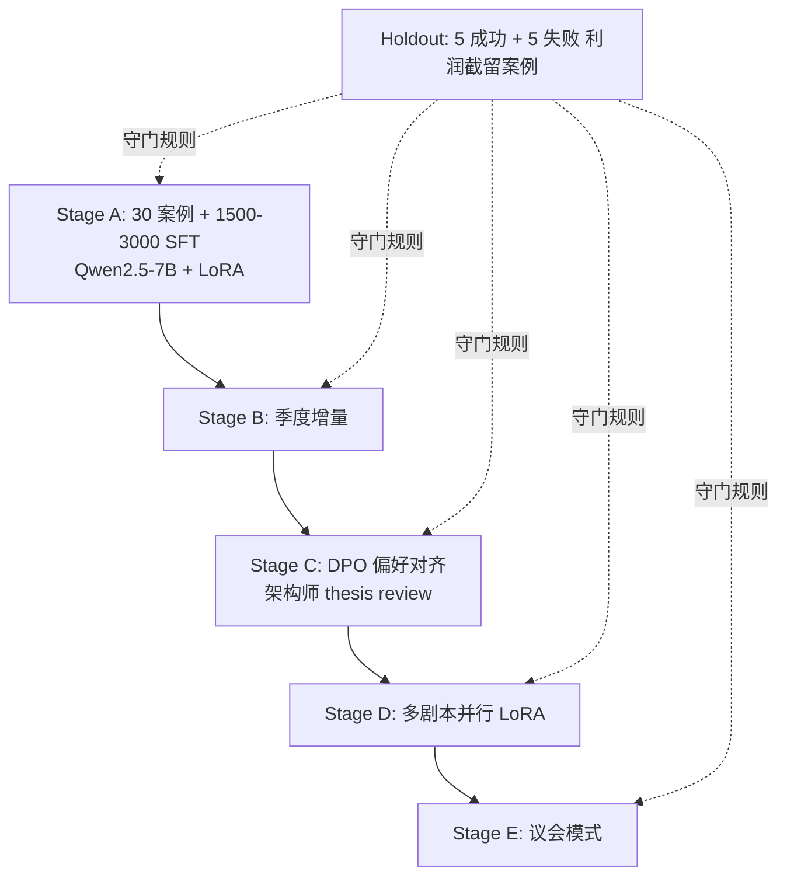

# 维度二·训练与评测资产路径

> [!NOTE] **[TRACEBACK]**
> - **维度概览**: [README](./README.md)
> - **跨维度训练范式**: [06_跨维度协作/02_5维度引擎全景与安全起步套餐](../06_跨维度协作/02_5维度引擎全景与安全起步套餐.md)

## 一、维度二通用 5 阶段训练范式

| 阶段 | 名称 | 关键动作 | 数据增量来源 | 训练方式 | 预期能力跃升 |
|---|---|---|---|---|---|
| **A** | 启动期·SFT 蒸馏 | 用 Teacher LLM + 30 个历史"利润截留型"成功案例合成 1500–3000 条标注数据 | 历史成功案例库 + Teacher LLM 财务分析师 prompt | LLaMA-Factory + LoRA（基座 Qwen2.5-7B） | 能识别 70% 的利润截留早期信号 |
| **B** | 增量·新案例补强 | 增加新发现的成功/失败案例 | 案例库季度增量 + 维度三/四的复盘反馈（thesis 验证结果） | LoRA 增量微调 | 误报率下降 |
| **C** | DPO·人类偏好对齐 | 收集"AI 推荐 vs 架构师采纳/否决"对子，用 DPO 对齐审美 | 架构师 review 时打的 thumbs up/down | DPO 流水线 + 同基座 LoRA 增量 | thesis 卡片质量与架构师偏好对齐 |
| **D** | 多 LoRA 并行·剧本细分 | 10 剧本各自独立 LoRA | 各剧本案例库独立 | vLLM 多 LoRA 多路复用 | 单剧本准确率最大化 |
| **E** | 议会模式·多剧本投票 | 一个标的同时跑多个剧本 + Judge LLM 综合 | 实盘 thesis 验证数据 | 议会式 ensemble | 跨剧本机会综合识别 |

## 二、首引擎（利润截留扫描仪）的训练路径



## 三、永久 Holdout 评测集

| 项 | 内容 |
|---|---|
| **大小** | 每个剧本 10 个案例（5 成功 + 5 失败），10 剧本共 100 案例 |
| **构成** | 成功案例（如某利润截留型 10 倍股全过程）+ 失败案例（看似命中但实际失败） |
| **主指标** | **召回率（Recall）≥ 0.70**——不能漏掉太多真实机会 |
| **副指标** | **精确率（Precision）≥ 0.60**——避免过度推荐 |
| **第三指标** | **thesis 卡片人工 review 通过率 ≥ 0.70** |
| **守门规则** | 每次新版本上线前回放 Holdout；任意指标退化 > 5% → 阻断发布 |

## 四、训练数据资产组织

```
diting-data/deep_strike/
├── playbook_cases/                     # 各剧本的成功/失败案例库
│   ├── profit_retention/               # 利润截留剧本
│   │   ├── success/                    # 成功案例（如某消费品龙头）
│   │   ├── failure/                    # 看似命中但失败的案例
│   │   └── README.md
│   ├── s_curve/
│   ├── industry_bottleneck/
│   └── ...
│
├── sft_data/
│   ├── profit_retention_v1_3000.jsonl
│   └── ...
│
├── dpo_pairs/
│   └── ...
│
├── holdout/
│   └── 100_cases_v1.jsonl
│
├── thesis_cards/                       # 历史生成过的 thesis 卡片归档
│   └── ...
│
└── README.md
```

## 五、维度二训练评测的特殊挑战

| 挑战 | 应对 |
|---|---|
| 投资剧本的"成功"需要 1–3 年验证 | 用历史回放代替"等今天的剧本明天验证" |
| 案例数量天然稀缺 | 与 Teacher LLM 合成"反事实案例"（看似机会但实际失败的） |
| 容易过拟合到"知名 10 倍股" | Holdout 必须包含小众但相同剧本的案例 |
| LLM 容易"自圆其说"造假 thesis | 维度一·二次校验 + 架构师人工 review 双闸 |
