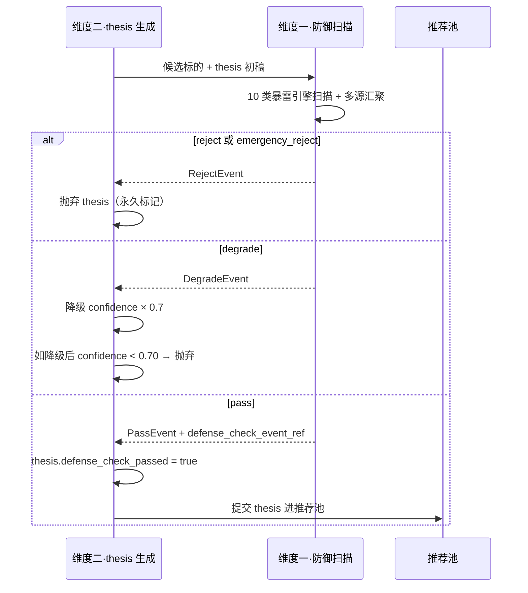
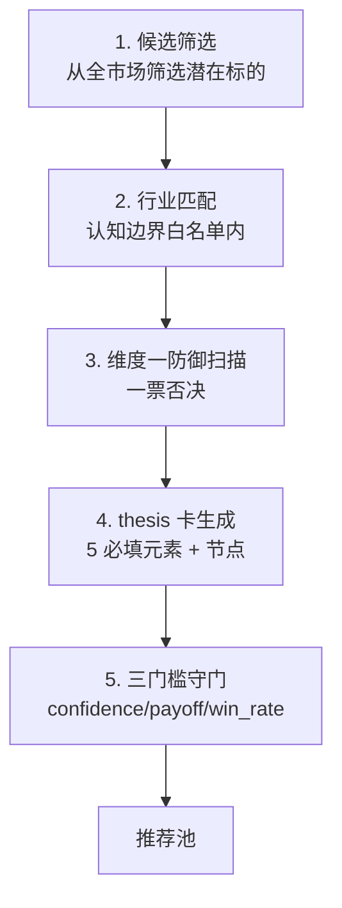

# L2 · 维度二 · 进攻实践策略规划

> [!IMPORTANT] **本文档承接 L1 哲学基石 ⑥·进攻哲学边界**的全部实践层规则。

> [!NOTE] **[TRACEBACK]**
> - **L1 哲学地基**：[基石 ⑥·进攻哲学边界](../../01_顶层概念/06_投资哲学体系总纲.md#基石-进攻哲学边界维度二纵深进攻)
> - **协同**：[基石 ③·时间边界](../../01_顶层概念/06_投资哲学体系总纲.md#基石-时间边界) → 战场参数见 [维度三 · 持仓策略与战场分配实践规划](../03_维度三_持仓监控/04_持仓策略与战场分配实践规划.md)
> - **同层**：[维度二 README](./README.md) | [引擎全景](./01_引擎全景与优先级.md)
> - **协作维度**：[维度一·防御实践规划](../01_维度一_极寒防御/04_防御实践策略规划.md)（一票否决前置）| [维度零·与后端契约](../00_维度零_AI投资副驾驶/04_与5维度后端的契约.md) §三
> - **下沉 L3 规约**：待 L3 创建（thesis 卡 schema、逻辑链节点定义、SLI 探针注册）
> - **下沉 DNA**：`_System_DNA/global_const.yaml` → `investment_philosophy.offense`

---

## 目录

- [一、本文档的层级定位](#一本文档的层级定位)
- [二、thesis 卡 5 必填元素 schema 完整版](#二thesis-卡-5-必填元素-schema-完整版)
- [三、推荐与持仓限额](#三推荐与持仓限额)
- [四、置信度·赔率·胜率三门槛](#四置信度赔率胜率三门槛)
- [五、与维度一的"一票否决"对接](#五与维度一的一票否决对接)
- [六、战场 × thesis 类型矩阵](#六战场--thesis-类型矩阵)
- [七、thesis 生成工作流与守门](#七thesis-生成工作流与守门)
- [八、进攻失败归因](#八进攻失败归因)
- [八A. Lighthouse-Alpha 进攻能力补强](#八a-lighthouse-alpha-进攻能力补强承接-l1-63-物理证伪--财务证伪)
- [九、DNA 键落地建议](#九dna-键落地建议)
- [十、一致性检查](#十一致性检查)

---

## 一、本文档的层级定位

| 层级 | 写什么 |
|---|---|
| **L1 哲学**（已存）| 进攻核心立场 + 哲学边界 + 5 元素必填 + 宁少不滥 + 四先四后 |
| **L2 实践规划**（本文档）| **thesis 卡 schema、推荐上限、置信度阈值、赔率/胜率阈值、战场×类型矩阵、生成工作流** |
| **L3 规约**（待建）| Schema、协议、接口 |
| **L4 实践**（待建）| 实施情况记录 |

---

## 二、thesis 卡 5 必填元素 schema 完整版

> 承接 L1 §6.3「5 元素必填」哲学。任意元素缺失 = thesis 不进入推荐池。

### 2.1 thesis 卡总体 schema

```yaml
ThesisCard:
  thesis_card_id: str
  symbol: str
  name: str
  industry: str
  created_at: datetime
  created_by_engine: str
  
  # === 元素 1: 逻辑链节点 ===
  logic_chain:
    nodes:
      - node_id: str
        sequence: int                   # 节点顺序（1-7）
        description: str                # 中文 ≤ 50 字
        is_strong_constraint: bool      # 至少 1 个强约束
        weight: float                   # 0-1，权重总和 = 1.0
        sli_probes:                     # 元素 2: SLI 探针映射
          - probe_id: str
            probe_type: enum            # event_driven | scheduled
            data_source: str
            check_frequency: enum       # daily | weekly | quarterly | event
            red_line_condition: str     # 触发"节点 broken"的条件
    constraints:
      min_nodes: 3
      min_strong_constraint_nodes: 1
      max_nodes: 7                      # 复杂度上限
  
  # === 元素 3: 战场窗口期 ===
  battlefield: enum                     # short | main | mid | long
  window_days: int                      # 必须落在战场范围内
  
  # === 元素 4: 最低收益门槛 ===
  min_return_threshold: float           # 按战场默认 0.15/0.20/0.30/0.50
  target_price: float
  stop_loss_price: float                # 注意：仅作参考，不基于价格止损（基石⑧）
  
  # === 元素 5: 认知边界检查 ===
  cognitive_boundary_check:
    passed: bool
    five_dimensions:
      industry_understood: bool
      data_available: bool
      sli_probes_buildable: bool
      historical_backtest_available: bool
      complexity_under_limit: bool
    rationale: str
  
  # === 量化指标（基石⑥ 三门槛）===
  confidence: float                     # ≥ 0.70
  expected_payoff_ratio: float          # 期望收益 / 期望损失，≥ 2.0
  historical_win_rate: float            # ≥ 0.55
  
  # === 维度零展示用 ===
  thesis_summary: str                   # 一段话 ≤ 200 字
  thesis_pdf_url: str
  
  # === 前置校验（基石⑥ 四先四后）===
  defense_check_passed: bool            # 必须先过维度一安检
  defense_check_event_ref: str          # 关联的 PassEvent ID
  
  # === 路由 ===
  push_level: enum                      # weekly_batch | orange | yellow
```

### 2.2 节点 schema 补充：强约束 vs 普通节点

| 节点类型 | 权重建议 | broken 后果 | 数量限制 |
|---|---|---|---|
| **强约束节点** | ≥ 0.30 | thesis 整体直接 broken | 至少 1 个；上限 3 个 |
| **核心节点** | ≥ 0.15 | thesis 健康度 -30% | 1-3 个 |
| **辅助节点** | ≤ 0.10 | thesis 健康度 -5% 至 -15% | 0-3 个 |

**节点权重总和约束**：所有节点 weight 之和 = 1.0。

### 2.3 SLI 探针的 4 种类型

| 探针类型 | 数据源 | 检查频率 | 用途 |
|---|---|---|---|
| **财报型** | 财报披露 | 季度 | 利润、营收、毛利率等基本面 |
| **公告型** | 公司公告 | 事件驱动 | 大股东减持、董事变动、关联交易 |
| **政策型** | 部委公告 | 事件驱动 | 行业政策落地、补贴公布 |
| **舆情型** | 新闻 + 论坛 | 日 | 情感聚合、热度变化 |

---

## 三、推荐与持仓限额

> 承接 L1 §6.3「宁少不滥」哲学。

### 3.1 数量上限

| 项 | 建议上限 | 哲学理由 |
|---|---|---|
| **单周新增推荐数** | ≤ 5 个 | 用户认知带宽有限，更多 = 噪声 |
| **单月用户新建仓数** | ≤ 8 个 | 集中持仓便于深度跟踪 |
| **单标的最大占比** | ≤ 5%（依收益仓库状态调整，详见维度三）| 单点风险控制 |
| **推荐池总规模**（候选池） | ≤ 30 只 | 超出 → 淘汰最低 confidence |
| **同行业推荐占比** | ≤ 40% | 行业分散度 |

### 3.2 单周推荐分配（按战场）

```
单周推荐总数上限 5 个，建议分配：
  超短战场：1-2 个（≤ 40%）
  主战场：  2-3 个（≤ 60%）
  中战场：  0-1 个（≤ 20%）
  长战场：  0-1 个（≤ 20%，需 architect 审批）
```

### 3.3 候选池淘汰机制

```python
def maintain_recommendation_pool(pool, new_candidate):
    """推荐池维护"""
    if len(pool) >= 30:
        # 淘汰最低 confidence 的候选
        weakest = min(pool, key=lambda x: x.confidence)
        if new_candidate.confidence > weakest.confidence:
            pool.remove(weakest)
            pool.add(new_candidate)
    else:
        pool.add(new_candidate)
```

---

## 四、置信度·赔率·胜率三门槛

> 承接 L1 §6.3「宁少不滥」+ 双门槛硬约束。

### 4.1 三门槛

| 指标 | 建议阈值 | 哲学理由 |
|---|---|---|
| **置信度**（confidence） | ≥ 0.70 | 低置信度不进入推荐池 |
| **赔率**（payoff ratio）| 期望收益 / 期望损失 ≥ 2.0 | 即使胜率 50% 也能正期望 |
| **胜率**（win rate）| Holdout 历史胜率 ≥ 0.55 | 不做赔率高但胜率低的赌博 |

### 4.2 三门槛的联合判定

```python
def is_eligible_for_recommendation(thesis):
    """是否进入推荐池"""
    return (
        thesis.confidence >= 0.70 and
        thesis.expected_payoff_ratio >= 2.0 and
        thesis.historical_win_rate >= 0.55 and
        thesis.defense_check_passed and        # 基石⑥ 四先四后
        thesis.cognitive_boundary_check.passed and
        len(thesis.logic_chain.nodes) >= 3 and
        thesis.has_strong_constraint_node()
    )
```

### 4.3 置信度的来源

| 来源 | 权重 |
|---|---|
| 节点 SLI 探针历史命中率 | 40% |
| 行业历史回测 win rate | 30% |
| 当前数据完整性（无缺失）| 20% |
| 多源信息一致性 | 10% |

---

## 五、与维度一的"一票否决"对接

> 承接 L1 §6.3 四先四后第 3 条：先过维度一安检，后进入推荐池。

### 5.1 对接流程



### 5.2 接收维度一事件的响应矩阵

| 维度一输出 | 维度二响应 |
|---|---|
| **reject** | 抛弃 thesis + 标的进入"永久排除池"（即使后续解除黑名单，也需重新生成 thesis） |
| **degrade** | confidence × 0.7；如低于 0.70 → 抛弃 |
| **pass** | thesis 可提交推荐池 |

### 5.3 防御检查的时效性

| 项 | 建议值 |
|---|---|
| **PassEvent 有效期** | 30 天（超期需重新检查）|
| **持仓中 thesis 持续防御扫描** | 每周 1 次（持仓变动触发额外检查）|
| **degrade 升级 reject 触发** | 持仓中 thesis 触发 degrade 升级到 reject → 紧急告警 |

---

## 六、战场 × thesis 类型矩阵

> 承接 L1 §基石③ 5 战场存在性 + §基石⑥ thesis 类型。

### 6.1 战场 × 类型矩阵

| 战场 | 典型 thesis 类型 | 关键 SLI | 信号触发点 |
|---|---|---|---|
| **超短战场**（30-90 天）| 业绩超预期 | 季报营收/利润同比、毛利率 | 季报披露前 30 天 |
| **超短战场** | 季报大幅超预期 | 业绩快报、预增公告 | 业绩预告 |
| **超短战场** | 产业链短期景气 | 价格指数、产能利用率 | 月度产业数据 |
| **主战场**（90-180 天）| 政策利好型 | 部委公告、补贴落地 | 政策公布 |
| **主战场** | 利润截留回流型 | 子公司利润、关联交易 | 财报 |
| **主战场** | 估值修复（PEG）| PEG、行业 PE 中位数 | 月度估值数据 |
| **中战场**（180-365 天）| 周期反转 | 行业产能、供需缺口 | 季度产业数据 |
| **中战场** | 治理修复早期 | 董事变动、回购、激励 | 公告 |
| **中战场** | 行业供给出清 | 产能退出数据、CR5 | 季度数据 |
| **长战场**（365-540 天）| 深度治理修复 | 多维治理指标 | 持续监控 |
| **长战场** | 长周期反转 | 多年产业数据 | 持续监控 |

### 6.2 类型 × 数据源 × 引擎依赖

| thesis 类型 | 主要数据源 | 关键引擎依赖 |
|---|---|---|
| 业绩超预期 | 财报 + 业绩预告 | earnings_surprise_engine |
| 政策利好 | 部委公告 + 产业政策 | policy_event_engine |
| 利润截留回流 | 财报子公司数据 | profit_repatriation_engine |
| 估值修复（PEG）| 估值数据 + 行业基准 | valuation_engine |
| 周期反转 | 产业景气数据 | cycle_reversal_engine |
| 治理修复 | 公告 + 治理评分 | governance_repair_engine |
| 行业供给出清 | 产能数据 + 政策 | supply_clearance_engine |

---

## 七、thesis 生成工作流与守门

### 7.1 thesis 生成 5 步骤



### 7.2 各步骤的守门规则

| 步骤 | 守门 | 失败处理 |
|---|---|---|
| 1. 候选筛选 | 流动性 + 市值下限 | 标的列入"低流动性观察" |
| 2. 行业匹配 | 必须在认知边界白名单 | 标的进入"待白名单扩展" |
| 3. 维度一防御 | reject → 抛弃 + 黑名单 | 见 §五 |
| 4. thesis 生成 | 5 必填元素完整性 | 节点数不足 → 重新生成 |
| 5. 三门槛 | confidence/payoff/win_rate | 不达标 → 候选池外保留待优化 |

---

## 八、进攻失败归因

> 承接 L1 §6.3「进攻失败的正确定义」。

### 8.1 失败类型

| 类型 | 定义 | 归因复盘路径 |
|---|---|---|
| **G·窗口失败** | 推荐后窗口期到，收益 < 战场门槛 | 窗口期/目标价模型校准（→ 维度五 window_calibration_library）|
| **H·真失败** | 推荐后逻辑链快速破裂 + 大跌 | DPO 偏好对增强（→ 维度五 failure_library_for_dpo）|

### 8.2 进攻归因时点

| 时点 | 归因目标 |
|---|---|
| **T+30** | 初次定位（A/C/E/G/H 候选）|
| **T+60** | 中期校准 |
| **T+90** | 主战场窗口期归因（最关键）|
| **T+180** | 长战场窗口期归因（仅长战场）|

### 8.3 反例（不算进攻失败）

| 反例 | 哲学解释 |
|---|---|
| 推荐后窗口期内已达门槛，后来回调 | 决策成功（窗口内已达标）|
| 推荐后用户未执行，标的暴雷 | 不算系统失败（用户决策）|
| 推荐后维度一升级 reject，用户清仓 | F·避雷成功（联合维度一归因）|

---

## 八A. Lighthouse-Alpha 进攻能力补强（承接 L1 §6.3 "物理证伪 ≥ 财务证伪"）

> [!IMPORTANT] **本节承接 L1 §6.3 新增"物理证伪 ≥ 财务证伪"原则**，把 Lighthouse-Alpha 嗅探层 + 业绩弹性闸门 + 监控字典生成的实践规则下沉为具体阈值与判定矩阵。
>
> 涉及大模型引用：**The Scorer**（项目机会探索/三维评分）、**The Critic**（评估真伪/物理证伪）、**The Mapper**（流程自动分析创建目标/标的映射）、**The Architect**（数据采集和关键指标监控字典生成）、**The Timer**（关键周期评估/财报披露窗口推演）。

### 8A.1 P01·主动嗅探层准入与"宁少不滥"

**承接 L1**：基石⑥ "宁少不滥" + "5 元素必填" + "物理证伪 ≥ 财务证伪"。

| 项 | 规则 | 判定/动作 |
|---|---|---|
| **每日候选题材簇上限** | ≤ 20 个 | 超出按 The Scorer 综合分降序截断 |
| **每日进入推荐池上限** | ≤ 3 个 | 与 §三推荐与持仓限额联合控制（推荐池总上限不变）|
| **NLP 暴增触发阈值** | 24 小时词频 / 30 天历史基准 ≥ **300%** | 达标 → 封装为候选题材簇，触发 The Scorer 评分 |
| **The Scorer 三维综合分门槛** | ≥ 7.0/10（政策级别 + 产业空间 + A股映射度 三维加权）| 低于阈值 → 当日不进入推荐池，记录到次日复评队列 |
| **去重窗口** | 同一题材簇 14 天内不重复进入推荐池 | 防止同一逻辑被重复消耗用户带宽 |
| **审计跨度** | The Scorer 评分必须留存 prompt + response + 评分明细 90 天 | 用于飞轮回流（→ 维度五 §七训练数据治理）|

### 8A.2 P02·The Critic 物理证伪门禁（强制两条硬性判据）

**承接 L1**：基石⑥ "物理证伪 ≥ 财务证伪" §"物理硬性极限优先于软件优化" + §"可证伪 ≥ 可证实"。

| # | 判据 | 通过条件 | 不通过动作 |
|---|---|---|---|
| 1 | **物理底线** | 题材簇所述技术必须明确"突破了哪个硬性物理极限"（含物理量名/单位/边界数字/可验证 source）| ❌ 拒绝入推荐池；标签 `physical_floor_missing` |
| 2 | **产能弹性** | 必须显式说明"短期不可复制壁垒"（如流片良率、设备前置期、技术认证周期）| ❌ 拒绝入推荐池；标签 `supply_elasticity_unclear` |

**双判据合规矩阵**：

| 物理底线 | 产能弹性 | 结果 |
|---|---|---|
| ✅ | ✅ | 通过 → 流转 The Mapper |
| ✅ | ❌ | 软门禁：保留入候选库但置信度上限 0.55；标签 `softgate_no_supply` |
| ❌ | ✅ | 硬门禁：拒绝（无物理底线 = 财务证伪门禁失败）|
| ❌ | ❌ | 硬门禁：拒绝 + 进入"复评队列" 30 天后重评 |

> **审计要求**：The Critic 的 prompt 必须含两条判据的检验逻辑，response 必须以结构化 JSON 返回；若大模型空降"通过"无引用 source，自动降级为硬门禁拒绝。

### 8A.3 P03·The Mapper 业绩弹性闸门（标的排雷规则）

**承接 L1**：基石⑥ "产能弹性优先于营收弹性" + 哲学边界表新增 ❌ "被营收基数稀释的大盘组装厂"。

| 项 | 规则 | 判定/动作 |
|---|---|---|
| **营收基数稀释门禁** | 候选标的"题材业务预测增量营收 / 标的总营收" **≥ 15%** | 低于阈值 → 入"已稀释名单"，置信度上限 0.45（不阻塞推荐，仅降权）|
| **业绩弹性最低增益** | 题材业务预测毛利率 ≥ 标的整体毛利率 **+ 5pp** | 低于阈值 → 标签 `gross_margin_drag`，置信度上限 0.55 |
| **大盘组装厂强排雷** | 标的总营收 ≥ **1000 亿** **且** 题材业务"营收增量贡献" **< 5%** | ❌ 强制拒绝该标的的本题材推荐；记 `largecap_diluted` |
| **细分龙头加权** | 标的总营收 < **300 亿** **且** 题材业务"营收增量贡献" ≥ **30%** | 置信度上限放宽至 0.85；优先推荐 |
| **推荐数量** | 单题材簇最多映射 **3 个**标的；按业绩弹性降序 | 超出 → 截断 + 保留下一轮复评 |

### 8A.4 P04·The Scorer 三维评分阈值与权重（严格对齐 Lighthouse-Alpha PRD）

**承接 PRD §2.3**：The Scorer 必须从【政策级别（国家级 > 地方级）】、【产业空间（千亿 > 百亿）】、【A 股映射度（是否有实锤标的）】三维打分，并对齐 diting 原有 thesis 卡置信度判定。

| 维度 | 权重 | 1~10 分判定标准 |
|---|---|---|
| **政策级别** `policy_tier` | 0.35 | 10=国家级三年行动计划；7=部委级专项；4=地方级规划；1=无政策背书 |
| **产业空间** `industry_space` | 0.35 | 10=千亿级且 5 年内复合增长 ≥ 30%；7=百亿级；4=十亿级；1=数据未确认 |
| **A 股映射度** `a_share_mapping` | 0.30 | 10=有 3+ 实锤标的且营收占比 ≥ 30%；7=有 1~2 个实锤；4=仅有大盘组装厂；1=无映射 |

**综合分公式**：`composite = 0.35·policy_tier + 0.35·industry_space + 0.30·a_share_mapping`

**与 §四三门槛联合判定**：

| The Scorer 综合分 | 与 §四三门槛的关系 |
|---|---|
| ≥ 8.0 | 置信度上限可达 0.85（与赔率/胜率门槛叠加生效）|
| 7.0~7.9 | 置信度上限 0.70 |
| < 7.0 | 当日不入推荐池（仅入候选库次日复评）|

> **审计要求**：每条三维评分必须含 source URL 或 The Critic 引用证据；缺失 source 直接降一档。

---

## 九、DNA 键落地建议

```yaml
investment_philosophy:
  offense:
    # === 5 必填元素 ===
    thesis_card:
      min_logic_chain_nodes: 3
      min_strong_constraint_nodes: 1
      max_logic_chain_nodes: 7
      strong_constraint_weight_min: 0.30
    
    # === 推荐与持仓限额 ===
    limits:
      weekly_recommendation_max: 5
      monthly_new_position_max: 8
      single_position_ratio_cap: 0.05
      pool_size_max: 30
      same_industry_ratio_cap: 0.40
    
    # === 单周推荐分配 ===
    weekly_allocation:
      short_battlefield_max: 2
      main_battlefield_max: 3
      mid_battlefield_max: 1
      long_battlefield_max: 1
    
    # === 三门槛 ===
    eligibility_thresholds:
      confidence: 0.70
      min_payoff_ratio: 2.0
      min_win_rate: 0.55
    
    # === 一票否决 ===
    defense_check:
      must_pass: true
      pass_event_validity_days: 30
      degrade_confidence_discount: 0.70
      holdings_recheck_frequency: "weekly"
    
    # === 战场 × thesis 类型 ===
    battlefield_thesis_types:
      short: [earnings_surprise, quarterly_beat, industry_seasonal]
      main: [policy_driven, profit_repatriation, valuation_repair]
      mid: [cyclical_reversal, governance_repair_early, supply_clearance]
      long: [deep_governance_repair, long_cyclical_reversal]
    
    # === 归因时点 ===
    attribution:
      timepoints_days: [30, 60, 90, 180]
```

---

## 十、一致性检查

| 检查项 | 状态 |
|---|---|
| L1 基石⑥ 已在本文档完整承接 | ✅ |
| thesis 卡 5 必填元素 schema 完整 | ✅ |
| 推荐与持仓限额、三门槛、单周分配齐全 | ✅ |
| 与维度一的"一票否决"对接清晰 | ✅ |
| 战场 × thesis 类型矩阵完整（覆盖 11 种典型类型）| ✅ |
| thesis 生成工作流 5 步骤明确 | ✅ |
| 进攻失败归因（G/H）算法明确 | ✅ |
| DNA 键落地建议完整 | ✅ |
| TRACEBACK 链完整 | ✅ |
| 不写代码实现细节，不重新定义哲学边界 | ✅ |

---

## 修订记录

| 日期 | 触发 | 内容 |
|---|---|---|
| 2026-05-14 | 用户要求"L2 实践策略规划"从占位变完整版 | 填充完整规则：thesis 卡 schema 含节点/SLI 探针 4 种类型、推荐与持仓限额、三门槛联合判定、与维度一对接流程、战场×类型矩阵（11 种）、thesis 生成 5 步骤工作流、进攻失败归因（G/H） |
| 2026-05-21 | Lighthouse-Alpha 进攻能力补强（承接 L1 §6.3 "物理证伪 ≥ 财务证伪"）| 新增 §8A 四子节：P01 主动嗅探层准入与"宁少不滥"（300% 暴增触发 / 三维综合分 7.0 门槛 / 每日 ≤ 3 入推荐池）、P02 The Critic 物理证伪双判据门禁（物理底线 + 产能弹性双判据矩阵）、P03 The Mapper 业绩弹性闸门（营收基数稀释 15% / 大盘组装厂 1000 亿强排雷 / 细分龙头加权）、P04 The Scorer 三维评分阈值与权重（政策级别 0.35 + 产业空间 0.35 + A股映射度 0.30）|
