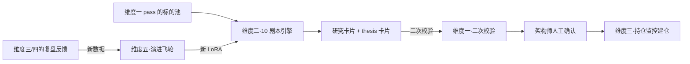

# 维度二·纵深进攻（The Striker）

> [!NOTE] **[TRACEBACK] 战略维度锚点**
> - **顶层概念**: [项目定义与核心价值](../../01_顶层概念/01_项目定义与核心价值.md)
> - **同层引用**: [双目标与战略维度关系](../00_双目标与战略维度关系.md)
> - **L3 对应模块**: [纵深进攻（deep_strike）](../../03_原子目标与规约/02_维度二_纵深进攻/README.md) + [06_L2 落地清单](../../03_原子目标与规约/02_维度二_纵深进攻/06_L2落地清单_设计.md)
> - **L3 工程映射**: [00_引擎到L3模块的映射](./00_引擎到L3模块的映射.md)

## 一、维度速览

| 项目 | 内容 |
|---|---|
| **一句话定位** | L1 主炮 / 寻找未来 3–5 年的 10 倍股的"剧本驱动 Agent 工作流"集合 |
| **战略目标** | 不追求市场上的所有机会，只在认识自己有信息+认知优势的少数赛道做"纵深进攻" |
| **核心使命** | 在能力圈内深挖，输出"研究卡片 + 投资 thesis"，每个 thesis 必须有可观察的 SLI 探针 |
| **L3 模块** | `deep_strike` |
| **引擎数量** | 10 剧本（P0:1 / P1:5 / P2:4） |
| **当前优先级** | P1（在维度一/五跑通后立即启动） |

## 二、本目录文件索引

| 文件 | 内容 |
|---|---|
| [**00_引擎到L3模块的映射.md**](./00_引擎到L3模块的映射.md) | **★ L2 ↔ L3 双向映射**：维度二能力映射到 L3 deep_strike 哪些后端服务 |
| [00_维度目标与能力边界.md](./00_维度目标与能力边界.md) | 战略目标、剧本框架、与基本面/概念股的边界 |
| [01_引擎全景与优先级.md](./01_引擎全景与优先级.md) | 10 剧本的扩展计划与实现优先级 |
| [02_数据依赖梯次总表.md](./02_数据依赖梯次总表.md) | 维度级数据采集清单 |
| [03_训练与评测资产路径.md](./03_训练与评测资产路径.md) | 维度级 5 阶段训练范式 + Holdout |
| [engines/](./engines/) | 10 个剧本引擎的完整规约 |

## 三、本维度引擎清单

| # | 引擎名称 | 优先级 | 文档 |
|---|---|---|---|
| 1 | **利润截留扫描仪剧本**（首引擎） | **P0** | [engines/01_利润截留扫描仪.md](./engines/01_利润截留扫描仪.md) |
| 2 | S 曲线渗透率监控剧本 | P1 | engines/02_S曲线渗透率监控.md（待 P1 阶段补全） |
| 3 | 产业链瓶颈嗅探器剧本 | P1 | engines/03_产业链瓶颈嗅探器.md（待 P1 阶段补全） |
| 4 | 产能出清追踪器剧本 | P1 | engines/04_产能出清追踪器.md（待 P1 阶段补全） |
| 5 | 国产替代攻坚剧本 | P1 | engines/05_国产替代攻坚.md（待 P1 阶段补全） |
| 6 | 出海/全球化扩张剧本 | P1 | engines/06_出海全球化.md（待 P1 阶段补全） |
| 7 | "中特估"估值重塑剧本 | P2 | engines/07_中特估估值重塑.md（待 P2 阶段补全） |
| 8 | 政策驱动主升浪剧本 | P2 | engines/08_政策驱动主升浪.md（待 P2 阶段补全） |
| 9 | 困境反转个股剧本 | P2 | engines/09_困境反转个股.md（待 P2 阶段补全） |
| 10 | 细分龙头扩品类剧本 | P2 | engines/10_细分龙头扩品类.md（待 P2 阶段补全） |

## 四、协作约定

- **本维度的输入是"过了维度一安检的标的池"**，出维度一才能进维度二
- **每个剧本必须输出"thesis 卡片"**：包含投资逻辑 + SLI 探针清单 + 触发卖出条件
- **本维度不直接持仓**，持仓决策需要架构师手动确认进入维度三的状态机
- **所有剧本输出必须经过维度一的二次校验**（防 LLM 幻觉骗自己）

## 五、与其他维度的关系

