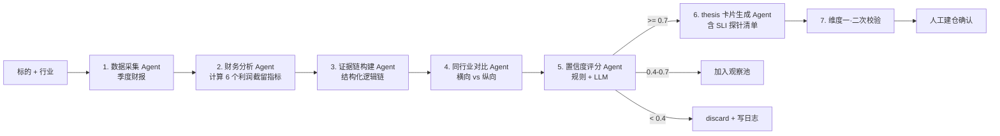

# 引擎 01：利润截留扫描仪剧本（首引擎）

> [!NOTE] **[TRACEBACK]**
> - **维度概览**: [README](../README.md)
> - **L3 子模块**: `deep_strike.profit_retention_playbook`
> - **DNA 配置键**: `_System_DNA/deep_strike/playbooks/profit_retention.yaml`

## 一、引擎定位与目标

| 项 | 内容 |
|---|---|
| **一句话定位** | 维度二首剧本，识别"成本下降快于收入下降 / 毛利率拐点 / 经营杠杆释放"早期信号 |
| **战略目标** | 从能力圈内行业找到"利润弹性放大"的早期机会，输出 thesis 卡片 |
| **优先级** | **P0**（维度二第 1 个剧本） |
| **决策机制** | 置信度 0–1；≥ 0.7 → propose；0.4–0.7 → watch；< 0.4 → discard |
| **能力边界** | 不识别营收驱动型增长；不预测毛利率上限 |

## 二、AI 工作流设计

### 2.1 工作流程图（LangGraph 编排）



### 2.2 输入契约

```yaml
input:
  symbol: "002271.SZ"  # 东方雨虹
  industry: "建筑材料"
  capability_circle: true  # 必须在能力圈白名单
```

### 2.3 输出契约（thesis 卡片）

```yaml
output:
  symbol: "002271.SZ"
  decision: "propose"
  confidence: 0.82
  thesis_card:
    title: "利润截留 + 经营杠杆释放"
    logic_chain:
      - "成本下降趋势：原油价格下行 30%，公司原材料占成本 60%"
      - "毛利率拐点：连续 3 季度毛利率从 25% 提升到 32%"
      - "经营杠杆释放：营收增长 15% 但销售费用增长 5%，杠杆系数 3.0"
    sli_probes:
      - sli_id: "raw_material_cost_ratio"
        name: "原材料成本占比"
        threshold: "<= 60%（季度）"
        slo: "warning <= 65%, critical <= 70%"
      - sli_id: "gross_margin_trend"
        name: "毛利率连续 N 季度提升"
        threshold: ">= 30%（季度）"
        slo: "warning <= 28%, critical <= 25%"
      - sli_id: "operating_leverage_ratio"
        name: "经营杠杆系数"
        threshold: ">= 2.5（季度）"
        slo: "warning <= 2.0, critical <= 1.5"
    exit_conditions:
      - "原材料价格回到高位 + 持续 2 季度（critical → 退出）"
      - "毛利率连续 2 季度回落（warning → review）"
      - "经营杠杆 < 1.5（critical → 退出）"
    expected_holding_period: "12-18 个月"
```

### 2.4 6 个利润截留指标

| # | 指标 | 计算逻辑 |
|---|---|---|
| 1 | **原材料成本占比下降趋势** | 原材料成本/营业成本 同比下降 ≥ 5% |
| 2 | **毛利率拐点** | 连续 ≥ 3 季度毛利率上升，且累计 ≥ 5% |
| 3 | **经营杠杆系数** | (息税前利润增速)/(营收增速) ≥ 2.0 |
| 4 | **销售费用率改善** | 销售费用率同比下降 ≥ 1pct |
| 5 | **管理费用率改善** | 管理费用率同比下降 ≥ 0.5pct |
| 6 | **现金流改善** | 经营现金流/净利润 ≥ 0.9（持续 ≥ 2 季度） |

### 2.5 与其他引擎的协作点

- **上游**：维度一 pass 的标的池 + 能力圈白名单
- **下游**：propose → 经维度一二次校验 → 人工建仓确认 → 进入维度三
- **跨维度**：thesis 卡片必须列出 SLI 探针清单（被维度三/四消费）

### 2.6 L3 子模块映射

- `deep_strike.profit_retention_playbook.data_collector`：数据采集
- `deep_strike.profit_retention_playbook.financial_analyzer`：财务指标计算
- `deep_strike.profit_retention_playbook.evidence_builder`：证据链构建
- `deep_strike.profit_retention_playbook.peer_comparator`：同行业对比
- `deep_strike.profit_retention_playbook.confidence_scorer`：置信度评分
- `deep_strike.profit_retention_playbook.thesis_generator`：thesis 卡片生成

## 三、首次训练数据合成方案（Stage A）

### 3.1 Step 1：圈定 30 个历史"利润截留型"成功案例

| 案例 | 行业 | 利润截留特征 |
|---|---|---|
| 海螺水泥（600585） 2016-2017 | 水泥 | 煤炭成本下降 + 行业供给侧改革 → 毛利率从 25% 升到 35% |
| 万华化学（600309） 2018-2019 | 化工 | MDI 价格回落 + 海外原料下行 → 毛利率与净利率双升 |
| 福耀玻璃（600660） 2019-2020 | 汽车玻璃 | 美国工厂经营杠杆释放 + 原料下行 |
| 东方雨虹（002271） 2014-2015 | 防水材料 | 原油价格下行 + 经营杠杆释放 |
| 老板电器（002508） 2014-2015 | 厨电 | 原材料下行 + 销售费用率改善 |
| ...（共 30 个）| ... | ... |

### 3.2 Step 2：抓取案例期前 8 季度的财报与产业数据

- 每个案例的 8 季度财报（重点字段：营收、营业成本、原材料成本、销售/管理/研发费用、毛利率）
- 产业数据：原料价格时序（如螺纹钢、煤炭、原油）
- 同期股价表现（用于事后验证"利润截留 → 股价上涨"的传导）

### 3.3 Step 3：Teacher LLM 财务分析师 Prompt

**System Prompt**：
```
你是 CFA 持证的资深行业研究员，擅长识别"利润截留"型机会。
任务：分析以下 8 季度财报 + 产业数据，判断该标的是否处于"利润截留 + 经营杠杆释放"的早期信号。

分析规则：
1. 必须检查 6 个利润截留指标
2. 必须给出可追溯证据（具体季度 + 具体字段）
3. 输出置信度 0-1
4. 如果置信度 ≥ 0.7，必须输出 thesis 卡片（含 3-5 个 SLI 探针 + 退出条件）
5. 输出格式：JSON
```

### 3.4 Step 4：Alpaca JSONL 格式化（示例）

```json
{
  "instruction": "请作为资深行业研究员，分析以下标的的 8 季度财报，判断是否存在利润截留型机会。",
  "input": "公司：东方雨虹（002271）\n行业：防水材料\n8 季度财报关键字段：\n2014Q1: 营收 4.2 亿，毛利率 28%，原料/营业成本 65%，销售费用率 11%\n2014Q2: 营收 5.1 亿，毛利率 29%，原料/营业成本 62%，销售费用率 11%\n... (省略中间)\n2015Q4: 营收 7.8 亿，毛利率 35%，原料/营业成本 55%，销售费用率 9%\n产业数据：\n2014 年布伦特油价从 110 USD/桶 跌到 50 USD/桶；同期沥青价格下行 28%",
  "output": "【propose】置信度：0.82\n触发指标：\n1. 原材料成本占比下降：从 65% 降到 55%，幅度 10pct（critical 信号）\n2. 毛利率拐点：连续 4 季度从 28% 升到 35%，累计 +7pct（critical 信号）\n3. 经营杠杆释放：净利润增速 65% / 营收增速 25% = 2.6（critical 信号）\n4. 销售费用率改善：从 11% 降到 9%（warning 信号）\n证据：油价下行 → 沥青下行 → 直接传导到原料成本\nthesis 卡片：\n  标题：东方雨虹·利润截留 + 经营杠杆释放\n  SLI 探针：\n    1. 沥青价格 <= 4000 元/吨\n    2. 季度毛利率 >= 32%\n    3. 经营杠杆系数 >= 2.0\n  退出条件：\n    1. 沥青价格回到 5500+ 持续 2 季度\n    2. 毛利率回到 28% 以下持续 2 季度"
}
```

### 3.5 Step 5：人工 verified 校验

Label Studio 配置（针对 thesis 卡片）：
- 三个字段：是否同意 propose 决策 / SLI 探针清单是否合理 / 退出条件是否合理
- 架构师每周复核 50 条样本

### 3.6 Step 6：第一次微调

| 配置 | 值 |
|---|---|
| 基座模型 | Qwen2.5-7B-Instruct |
| 微调方式 | LoRA（rank=16） |
| 训练数据 | 1500–3000 条 verified JSONL |
| Epochs | 3 |
| GPU | RTX 4090 |
| 评测目标 | Holdout Recall ≥ 0.70、Precision ≥ 0.60 |

## 四、多阶段进化路径（Stage A → E）

| 阶段 | 关键动作 | 数据增量来源 | 训练方式 | 预期能力跃升 |
|---|---|---|---|---|
| A | 30 案例 SFT 蒸馏 | 历史成功案例库 | LoRA | 识别 60% 已知机会 |
| B | 季度新案例 + 失败案例 | 案例库季度增量 + 维度三/四的复盘反馈 | LoRA 增量 | 误报率 ↓ |
| C | DPO 偏好对齐 | 架构师 thesis review 的 thumbs up/down | DPO | thesis 风格对齐 |
| D | 多 LoRA（不同行业） | 各行业训练集 | vLLM 多 LoRA | 行业敏感度 |
| E | 议会模式 | 与其他剧本协同 | 议会式 ensemble | 综合机会识别 ↑ |

## 五、数据依赖梯次表

| 阶段 | 数据类别 | 数据源 | 关键字段 | 采集频率 | 是否结构化 |
|---|---|---|---|---|---|
| 前期 | 季度财报全量 | Tushare | 营收/营业成本/原材料/费用 | 季度 | 结构化 |
| 前期 | 历史成功案例库 | 自建 + Teacher LLM | 案例期前 8 季度数据 + 事后股价 | 一次性 + 季度增量 | 结构化 |
| 前期 | 主要原材料价格 | Wind、生意社 | 螺纹钢/煤炭/原油/铝/铜价格时序 | 日度 | 结构化 |
| 前期 | 行业研报全文 | 自建抓取 | 研报对原材料/产能的判断 | 日度 | 半结构化 |
| 中期 | 行业产能与产量 | 行业协会 | 产能、库存、价格 | 月度 | 半结构化 |
| 中期 | 同行业对比基准 | Tushare 行业分类 | 同行业指标分位 | 季度 | 结构化 |
| 后期 | 调研纪要 | 自建 | 公司答问、产业链反馈 | 实时 | 非结构化 |

## 六、永久 Holdout 评测集

| 项 | 内容 |
|---|---|
| **大小** | 10 案例（5 成功 + 5 失败） |
| **构成** | 跨行业（建材、化工、汽车零部件、家电、消费） |
| **主指标** | **Recall ≥ 0.70**——必须查出至少 3.5/5 成功案例 |
| **副指标** | **Precision ≥ 0.60**、thesis 通过率 ≥ 0.70 |

## 七、与上下游引擎的衔接

- **上游**：维度一 pass 池、能力圈白名单、Tushare 财报、Wind 原料价格
- **下游**：thesis 卡片 → 维度一二次校验 → 人工建仓 → 维度三 SLI 监控
- **跨维度**：与维度二其他剧本（S 曲线渗透率、产业链瓶颈）互为补充

## 八、L3 / L4 / L5 / DNA 映射

- **L3 子模块**: `deep_strike.profit_retention_playbook`
- **L4 阶段实践**: `04_阶段规划与实践/Stage3_模块实践/04_利润截留剧本/`
- **L5 验收行 ID**: `l5-strike-profit-retention`
- **DNA 配置键**: `_System_DNA/deep_strike/playbooks/profit_retention.yaml`
- **代码仓路径**: `diting-src/deep_strike/playbooks/profit_retention/`
- **训练数据路径**: `diting-data/deep_strike/playbook_cases/profit_retention/`
