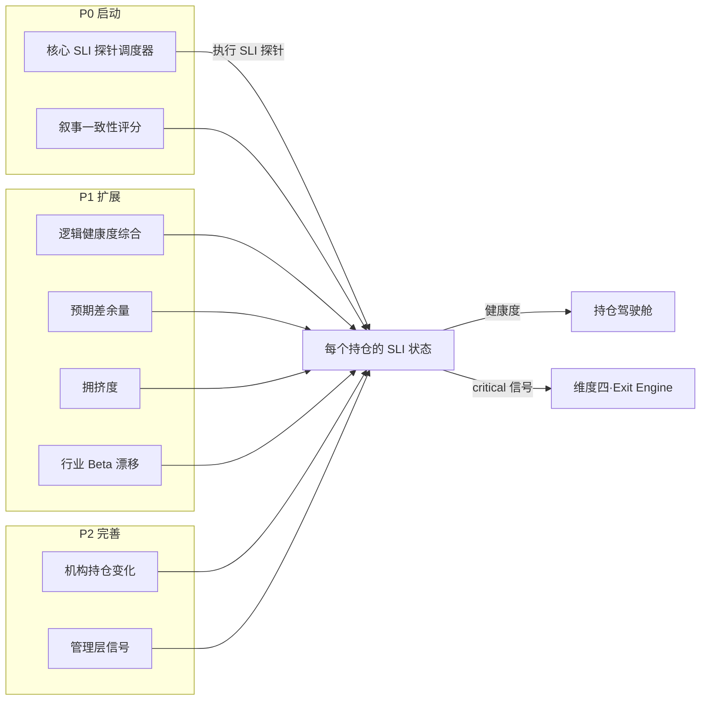

# 维度三·引擎全景与优先级

> [!NOTE] **[TRACEBACK]**
> - **维度概览**: [README](./README.md)

## 一、8 引擎扩展计划（三阶段）

| 阶段 | # | 引擎名称 | 主要工作目标 | 能力边界 |
|---|---|---|---|---|
| **P0** | 1 | **叙事一致性评分引擎**（首引擎） | 用 LLM 做 NLI（自然语言推理），判断"建仓 thesis vs 最新事实"的语义偏离度（0–100 分） | 不做最终决策，仅产生评分 |
| **P0** | 2 | **核心 SLI 探针调度器**（首引擎组件） | 维护每个持仓的 3–5 个 SLI 定义，按调度策略（季度/月度/事件驱动）执行探针 | 不定义 SLI 内容（由 thesis 卡片提供） |
| **P1** | 3 | **逻辑健康度综合评分引擎** | 把多个 SLI 评分加权汇总为一个 0–100 的健康度分数 | 加权策略由架构师配置 |
| **P1** | 4 | **预期差余量计算引擎** | 用反向估值法，反推当前股价隐含的预期，与真实经营预期对比 | 仅做结构化计算，不做"目标价"建议 |
| **P1** | 5 | **拥挤度监测引擎** | 监测北上资金、机构持仓、研报覆盖密度等"拥挤度"指标 | 仅做拥挤度评分，不直接卖出 |
| **P1** | 6 | **行业 Beta 漂移检测引擎** | 计算标的相对行业 Beta 的漂移信号（持续 N 期偏离） | 仅做 Beta 漂移识别 |
| **P2** | 7 | **机构持仓变化引擎** | 跟踪基金/QFII/北上资金持仓变化 | 仅做持仓变化追踪 |
| **P2** | 8 | **管理层信号引擎** | 跟踪管理层增减持、董事会变更、关键人发言 | 不替代维度一的"大股东诚信"（侧重边缘信号） |

## 二、引擎实现优先级与排序理由

| 排序 | 引擎 | 排序理由 |
|---|---|---|
| 1 | **叙事一致性评分** | 解决"thesis 与现实脱节"的核心痛点；LLM NLI 工程门槛中等 |
| 2 | **核心 SLI 探针调度器** | 整个维度三的"基础设施"，必须先有它才能跑其他引擎 |
| 3 | **逻辑健康度综合评分** | 把多个 SLI 综合，给驾驶舱一个"一目了然"的入口 |
| 4 | **预期差余量计算** | 估值类信号，工程门槛中等 |
| 5 | **拥挤度监测** | 数据较容易获取，能识别"赛道太拥挤"的卖出信号 |
| 6 | **行业 Beta 漂移** | 量化信号类，工程门槛偏低 |
| 7 | **机构持仓变化** | 数据偏滞后（季度披露），优先级靠后 |
| 8 | **管理层信号** | 信号偏弱，作为补充 |

## 三、SLI 探针的标准化定义

每一个 SLI 探针由以下结构组成：

```yaml
sli_id: "ev_quarterly_delivery_growth"
name: "季度交付量同比增速"
position_tag: "EV_LEADER_001"
probe_type: "quarterly"          # quarterly / monthly / event_driven
data_source: "tushare.financial_report"
query: "SELECT delivery_count FROM ... WHERE quarter=?"
slo:
  threshold: 0.30                # 同比增速 > 30%
  warning_threshold: 0.20        # 20-30% 触发 warning
  critical_threshold: 0.10       # < 10% 触发 critical
last_value: null
last_status: "healthy"
last_evaluated_at: null
```

## 四、维度三引擎协作图


