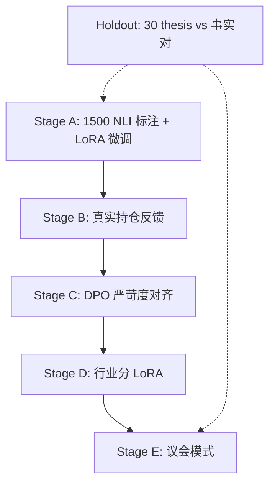

# 维度三·训练与评测资产路径

> [!NOTE] **[TRACEBACK]**
> - **维度概览**: [README](./README.md)

## 一、维度三通用 5 阶段训练范式

| 阶段 | 名称 | 关键动作 | 数据增量来源 | 训练方式 | 预期能力跃升 |
|---|---|---|---|---|---|
| **A** | 启动期·SFT 蒸馏 | 用 Teacher LLM + 30 个"被打脸案例" + 30 个"仍成立案例"合成 1500 条 NLI 标注数据 | 历史 thesis 与事实对 + Teacher LLM NLI prompt | LLaMA-Factory + LoRA（基座 Qwen2.5-7B 或 BERT-large for NLI） | 能识别 70% 的 thesis vs 事实偏离 |
| **B** | 增量·真实持仓反馈 | 用真实持仓的 thesis vs 事实对补强 | 真实持仓的 SLI 探针历史 | LoRA 增量微调 | 偏离识别精度提升 |
| **C** | DPO·人类偏好对齐 | "AI 评分 vs 架构师事后判断" 对子做 DPO | 架构师在驾驶舱的"覆盖确认" | DPO 流水线 | 评分严苛度对齐 |
| **D** | 多 LoRA 并行 | 不同行业的 NLI 评分独立 LoRA（如新能源、消费、医药） | 各行业独立训练集 | vLLM 多 LoRA | 行业敏感度提升 |
| **E** | 议会模式 | 多 LoRA + Judge LLM 综合评分 | 实盘多源数据 | 议会式 ensemble | 综合健康度评分置信度提升 |

## 二、首引擎（叙事一致性评分）的训练路径



## 三、永久 Holdout 评测集

| 项 | 内容 |
|---|---|
| **大小** | 60 个 thesis vs 事实对（30 被打脸 + 30 仍成立） |
| **构成** | 跨行业、跨剧本、跨时间窗 |
| **主指标** | **F1 ≥ 0.80**（NLI 任务的标准指标） |
| **副指标** | **被打脸召回率 ≥ 0.85**——必须查出至少 25.5/30 个被打脸的 thesis |
| **守门规则** | 每次新版本上线前回放 Holdout |

## 四、训练数据资产组织

```
diting-data/state_watch/
├── thesis_history/                     # 历史 thesis 卡片归档
│   └── ...
├── thesis_vs_fact_pairs/               # 被打脸 / 仍成立 案例对
│   ├── broken/                         # 被打脸
│   └── valid/                          # 仍成立
├── sli_probe_history/                  # SLI 探针历史结果
│   └── ...
├── sft_data/
│   └── nli_v1_1500.jsonl
├── dpo_pairs/
│   └── ...
└── holdout/
    └── 60_pairs_v1.jsonl
```

## 五、维度三训练评测的特殊挑战

| 挑战 | 应对 |
|---|---|
| 投资 thesis 的"对错"需要时间验证 | 历史回放（找过去 5 年的 thesis 与今天的事实做对比） |
| NLI 任务对长文本敏感 | 必须用支持长上下文的基座（Qwen2.5-7B 32K） |
| 评分容易"过严或过松"两极化 | DPO 阶段重点对齐架构师的"严苛度" |
| Holdout 容易过拟合 | Holdout 必须按时间分层（不同年份的案例平衡） |
