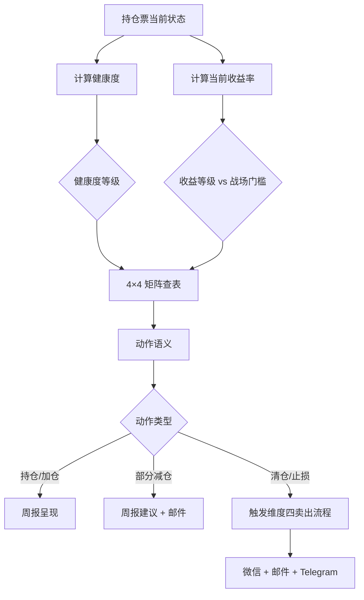

# L2 · 维度三 · 持仓策略与战场分配实践规划

> [!IMPORTANT] **本文档承接 L1 哲学基石 ③（时间边界·战场存在性）+ 基石 ⑦（持仓监控哲学边界·三柱职责）的全部实践层规则**。
>
> L1 只承诺"战场的存在、5 战场命名、收益门槛是系统评估指标而非卖出触发器、持仓监控的三柱职责"；本文档**承接所有具体阈值、规则矩阵、审计逻辑、协作 schema**。

> [!NOTE] **[TRACEBACK] L2 实践规划锚点**
> - **上溯 L1 哲学**：
>   - [基石 ③·时间边界](../../01_顶层概念/06_投资哲学体系总纲.md#基石-时间边界)
>   - [基石 ⑦·持仓监控哲学边界](../../01_顶层概念/06_投资哲学体系总纲.md#基石-持仓监控哲学边界维度三持仓监控)
> - **同层**: [维度三 README](./README.md) | [维度目标与能力边界](./00_维度目标与能力边界.md) | [引擎全景](./01_引擎全景与优先级.md) | [数据依赖梯次](./02_数据依赖梯次总表.md) | [训练资产路径](./03_训练与评测资产路径.md)
> - **下沉 L3 规约**: 待 L3 创建（thesis 卡 schema 含 battlefield；逻辑链节点状态机；调仓建议 API）
> - **下沉 DNA**: `_System_DNA/global_const.yaml` → `investment_philosophy.monitor`、`investment_philosophy.battlefields`

---

## 目录

- [一、本文档的层级定位](#一本文档的层级定位)
- [二、战场分配实践规划（承接基石③）](#二战场分配实践规划承接基石)
- [三、收益仓库控制边界实践规划（承接基石⑦·收益仓库）](#三收益仓库控制边界实践规划承接基石持仓监控)
- [四、动态调仓矩阵实践规划（承接基石⑦·动态调仓）](#四动态调仓矩阵实践规划承接基石持仓监控)
- [五、与维度四（卖出决策）协作 schema](#五与维度四卖出决策协作-schema)
- [六、与维度零（AI 副驾驶）推送对接](#六与维度零ai-副驾驶推送对接)
- [六A. Lighthouse-Alpha 物理量探针接入](#六a-lighthouse-alpha-物理量探针接入承接-l1-72a-物理量探针读数哲学边界)
- [七、DNA 键落地建议](#七dna-键落地建议)
- [八、一致性检查](#八一致性检查)

---

## 一、本文档的层级定位

| 层级 | 写什么 | 不写什么 |
|---|---|---|
| **L1 哲学**（已存）| 战场存在性 + 哲学性判据 + 不做什么 | 具体阈值、矩阵、代码、DNA |
| **L2 实践规划**（本文档）| **具体阈值、规则矩阵、健康范围、告警规则、审计逻辑思路、协作 schema** | 实际代码实现、字段类型 |
| **L3 规约**（待建）| Schema、协议、接口、最终 DNA YAML | 单次迭代步骤 |
| **L4 实践**（待建）| 实施情况记录 | 重新设计 |

> 本文档**只承接**"具体怎么做"——所有规则、阈值、矩阵都明文化。L3 据此设计字段与协议，L4 据此实施与记录。

---

## 二、战场分配实践规划（承接基石③）

### 2.1 5 战场参数表（具体值）

| 战场 | 资源占比目标 | 健康浮动范围 | 窗口期 | 最低收益门槛 | 备注 |
|---|---|---|---|---|---|
| **超短战场** | 30% | 20%-40% | 30-90 天 | 15% | 业绩超预期、季报超预期、产业链短期景气 |
| **主战场** | 40% | 30%-50% | 90-180 天 | 20% | 政策利好、利润截留回流、估值修复（PEG）|
| **中战场** | 25% | 15%-35% | 180-365 天 | 30% | 周期反转、治理修复早期、行业供给出清 |
| **长战场** | 5% | 0%-10% | 365-540 天 | 50% | 深度治理修复；单只 ≤ 5%；总仓位 ≤ 10%；需 architect 审批 |
| **禁地** | 0% | 0% | > 540 天 | — | 永不参与 |

> **收益门槛澄清（来自 L1 基石③）**：上表"最低收益门槛"**是系统评估指标**——窗口期到期未达 = 系统判失败；**不是**"达到 20% 就自动卖出"的触发器。

### 2.2 战场分配审计逻辑（思路 + 伪代码）

**触发**：每月 1 日 00:00 自动执行；用户在 Web 上手动触发审计；持仓变动 ≥ 5% 时增量触发。

```python
def audit_battlefield_allocation(holdings, total_capital):
    """维度三月度战场分配健康度审计（实现见 L3/L4）"""
    distribution = {
        "short": sum_position(h for h in holdings if h.battlefield == "short") / total_capital,
        "main": sum_position(h for h in holdings if h.battlefield == "main") / total_capital,
        "mid": sum_position(h for h in holdings if h.battlefield == "mid") / total_capital,
        "long": sum_position(h for h in holdings if h.battlefield == "long") / total_capital,
    }

    healthy_ranges = {
        "short": (0.20, 0.40),
        "main": (0.30, 0.50),
        "mid": (0.15, 0.35),
        "long": (0.0, 0.10),
    }

    alerts = []
    healthy = True
    for battlefield, (low, high) in healthy_ranges.items():
        if not (low <= distribution[battlefield] <= high):
            healthy = False
            severity = "high" if battlefield == "long" else "medium"
            alerts.append({
                "battlefield": battlefield,
                "current": distribution[battlefield],
                "healthy_range": (low, high),
                "direction": "overweight" if distribution[battlefield] > high else "underweight",
                "severity": severity,
            })

    return {
        "distribution": distribution,
        "healthy": healthy,
        "alerts": alerts,
        "audit_date": today(),
    }
```

### 2.3 告警与响应矩阵

| 触发条件 | 告警等级 | 推送通道 | 响应动作 |
|---|---|---|---|
| 长战场 > 10%（硬上限超）| 🔴 紧急红 | 微信 + 邮件 | < 24h 内 review，给出减仓建议 |
| 长战场 > 7%（接近上限） | 🟠 橙 | 邮件 | 周报标注，建议不再新增长战场 |
| 超短战场 < 15% | 🟡 黄 | 周报标注 | 提示"可能错过财报窗口机会" |
| 主战场 > 55% | 🟠 橙 | 邮件 | 集中度风险，建议分散 |
| 主战场 < 25% | 🟡 黄 | 周报标注 | 建议增配主战场标的 |
| 任意战场超 ±10pct 健康范围 | 🟡 黄 | 周报标注 | 月度调仓候选池 |

### 2.4 动态再平衡时机（不强制立刻执行）

| 触发场景 | 响应 | 强度 |
|---|---|---|
| 月度审计欠配/超配 | 进入"调仓候选池"，周报呈现 | 建议，不强制 |
| 新 thesis 进入时 | 检查目标战场是否超配；超配 → 降低建仓比例建议（如建议仓位 × 0.7）| 建议，不强制 |
| 止盈/止损退出后 | 检查回收资金的再分配建议 → 建议流向欠配战场 | 建议，不强制 |
| 逻辑链状态批量变化 | 触发"战场健康度重评估"；某战场大量 thesis 走弱 → 建议主动减仓 | 建议，但优先级高 |
| 长战场超过 10% 硬上限 | 强制触发"减仓候选" → 用户最终决策 | **强建议** |

> **再平衡哲学**：战场分配是"持续趋近目标"的动态过程，不是"任何时刻必须精确符合"的刚性约束。

---

## 三、收益仓库控制边界实践规划（承接基石⑦·收益仓库）

### 3.1 收益仓库的可计算定义

```
收益仓库 (Gain Vault) = Σ[象限_A_F 的已实现收益] + Σ[象限_A_F 的未实现浮盈]

排除项:
  - 象限 B（假阳性涨，运气钱）→ 不计入
  - 象限 H（真失败的损失）→ 不抵扣（损失已计入本金消耗）
  - 未归因决策（< T+30 天） → 暂不计入
```

### 3.2 收益仓库 4 档状态与策略

| 收益仓库状态 | 判定条件 | 策略姿态 | 战场分配建议（超短/主/中/长）| 单仓上限 |
|---|---|---|---|---|
| **负（亏损状态）** | gain_vault < 0 | 极保守 | 40% / 40% / 20% / 0% | 3% |
| **正但 < 安全阈值** | 0 ≤ gain_vault < 本金 × 1.0 | 保守 | 35% / 40% / 20% / 5% | 4% |
| **≥ 安全阈值** | gain_vault ≥ 本金 × 1.0 | 平衡 | 30% / 40% / 25% / 5% | 5% |
| **≥ 2× 安全阈值** | gain_vault ≥ 本金 × 2.0 | 进取 | 25% / 35% / 30% / 10% | 6%（需 architect 确认）|

### 3.3 实验性头寸控制

| 收益仓库状态 | 实验性头寸来源 | 实验性头寸上限 |
|---|---|---|
| 负 | **禁止实验** | 0 |
| 正但 < 安全阈值 | 仅收益仓库 | 收益仓库 × 10% |
| ≥ 安全阈值 | 仅收益仓库 | 收益仓库 × 20% |
| ≥ 2× 安全阈值 | 仅收益仓库 | 收益仓库 × 20%（仍然上限）|

> **铁律（来自 L1 基石⑦）**：**本金不可用于实验**——实验性头寸只能来自已建立的收益仓库。

### 3.4 收益仓库与逻辑链联动

| 逻辑链状态 | 对收益仓库的影响 |
|---|---|
| 强约束节点 validated | 该 thesis 浮盈计入收益仓库（未实现但高确信）|
| 普通节点 weakened | 该 thesis 浮盈降级为"待验证收益"，不计入安全仓库判定 |
| 强约束节点 broken | 该 thesis 浮盈立刻剔除收益仓库；浮亏计入"待止损" |
| 节点 validated 至窗口期到 + 达门槛 | 锁定为"已落袋收益" |

---

## 四、动态调仓矩阵实践规划（承接基石⑦·动态调仓）

### 4.1 健康度阈值分级

| 健康度等级 | 健康度区间 | 哲学含义 |
|---|---|---|
| **强势** | ≥ 0.80 | 多节点 validated；强约束全 active |
| **正常** | [0.50, 0.80) | 多数节点 active；少量 weakened |
| **走弱** | [0.30, 0.50) | 多节点 weakened；进入预警 |
| **失效** | < 0.30 | 强约束节点 broken 或多节点 broken |

### 4.2 收益情况分级（按战场门槛）

| 收益等级 | 判定条件 |
|---|---|
| **高盈利** | ≥ 战场门槛 × 1.5 |
| **达标盈利** | ≥ 战场门槛 |
| **未达门槛** | 0 ≤ 收益 < 战场门槛 |
| **亏损** | 收益 < 0 |

### 4.3 4×4 动态调仓矩阵（核心决策表）

|  | **强势**<br/>健康度 ≥ 0.80 | **正常**<br/>[0.50, 0.80) | **走弱**<br/>[0.30, 0.50) | **失效**<br/>< 0.30 |
|---|---|---|---|---|
| **高盈利**（≥ 门槛×1.5）| 持仓或加仓<br/>逻辑强+盈利高=继续冲 | 持仓，可部分止盈<br/>锁定 30-50% 收益 | 立刻减仓 50%+<br/>锁定利润，不等逻辑断 | 全清退出<br/>触发维度四卖出 |
| **达标盈利**（≥ 门槛）| 持仓<br/>逻辑强=可冲更高 | 持仓或部分止盈<br/>可锁定 30% | 减仓 30-50%<br/>门槛达+逻辑弱=先保 | 全清退出<br/>触发维度四卖出 |
| **未达门槛**（< 门槛）| 持仓等待<br/>象限 C 正常等待 | 持仓<br/>逻辑未断继续等 | 减仓 30%<br/>逻辑弱+未达标=提前减 | 清仓<br/>触发维度四卖出 |
| **亏损**（< 0）| 持仓，可加仓<br/>逻辑强=可能洗盘 | 持仓<br/>不因亏损恐慌卖 | 减仓 50%<br/>逻辑弱+亏损=高风险 | 止损退出<br/>触发维度四 stop_loss |

### 4.4 矩阵动作的精确语义

| 动作 | 含义 | 操作建议比例 |
|---|---|---|
| **持仓或加仓** | 当前仓位不变，或在单仓上限内加仓 | 加仓建议 ≤ 当前仓位 × 30% |
| **持仓** | 不动 | — |
| **持仓，可部分止盈** | 当前仓位减少 20-30%，锁定部分收益 | 减 20-30% |
| **减仓 30%** | 减少当前仓位 30% | 30% |
| **减仓 30-50%** | 减少当前仓位 30-50%，视逻辑链恶化速度 | 30-50% |
| **减仓 50%+** | 减少当前仓位至少 50% | ≥ 50% |
| **清仓** | 全部清空 | 100%（触发维度四）|
| **全清退出 / 止损退出** | 触发维度四的卖出流程 | 100% |

### 4.5 调仓建议生成流程



---

## 五、与维度四（卖出决策）协作 schema

### 5.1 职责边界（精确切分）

| 职责 | 归属 | 输出 |
|---|---|---|
| 逻辑链节点状态追踪 | **维度三** | 节点状态机 + 健康度 |
| 告警发送（按 4 级分级） | **维度三** | 紧急红/常规红/橙/黄 |
| **调仓建议**（加仓 / 持仓 / 减仓） | **维度三** | 4×4 矩阵 → 动作 |
| **卖出建议**（止盈 / 止损 / 逻辑断 / 窗口失败） | **维度四** | 4 类正确卖出 |
| 执行优先级排序 | **维度四** | 紧急红 > 常规红 > 止盈 > 机会重置 |
| 最终决策 | **用户** | 系统只建议，不强制 |

### 5.2 协作交接 schema

**维度三 → 维度四的事件 schema**：

```yaml
handoff_event:
  thesis_id: str          # thesis 卡 ID
  trigger_type: enum      # full_exit | logic_break_exit | take_profit_review | battlefield_failure_review
  trigger_reason:         # 触发原因
    health: float         # 当前健康度
    strong_constraint_broken: bool
    return_pct: float
    window_status: enum   # within | expired
    quadrant_attribution: enum  # A | B | C | D | E | F | G | H
  recommendation_from_monitor:
    action: enum          # full_exit | partial_exit | take_profit | review
    suggested_ratio: float  # 减仓比例建议（0-1）
  timestamp: datetime
  alert_level: enum       # emergency_red | regular_red | orange | yellow
```

### 5.3 触发条件矩阵

| 维度三状态 | 触发维度四的事件 | 维度四响应（按基石⑧）|
|---|---|---|
| 强约束节点 broken | `logic_break_exit` | 缓冲期 5 个交易日内全清 |
| 健康度 < 0.30 | `full_exit` | 立刻全清 |
| 健康度 [0.30, 0.50) + 高盈利 | `take_profit_review` | 部分止盈建议（50%+）|
| 收益 ≥ 战场门槛 + 逻辑强势 | `take_profit_review` | **不强制卖**——维度四返回"继续持仓" |
| 窗口期到 | `battlefield_failure_review` | 判定 G·窗口失败 或 A·达标 |

---

## 六、与维度零（AI 副驾驶）推送对接

### 6.1 告警 4 级分级与通道

| 级别 | 触发 | 通道 | 用户响应时间 |
|---|---|---|---|
| 🔴 **紧急红** | 强约束节点 broken；长战场 > 10% | 微信 + Telegram + 邮件 | < 1 小时 |
| 🔴 **常规红** | thesis 健康度 < 0.30 | 微信 + 邮件 | < 24 小时 |
| 🟠 **橙** | 健康度 [0.30, 0.50) 或战场超配（≠长战场硬超）| 邮件 | 周内决策 |
| 🟡 **黄** | 健康度 [0.50, 0.80) 或节点 weakened | 周报标注 | 周报 review |

### 6.2 推送内容契约

每条推送须含：

```yaml
push_payload:
  thesis_id: str
  ticker: str
  alert_level: enum
  health_score: float
  current_return: float
  battlefield: enum
  window_remaining_days: int
  
  # 调仓建议（来自维度三）
  rebalance_suggestion:
    action: enum  # hold | add | partial_exit | full_exit
    ratio: float
    reason: str   # 人类可读的中文解释
  
  # 卖出建议（来自维度四，若触发）
  exit_suggestion:
    type: enum    # take_profit | logic_break_exit | opportunity_cost_reset | battlefield_failure_exit
    urgency: enum # immediate | within_24h | within_week
    reason: str
  
  # 逻辑链状态明细
  logic_chain_snapshot:
    nodes: list[NodeState]
    broken_nodes: list[str]
    weakened_nodes: list[str]
```

---

## 六A. Lighthouse-Alpha 物理量探针接入（承接 L1 §7.2A "物理量探针读数"哲学边界）

> [!IMPORTANT] **本节承接 L1 §7.2 哲学边界表新增"物理量探针读数"行**，把 Lighthouse-Alpha PRD §2/§3 监控字典生成出的物理量探针落地到 D3 持仓监控的 SLI 探针体系。
>
> 涉及大模型引用：**The Architect**（监控字典生成）—— 由 D2 The Architect 生成的"监控字典 JSON"由本维度 P5/P6/P7 探针消费。

### 6A.1 P05·物理量探针 P5/P6/P7 准入规则

**承接 PRD §3.3 + §4.2**：The Architect 监控字典必须包含"具体网址 / 数据途径 / HS 编码"，由 D3 持仓监控通过 P5/P6/P7 探针每日轮询并写入逻辑链节点状态机。

| 探针 ID | 名称 | 数据源类型 | 监控对象 | 与逻辑链节点的映射 |
|---|---|---|---|---|
| **P5** | **政府招标物理量探针** | `WEB_SCRAPING`（Playwright + ETL LLM Engine 抽取）| 中国政府采购网 / 三大运营商电子采购平台 | thesis 卡 `logic_chain.nodes[供需错配/订单兑现]` |
| **P6** | **海关 HS Code 出口量探针** | `STRUCT_DATA_API`（AkShare `macro_china_customs`）| 海关总署对应 HS Code 月度出口量与单价 | thesis 卡 `logic_chain.nodes[出海/海外业务兑现]` |
| **P7** | **产业产能利用率探针** | `STRUCT_DATA_API`（AkShare + 国家统计局）| 行业产能利用率 / 大宗能源消耗 / 物流量 | thesis 卡 `logic_chain.nodes[产能瓶颈/产能弹性]` |

### 6A.2 P05~P07 探针报警阈值（与 D4 卖出决策协作）

| 探针 | 触发预警条件 | 报警等级 | 与 D4 协作动作 |
|---|---|---|---|
| **P5 招标累计金额** | 近 30 天累计中标金额 ≥ 上一年度总营收 **20%** | **GREEN** 利好确认 | 触发 D4 SP3 增持权重提升至 +1.5σ |
| **P5 招标突然停摆** | 近 30 天中标金额环比骤降 **≥ 60%** | **RED** 逻辑链破裂 | 触发 D4 SP3 节点状态 `broken` → 启动复盘 |
| **P6 海关出口量** | 月度环比增长 **> 30%** **且** 单价同比 ≥ +10% | **GREEN** 利好确认 | 触发 D4 SP3 增持权重提升至 +1.5σ |
| **P6 海关出口萎缩** | 月度环比 **< -20%** **且** 连续 2 月 | **RED** 逻辑链破裂 | 触发 D4 SP3 节点状态 `broken` |
| **P7 产能利用率** | 行业产能利用率 ≥ **85%** **且** 在线扩产周期 ≥ 6 个月 | **GREEN** 产能弹性确认 | 触发 D4 SP3 节点状态 `confirmed` |
| **P7 产能过剩** | 行业产能利用率连续 3 月 < **65%** | **YELLOW** 节点弱化 | 节点状态 `weakened`；触发 D4 SP1 / SP3 |

### 6A.3 P05~P07 探针监控字典消费契约

**承接 PRD §3.3 监控字典 JSON schema**：

```yaml
# D2 The Architect 输出 → 写入 Redis 配置中心 → D3 P5/P6/P7 轮询消费
MonitorMatrix:
  thesis_card_id: str
  target_company: str
  symbol: str
  matrix:
    - probe_id: P5  # P5/P6/P7 之一
      metric_name: str
      data_source_type: WEB_SCRAPING | STRUCT_DATA_API
      source_url: str | null       # WEB_SCRAPING 时必填
      source_api: str | null       # STRUCT_DATA_API 时必填，如 "akshare.macro_china_customs()"
      specific_target: str         # 如 "HS Code: 85176239, 目的地: 美国"
      keywords: list[str] | null   # WEB_SCRAPING 时建议
      alert_threshold: str         # 自然语言+结构化数字双形式
      alert_threshold_struct:      # 结构化版本（自动判定）
        operator: gt | lt | mom_pct | yoy_pct | sum_pct
        value: float
        window_days: int
```

**契约硬约束**：

| 约束 | 含义 |
|---|---|
| **alert_threshold 必须双形式** | 自然语言（人审阅）+ 结构化（机器执行）；缺一即拒绝写入 |
| **轮询频率** | P5 每天 1 次；P6 每月 20 日海关数据发布后 1 小时内；P7 每月统计局发布后 1 小时内 |
| **降级路径** | P5 web scraping 失败 → 24 小时 retry + 发 RED 告警；P6/P7 API 不可用 → 自动切到次源（如 Tushare）|
| **死字段 GC** | 监控字典中超过 90 天无写入命中的字段，自动标 `stale=true`；架构师每月复审 |

---

## 七、DNA 键落地建议

> **以下 YAML 由 L3 `_System_DNA/global_const.yaml` 承接**，L2 仅提出"建议落地值"。L3 据此最终定值。

```yaml
# 建议合并到 investment_philosophy.monitor 及 investment_philosophy.battlefields
investment_philosophy:
  battlefields:
    short:
      window_days: [30, 90]
      resource_allocation: 0.30
      healthy_range: [0.20, 0.40]
      min_return_threshold: 0.15
      typical_thesis: ["earnings_surprise", "industry_seasonal"]
    main:
      window_days: [90, 180]
      resource_allocation: 0.40
      healthy_range: [0.30, 0.50]
      min_return_threshold: 0.20
      typical_thesis: ["policy_driven", "profit_repatriation", "valuation_repair"]
    mid:
      window_days: [180, 365]
      resource_allocation: 0.25
      healthy_range: [0.15, 0.35]
      min_return_threshold: 0.30
      typical_thesis: ["cyclical_reversal", "governance_repair_early"]
    long:
      window_days: [365, 540]
      resource_allocation: 0.05
      healthy_range: [0.0, 0.10]
      max_position_ratio: 0.10
      min_return_threshold: 0.50
      requires_architect_approval: true
    banned:
      window_days: ">540"
      resource_allocation: 0.0

  monitor:
    health_thresholds:
      strong: 0.80
      normal: 0.50
      weakening: 0.30
      broken: 0.0

    battlefield_allocation_audit:
      frequency: "monthly"
      rebalance_enforcement: false
      alerts:
        long_emergency_threshold: 0.10
        long_warning_threshold: 0.07
        short_underweight_threshold: 0.15
        main_overweight_threshold: 0.55
        main_underweight_threshold: 0.25

    gain_vault:
      definition: "quadrant_AF_attributable_gains"
      exclude_quadrant_B: true
      safety_threshold_multiplier: 1.0
      experimental_position_source: "gain_vault_only"
      experimental_position_ratio_cap:
        negative: 0.0
        below_safety: 0.10
        at_safety: 0.20
        above_2x_safety: 0.20
      strategy_by_vault_status:
        negative:
          allocation: [0.40, 0.40, 0.20, 0.0]
          single_position_cap: 0.03
        positive_below_safety:
          allocation: [0.35, 0.40, 0.20, 0.05]
          single_position_cap: 0.04
        at_safety:
          allocation: [0.30, 0.40, 0.25, 0.05]
          single_position_cap: 0.05
        above_2x_safety:
          allocation: [0.25, 0.35, 0.30, 0.10]
          single_position_cap: 0.06
          requires_architect_confirm: true

    dynamic_rebalancing:
      matrix:
        # 4×4 矩阵（健康度等级 × 收益等级 → 动作）
        # 详见本文档 §4.3
        strong_high: "hold_or_add"
        strong_on_target: "hold"
        strong_below_target: "hold_wait"
        strong_loss: "hold_maybe_add"
        normal_high: "hold_or_partial_take_profit"
        normal_on_target: "hold_or_partial_take_profit_30"
        normal_below_target: "hold"
        normal_loss: "hold"
        weakening_high: "reduce_50_plus"
        weakening_on_target: "reduce_30_50"
        weakening_below_target: "reduce_30"
        weakening_loss: "reduce_50"
        broken_any: "trigger_exit_dimension4"
      principles:
        - "logic_chain_first_profit_second"
        - "preserve_principal_then_seek_gain"
        - "lock_partial_before_full_hold"

    handoff_to_exit:
      triggers:
        - condition: "health < 0.30"
          action: "trigger_full_exit"
        - condition: "strong_constraint_broken"
          action: "trigger_logic_break_exit"
        - condition: "return >= battlefield_threshold AND health >= 0.80"
          action: "trigger_take_profit_review_optional"  # 不强制卖
        - condition: "window_expired"
          action: "trigger_battlefield_failure_review"
      final_decision_owner: "user"
```

---

## 八、一致性检查

| 检查项 | 状态 |
|---|---|
| L1 哲学边界（基石③、⑦）已在本文档承接 | ✅ |
| 战场参数表完整（5 战场 × 4 列）| ✅ |
| 收益仓库 4 档状态 + 策略已完整定义 | ✅ |
| 动态调仓 4×4 矩阵全 16 格填写 | ✅ |
| 与维度四协作 schema 已定义 | ✅ |
| 与维度零推送对接已定义 | ✅ |
| **§6A Lighthouse-Alpha 物理量探针 P5/P6/P7 已落地（含监控字典消费契约）**| ✅ |
| DNA 键落地建议完整 | ✅ |
| [TRACEBACK] 锚点完整（上溯 L1、同层、下沉 L3/DNA） | ✅ |
| 不写代码实现细节（仅伪代码思路） | ✅ |
| 不重新定义哲学边界（哲学引用 L1） | ✅ |

---

## 修订记录

| 日期 | 触发 | 内容 |
|---|---|---|
| 2026-05-21 | Lighthouse-Alpha 物理量探针接入（承接 L1 §7.2 哲学边界表新增"物理量探针读数"行）| 新增 §6A 三子节：P05 P5/P6/P7 探针准入规则（招标/海关/产能利用率三探针）、报警阈值矩阵（GREEN/YELLOW/RED 三档与 D4 SP3 协作）、监控字典消费契约（MonitorMatrix yaml schema + alert_threshold 双形式 + 死字段 GC）|
