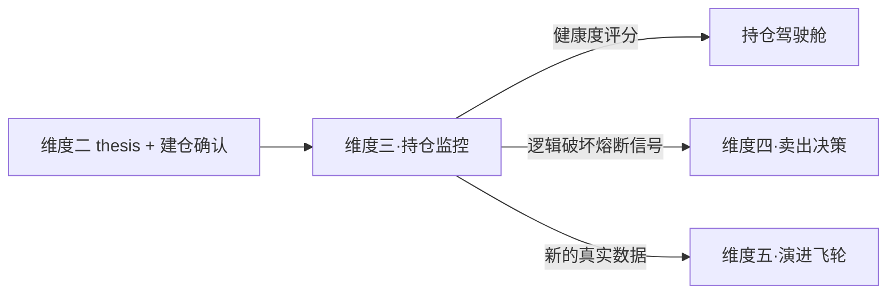

# 维度三·持仓监控（The Observer）

> [!NOTE] **[TRACEBACK] 战略维度锚点**
> - **顶层概念**: [项目定义与核心价值](../../01_顶层概念/01_项目定义与核心价值.md)
> - **同层引用**: [双目标与战略维度关系](../00_双目标与战略维度关系.md)
> - **L3 对应模块**: [状态机监控（state_watch）](../../03_原子目标与规约/03_维度三_持仓监控/README.md) + [06_L2 落地清单](../../03_原子目标与规约/03_维度三_持仓监控/06_L2落地清单_设计.md)（与维度四共享）
> - **L3 工程映射**: [00_引擎到L3模块的映射](./00_引擎到L3模块的映射.md)

## 一、维度速览

| 项目 | 内容 |
|---|---|
| **一句话定位** | 投资逻辑的"DevOps 监控系统"，把"持仓 thesis"当作被持续监控的服务 |
| **战略目标** | 解决"为什么买"和"凭什么继续持有"的可观测性问题，杜绝"买完就忘记/被市场情绪绑架" |
| **核心使命** | 每一个持仓都必须有可观察的 SLI（服务等级指标），违反即触发熔断（交给维度四决策） |
| **L3 模块** | `state_watch`（持仓监控部分） |
| **引擎数量** | 8 引擎（P0:2 / P1:4 / P2:2） |
| **当前优先级** | P0/P1 混合（与维度四协同） |

## 二、本目录文件索引

| 文件 | 内容 |
|---|---|
| [**00_引擎到L3模块的映射.md**](./00_引擎到L3模块的映射.md) | **★ L2 ↔ L3 双向映射**：维度三能力映射到 L3 state_watch 哪些后端服务（与维度四共享 state_watch）|
| [00_维度目标与能力边界.md](./00_维度目标与能力边界.md) | 战略目标、SLI 探针思想、与维度四的边界 |
| [01_引擎全景与优先级.md](./01_引擎全景与优先级.md) | 8 引擎的扩展计划 |
| [02_数据依赖梯次总表.md](./02_数据依赖梯次总表.md) | 维度级数据采集清单 |
| [03_训练与评测资产路径.md](./03_训练与评测资产路径.md) | 维度级训练范式 |
| [engines/](./engines/) | 8 个引擎的完整规约 |

## 三、本维度引擎清单

| # | 引擎名称 | 优先级 | 文档 |
|---|---|---|---|
| 1 | **叙事一致性评分引擎**（首引擎） | **P0** | [engines/01_叙事一致性评分.md](./engines/01_叙事一致性评分.md) |
| 2 | **核心 SLI 探针调度器**（首引擎组件） | **P0** | [engines/02_核心SLI探针调度器.md](./engines/02_核心SLI探针调度器.md) |
| 3 | 逻辑健康度综合评分引擎 | P1 | engines/03_逻辑健康度综合评分.md（待 P1 阶段补全） |
| 4 | 预期差余量计算引擎 | P1 | engines/04_预期差余量计算.md（待 P1 阶段补全） |
| 5 | 拥挤度监测引擎 | P1 | engines/05_拥挤度监测.md（待 P1 阶段补全） |
| 6 | 行业 Beta 漂移检测引擎 | P1 | engines/06_行业Beta漂移检测.md（待 P1 阶段补全） |
| 7 | 机构持仓变化引擎 | P2 | engines/07_机构持仓变化.md（待 P2 阶段补全） |
| 8 | 管理层信号引擎 | P2 | engines/08_管理层信号.md（待 P2 阶段补全） |

## 四、协作约定

- **本维度的输入是"维度二·thesis 卡片 + 架构师建仓确认"**
- **本维度只观察、只评分、只产生信号**，**不直接做卖出决策**（卖出由维度四接管）
- **触发熔断信号 → 推送到维度四的 Exit Engine**

## 五、与其他维度的关系

