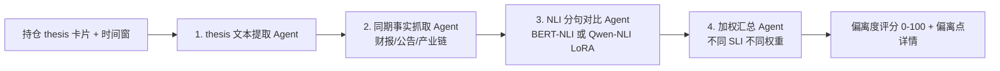

# 引擎 01：叙事一致性评分引擎（首引擎）

> [!NOTE] **[TRACEBACK]**
> - **维度概览**: [README](../README.md)
> - **L3 子模块**: `state_watch.narrative_consistency_engine`
> - **DNA 配置键**: `_System_DNA/state_watch/observer/narrative_consistency.yaml`

## 一、引擎定位与目标

| 项 | 内容 |
|---|---|
| **一句话定位** | 用 LLM 做 NLI（自然语言推理），判断"建仓 thesis vs 最新事实"的语义偏离度（0-100 分） |
| **战略目标** | 解决"thesis 与现实脱节但持仓人继续抱有信仰"的痛点 |
| **优先级** | **P0**（维度三第 1 个引擎） |
| **决策机制** | 偏离度评分 0–100；≥ 70 → critical；40–69 → warning；< 40 → healthy |
| **能力边界** | 不做最终决策，仅产生评分给维度四消费 |

## 二、AI 工作流设计

### 2.1 工作流程图



### 2.2 输入契约

```yaml
input:
  position_id: "EV_LEADER_001"
  thesis_card:
    title: "新能源车龙头·渗透率拐点机会"
    logic_chain:
      - "全球电动车渗透率从 5% 突破到 15% 拐点"
      - "公司毛利率维持在 20% 以上"
      - "研发投入加大但销售费用率改善"
    sli_probes: [...]
  time_window: "2026Q1"
  facts:
    - source: "公司年报"
      content: "毛利率从 22% 下降到 16%..."
    - source: "行业协会"
      content: "全球电动车渗透率达到 18%..."
```

### 2.3 输出契约

```yaml
output:
  position_id: "EV_LEADER_001"
  consistency_score: 35  # 偏离度（数值越高越偏离）
  deviation_status: "critical"
  deviation_details:
    - thesis_claim: "公司毛利率维持在 20% 以上"
      fact: "毛利率从 22% 下降到 16%"
      deviation_type: "contradicts"  # contradicts / partial / neutral / supports
      severity: "critical"
    - thesis_claim: "全球电动车渗透率从 5% 突破到 15% 拐点"
      fact: "全球电动车渗透率达到 18%"
      deviation_type: "supports"
      severity: "normal"
  llm_explanation: "..."
```

### 2.4 NLI 4 类判定

| 判定 | 含义 | 评分贡献 |
|---|---|---|
| `supports` | 事实支持 thesis 论点 | 0 偏离贡献 |
| `neutral` | 事实与论点无关 | 5–10 偏离贡献 |
| `partial` | 事实部分偏离 | 20–40 偏离贡献 |
| `contradicts` | 事实直接反驳论点 | 60–90 偏离贡献 |

### 2.5 与其他引擎的协作点

- **上游**：维度二的 thesis 卡片库（建仓时存档）+ 数据湖最新事实
- **下游**：critical 评分 → 推送到维度四的 Exit Engine R1 触发器
- **跨维度**：与"逻辑健康度综合评分"汇总；与"管理层信号"互为印证

### 2.6 L3 子模块映射

- `state_watch.narrative_consistency_engine.thesis_extractor`：thesis 文本提取
- `state_watch.narrative_consistency_engine.fact_collector`：事实抓取
- `state_watch.narrative_consistency_engine.nli_comparator`：NLI 分句对比
- `state_watch.narrative_consistency_engine.weighted_aggregator`：加权汇总

## 三、首次训练数据合成方案（Stage A）

### 3.1 Step 1：圈定 30 个"被打脸"案例 + 30 个"仍成立"案例

| 案例类别 | 案例 | 状态 |
|---|---|---|
| 被打脸 | 教培双减前的好未来/新东方 thesis | 政策黑天鹅打脸 |
| 被打脸 | 地产三道红线前的部分地产龙头 thesis | 政策打脸 |
| 被打脸 | 某某医药集采前的 thesis | 集采打脸 |
| 被打脸 | 某某新能源车 thesis（毛利率假设破坏） | 行业内卷打脸 |
| 被打脸 | 某某游戏厂商 thesis（版号停发） | 政策打脸 |
| ...（共 30 个）| ... | ... |
| 仍成立 | 某某白酒龙头 5 年 thesis | 持续验证 |
| 仍成立 | 某某医疗器械龙头 thesis | 持续验证 |
| ...（共 30 个）| ... | ... |

### 3.2 Step 2：抓取 thesis 与事实对

每个案例采集：
- 建仓时的 thesis 文本（含 3–5 个核心论点）
- 持仓期内每季度的真实事实（财报、公告、行业数据）
- 事后判断：thesis 是否被打脸（人工标注）

### 3.3 Step 3：Teacher LLM NLI Prompt

**System Prompt**：
```
你是 NLI（自然语言推理）专家，擅长判断"投资 thesis 论点"与"实际事实"的关系。
任务：对于每对（thesis_claim, fact），判定是 supports / neutral / partial / contradicts。

判定规则：
1. 必须基于事实文本的字面含义
2. 严格区分"部分偏离"和"完全反驳"
3. 不能凭"投资直觉"做判断，只看事实是否支持论点
4. 输出格式：JSON
```

**User Prompt**：
```
Thesis 论点：{thesis_claim}
事实文本：{fact}
判定：supports / neutral / partial / contradicts
理由：...
```

### 3.4 Step 4：Alpaca JSONL 格式化（示例）

```json
{
  "instruction": "请判断以下 thesis 论点与事实之间的 NLI 关系（supports/neutral/partial/contradicts）。",
  "input": "Thesis 论点：公司毛利率维持在 20% 以上\n事实：根据 2026 年报，公司毛利率从 22% 下降到 16%",
  "output": "判定：contradicts\n理由：thesis 明确声明毛利率维持在 20% 以上，但实际事实显示毛利率从 22% 下降到 16%（已低于 20%），事实直接反驳论点。\n严重性：critical"
}
```

### 3.5 Step 5：人工 verified 校验

Label Studio 配置：
- 4 个选项（supports / neutral / partial / contradicts）
- 架构师每周 verified 50 对（30min）
- Cohen's Kappa ≥ 0.85

### 3.6 Step 6：第一次微调

| 配置 | 值 |
|---|---|
| 基座模型 | Qwen2.5-7B-Instruct（支持 32K 上下文） |
| 微调方式 | LoRA（rank=16） |
| 训练数据 | 1500 对 NLI 标注 |
| Epochs | 3 |
| GPU | RTX 4090 |
| 评测目标 | F1 ≥ 0.80、被打脸召回率 ≥ 0.85 |

## 四、多阶段进化路径（Stage A → E）

| 阶段 | 关键动作 | 数据增量来源 | 训练方式 | 预期能力跃升 |
|---|---|---|---|---|
| A | 60 案例 + 1500 NLI SFT | 历史 thesis vs 事实对 | LoRA | F1 ~ 0.80 |
| B | 真实持仓反馈 | 真实持仓的 SLI 探针历史 | LoRA 增量 | F1 ↑ |
| C | DPO 偏好对齐 | 架构师覆盖确认对子 | DPO | 严苛度对齐 |
| D | 行业分 LoRA | 各行业独立训练集 | vLLM 多 LoRA | 行业敏感度 |
| E | 议会模式 | 多源数据 | 议会式 ensemble | 综合健康度 ↑ |

## 五、数据依赖梯次表

| 阶段 | 数据类别 | 数据源 | 关键字段 | 采集频率 | 是否结构化 |
|---|---|---|---|---|---|
| 前期 | 持仓 thesis 卡片库 | 维度二输出 | 论点、SLI 探针清单 | 事件驱动 | 结构化 |
| 前期 | 历史"被打脸/仍成立"案例库 | 自建 + Teacher LLM | thesis vs 事实对 + 人工标注 | 一次性 + 季度增量 | 结构化 |
| 前期 | 季报与公告（事实源） | 已采集（维度一/二复用） | 复用 | - | - |
| 中期 | 真实持仓 SLI 探针历史 | 维度三 sli_probe_history | 探针历史结果 | 实时 | 结构化 |
| 中期 | 调研纪要 | 自建 | 公司答问 | 实时 | 非结构化 |
| 后期 | 第三方做空报告 | 自建 | 做空逻辑 | 事件驱动 | 半结构化 |

## 六、永久 Holdout 评测集

| 项 | 内容 |
|---|---|
| **大小** | 60 对（30 被打脸 + 30 仍成立） |
| **构成** | 跨行业、跨时间窗 |
| **主指标** | **F1 ≥ 0.80** |
| **副指标** | **被打脸召回率 ≥ 0.85**——必须查出 25.5/30 |

## 七、与上下游引擎的衔接

- **上游**：维度二 thesis 卡片库、数据湖（财报/公告/产业数据）
- **下游**：偏离度评分 → "逻辑健康度综合评分"汇总 → 维度四 R1 触发器
- **跨维度**：critical 信号触发维度四 escalate

## 八、L3 / L4 / L5 / DNA 映射

- **L3 子模块**: `state_watch.narrative_consistency_engine`
- **L4 阶段实践**: `04_阶段规划与实践/Stage3_模块实践/05_叙事一致性引擎/`
- **L5 验收行 ID**: `l5-watch-narrative-consistency`
- **DNA 配置键**: `_System_DNA/state_watch/observer/narrative_consistency.yaml`
- **代码仓路径**: `diting-src/state_watch/observer/narrative_consistency/`
- **训练数据路径**: `diting-data/state_watch/thesis_vs_fact_pairs/`
