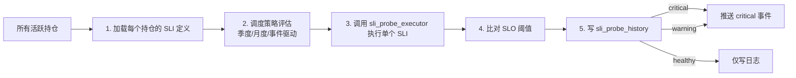

# 引擎 02：核心 SLI 探针调度器（首组件）

> [!NOTE] **[TRACEBACK]**
> - **维度概览**: [README](../README.md)
> - **L3 子模块**: `state_watch.sli_probe_scheduler`
> - **DNA 配置键**: `_System_DNA/state_watch/observer/sli_probe_scheduler.yaml`

## 一、引擎定位与目标

| 项 | 内容 |
|---|---|
| **一句话定位** | 维度三的"基础设施"——维护、调度、执行所有持仓的 SLI 探针 |
| **战略目标** | 让每一笔持仓都有"可观测的 SLI 探针"，杜绝"无逻辑持仓" |
| **优先级** | **P0**（维度三第 2 个引擎，与"叙事一致性"并行） |
| **决策机制** | 不做决策，仅执行探针并产生事件 |
| **能力边界** | 不定义 SLI 内容（由 thesis 卡片提供）；不做加权汇总（由"健康度评分"做） |

## 二、AI 工作流设计（这是个工程组件，不是 AI 引擎）

### 2.1 工作流程图



### 2.2 输入契约

```yaml
input:
  active_positions:
    - position_id: "EV_LEADER_001"
      sli_probes:
        - sli_id: "ev_quarterly_delivery_growth"
          probe_type: "quarterly"
          data_source: "tushare.financial_report"
          query: "..."
          slo:
            critical_threshold: 0.10
            warning_threshold: 0.20
```

### 2.3 输出契约

```yaml
output:
  position_id: "EV_LEADER_001"
  sli_id: "ev_quarterly_delivery_growth"
  evaluated_at: "2026-05-01T08:00:00Z"
  value: 0.08
  status: "critical"  # critical / warning / healthy
  threshold_breached: "critical_threshold (0.10)"
  history_link: "..."
```

### 2.4 调度策略

| 类型 | 触发 |
|---|---|
| `quarterly` | 财报披露后 +1 天自动触发 |
| `monthly` | 每月 1 日 09:00 触发 |
| `weekly` | 每周一 09:00 触发 |
| `event_driven` | 由公告流/Webhook 触发（如减持公告、政策出台） |
| `manual` | 架构师手动触发 |

### 2.5 与其他引擎的协作点

- **上游**：维度二的 thesis 卡片（含 SLI 定义） + 数据湖
- **下游**：探针结果 → 健康度综合评分 + 维度四 Exit Engine
- **跨维度**：所有维度三的引擎都依赖本组件

### 2.6 L3 子模块映射

- `state_watch.sli_probe_scheduler.scheduler_engine`：调度引擎
- `state_watch.sli_probe_scheduler.sli_definition_registry`：SLI 定义注册中心
- `state_watch.sli_probe_executor`：执行器（独立组件）

## 三、首次实现方案（Stage A · 没有训练，只有工程）

> 本组件是**纯工程组件**，不需要 LLM 训练。Stage A 主要是工程实现。

### 3.1 Step 1：定义 SLI Schema

```yaml
# SLI 定义模板
sli_id: "{position_id}_{metric_name}"
name: "..."
position_tag: "..."
probe_type: "quarterly"
data_source: "tushare.financial_report"
query_template: "SELECT delivery FROM ..."
slo:
  threshold: 0.30
  warning_threshold: 0.20
  critical_threshold: 0.10
```

### 3.2 Step 2：实现调度器

```python
# 伪代码
def scheduler_loop():
    while True:
        for position in active_positions():
            for sli in position.sli_probes:
                if should_trigger(sli):
                    result = execute_sli(sli)
                    write_history(result)
                    if result.status in ("critical", "warning"):
                        push_event(result)
        sleep(60)  # 每分钟扫描一次
```

### 3.3 Step 3：实现执行器

```python
def execute_sli(sli):
    if sli.data_source.startswith("tushare"):
        value = query_tushare(sli.query_template)
    elif sli.data_source.startswith("internal"):
        value = query_internal_db(sli.query_template)
    elif sli.data_source.startswith("llm"):
        value = ask_llm(sli.query_template)  # 复杂场景如新闻问答型 SLI
    
    status = compare_slo(value, sli.slo)
    return SliResult(value=value, status=status, ...)
```

### 3.4 Step 4：写 sli_probe_history

```sql
CREATE TABLE sli_probe_history (
    id BIGSERIAL PRIMARY KEY,
    position_id TEXT,
    sli_id TEXT,
    evaluated_at TIMESTAMPTZ,
    value NUMERIC,
    status TEXT,
    raw_query_result JSONB
);
```

### 3.5 Step 5：与维度四 Exit Engine 集成

```python
def push_event(result):
    if result.status == "critical":
        publish("exit_engine.r1_trigger", {
            "position_id": result.position_id,
            "sli_id": result.sli_id,
            "value": result.value,
            "evaluated_at": result.evaluated_at,
        })
```

### 3.6 Step 6：前端集成

- 持仓驾驶舱：每笔持仓的 SLI 仪表盘
- 探针历史回放：单个 SLI 的历史结果时序
- 手动触发按钮：架构师手动触发 SLI

## 四、组件成熟度路径（Stage A → E，工程类）

| 阶段 | 关键动作 | 完成标志 |
|---|---|---|
| A | 调度器 + 执行器 + sli_probe_history 表跑通 | 至少 1 个持仓的 3 个 SLI 能被执行并落表 |
| B | 加 event_driven 调度（公告 Webhook） | 减持/对赌履约/质押公告能触发探针 |
| C | 加 LLM 类 SLI（如"管理层近 3 个月公开发言是否积极") | LLM 类 SLI 能跑且评分稳定 |
| D | 加多源数据 SLI（结合产业链数据） | 跨数据源 SLI 能跑 |
| E | 加 ML 类 SLI（如"短期股价异常波动检测") | ML 类 SLI 能跑且不误报 |

## 五、数据依赖梯次表

| 阶段 | 数据类别 | 数据源 | 关键字段 | 采集频率 | 是否结构化 |
|---|---|---|---|---|---|
| 前期 | SLI 定义 | 维度二的 thesis 卡片 | sli_id、阈值、数据源、查询模板 | 事件驱动 | 结构化 |
| 前期 | 财报数据 | Tushare（已采集） | 复用 | - | - |
| 前期 | 公告 Webhook | 巨潮（已采集） | 复用 | - | - |
| 中期 | 产业链数据 | 行业协会（已采集） | 复用 | - | - |
| 中期 | 高频行情 | Tushare（已采集） | 复用 | - | - |
| 后期 | 卫星/电力等替代数据 | 第三方 | 复用 | - | - |

## 六、组件 SLO（自身的服务等级目标）

| SLO | 目标 |
|---|---|
| 调度延迟 | 应触发的 SLI 在 5 分钟内被调度 |
| 执行成功率 | ≥ 99.5% |
| 数据延迟告警 | 任何 SLI 执行延迟 > 1 小时 → 告警 |
| 历史可回放率 | 100% |

## 七、与上下游引擎的衔接

- **上游**：维度二 thesis 卡片、数据湖
- **下游**：维度三所有评分类引擎、维度四 Exit Engine
- **跨维度**：维度五的"评测回放器"复用 sli_probe_history 做回测

## 八、L3 / L4 / L5 / DNA 映射

- **L3 子模块**: `state_watch.sli_probe_scheduler`
- **L4 阶段实践**: `04_阶段规划与实践/Stage3_模块实践/06_SLI探针调度器/`
- **L5 验收行 ID**: `l5-watch-sli-probe-scheduler`
- **DNA 配置键**: `_System_DNA/state_watch/observer/sli_probe_scheduler.yaml`
- **代码仓路径**: `diting-src/state_watch/observer/sli_probe_scheduler/`
- **元数据路径**: `diting-data/state_watch/sli_probe_history/`（PostgreSQL）
