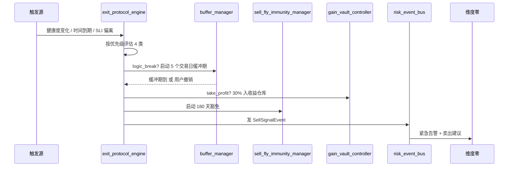

# 维度四·引擎到 L3 模块的映射

> [!NOTE] **[TRACEBACK]**
> - **维度概览**: [README](./README.md)
> - **本维度引擎全景**: [01_引擎全景与优先级](./01_引擎全景与优先级.md)
> - **本维度实践策略**: [04_卖出实践策略规划](./04_卖出实践策略规划.md)
> - **对应 L3 模块**: [状态机监控 state_watch](../../03_原子目标与规约/04_维度四_卖出决策/README.md)（与维度三共享）
> - **L3 落地清单**: [状态机监控 06_L2 落地清单](../../03_原子目标与规约/04_维度四_卖出决策/06_L2落地清单_设计.md)

## 一、本文档的位置

L2 维度四**与维度三同时映射到 L3 状态机监控**——这是 L2 5 维度产品视角 vs L3 4 大模块工程视角的不对齐表达。

本文档明确**维度四的引擎/能力运行在 L3 state_watch 哪些服务上**；维度三的映射见 [维度三·00_引擎到L3模块的映射](../03_维度三_持仓监控/00_引擎到L3模块的映射.md)。

## 二、维度四 ↔ L3 模块的总归属

| L2 维度 | L3 工程归属 |
|---|---|
| **维度四·卖出决策**（产品视角）| **L3·状态机监控 state_watch**（工程视角，与维度三共享）|

## 三、引擎/能力 → L3 state_watch 后端服务子模块映射

| L2 能力（维度四）| 优先级 | L3 主责服务 | L3 协责服务 |
|---|---|---|---|
| **4 类卖出协议引擎** | P0 | `exit_protocol_engine`（新增）| `rebalance_advisor` |
| - take_profit（止盈） | P0 | `exit_protocol_engine.check_take_profit` | `gain_vault_controller`（30% 入仓库）|
| - logic_break_exit（逻辑链断）| P0 | `exit_protocol_engine.check_logic_break` | `state_machine_registry`（broken 状态）|
| - opportunity_cost_reset（机会成本重置）| P1 | `exit_protocol_engine.check_opportunity_cost` | — |
| - battlefield_failure_exit（战场失败）| P1 | `exit_protocol_engine.check_battlefield_failure` | — |
| **卖飞豁免管理（180 天）** | P1 | `sell_fly_immunity_manager`（新增）| `invalidation_auditor` |
| **不正确卖出拦截器**（防止价格驱动）| P0 | `exit_protocol_engine.intercept_price_only` | — |
| **缓冲期管理（5 个交易日）** | P0 | `exit_protocol_engine.buffer_manager` | `transition_engine` |
| **与维度三 4×4 矩阵集成** | P1 | `rebalance_advisor` 触发 `exit_protocol_engine` | — |
| **卖出复盘** | P2 | `invalidation_auditor` | super_evo `feedback_collector` |

## 四、关键能力的协作场景

| 场景 | 涉及的 L3 服务 | 说明 |
|---|---|---|
| **4 类卖出协议触发链** | `exit_protocol_engine` 按优先级评估 4 类 → 发 SellSignalEvent | logic_break > battlefield > opportunity_cost > take_profit |
| **卖飞豁免标记** | `sell_fly_immunity_manager` 注册 → super_evo 归因引擎查询 | 180 天内同标的再涨不算系统失败 |
| **不正确卖出拦截** | `exit_protocol_engine.intercept_price_only` 拦截"仅基于价格的卖出" | 必须 ≥ 1 个 thesis 状态原因 |
| **缓冲期内可撤销** | `exit_protocol_engine.buffer_manager` 5 个交易日窗口 | 用户撤销 → 重置状态 |
| **与维度三调仓矩阵联动** | `rebalance_advisor` 生成 reduce/liquidate 时调 `exit_protocol_engine` | 跨能力协作 |
| **执行后归因** | `invalidation_auditor` → super_evo A/G/H 路由 | T+30/60/90 评估 |

## 五、4 类卖出协议的服务调用流



## 六、部署形态建议

| 服务 | 部署形态 | 资源 |
|---|---|---|
| `exit_protocol_engine` | 独立微服务（含 4 类协议 + 拦截器 + 缓冲期）| 1 vCPU / 2GB RAM |
| `sell_fly_immunity_manager` | 独立微服务（PG 后端）| 0.5 vCPU / 1GB RAM |

> 这两个服务在 L3 状态机监控的 02_后端服务子模块_设计 抽象中未单独列出，是 06_L2 落地清单 新增的具体服务。

## 七、共享服务（与维度三共享）

| 共享服务 | 说明 |
|---|---|
| `state_machine_registry` | 与维度三共享同一节点状态机 |
| `transition_engine` | 共享状态迁移引擎（broken 触发 logic_break_exit）|
| `invalidation_auditor` | 共享失效审计 |
| `notification_dispatcher` | 共享通知派发 |
| `rebalance_advisor`（维度三主责） | 维度四的 reduce/liquidate 建议触发本维度卖出协议 |
| `gain_vault_controller`（维度三主责） | 维度四 take_profit 时联动 |

## 八、上下游事件流

### 8.1 维度四输出（被其他维度消费）

```yaml
SellSignalEvent:             消费方: 维度零紧急告警（4 类卖出按 urgency 分级推）
SellAttributionEvent:        消费方: 维度五 A/G/H 归因（含卖飞豁免标记）
```

### 8.2 维度四输入（消费其他维度）

```yaml
events:monitor:health_change:   维度三 broken_any → 触发 logic_break_exit
events:monitor:rebalance_advice: 维度三 4×4 矩阵 reduce/liquidate 单元 → 触发对应卖出协议
events:price:daily_close:        T+0 价格 → take_profit 检查
events:flywheel:lora_updated:    维度五卖出 LoRA 更新
events:user:cancel_buffer:       用户在缓冲期内撤销 → 重置状态
```

## 九、卖出协议优先级表

> 同时满足多个协议触发条件时，按从严到松顺序执行（≤ 1 个最终触发）。

| 优先级 | 协议 | 触发条件 | 卖出比例 | urgency |
|---|---|---|---|---|
| 1（最严）| **logic_break_exit** | ≥ 1 强约束 broken（缓冲期到）| 100% | emergency_red |
| 2 | **battlefield_failure_exit** | 持有满战场周期 + 收益 < 最低门槛 + 健康度 weakening | 100% | regular_red |
| 3 | **opportunity_cost_reset** | 持有 ≥ 战场最低周期 50% + 收益 < 战场最低门槛 | 100% | orange |
| 4（最松）| **take_profit** | 健康度 strong/healthy + 大涨 | 30-50% | orange |

## 十、一致性检查表

- [x] 维度四 4 类卖出协议全部映射到 L3 state_watch 服务
- [x] 卖飞豁免 180 天 + 缓冲期 5 个交易日实现
- [x] 与维度三 4×4 矩阵联动 + 共享服务
- [x] 不正确卖出拦截器（防价格驱动）
- [x] 4 类协议优先级表清晰
- [x] 部署形态 + 双向事件流
- [x] 与 L3 状态机监控 06_L2 落地清单 严格对齐

---

## 修订记录

| 日期 | 触发 | 内容 |
|---|---|---|
| 2026-05-16 | 补 L2/L3 双向映射 | 新建本映射文档 |
