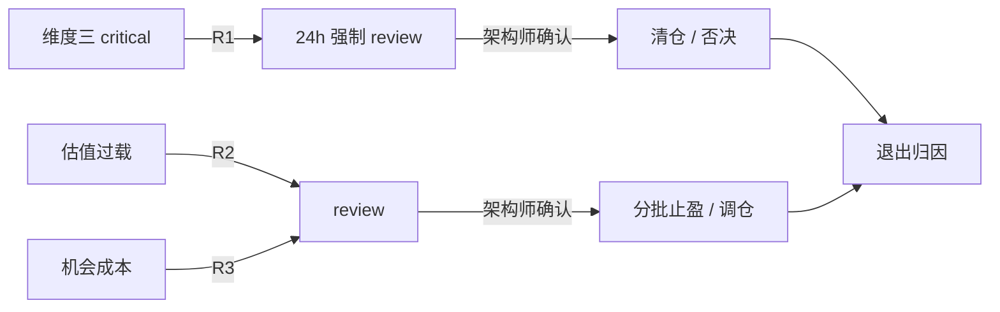

# 维度四·引擎全景与优先级

> [!NOTE] **[TRACEBACK]**
> - **维度概览**: [README](./README.md)

## 一、7 引擎扩展计划（两阶段）

| 阶段 | # | 引擎名称 | 主要工作目标 | 能力边界 |
|---|---|---|---|---|
| **P1** | 1 | **逻辑破坏熔断引擎** | 消费维度三的 critical 信号，触发 R1 强制 review | 不直接卖出，仅 escalate |
| **P1** | 2 | **估值过载止盈引擎** | 基于反向 DCF / 行业历史估值分位，触发 R2 | 不预测目标价 |
| **P1** | 3 | **机会成本调仓引擎** | 全市场扫候选标的，触发 R3 | 候选标的必须先过维度一 |
| **P1** | 4 | **分批止盈策略生成引擎** | 当 R2 触发时给出"分 N 批、每批 X%"具体节奏 | 仅生成建议，不下单 |
| **P2** | 5 | **税费成本优化引擎** | 考虑交易成本 / 印花税 / 资本利得税 | 仅做净收益计算 |
| **P2** | 6 | **多因子退出聚合引擎** | R1+R2+R3 加权综合 | 加权策略由架构师配置 |
| **P2** | 7 | **退出回放归因引擎** | 事后归因"卖对了/卖错了，因为..." | 高价值训练数据来源 |

## 二、引擎实现优先级与排序理由

| 排序 | 引擎 | 排序理由 |
|---|---|---|
| 1 | **逻辑破坏熔断** | 消费维度三的核心 critical 信号，是维度四的"防御性核心" |
| 2 | **估值过载止盈** | 工程门槛中等，反向 DCF 模型可复用 |
| 3 | **机会成本调仓** | 数据来源依赖维度二的 thesis 卡片库 + 维度一的安检通过池 |
| 4 | **分批止盈策略生成** | 在 R2 之上的策略生成，工程门槛较低 |
| 5 | **税费成本优化** | 锦上添花，但对长期复利影响很大 |
| 6 | **多因子退出聚合** | 在 R1+R2+R3 都跑通后才有意义 |
| 7 | **退出回放归因** | 数据需要真实卖出决策积累 ≥ 6 个月才有意义 |

## 三、维度四"R1 优先级压倒一切"原则

**铁律**：当 R1 触发时，R2/R3 即使未触发也升级为 escalate；R1 是"否决性触发"。

## 四、卖出审议池的 SLO

| 状态 | SLO |
|---|---|
| `review`（R2/R3） | 架构师 7 天内做出决策 |
| `escalate`（R1） | 架构师 24h 内做出决策 |
| `auto_pass`（造假定性等） | 立刻进入清仓审议 |

超时未决策 → 升级告警到架构师手机/邮箱。
