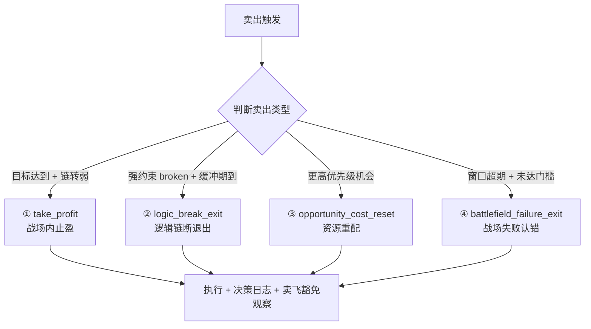

# L2 · 维度四 · 卖出实践策略规划

> [!IMPORTANT] **本文档承接 L1 哲学基石 ⑧·卖出决策哲学边界**的全部实践层规则。
>
> **核心区分**：维度三是"监控 + 调仓"（持仓内部调整），维度四是"卖出"（完全退出或大额减仓）。两者在 4×4 调仓矩阵中分工见 §五。

> [!NOTE] **[TRACEBACK]**
> - **L1 哲学地基**：[基石 ⑧·卖出决策哲学边界](../../01_顶层概念/06_投资哲学体系总纲.md#基石-卖出决策哲学边界维度四卖出决策)
> - **协同**：[基石 ④·八象限](../../01_顶层概念/06_投资哲学体系总纲.md#基石-决策正确性的四象限判定) | [基石 ⑦·持仓监控](../../01_顶层概念/06_投资哲学体系总纲.md#基石-持仓监控哲学边界维度三持仓监控)
> - **同层**：[维度四 README](./README.md) | [维度三·持仓策略与战场分配实践规划](../03_维度三_持仓监控/04_持仓策略与战场分配实践规划.md)
> - **协作维度**：[维度零·价值账本](../00_维度零_AI投资副驾驶/03_价值账本与决策日志.md) | [维度零·与后端契约](../00_维度零_AI投资副驾驶/04_与5维度后端的契约.md) §五
> - **下沉 L3 规约**：待 L3 创建（SellSignal schema、4 类卖出协议、卖飞豁免规约）
> - **下沉 DNA**：`_System_DNA/global_const.yaml` → `investment_philosophy.exit`

---

## 目录

- [一、本文档的层级定位](#一本文档的层级定位)
- [二、4 类正确卖出协议](#二4-类正确卖出协议)
- [三、1 类错误卖出反例](#三1-类错误卖出反例)
- [四、卖飞豁免规则](#四卖飞豁免规则)
- [五、与维度三的边界与调仓协作](#五与维度三的边界与调仓协作)
- [六、卖出建议事件 schema](#六卖出建议事件-schema)
- [七、卖出节奏与执行策略](#七卖出节奏与执行策略)
- [八、卖出归因与失败定义](#八卖出归因与失败定义)
- [九、DNA 键落地建议](#九dna-键落地建议)
- [十、一致性检查](#十一致性检查)

---

## 一、本文档的层级定位

| 层级 | 写什么 |
|---|---|
| **L1 哲学**（已存）| 卖出核心立场 + 4 类正确 + 1 类错误 + 卖飞豁免 + 决策不可逆 |
| **L2 实践规划**（本文档）| **4 类卖出协议的触发条件、卖出节奏、卖飞豁免具体规则、与维度三完整接口** |
| **L3 规约**（待建）| Schema、协议、接口 |
| **L4 实践**（待建）| 实施情况记录 |

---

## 二、4 类正确卖出协议

> 承接 L1 §8.3「四种正确卖出，一种错误卖出」。

### 2.1 协议总览



### 2.2 协议 ① · 战场内止盈（take_profit）

| 项 | 规则 |
|---|---|
| **触发条件** | 窗口期内收益 ≥ 战场最低收益门槛 **AND** 逻辑链节点开始转弱（≥ 1 个核心节点 weakened）|
| **建议动作** | 分批止盈：先卖 30-50%，剩余继续观察 |
| **执行节奏** | T+0 卖 30%；如逻辑链继续走弱 T+5 再卖 30-50% |
| **推送级别** | orange |
| **典型场景** | 政策利好型 thesis 已兑现 + 利好开始消化 |

```python
def trigger_take_profit(holding):
    """协议①触发条件"""
    return (
        holding.return_pct >= holding.battlefield.min_return_threshold and
        holding.in_window and
        any(node.state == "weakened" for node in holding.core_nodes)
    )
```

### 2.3 协议 ② · 逻辑链断退出（logic_break_exit）

| 项 | 规则 |
|---|---|
| **触发条件** | 强约束节点 broken **AND** 缓冲期已到（5 个交易日观察期）|
| **建议动作** | 完全退出（不分批，立刻卖完）|
| **执行节奏** | 缓冲期内：T+0 ~ T+4 观察；T+5 决定 |
| **推送级别** | emergency_red |
| **关键约束** | 无论价格涨跌，都必须执行（不基于价格止损）|
| **典型场景** | 大股东大额减持公告 + 公司澄清失败 |

```python
def trigger_logic_break_exit(holding):
    """协议②触发条件"""
    if not any(node.state == "broken" and node.is_strong_constraint 
               for node in holding.nodes):
        return False
    
    broken_node = next(n for n in holding.nodes 
                       if n.state == "broken" and n.is_strong_constraint)
    buffer_days_passed = (datetime.now() - broken_node.broken_at).days
    return buffer_days_passed >= 5  # 缓冲期 5 个交易日
```

### 2.4 协议 ③ · 资源重配（opportunity_cost_reset）

| 项 | 规则 |
|---|---|
| **触发条件** | 持仓 thesis 健康度 OK 但收益缓慢 **AND** 出现更高 expected_payoff_ratio 机会 |
| **建议动作** | 部分减仓（30-50%）腾出资金 |
| **执行节奏** | T+0 减 30%；监控替代标的入场后再减 20-30% |
| **推送级别** | yellow |
| **典型场景** | 持仓利润截留型缓慢回流 + 新出现政策利好型机会 |

```python
def trigger_opportunity_cost_reset(holding, candidate):
    """协议③触发条件"""
    return (
        holding.health >= 0.50 and
        holding.return_pct < holding.battlefield.min_return_threshold * 0.5 and
        candidate.expected_payoff_ratio >= holding.expected_payoff_ratio * 1.5 and
        candidate.cognitive_boundary_check.passed
    )
```

### 2.5 协议 ④ · 战场失败认错（battlefield_failure_exit）

| 项 | 规则 |
|---|---|
| **触发条件** | 持仓窗口期超期 **AND** 收益 < 战场最低收益门槛 |
| **建议动作** | 完全退出（认错）|
| **执行节奏** | 超期 + 收益不达标 → 30 个交易日内分批退出（避免一次性砸盘）|
| **推送级别** | regular_red |
| **典型场景** | 主战场 90 天到期，预期 20% 实际 -5%（逻辑链未破但价值未兑现）|
| **后续路由** | 进入维度五 `window_calibration_library`（G 象限）|

```python
def trigger_battlefield_failure_exit(holding):
    """协议④触发条件"""
    return (
        not holding.in_window and
        holding.return_pct < holding.battlefield.min_return_threshold
    )
```

---

## 三、1 类错误卖出反例

> 承接 L1 §8.3「错误卖出 = 单纯因短期价格回撤"止损"」。

### 3.1 错误卖出特征

| 触发"信号" | 卖出类型 | 错误原因 |
|---|---|---|
| 价格下跌 5%（无任何 SLI 变化） | "技术止损" | 价格下跌 ≠ 链断 |
| 价格连续 3 天跌 | "趋势止损" | 不是哲学允许的止损依据 |
| 大盘大跌 → 持仓跟跌 | "跟随止损" | 系统性事件 ≠ 个股逻辑链断 |
| 短期负面新闻情绪 | "情绪止损" | 情绪 ≠ 逻辑链 |

### 3.2 系统响应：拦截错误卖出

```python
def validate_sell_request(request):
    """拦截错误卖出请求"""
    
    # 检查是否对应 4 类正确卖出之一
    valid_protocols = [
        "take_profit", "logic_break_exit",
        "opportunity_cost_reset", "battlefield_failure_exit"
    ]
    
    if request.sell_type not in valid_protocols:
        return {
            "allowed": False,
            "reason": "非 4 类正确卖出之一",
            "philosophical_principle": "L1 基石⑧ 反对价格止损"
        }
    
    # 检查是否有合法触发依据
    if request.sell_type == "logic_break_exit":
        if not request.has_broken_strong_constraint:
            return {"allowed": False, "reason": "无 broken 强约束节点"}
    
    return {"allowed": True}
```

---

## 四、卖飞豁免规则

> 承接 L1 §8.3「卖飞豁免」哲学：6 个月内不可后悔卖出。

### 4.1 卖飞豁免的本质

```
错误信念：标的卖了后涨 → 当时不该卖
正确认知：卖出时点的"逻辑链状态 + 战场窗口" 才是判据
```

### 4.2 豁免窗口期

| 项 | 建议值 |
|---|---|
| **豁免窗口期** | 180 天（≈ 6 个月）|
| **豁免范围** | 卖出后 180 天内的价格上涨，不算"卖飞" |
| **豁免触发** | 卖出时 logic_chain_state ∈ {weakened, broken} → 自动豁免 |

### 4.3 卖飞豁免的归因路径

```
卖出后价格上涨场景:
  T+30 检查 → 当时是否 weakened/broken?
                ✅ 是 → "卖飞豁免" (sell_type 仍然是正确决策)
                ❌ 否 → 进入 "可能错卖" 复盘队列
  
  T+90 检查 → 是否仍涨 ≥ 战场门槛?
                ✅ 是 → 在 verified 时询问架构师 "是否当时观察到了链反转信号"
                ❌ 否 → 卖出仍然正确
  
  T+180 检查 → 豁免窗口期到，最终归因
```

### 4.4 卖飞豁免与归因模型对齐

| 卖出时状态 | T+90 后价格 | 八象限归因 | 卖飞判定 |
|---|---|---|---|
| 链 broken + 卖出 | 涨 ≥ 20% | A_exit·完美退出 | 豁免（不算卖飞）|
| 链 weakened + 卖出 | 涨 ≥ 20% | A_exit·完美退出 | 豁免 |
| 链 weakened + 卖出 | 跌 | F·避雷成功 | 不需豁免 |
| 链 validated + 卖出（错卖）| 涨 ≥ 20% | 真错卖 | **不豁免**，进 DPO failure 库 |

---

## 五、与维度三的边界与调仓协作

### 5.1 维度三 vs 维度四 分工

| 项 | 维度三·持仓监控 | 维度四·卖出决策 |
|---|---|---|
| **核心职责** | 监控 + 调仓建议（内部调整） | 卖出建议（退出仓位）|
| **触发场景** | 健康度变化、节点状态变化 | 卖出协议 4 类触发条件 |
| **建议类型** | 加仓 / 持有 / 部分减仓 / 完全卖出 | 完全退出 / 大额减仓 |
| **重叠区** | 维度三 4×4 矩阵的"reduce_50_plus / exit" 直接调用维度四 |

### 5.2 维度三 4×4 矩阵 → 维度四 4 类卖出协议的映射

| 维度三矩阵单元 | 触发维度四协议 |
|---|---|
| `weakening_on_target` | 协议①·战场内止盈 |
| `weakening_above_target` | 协议①·战场内止盈 |
| `broken_*`（任意收益）| 协议②·逻辑链断退出 |
| `strong_below_target` + 出现更优机会 | 协议③·资源重配 |
| `normal_*` + 窗口超期 + 未达门槛 | 协议④·战场失败认错 |

### 5.3 完整协作 schema

```yaml
# 维度三 RebalanceAdviceEvent (大额减仓时)
# ↓ 触发
# 维度四 SellSignalEvent

cross_dimension_protocol:
  trigger:
    source_event: monitor.rebalance_advice
    action_in: [reduce_50_plus, exit]
  
  routing:
    matrix_cell: str           # 如 "weakening_on_target"
    -> sell_type: str          # 维度四自动判定 4 类之一
    -> push_level: str         # emergency_red | regular_red | orange
  
  consistency:
    require_same_thesis_card: true
    require_same_health_snapshot: true
```

---

## 六、卖出建议事件 schema

> 与 [维度零·与后端契约 §五](../00_维度零_AI投资副驾驶/04_与5维度后端的契约.md#五维度四--维度零卖出建议事件) 严格对齐。

```yaml
SellSignalEvent:
  event_id: str
  thesis_card_id: str
  symbol: str
  
  # 4 类卖出之一（必填）
  sell_type: enum                       # take_profit | logic_break_exit | opportunity_cost_reset | battlefield_failure_exit
  
  # 触发上下文
  trigger:
    health: float
    return_pct: float
    quadrant: enum                      # A | C | E | G | F | H
    in_window: bool
    strong_constraint_broken: bool
    broken_at: datetime | null
    buffer_days_passed: int             # 协议②专用
    candidate_symbol: str | null        # 协议③专用
  
  # 卖出建议
  recommendation:
    action: enum                        # full_exit | partial_exit_50 | partial_exit_30
    urgency: enum                       # immediate | within_24h | within_week | within_30d
    reason: str                         # 中文解释
    suggested_execution_plan:           # 执行节奏
      - day_offset: int                 # T+0, T+5...
        ratio: float                    # 0-1
        condition: str | null           # 触发本次执行的额外条件
  
  # 卖飞豁免说明
  sell_fly_immunity:
    enabled: bool                       # 卖出时 logic_chain ∈ {weakened, broken} → true
    window_days: 180
    explanation: str
  
  # 上游引用
  health_change_event_ref: str
  rebalance_advice_event_ref: str | null
  
  # 路由
  push_level: enum                      # emergency_red | regular_red | orange
```

---

## 七、卖出节奏与执行策略

### 7.1 节奏建议矩阵

| 卖出类型 | 紧急度 | 节奏 | 总周期 |
|---|---|---|---|
| 协议①·止盈 | 普通 | T+0 卖 30-50% / T+5 视情况再卖 | ≤ 10 天 |
| 协议②·链断 | 紧急 | T+0 ~ T+5 缓冲期 / T+5 完全卖出 | 5 天 |
| 协议③·重配 | 中等 | T+0 卖 30% / T+5-T+10 配合替代标的再卖 | ≤ 20 天 |
| 协议④·战场失败 | 中等 | 30 个交易日分批退出 | 30 天 |

### 7.2 流动性限制

| 项 | 规则 |
|---|---|
| **单日卖出比例上限** | ≤ 持仓的 50%（避免冲击成本）|
| **特别注意** | 小盘股 ≤ 30%；流动性不足时分 5 天卖出 |
| **盘前 / 盘后** | 集合竞价不卖（流动性差）|

---

## 八、卖出归因与失败定义

> 承接 L1 §8.4「卖出决策的成功定义」+ §8.5「卖出决策的失败定义」。

### 8.1 卖出归因时点

| 时点 | 归因目标 |
|---|---|
| **T+30** | 初次定位（卖飞豁免初判）|
| **T+90** | 主战场卖飞豁免最终判定 |
| **T+180** | 豁免窗口期到，最终归因入库 |

### 8.2 卖出归因矩阵

| 卖出协议 | T+90 价格涨 | T+90 价格跌 | 卖出时链状态 | 归因结果 |
|---|---|---|---|---|
| ① 止盈 | 涨 | 跌 | 已 weakened | A_exit·完美止盈 / F·避免回撤 |
| ② 链断 | 涨 | 跌 | broken | A_exit·豁免 / F·避雷 |
| ③ 重配 | 替代涨 | 替代跌 | OK | 视替代标的表现 |
| ④ 战场失败 | 涨 | 跌 | OK | G·窗口失败（无论价格） |

### 8.3 卖出失败的明确定义

```python
def is_sell_failed(sell_event, t180_outcome):
    """卖出失败 ≠ 卖飞"""
    
    # 失败 1: 链未 weakened 就卖（提前卖出）
    if sell_event.trigger.health >= 0.80 and sell_event.sell_type != "opportunity_cost_reset":
        return True, "premature_exit"
    
    # 失败 2: 该卖未卖（系统未触发卖出协议但应该触发）
    # —— 这是漏报，在 verified 阶段补归因
    
    # 失败 3: 节奏失误（紧急情况下慢卖）
    if sell_event.sell_type == "logic_break_exit" and \
       sell_event.execution_completed_days > 7:
        return True, "slow_execution"
    
    return False, None
```

### 8.4 飞轮路由

```yaml
quadrant_routing:
  A_exit:
    library: gold_library
    use: SFT 强化训练（完美止盈样本）
  
  F_exit:
    library: gold_library
    use: SFT 强化训练（避雷样本）
  
  G_exit:
    library: window_calibration_library
    use: 训练窗口期/目标价估计模型
  
  premature_exit:
    library: failure_library_for_dpo
    use: DPO 偏好对（让模型学会"链未弱时不要卖"）
  
  slow_execution:
    library: execution_speed_library
    use: 训练紧急度判定模型
```

---

## 九、DNA 键落地建议

```yaml
investment_philosophy:
  exit:
    # === 4 类卖出协议 ===
    protocols:
      take_profit:
        return_threshold: "battlefield_min_return"
        node_weakened_required: true
        execution_plan: [{ day: 0, ratio: 0.30 }, { day: 5, ratio: 0.50 }]
        push_level: orange
      
      logic_break_exit:
        strong_constraint_broken_required: true
        buffer_days: 5
        execution_plan: [{ day: 5, ratio: 1.00 }]
        push_level: emergency_red
      
      opportunity_cost_reset:
        health_min: 0.50
        return_below_ratio: 0.50      # 当前收益 < 50% 战场门槛
        candidate_payoff_uplift: 1.5
        execution_plan: [{ day: 0, ratio: 0.30 }, { day: 10, ratio: 0.30 }]
        push_level: yellow
      
      battlefield_failure_exit:
        require_window_expired: true
        require_below_threshold: true
        execution_plan_days: 30
        push_level: regular_red
    
    # === 卖飞豁免 ===
    sell_fly_immunity:
      window_days: 180
      auto_immune_states: [weakened, broken]
      verified_review_required: true   # 涨 ≥ 20% 时进 verified 队列
    
    # === 错误卖出拦截 ===
    incorrect_sell_validation:
      enabled: true
      reject_reasons:
        - technical_stop_loss
        - trend_stop_loss
        - market_follow_stop_loss
        - sentiment_stop_loss
    
    # === 与维度三协作 ===
    coordination_with_d3:
      matrix_cell_to_protocol:
        weakening_on_target: take_profit
        weakening_above_target: take_profit
        broken_any: logic_break_exit
        strong_below_target_with_alternative: opportunity_cost_reset
        normal_window_expired_below_threshold: battlefield_failure_exit
    
    # === 流动性 ===
    liquidity_limits:
      max_daily_sell_ratio: 0.50
      small_cap_max_daily_sell_ratio: 0.30
      auction_period_excluded: true
    
    # === 归因 ===
    attribution:
      timepoints_days: [30, 90, 180]
      failure_routing:
        premature_exit: failure_library_for_dpo
        slow_execution: execution_speed_library
```

---

## 十、一致性检查

| 检查项 | 状态 |
|---|---|
| L1 基石⑧ 已在本文档完整承接 | ✅ |
| 4 类正确卖出协议触发条件 + 执行节奏 + 推送级别齐全 | ✅ |
| 1 类错误卖出反例 + 系统拦截规则明确 | ✅ |
| 卖飞豁免规则（180 天 + 自动豁免条件 + verified 复盘）齐全 | ✅ |
| 与维度三完整协作 schema | ✅ |
| SellSignalEvent schema 与维度零契约完整对齐 | ✅ |
| 卖出节奏与流动性限制规则齐全 | ✅ |
| 卖出归因与失败定义算法明确 | ✅ |
| DNA 键落地建议完整 | ✅ |
| TRACEBACK 链完整 | ✅ |
| 不写代码实现细节，不重新定义哲学边界 | ✅ |

---

## 修订记录

| 日期 | 触发 | 内容 |
|---|---|---|
| 2026-05-14 | 用户要求"L2 实践策略规划"从占位变完整版 | 填充完整规则：4 类卖出协议（触发条件 + 节奏 + 推送）、1 类错误卖出拦截、卖飞豁免（180 天 + 归因路径）、与维度三完整协作矩阵、SellSignalEvent schema、流动性限制、卖出失败定义（premature/slow_execution）、飞轮路由 |
