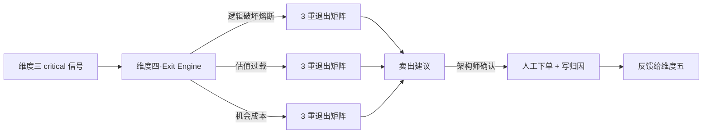

# 维度四·卖出决策（The Exit）

> [!NOTE] **[TRACEBACK] 战略维度锚点**
> - **顶层概念**: [项目定义与核心价值](../../01_顶层概念/01_项目定义与核心价值.md)
> - **同层引用**: [双目标与战略维度关系](../00_双目标与战略维度关系.md)
> - **L3 对应模块**: [状态机监控（state_watch）](../../03_原子目标与规约/04_维度四_卖出决策/README.md) + [06_L2 落地清单](../../03_原子目标与规约/04_维度四_卖出决策/06_L2落地清单_设计.md)（与维度三共享）
> - **L3 工程映射**: [00_引擎到L3模块的映射](./00_引擎到L3模块的映射.md)

## 一、维度速览

| 项目 | 内容 |
|---|---|
| **一句话定位** | 把"什么时候卖"从"靠感觉/被市场情绪绑架"变成"由结构化规则触发" |
| **战略目标** | 解决"买得对不一定卖得对"的痛点，用 3 重退出矩阵管理卖出决策 |
| **核心使命** | 卖出由维度三的信号 + 估值过载 + 机会成本三套规则共同触发，永远人工最终确认 |
| **L3 模块** | `state_watch`（卖出决策部分） |
| **引擎数量** | 7 引擎（P0:0 / P1:4 / P2:3） |
| **当前优先级** | P1（在维度三的 SLI 探针就绪后启动） |

## 二、本目录文件索引

| 文件 | 内容 |
|---|---|
| [**00_引擎到L3模块的映射.md**](./00_引擎到L3模块的映射.md) | **★ L2 ↔ L3 双向映射**：维度四 4 类卖出协议映射到 L3 state_watch 哪些后端服务 |
| [00_维度目标与能力边界.md](./00_维度目标与能力边界.md) | 战略目标、3 重退出矩阵、与维度三的边界 |
| [01_引擎全景与优先级.md](./01_引擎全景与优先级.md) | 7 引擎的扩展计划 |
| [02_数据依赖梯次总表.md](./02_数据依赖梯次总表.md) | 维度级数据采集清单 |
| [03_训练与评测资产路径.md](./03_训练与评测资产路径.md) | 维度级训练范式 |
| [engines/](./engines/) | 7 个引擎的完整规约 |

## 三、本维度引擎清单

| # | 引擎名称 | 优先级 | 文档 |
|---|---|---|---|
| 1 | 逻辑破坏熔断引擎 | P1 | engines/01_逻辑破坏熔断.md（待 P1 阶段补全） |
| 2 | 估值过载止盈引擎 | P1 | engines/02_估值过载止盈.md（待 P1 阶段补全） |
| 3 | 机会成本调仓引擎 | P1 | engines/03_机会成本调仓.md（待 P1 阶段补全） |
| 4 | 分批止盈策略生成引擎 | P1 | engines/04_分批止盈策略生成.md（待 P1 阶段补全） |
| 5 | 税费成本优化引擎 | P2 | engines/05_税费成本优化.md（待 P2 阶段补全） |
| 6 | 多因子退出聚合引擎 | P2 | engines/06_多因子退出聚合.md（待 P2 阶段补全） |
| 7 | 退出回放归因引擎 | P2 | engines/07_退出回放归因.md（待 P2 阶段补全） |

## 四、协作约定

- **本维度的输入是维度三推送的 critical 信号 + 维度四自己的估值/机会成本计算**
- **本维度永远不下单**：所有卖出建议必须在前端"卖出确认"按钮经架构师确认
- **本维度所有决策写入"退出回放归因"**，作为维度五训练的高价值数据

## 五、与其他维度的关系

