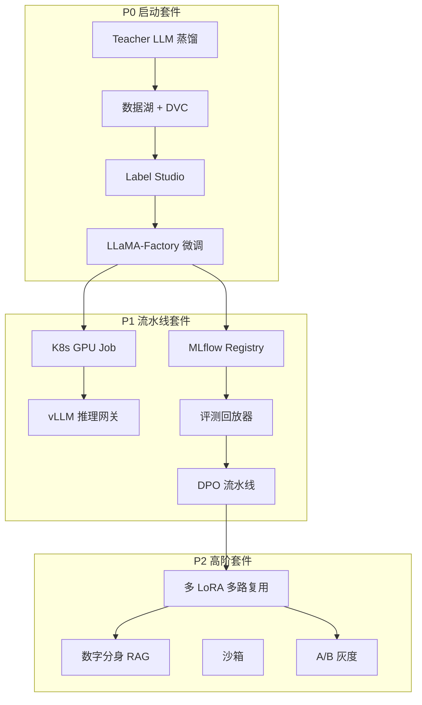

# 维度五·组件全景与优先级

> [!NOTE] **[TRACEBACK]**
> - **维度概览**: [README](./README.md)

## 一、13 MLOps 组件扩展计划（三阶段）

### P0 启动套件（第 1 个月跑通"数据 → 模型 → 推理"最小闭环）

| # | 组件名 | 主要工作目标 | 能力边界 |
|---|---|---|---|
| 1 | **Teacher LLM 蒸馏服务** | 用 Claude 3.5 Sonnet / GPT-4o，按 prompt 模板批量生成训练数据；速率限制、成本上限、错误重试 | 不做"全自动训练"——蒸馏后必须人工 verified |
| 2 | **数据湖 + DVC 版本化** | MinIO 单节点起步，DVC 锁定每次训练数据快照 | 不替代生产级数据治理（如 Delta Lake） |
| 3 | **Label Studio 人工 verified** | 架构师每周抽 2h 重点 verified 一批关键样本 | 不替代专业标注员 |
| 4 | **LLaMA-Factory 手动微调** | 本地用 LoRA 微调 Qwen2.5-7B，跑通"数据 → 模型"链路；不用 K8s | 不做超大模型训练 |

### P1 流水线套件（第 2–4 个月，自动化与可观测）

| # | 组件名 | 主要工作目标 | 能力边界 |
|---|---|---|---|
| 5 | **K8s GPU Job 自动训练触发** | CT 流水线，数据增量到一定阈值（如新增 100 条 verified 样本）自动触发训练 | 仅触发训练，不替人工部署 |
| 6 | **vLLM 推理网关** | 所有维度调用 LoRA 模型都过 vLLM；速率限制 / 监控 / 灰度路由 | 不做模型选择决策 |
| 7 | **MLflow Model Registry** | 管理所有版本 LoRA + 元数据 + 评测结果；带审批流 | 仅做 Registry，不替评测 |
| 8 | **评测回归集与回放器** | Holdout 回放守门，任意指标退化 > 5% 自动 Block | 仅做评测，不做修复 |
| 9 | **DPO 偏好对齐流水线** | Stage C 开始引入；Label Studio 收集偏好对 + DPO 训练脚本 | 仅做 DPO，不替代 SFT |

### P2 高阶套件（第 6 个月+，议会模式 + 数字分身）

| # | 组件名 | 主要工作目标 | 能力边界 |
|---|---|---|---|
| 10 | **vLLM 多 LoRA 多路复用** | 一台 GPU 同时服务多个专科 LoRA（财务测谎、利润截留、叙事一致性各自 LoRA） | 单 GPU 同时 LoRA 数量受限 |
| 11 | **数字分身 RAG 系统** | 基于架构师历史决策日志构建个人风格 RAG；不替代架构师本人 | 仅做"风格辅助"，不做最终决策 |
| 12 | **gVisor / Firecracker 沙箱** | Agent 生成的代码在沙箱执行；网络隔离 / 文件系统隔离 / 资源限制 | 仅做隔离，不替代代码 review |
| 13 | **A/B 测试与灰度发布** | 新 LoRA 先 5% 流量灰度，观察一周再全量；自动回滚机制 | 仅做发布，不做评测 |

## 二、组件实现优先级与排序理由

| 排序 | 组件 | 排序理由 |
|---|---|---|
| 1 | **Teacher LLM 蒸馏 + 数据湖 + DVC + Label Studio + LLaMA-Factory（4 组件并列 P0）** | 这 4 个是"任何维度的首引擎都需要"的基础设施，必须并行启动 |
| 2 | **MLflow Model Registry** | 没有它，训练跑多了就乱了；评测也无法对照 |
| 3 | **评测回归集与回放器** | 守门核心；Holdout 必须有自动回放才能形成闭环 |
| 4 | **K8s GPU Job 自动训练触发** | 让 CT 流水线脱离架构师手动操作 |
| 5 | **vLLM 推理网关** | 把 LoRA 模型与业务调用解耦 |
| 6 | **DPO 偏好对齐流水线** | Stage C 阶段才用，但工程门槛中等 |
| 7 | **vLLM 多 LoRA 多路复用** | Stage D 阶段才用，工程门槛较高 |
| 8 | **数字分身 RAG** | 高价值但需要大量历史决策日志才能启动 |
| 9 | **gVisor / Firecracker 沙箱** | Agent 工作流成熟后才需要 |
| 10 | **A/B 测试与灰度** | 多 LoRA 多路复用之后才有意义 |

## 三、组件协作图

## 四、维度五的"个人成长资产"维度

| 组件 | 对应可写入简历的能力 |
|---|---|
| Teacher LLM 蒸馏 | "设计并实现 LLM 数据合成流水线" |
| 数据湖 + DVC | "搭建可版本化的数据湖" |
| LLaMA-Factory + DPO | "完成基于人类反馈的偏好对齐微调" |
| K8s GPU Job | "Kubernetes-native MLOps 流水线" |
| MLflow Registry | "MLOps 模型生命周期管理" |
| 评测回放器 | "Continuous Evaluation 系统设计" |
| vLLM 多 LoRA | "高并发 LLM 推理架构" |
| 数字分身 RAG | "RAG 系统设计与构建" |
| gVisor 沙箱 | "Untrusted Code Execution 安全设计" |

> **核心**：维度五的每一个组件都不是"为了写简历而做"，但其工程能力**天然就是 LLMOps 工程师/AI Infra 工程师的高 demand 技能**——这是"做就完了"的合理性所在。
