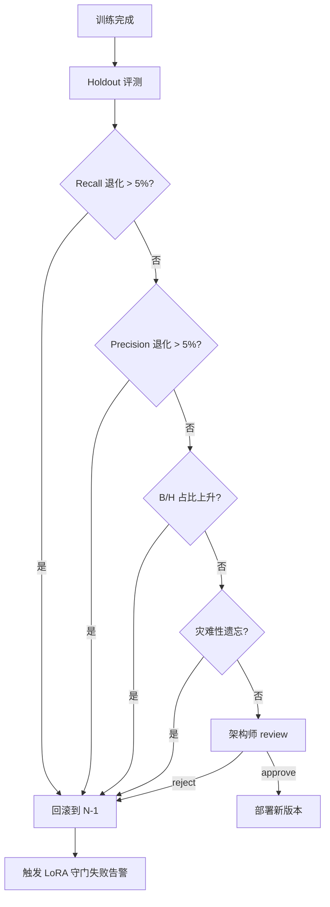

# L2 · 维度五 · 演进实践策略规划

> [!IMPORTANT] **本文档承接 L1 哲学基石 ⑨·演进进化哲学边界**的全部实践层规则。

> [!NOTE] **[TRACEBACK]**
> - **L1 哲学地基**：[基石 ⑨·演进进化哲学边界](../../01_顶层概念/06_投资哲学体系总纲.md#基石-演进进化哲学边界维度五演进飞轮)
> - **协同**：[基石 ④·八象限](../../01_顶层概念/06_投资哲学体系总纲.md#基石-决策正确性的四象限判定)（按象限路由训练）
> - **同层**：[维度五 README](./README.md)
> - **协作维度**：[维度零·价值账本（飞轮入料）](../00_维度零_AI投资副驾驶/03_价值账本与决策日志.md) | [维度零·与后端契约](../00_维度零_AI投资副驾驶/04_与5维度后端的契约.md) §六
> - **下沉 L3 规约**：待 L3 创建（训练库 schema、LoRA 守门协议、Kappa 标定协议）
> - **下沉 DNA**：`_System_DNA/global_const.yaml` → `investment_philosophy.evolution`

---

## 目录

- [一、本文档的层级定位](#一本文档的层级定位)
- [二、八象限路由训练规则](#二八象限路由训练规则)
- [三、LoRA 守门协议](#三lora-守门协议)
- [四、架构师 verified Kappa 标定](#四架构师-verified-kappa-标定)
- [五、训练频率与战场分级](#五训练频率与战场分级)
- [六、成本约束与控制](#六成本约束与控制)
- [七、训练数据治理](#七训练数据治理)
- [八、回滚机制](#八回滚机制)
- [八A. Lighthouse-Alpha ETL LLM Engine 实践规划](#八a-lighthouse-alpha-etl-llm-engine-实践规划承接-l1-9-演进哲学--异构-ai-调度栈)
- [九、DNA 键落地建议](#九dna-键落地建议)
- [十、一致性检查](#十一致性检查)

---

## 一、本文档的层级定位

| 层级 | 写什么 |
|---|---|
| **L1 哲学**（已存）| 演进核心立场 + 哲学边界（按象限路由 + 5% 退化即回滚 + Kappa ≥ 0.85） |
| **L2 实践规划**（本文档）| **8 象限路由具体训练库、LoRA 守门指标、Kappa 标定流程、训练频率、成本约束** |
| **L3 规约**（待建）| Schema、协议、接口 |
| **L4 实践**（待建）| 实施情况记录 |

---

## 二、八象限路由训练规则

> 承接 L1 §9.3 哲学要点 1「按八象限路由训练」+ 基石④ 八象限。

### 2.1 路由表

| 象限 | 含义 | 训练库 | 训练用途 | 数据增强权重 |
|---|---|---|---|---|
| **A·完美决策** | 链正常 + 价格涨 | gold_library | SFT 强化训练 | ×1.0 |
| **F·避雷成功** | 链断 + 小跌 | gold_library | SFT 强化训练 | ×1.0 |
| **D·早期识别** | 链断 + 价格平 | early_signal_library | 训练"提前预警"模型 | ×0.8 |
| **C·正常等待** | 链正常 + 价格平 | patience_library | **仅评测**（不进训练，避免学到"耐心 = 不动" ）| ×0.0 |
| **G·窗口失败** | 超期未达门槛 | window_calibration_library | 训练窗口/目标价估计模型 | ×1.2（更需校准）|
| **H·真失败** | 超期 + 大跌 + 链断 | failure_library_for_dpo | DPO 偏好对（让模型避免类似错误）| ×1.5（最重）|
| **B·假阳性** | 链断 + 价格涨 | anomaly_isolation | 异常隔离，不进训练；仅用于检测庄家拉升模式 | ×0.0 |
| **E·正常波动** | 链正常 + 小跌 | （不入库）| 视为正常噪声 | ×0.0 |
| **VIOLATION**（能力圈外）| 在能力圈外做决策 | violation_alert | 立刻告警 + 排查训练数据污染 | — |

### 2.2 路由触发时点

```
T+30: 初次路由（试探性入库，未确认）
T+60: 中期验证
T+90: 主战场最终路由（最重要的入库时点）
T+180: 长战场最终路由
```

### 2.3 用户 verified 反馈的路由

```yaml
verified_routing:
  # 用户在 Web 上的 verified 操作
  user_verified_correct: true   → 强化原归因结论
  user_verified_correct: false  → 进 DPO 偏好对池（与系统结论作为反例）
  user_verified_partial: true   → 触发 architect 仲裁
```

---

## 三、LoRA 守门协议

> 承接 L1 §9.3 哲学要点 4「Holdout 退化 > 5% 立刻回滚」。

### 3.1 守门指标

| 指标 | 目标 | 失败处理 |
|---|---|---|
| **Holdout Recall** | 不能比上一版本下降 > 5% | 触发回滚 |
| **Holdout Precision** | 不能比上一版本下降 > 5% | 触发回滚 |
| **A+F 象限占比** | 不能比上一版本下降 > 3% | 触发回滚 |
| **B 象限占比** | 不能比上一版本上升 > 3% | 触发回滚（学坏了）|
| **H 象限占比** | 不能比上一版本上升 > 5% | 触发回滚 |
| **灾难性遗忘**（Catastrophic Forgetting）| 任何主类别 Recall 跌 > 10% | 立刻回滚 |

### 3.2 守门流程



### 3.3 守门通过后的灰度

| 阶段 | 流量比例 | 持续时间 | 监控指标 |
|---|---|---|---|
| **灰度 1** | 10% | 3 天 | 实盘 Recall / Precision / 用户 verified Kappa |
| **灰度 2** | 30% | 7 天 | 同上 + 用户使用满意度 |
| **全量** | 100% | — | 月度持续监控 |

### 3.4 实盘退化触发

```
实盘指标:
  连续 7 天 A+F 占比 < 历史均值 × 0.8 → 紧急回滚
  连续 14 天用户 verified 反对率 > 30% → 紧急回滚
  Kappa < 0.75 → 紧急 review
```

---

## 四、架构师 verified Kappa 标定

> 承接 L1 §9.3 哲学要点 3「架构师 verified Kappa ≥ 0.85」。

### 4.1 Kappa 是什么

```
Kappa（Cohen's Kappa）= 标注一致性指标
  Kappa ≥ 0.85: 强一致（生产可用）
  Kappa ∈ [0.70, 0.85): 中等（需训练标注规范）
  Kappa < 0.70: 不一致（标注规范有问题）
```

### 4.2 Kappa 标定流程

| 频率 | 操作 |
|---|---|
| **每周**（持续）| 架构师在 Web 上对 5-10 条系统判断做 verified |
| **每月**（自动）| 计算 Kappa = 架构师标注 vs 系统判断 |
| **每季度**（自动）| 重大评测：50 条 Holdout 案例的 Kappa |
| **每半年**（自动）| 全样本 Kappa（≥ 100 条）|

### 4.3 Kappa 不达标响应

| Kappa 水平 | 系统响应 |
|---|---|
| **≥ 0.85** | 训练数据健康，继续 |
| **[0.70, 0.85)** | 架构师 review 标注规范；暂缓新 LoRA 发布 |
| **< 0.70** | **暂停所有 LoRA 训练**；触发 architect 紧急 review |

### 4.4 Kappa 标定的双盲机制

```yaml
double_blind_calibration:
  enabled: true
  every_n_decisions: 50         # 每 50 条系统判断
  blind_size: 10                # 抽 10 条
  hide_system_judgment: true    # 架构师看不到系统结论
  reveal_after_labeling: true   # 标注完才显示
  kappa_calculation_window: 100 # 滚动窗口
```

---

## 五、训练频率与战场分级

> 承接 L1 §9.3 哲学要点 2「演进节奏 - 不抢跑、不停滞」。

### 5.1 战场分级训练频率

| 战场 | 训练频率 | 触发条件 | 训练规模 |
|---|---|---|---|
| **超短战场**（30-90 天）| 月度增量 | 数据积累 ≥ 100 条 | 增量 LoRA（~1 小时）|
| **主战场**（90-180 天）| 季度增量 | 数据积累 ≥ 200 条 | 增量 LoRA（~2 小时）|
| **中战场**（180-365 天）| 半年增量 | 数据积累 ≥ 100 条 | 增量 LoRA（~3 小时）|
| **长战场**（365-540 天）| 年度 | 数据积累 ≥ 50 条 | 增量 LoRA（~4 小时）|
| **全局重大版本** | 半年 | 累积数据 + 战场重大变化 | 大版本（~12 小时）|

### 5.2 训练触发的硬约束

```python
def should_trigger_training(library, last_train_time):
    """训练触发判定"""
    
    # 数据积累不足 → 不训
    if library.new_samples_count < library.min_threshold:
        return False, "data_insufficient"
    
    # 距上次训练时间过短 → 不训
    min_interval = library.min_interval_days
    if (datetime.now() - last_train_time).days < min_interval:
        return False, "too_frequent"
    
    # Kappa 不达标 → 不训
    if library.current_kappa < 0.85:
        return False, "kappa_below_threshold"
    
    # 月度成本超预算 → 不训
    if library.monthly_cost_used > library.monthly_cost_cap:
        return False, "cost_exceeded"
    
    return True, None
```

---

## 六、成本约束与控制

> 承接 L1 §9.3 哲学要点 5「成本约束 ≤ ¥10000/月」。

### 6.1 月度预算

| 项 | 月度预算 | 触发响应 |
|---|---|---|
| **训练成本** | ≤ ¥8000 | 超过 → 仅训练高优先级战场 |
| **GPU 推理成本** | ≤ ¥1500 | 超过 → 降级模型尺寸 |
| **存储成本** | ≤ ¥500 | 超过 → 清理低 SCS 旧数据 |
| **总成本上限** | ≤ ¥10000 | 超过 → 暂停所有训练 + 告警架构师 |

### 6.2 成本分配建议

```
月度训练预算 ¥8000 建议分配:
  超短战场训练:  ¥3500 (月度增量)
  主战场训练:    ¥2500 (季度均摊)
  中战场训练:    ¥1000 (半年均摊)
  长战场训练:    ¥500  (年度均摊)
  应急调整:      ¥500
```

### 6.3 成本超出的降级策略

```
月成本 / 预算:
  < 80%:  正常
  80-95%: 暂停低优先级训练（长战场、应急）
  95-100%: 仅训练超短战场
  ≥ 100%: 暂停所有训练 + 紧急告警
```

---

## 七、训练数据治理

### 7.1 数据质量

| 项 | 要求 |
|---|---|
| **A/F 样本占比** | 训练集 A+F 占比 ≥ 40% |
| **H 样本占比** | DPO 偏好对中 H 占比 30-50% |
| **C 样本** | 不进训练（避免学到"什么都不做"）|
| **B 样本** | 完全隔离（异常案例）|
| **VIOLATION 样本** | 用于污染检测，不参与训练 |

### 7.2 数据去重与时效

| 项 | 规则 |
|---|---|
| **去重窗口** | 同一标的 30 天内重复样本只保留最新 |
| **过期清理** | > 24 个月的样本自动归档（不进新训练）|
| **数据版本** | 每次训练数据集打 tag（用于复现）|

### 7.3 数据脱敏

| 项 | 规则 |
|---|---|
| **用户隐私** | 训练数据不包含用户名、IP、设备 |
| **持仓信息** | 训练数据脱敏持仓金额，仅保留比例 |
| **审计** | 所有训练数据访问入审计日志 |

---

## 八、回滚机制

### 8.1 回滚触发

| 触发 | 响应 |
|---|---|
| Holdout 守门失败 | 自动回滚到 N-1 |
| 实盘 7 天 A+F 占比骤降 | 自动回滚 + 紧急告警 |
| 用户 verified 反对率 > 30% | 自动回滚 + 紧急告警 |
| Kappa < 0.75 | 暂停 + 紧急 review |
| 架构师手动触发 | 立即回滚 |

### 8.2 回滚保留

| 项 | 保留策略 |
|---|---|
| **最近 N-3 个 LoRA 版本** | 永久保留 |
| **N-4 ~ N-12** | 归档保留 6 个月 |
| **N-13 之前** | 仅保留元数据 |

### 8.3 回滚后的复盘流程

```
回滚事件触发:
  1. 立即停止流量切换
  2. 1 小时内：架构师 + AI 协助分析回滚原因
  3. 24 小时内：撰写回滚 ADR（决策记录）
  4. 7 天内：识别训练数据/超参/守门指标问题
  5. 重新训练 + 守门验证后才能再次部署
```

---

## 八A. Lighthouse-Alpha ETL LLM Engine 实践规划（承接 L1 §9 演进哲学 + 异构 AI 调度栈）

> [!IMPORTANT] **本节承接 L1 基石⑨ 演进哲学边界**，把 Lighthouse-Alpha PRD §1.2 "异构 AI 调度栈" + §4.3 "本地小模型清洗中心（ETL LLM Engine）" 下沉为 D5 演进维度的训练与运维实践规则。
>
> **异构 AI 调度栈定义**：远程超级大模型 API（**Claude Opus 4.7 · Lighthouse 全替**）负责"脑力"（零样本通识推理、The Scorer/Critic/Architect/Timer）；本地微调小模型（Qwen-14B + LoRA）负责"体力"（海量招标 PDF/研报清洗、JSON 实体抽取）。**两者训练与运维归 D5 演进飞轮统一管理**。

### 8A.1 P06·ETL LLM Engine 训练与上线协议

| 项 | 规则 | 说明 |
|---|---|---|
| **基座模型** | Qwen-14B（开源、商用免授权）| 不选 13B 以下（语义抽取召回率不达标）|
| **微调方法** | LoRA + 招标公告/研报抽取数据集 | rank=16, alpha=32, dropout=0.1 |
| **训练数据来源** | 维度零价值账本（人工标注的 JSON 抽取样本，≥ 5000 条 / 类）| 含招标公告 / 财务事件 / 政策公告 / 海关数据共 4 类 |
| **训练频率** | 每月增量 LoRA（incremental）+ 每季度全量重训 | 与 §五战场分级训练频率联动 |
| **守门 SLI** | 实体抽取 F1 ≥ **0.90**；JSON schema 合规率 ≥ **0.95**；推理延迟 P95 ≤ **2s/文档** | 任一不达标 → 自动回滚到上版 LoRA |
| **灰度策略** | 5% → 25% → 100%（与 §三 LoRA 守门协议一致）| 灰度任意阶段触发 RED → 立即全量回滚 |
| **回流闭环** | ETL LLM Engine 抽取结果中"低置信度样本"（confidence < 0.7）自动入飞轮人工复核队列 | 复核结果回流为下次训练数据 |

### 8A.2 P06·异构 AI 调度栈运维边界

| 维度 | 远程大模型（**Claude Opus 4.7**）| 本地小模型（Qwen-14B + LoRA） |
|---|---|---|
| **任务定位** | 脑力（零样本推理、复杂判断）| 体力（结构化抽取、模板化清洗）|
| **触发场景** | The Scorer（policy/mapping）/ Critic / Architect / Timer | Scorer `industry_space` / Mapper / 招标 PDF / 长文研报 / 公告解析 |
| **调用频率上限** | 日 ≤ **200**（启动）/ **400**（扩展）| 日 ≤ **50000** 次（吞吐约束）|
| **成本预算** | 日 ≤ **¥141**（启动）/ **¥1060**（扩展）；与共享规约 19 §4.1 联动 | 月 ≤ GPU 折旧 + 电费 ¥400 |
| **降级路径** | 大模型 API 不可用 → 自动切到 The Critic/Mapper 缓存的过去 7 天 prompt-response 组合 | 本地小模型不可用 → 任务回退到 Kafka 死信队列，告警 + 人工触发重处理 |
| **数据隔离** | 远程大模型不接触持仓 SoT、不接触决策日志原始数据 | 本地小模型可访问全数据（含 PII），但抽取结果输出前必须脱敏 |
| **审计要求** | 远程调用 prompt + response 留存 90 天 | 本地推理 input + output 留存 30 天 |

### 8A.3 P06·与 D2 进攻能力的训练联动

| 触发源（D2 嗅探层）| 飞轮入料（D5）| 训练用途 |
|---|---|---|
| The Scorer 三维评分（含 prompt + response + 评分明细）| → 飞轮·决策日志 | 训练 The Scorer 微调样本（评分一致性 Kappa 标定）|
| The Critic 物理证伪判定（通过/拒绝 + 理由）| → 飞轮·决策日志 + 八象限路由（VIOLATION）| 训练 The Critic 物理证伪强化样本 |
| The Mapper 标的映射（被采纳 / 被覆盖 / 命中失败）| → 飞轮·价值账本 | 训练 The Mapper 业绩弹性校准 |
| The Architect 监控字典（被消费/未消费/死字段）| → 飞轮·价值账本 | 训练 The Architect 字典生成质量 |
| The Timer 财报窗口预判（实际兑现/未兑现/提前/滞后）| → 飞轮·决策日志 | 训练 The Timer 节奏推演校准 |

---

## 九、DNA 键落地建议

```yaml
investment_philosophy:
  evolution:
    # === 八象限路由 ===
    quadrant_routing:
      A:
        library: gold_library
        weight: 1.0
        use: sft_strengthening
      F:
        library: gold_library
        weight: 1.0
        use: sft_strengthening
      D:
        library: early_signal_library
        weight: 0.8
        use: early_warning_model
      C:
        library: patience_library
        weight: 0.0
        use: eval_only
      G:
        library: window_calibration_library
        weight: 1.2
        use: window_target_calibration
      H:
        library: failure_library_for_dpo
        weight: 1.5
        use: dpo_negative
      B:
        library: anomaly_isolation
        weight: 0.0
        use: ghost_pattern_detection
      E:
        library: none
        weight: 0.0
      VIOLATION:
        library: violation_alert
        action: pause_engine_and_audit
    
    # === LoRA 守门 ===
    gatekeeper:
      recall_degradation_max: 0.05
      precision_degradation_max: 0.05
      af_ratio_degradation_max: 0.03
      b_ratio_increase_max: 0.03
      h_ratio_increase_max: 0.05
      catastrophic_forgetting_max: 0.10
    
    # === 灰度 ===
    canary:
      stage1_ratio: 0.10
      stage1_days: 3
      stage2_ratio: 0.30
      stage2_days: 7
      rollback_conditions:
        weekly_af_below_history_ratio: 0.80
        weekly_af_window_days: 7
        verified_rejection_rate_max: 0.30
        verified_window_days: 14
    
    # === Kappa 标定 ===
    kappa_calibration:
      weekly_labeling_count: 10
      monthly_calculation: true
      quarterly_full_review: 50
      semi_annual_full_review: 100
      target: 0.85
      warning_threshold: 0.70
      pause_threshold: 0.70
      double_blind:
        enabled: true
        every_n_decisions: 50
        blind_size: 10
    
    # === 训练频率 ===
    training_frequency:
      short_battlefield:
        cadence: monthly
        min_samples: 100
        duration_hours: 1
      main_battlefield:
        cadence: quarterly
        min_samples: 200
        duration_hours: 2
      mid_battlefield:
        cadence: semi_annual
        min_samples: 100
        duration_hours: 3
      long_battlefield:
        cadence: annual
        min_samples: 50
        duration_hours: 4
      major_release:
        cadence: semi_annual
        duration_hours: 12
    
    # === 成本约束 ===
    cost:
      monthly_cap: 10000           # CNY
      training_budget: 8000
      inference_budget: 1500
      storage_budget: 500
      allocation:
        short_battlefield: 3500
        main_battlefield: 2500
        mid_battlefield: 1000
        long_battlefield: 500
        emergency_buffer: 500
      degradation:
        warn_at: 0.80
        pause_low_priority_at: 0.95
        pause_all_at: 1.00
    
    # === 数据治理 ===
    data_governance:
      af_ratio_min: 0.40
      h_in_dpo_ratio_range: [0.30, 0.50]
      c_in_training: false
      b_in_training: false
      dedup_window_days: 30
      archive_after_months: 24
      version_tagged: true
    
    # === 回滚 ===
    rollback:
      retain_recent: 3
      archive_versions: 12
      archive_metadata_only_after: 13
```

---

## 十、一致性检查

| 检查项 | 状态 |
|---|---|
| L1 基石⑨ 已在本文档完整承接 | ✅ |
| 八象限路由完整（含 VIOLATION 和 B/E 隔离）| ✅ |
| LoRA 守门 6 个指标 + 灰度策略齐全 | ✅ |
| Kappa 标定流程完整（含双盲机制）| ✅ |
| 战场分级训练频率 + 触发硬约束齐全 | ✅ |
| 成本约束 + 降级策略明确 | ✅ |
| 训练数据治理（质量/去重/脱敏）齐全 | ✅ |
| 回滚机制 + 复盘流程完整 | ✅ |
| **§8A Lighthouse-Alpha ETL LLM Engine 训练协议 + 异构 AI 调度栈运维边界 + D2 联动训练已落地**| ✅ |
| DNA 键落地建议完整 | ✅ |
| TRACEBACK 链完整 | ✅ |
| 不写代码实现细节，不重新定义哲学边界 | ✅ |

---

## 修订记录

| 日期 | 触发 | 内容 |
|---|---|---|
| 2026-05-14 | 用户要求"L2 实践策略规划"从占位变完整版 | 填充完整规则：8 象限路由（含权重 + 用途）、LoRA 守门 6 指标 + 灰度策略、Kappa 标定（双盲机制）、战场分级训练频率、成本约束 ¥10000/月、训练数据治理、回滚机制 |
| 2026-05-21 | Lighthouse-Alpha ETL LLM Engine 实践规划（承接 L1 §9 + 异构 AI 调度栈）| 新增 §8A 三子节：P06 ETL LLM Engine 训练与上线协议（Qwen-14B + LoRA / 守门 F1 ≥ 0.90 / 灰度 5%→25%→100%）、异构 AI 调度栈运维边界（远程脑力 vs 本地体力 / 调用频率 / 成本预算 / 数据隔离）、与 D2 进攻能力的训练联动（The Scorer/Critic/Mapper/Architect/Timer 五条飞轮入料路径）|
| 2026-05-22 | **架构师决策：Lighthouse 远程大模型全替 Claude Opus 4.7** | §8A 异构调度定义与 §8A.2 运维边界表：远程模型统一 Opus 4.7；日预算启动 ¥141 / 扩展 ¥1060；远程日调用上限 200/400；与共享规约 19 v1.1 + DNA Y01 v1.1 同步 |
