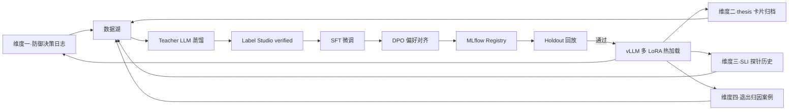

# 维度五·演进飞轮（The Evolution Engine）

> [!NOTE] **[TRACEBACK] 战略维度锚点**
> - **顶层概念**: [项目定义与核心价值](../../01_顶层概念/01_项目定义与核心价值.md)
> - **同层引用**: [双目标与战略维度关系](../00_双目标与战略维度关系.md)
> - **L3 对应模块**: [超级个体进化（super_evo）](../../03_原子目标与规约/05_维度五_演进飞轮/README.md) + [06_L2 落地清单](../../03_原子目标与规约/05_维度五_演进飞轮/06_L2落地清单_设计.md)
> - **L3 工程映射**: [00_组件到L3模块的映射](./00_组件到L3模块的映射.md)

## 一、维度速览

| 项目 | 内容 |
|---|---|
| **一句话定位** | 系统的"基因迭代器"：把所有维度的失败/成功转化为"模型 + 知识"的进化资产 |
| **战略目标** | 实现"自进化"——系统使用越久，越懂自己/越懂市场，且越值钱（个人成长资产） |
| **核心使命** | 把 LLMOps（Teacher 蒸馏、SFT、DPO、多 LoRA、议会模式）做成可复制的工程能力 |
| **L3 模块** | `super_evo` |
| **组件数量** | 13 MLOps 组件（P0:4 / P1:5 / P2:4） |
| **当前优先级** | **P0**（与维度一并列第一） |

## 二、本目录文件索引

| 文件 | 内容 |
|---|---|
| [**00_组件到L3模块的映射.md**](./00_组件到L3模块的映射.md) | **★ L2 ↔ L3 双向映射**：13 组件映射到 L3 super_evo 哪些后端服务 |
| [00_维度目标与能力边界.md](./00_维度目标与能力边界.md) | 战略目标、LLMOps 组件清单、与其他维度的边界 |
| [01_组件全景与优先级.md](./01_组件全景与优先级.md) | 13 组件的扩展计划与排序理由 |
| [02_数据依赖梯次总表.md](./02_数据依赖梯次总表.md) | 维度级数据采集清单（飞轮自身的 metadata） |
| [03_训练与评测资产路径.md](./03_训练与评测资产路径.md) | 维度级"飞轮自身的元路径" |
| [components/](./components/) | 13 个 MLOps 组件的完整规约 |

## 三、本维度组件清单

| # | 组件名称 | 优先级 | 文档 |
|---|---|---|---|
| 1 | **Teacher LLM 蒸馏服务**（首组件） | **P0** | [components/01_Teacher_LLM蒸馏服务.md](./components/01_Teacher_LLM蒸馏服务.md) |
| 2 | **数据湖 + DVC 版本化**（首组件） | **P0** | [components/02_数据湖_DVC版本化.md](./components/02_数据湖_DVC版本化.md) |
| 3 | **Label Studio 人工 verified** | **P0** | [components/03_LabelStudio人工verified.md](./components/03_LabelStudio人工verified.md) |
| 4 | **LLaMA-Factory 手动微调** | **P0** | [components/04_LLaMA-Factory微调.md](./components/04_LLaMA-Factory微调.md) |
| 5 | K8s GPU Job 自动训练触发 | P1 | components/05_K8s_GPU_Job自动训练触发.md（待补全） |
| 6 | vLLM 推理网关 | P1 | components/06_vLLM推理网关.md（待补全） |
| 7 | MLflow Model Registry | P1 | components/07_MLflow_Model_Registry.md（待补全） |
| 8 | 评测回归集与回放器 | P1 | components/08_评测回归集与回放器.md（待补全） |
| 9 | DPO 偏好对齐流水线 | P1 | components/09_DPO偏好对齐流水线.md（待补全） |
| 10 | vLLM 多 LoRA 多路复用 | P2 | components/10_vLLM多LoRA多路复用.md（待补全） |
| 11 | 数字分身 RAG 系统 | P2 | components/11_数字分身RAG系统.md（待补全） |
| 12 | gVisor / Firecracker 沙箱 | P2 | components/12_gVisor_Firecracker沙箱.md（待补全） |
| 13 | A/B 测试与灰度发布 | P2 | components/13_AB测试与灰度发布.md（待补全） |

## 四、协作约定

- **本维度的输入是其他 4 维度的所有"决策事件流 + 反馈数据"**
- **本维度的输出是新版本 LoRA + 新规则 + 新知识资产**
- **本维度不直接做投资决策**，但所有维度的智能都源于本维度的飞轮

## 五、与其他维度的关系

