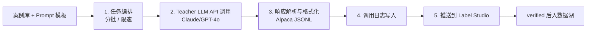

# 组件 01：Teacher LLM 蒸馏服务（首组件）

> [!NOTE] **[TRACEBACK]**
> - **维度概览**: [README](../README.md)
> - **L3 子模块**: `super_evo.teacher_llm_distiller`
> - **DNA 配置键**: `_System_DNA/super_evo/components/teacher_llm_distiller.yaml`

## 一、组件定位与目标

| 项 | 内容 |
|---|---|
| **一句话定位** | 用 Claude 3.5 Sonnet / GPT-4o，按 prompt 模板批量生成训练数据 |
| **战略目标** | 解决"小项目无法负担大量人工标注"的问题，用 Teacher LLM "加速"标注 |
| **优先级** | **P0**（维度五第 1 个组件，所有维度的首引擎都依赖） |
| **决策机制** | 不做决策，仅生成数据 |
| **能力边界** | 不替代人工 verified；蒸馏后必须经 Label Studio 二次校验 |

## 二、组件设计

### 2.1 工作流程图



### 2.2 输入契约

```yaml
input:
  case_library_path: "diting-data/cryo_guard/case_library/financial_fraud/"
  prompt_template: "diting-src/super_evo/teacher_distiller/prompts/financial_fraud_v1.yaml"
  teacher_model: "claude-3-5-sonnet"  # 或 "gpt-4o"
  batch_size: 50
  max_concurrent: 5
  cost_limit_usd: 100  # 单次任务成本上限
```

### 2.3 输出契约

```yaml
output:
  task_id: "distill_financial_fraud_20260513_001"
  generated_count: 50
  total_cost_usd: 12.34
  jsonl_path: "diting-data/cryo_guard/sft_data/financial_fraud_v1_50.jsonl"
  pushed_to_label_studio: true
  label_studio_project_id: 42
```

### 2.4 关键设计

| 设计点 | 内容 |
|---|---|
| **限速** | Anthropic API: 50 RPM；OpenAI: 100 RPM；超限自动重试 |
| **错误处理** | 5xx 错误自动重试 3 次；4xx 错误立刻停止 |
| **成本控制** | 每次任务设置 cost_limit_usd；超限自动停止 |
| **多模型支持** | 同一任务可用 Claude 和 GPT-4o 互验（用于 Holdout 数据生成时的"双 Teacher 共识") |
| **可观测** | 调用日志全记录（prompt + response + cost + latency） |

### 2.5 Prompt 模板规范

每个引擎/组件维护自己的 prompt 模板（YAML 格式）：

```yaml
# diting-src/super_evo/teacher_distiller/prompts/financial_fraud_v1.yaml
prompt_id: financial_fraud_v1
description: "财务造假测谎引擎首引擎蒸馏 prompt"
system_prompt: |
  你是 PCAOB 注册的高级司法会计专家...
  审讯规则：
  1. ...
user_prompt_template: |
  请分析以下财报：
  {financial_report_text}
output_format: alpaca_jsonl
expected_fields:
  - instruction
  - input
  - output
```

### 2.6 与其他组件的协作

- **下游**：Label Studio（人工 verified） → SFT 训练数据
- **跨维度**：所有 4 维度的首引擎都依赖本组件

### 2.7 L3 子模块映射

- `super_evo.teacher_llm_distiller.task_orchestrator`：任务编排
- `super_evo.teacher_llm_distiller.api_client`：Teacher API 客户端
- `super_evo.teacher_llm_distiller.response_parser`：响应解析
- `super_evo.teacher_llm_distiller.cost_tracker`：成本追踪
- `super_evo.teacher_llm_distiller.label_studio_pusher`：Label Studio 集成

## 三、首次实现方案（Stage A · 工程实现）

### 3.1 Step 1：搭建 API 客户端（同时支持 Anthropic 和 OpenAI）

```python
class TeacherLLMClient:
    def __init__(self, provider: str):
        self.provider = provider  # "anthropic" or "openai"
        self.client = ...
    
    async def call(self, system_prompt, user_prompt, max_retries=3):
        for i in range(max_retries):
            try:
                resp = await self.client.messages.create(
                    model=self.model,
                    system=system_prompt,
                    messages=[{"role": "user", "content": user_prompt}],
                    max_tokens=2000,
                )
                return resp.content
            except Exception as e:
                if i == max_retries - 1:
                    raise
                await asyncio.sleep(2 ** i)
```

### 3.2 Step 2：实现任务编排（限速 + 并发）

```python
async def distill_batch(case_paths, prompt_template, batch_size=50):
    semaphore = asyncio.Semaphore(5)  # 最多 5 并发
    cost_tracker = CostTracker(limit_usd=100)
    
    async def distill_one(case):
        async with semaphore:
            if cost_tracker.exceeded():
                return None
            result = await client.call(...)
            cost_tracker.add(estimate_cost(result))
            return result
    
    tasks = [distill_one(case) for case in case_paths]
    return await asyncio.gather(*tasks)
```

### 3.3 Step 3：响应解析与 JSONL 输出

```python
def parse_to_alpaca(response: str) -> dict:
    # Teacher LLM 返回 JSON，解析为 Alpaca 格式
    parsed = json.loads(response)
    return {
        "instruction": parsed["instruction"],
        "input": parsed["input"],
        "output": parsed["output"],
    }
```

### 3.4 Step 4：调用日志写入

```sql
CREATE TABLE teacher_distill_logs (
    id BIGSERIAL PRIMARY KEY,
    task_id TEXT,
    provider TEXT,
    model TEXT,
    prompt_template_id TEXT,
    case_id TEXT,
    request_tokens INT,
    response_tokens INT,
    cost_usd NUMERIC,
    latency_ms INT,
    response_jsonb JSONB,
    created_at TIMESTAMPTZ
);
```

### 3.5 Step 5：推送到 Label Studio

```python
def push_to_label_studio(jsonl_path: str, project_id: int):
    studio_client = LabelStudioClient(...)
    studio_client.import_tasks(project_id, jsonl_path)
```

### 3.6 Step 6：CLI 与 Make 集成

```makefile
# diting-src/Makefile
distill-financial-fraud:
	python -m super_evo.teacher_distiller \
		--case-library diting-data/cryo_guard/case_library/financial_fraud/ \
		--prompt-template diting-src/super_evo/teacher_distiller/prompts/financial_fraud_v1.yaml \
		--teacher-model claude-3-5-sonnet \
		--batch-size 50 \
		--cost-limit-usd 50
```

## 四、组件成熟度路径（Stage A → E，工程类）

| 阶段 | 关键动作 | 完成标志 |
|---|---|---|
| A | API 客户端 + 任务编排 + JSONL 输出 + Label Studio 推送 | 第一个引擎能跑通完整流水线 |
| B | 加双 Teacher 共识机制（Claude + GPT-4o 互验） | Holdout 数据生成走双 Teacher |
| C | 加 prompt template 版本管理 + AB 测试 | prompt 改动可对比效果 |
| D | 加自动 prompt 优化（基于 verified 偏差自动调整 prompt） | prompt 自动迭代 |
| E | 加多 Teacher 议会（多个 Teacher 投票） | Holdout 数据高质量 |

## 五、数据依赖梯次表

| 阶段 | 数据类别 | 来源 | 用途 |
|---|---|---|---|
| 前期 | 案例库 | 各维度提供 | Teacher 蒸馏的输入 |
| 前期 | Prompt 模板 | 各维度自建 | Teacher 蒸馏的指令 |
| 前期 | 调用日志 | 自建（写库） | 成本控制与审计 |
| 中期 | Verified 偏差数据 | Label Studio 导出 | 用于 prompt 优化 |
| 后期 | 多 Teacher 一致性数据 | 自建 | 议会模式 |

## 六、组件 SLO

| SLO | 目标 |
|---|---|
| 单条蒸馏延迟 | < 30s（含重试） |
| 任务成功率 | ≥ 99% |
| 月度成本 | < ¥3000 |
| 调用日志完整率 | 100% |

## 七、与上下游组件的衔接

- **上游**：各维度的案例库 + Prompt 模板
- **下游**：Label Studio → 数据湖 → LLaMA-Factory 训练
- **跨维度**：所有 4 维度的首引擎都依赖本组件

## 八、L3 / L4 / L5 / DNA 映射

- **L3 子模块**: `super_evo.teacher_llm_distiller`
- **L4 阶段实践**: `04_阶段规划与实践/Stage3_模块实践/07_Teacher_LLM蒸馏/`
- **L5 验收行 ID**: `l5-evo-teacher-distiller`
- **DNA 配置键**: `_System_DNA/super_evo/components/teacher_llm_distiller.yaml`
- **代码仓路径**: `diting-src/super_evo/teacher_distiller/`
- **元数据路径**: `diting-data/super_evo/teacher_distill_logs/`
