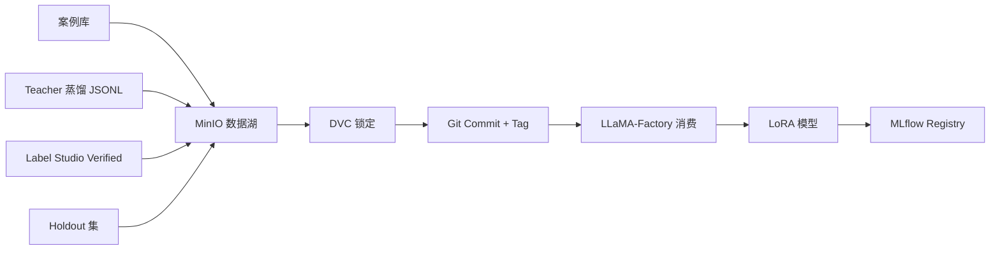

# 组件 02：数据湖 + DVC 版本化（首组件）

> [!NOTE] **[TRACEBACK]**
> - **维度概览**: [README](../README.md)
> - **L3 子模块**: `super_evo.data_lake_with_dvc`
> - **DNA 配置键**: `_System_DNA/super_evo/components/data_lake.yaml`

## 一、组件定位与目标

| 项 | 内容 |
|---|---|
| **一句话定位** | MinIO 单节点存数据，DVC 锁定每次训练数据快照 |
| **战略目标** | 让任何一个 LoRA 都能回到具体的训练数据 commit；任何 Holdout 都不可被污染 |
| **优先级** | **P0**（维度五第 2 个组件） |
| **决策机制** | 不做决策；强制版本化 |
| **能力边界** | 不替代生产级数据治理（如 Delta Lake） |

## 二、组件设计

### 2.1 架构图



### 2.2 数据湖目录约定

```
diting-data/                    # MinIO 根目录（也是 DVC 仓库根）
├── cryo_guard/                 # 维度一
│   ├── case_library/
│   ├── sft_data/
│   ├── dpo_pairs/
│   └── holdout/                # 永久 Holdout（DVC 锁定）
├── deep_strike/                # 维度二
│   ├── playbook_cases/
│   └── ...
├── state_watch/                # 维度三/四
│   ├── thesis_history/
│   ├── thesis_vs_fact_pairs/
│   └── holdout/
├── exit_engine/                # 维度四
│   └── ...
├── super_evo/                  # 维度五自身的元数据
│   ├── teacher_distill_logs/
│   ├── label_studio_projects/
│   ├── training_runs/
│   ├── mlflow_artifacts/
│   ├── lora_registry/
│   └── eval_holdouts/
└── README.md
```

### 2.3 DVC 使用约定

```bash
# 添加新的训练数据
cd diting-data/
dvc add cryo_guard/sft_data/financial_fraud_v2_4500.jsonl
git add cryo_guard/sft_data/financial_fraud_v2_4500.jsonl.dvc .gitignore
git commit -m "data(cryo): financial_fraud SFT v2 4500 samples"
git tag financial_fraud_v2

# 推送到 MinIO 远端
dvc push -r minio
```

### 2.4 与其他组件的协作

- **下游**：LLaMA-Factory（训练）、评测回放器（Holdout）、MLflow Registry（元数据）
- **跨维度**：所有 4 维度的训练数据都存在本组件

### 2.5 L3 子模块映射

- `super_evo.data_lake_with_dvc.minio_storage`：MinIO 存储层
- `super_evo.data_lake_with_dvc.dvc_versioning`：DVC 版本化层
- `super_evo.data_lake_with_dvc.access_control`：访问控制（Holdout 锁定）

## 三、首次实现方案（Stage A）

### 3.1 Step 1：部署 MinIO 单节点

```yaml
# diting-infra/charts/minio/values.yaml
minio:
  mode: standalone
  resources:
    requests:
      memory: 2Gi
      cpu: 500m
  persistence:
    enabled: true
    size: 1Ti
  defaultBuckets: "diting-data"
```

```bash
# 部署
helm install minio bitnami/minio -f diting-infra/charts/minio/values.yaml -n minio
```

### 3.2 Step 2：初始化 DVC

```bash
cd diting-data/
git init
dvc init
dvc remote add -d minio s3://diting-data
dvc remote modify minio endpointurl http://minio.minio.svc.cluster.local:9000
dvc remote modify minio access_key_id $MINIO_ACCESS_KEY
dvc remote modify minio secret_access_key $MINIO_SECRET_KEY
```

### 3.3 Step 3：建立目录骨架

```bash
mkdir -p diting-data/{cryo_guard,deep_strike,state_watch,exit_engine,super_evo}
mkdir -p diting-data/cryo_guard/{case_library,sft_data,dpo_pairs,holdout}
# ...
```

### 3.4 Step 4：Holdout 锁定机制

```python
# 在 CI 中检查 Holdout 是否被污染
def check_holdout_isolation():
    holdout_files = glob("diting-data/*/holdout/*.jsonl")
    sft_files = glob("diting-data/*/sft_data/*.jsonl")
    
    holdout_ids = set()
    for f in holdout_files:
        for line in open(f):
            holdout_ids.add(json.loads(line)["case_id"])
    
    for f in sft_files:
        for line in open(f):
            case_id = json.loads(line)["case_id"]
            if case_id in holdout_ids:
                raise ValueError(f"Holdout pollution detected: {case_id} in {f}")
```

### 3.5 Step 5：Make 集成

```makefile
data-add-sft:
	cd diting-data && dvc add $(FILE) && git add $(FILE).dvc && git commit -m "data: $(FILE)"

data-push:
	cd diting-data && dvc push

check-holdout-isolation:
	python -m super_evo.data_lake.check_isolation
```

### 3.6 Step 6：备份策略

| 备份目标 | 频率 | 备份方式 |
|---|---|---|
| MinIO 数据 | 周度 | rsync 到外部硬盘 |
| Git + DVC metadata | 每次 commit | push 到 GitHub 私有仓库 |
| Holdout（最重要） | 每次变更 | 同时备份到云盘 |

## 四、组件成熟度路径（Stage A → E）

| 阶段 | 关键动作 | 完成标志 |
|---|---|---|
| A | MinIO + DVC + 目录骨架跑通 | 第一个 SFT 数据能 DVC 锁定 |
| B | 加 Holdout 隔离 CI 检查 | CI 自动检查 Holdout 污染 |
| C | 加自动备份脚本 | 周度自动备份 |
| D | 多副本（K8s 多节点） | 高可用 |
| E | 加数据治理（Great Expectations） | 数据质量自动检查 |

## 五、数据依赖梯次表

| 阶段 | 数据类别 | 来源 | 用途 |
|---|---|---|---|
| 前期 | SFT JSONL | Teacher 蒸馏 + Label Studio | 训练 |
| 前期 | Holdout JSONL | 各维度提供 | 评测守门 |
| 中期 | DPO 对子 | Label Studio | DPO 训练 |
| 中期 | LoRA 权重 | LLaMA-Factory 输出 | 推理 |
| 后期 | 替代数据（卫星等） | 第三方 | 探针 |

## 六、组件 SLO

| SLO | 目标 |
|---|---|
| 数据上传成功率 | ≥ 99.9% |
| DVC commit 完整率 | 100% |
| Holdout 污染检测 | 0 次违规（CI 自动 block） |
| 备份完整率 | 100% |

## 七、与上下游组件的衔接

- **上游**：Teacher 蒸馏服务、Label Studio、各维度
- **下游**：LLaMA-Factory（训练）、评测回放器（Holdout）、MLflow Registry

## 八、L3 / L4 / L5 / DNA 映射

- **L3 子模块**: `super_evo.data_lake_with_dvc`
- **L4 阶段实践**: `04_阶段规划与实践/Stage1_仓库与骨架/03_数据湖_DVC/`
- **L5 验收行 ID**: `l5-evo-data-lake-dvc`
- **DNA 配置键**: `_System_DNA/super_evo/components/data_lake.yaml`
- **部署仓路径**: `diting-infra/charts/minio/`
- **数据仓路径**: `diting-data/`
