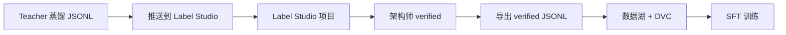

# 组件 03：Label Studio 人工 verified

> [!NOTE] **[TRACEBACK]**
> - **维度概览**: [README](../README.md)
> - **L3 子模块**: `super_evo.label_studio_integration`
> - **DNA 配置键**: `_System_DNA/super_evo/components/label_studio.yaml`

## 一、组件定位与目标

| 项 | 内容 |
|---|---|
| **一句话定位** | 架构师每周抽 2h 重点 verified 一批关键样本，确保 SFT 数据质量 |
| **战略目标** | 永远不让 Teacher LLM 蒸馏数据直接进入训练；人工 verified 是不可绕过的一环 |
| **优先级** | **P0**（维度五第 3 个组件） |
| **决策机制** | 不做决策；强制 human-in-the-loop |
| **能力边界** | 不替代专业标注员（架构师本人是唯一 reviewer） |

## 二、组件设计

### 2.1 架构图



### 2.2 Label Studio 项目模板

每个引擎/组件有自己的 Label Studio 项目，配置如下：

```xml
<View>
  <Text name="instruction" value="$instruction"/>
  <Text name="input" value="$input"/>
  <Text name="ai_output" value="$output"/>
  
  <Header value="您是否同意 AI 的判定？"/>
  <Choices name="agreement" toName="ai_output" choice="single">
    <Choice value="agree"/>
    <Choice value="partial_agree"/>
    <Choice value="disagree"/>
  </Choices>
  
  <Header value="如果不同意，请提供修正后的判定："/>
  <TextArea name="corrected_output" toName="ai_output" />
  
  <Header value="修正理由（30 字以内）："/>
  <TextArea name="reason" toName="ai_output" />
</View>
```

### 2.3 Quality Control 机制

| 机制 | 内容 |
|---|---|
| **每 50 条抽 5 条复核** | 架构师在不同时间段复核同一样本，检查自己的一致性 |
| **Cohen's Kappa 计算** | 复核样本与原始判定的 Kappa 必须 ≥ 0.85 |
| **不同意率统计** | 如果 disagree 比例 > 30% → 触发"prompt 优化"流程 |

### 2.4 与其他组件的协作

- **上游**：Teacher 蒸馏服务推送数据
- **下游**：导出 verified JSONL → 数据湖 + DVC → 训练

### 2.5 L3 子模块映射

- `super_evo.label_studio_integration.project_manager`：项目管理
- `super_evo.label_studio_integration.task_pusher`：任务推送
- `super_evo.label_studio_integration.export_handler`：导出处理
- `super_evo.label_studio_integration.qc_calculator`：Quality Control 计算

## 三、首次实现方案（Stage A）

### 3.1 Step 1：部署 Label Studio

```yaml
# diting-infra/charts/label-studio/values.yaml
labelstudio:
  enabled: true
  resources:
    requests:
      memory: 1Gi
      cpu: 500m
  persistence:
    enabled: true
    size: 50Gi
```

```bash
helm install label-studio heartex/label-studio -f values.yaml -n label-studio
```

### 3.2 Step 2：为每个引擎创建 Label Studio 项目

```python
# 自动化创建项目
from label_studio_sdk import Client

client = Client(url="http://label-studio.labels.svc.cluster.local:8080", api_key=API_KEY)

projects = [
    {"name": "维度一·财务造假测谎", "label_config": "..."},
    {"name": "维度一·大股东诚信", "label_config": "..."},
    {"name": "维度一·关联交易", "label_config": "..."},
    {"name": "维度二·利润截留", "label_config": "..."},
    {"name": "维度三·叙事一致性 NLI", "label_config": "..."},
]

for p in projects:
    project = client.start_project(title=p["name"], label_config=p["label_config"])
    print(f"Created project: {p['name']}, id: {project.id}")
```

### 3.3 Step 3：实现任务推送

```python
def push_jsonl_to_project(jsonl_path: str, project_id: int):
    project = client.get_project(project_id)
    tasks = []
    for line in open(jsonl_path):
        item = json.loads(line)
        tasks.append({
            "data": {
                "instruction": item["instruction"],
                "input": item["input"],
                "output": item["output"],
            }
        })
    project.import_tasks(tasks)
```

### 3.4 Step 4：实现 verified 导出

```python
def export_verified(project_id: int, output_path: str):
    project = client.get_project(project_id)
    annotations = project.get_labeled_tasks()
    
    with open(output_path, "w") as f:
        for ann in annotations:
            agreement = ann["annotations"][0]["result"][0]["value"]["choices"][0]
            corrected = ann["annotations"][0]["result"][1]["value"].get("text", [""])[0]
            
            if agreement == "agree":
                final_output = ann["data"]["output"]
            else:
                final_output = corrected
            
            f.write(json.dumps({
                "instruction": ann["data"]["instruction"],
                "input": ann["data"]["input"],
                "output": final_output,
                "verified": True,
            }) + "\n")
```

### 3.5 Step 5：Quality Control 计算

```python
def calculate_kappa(project_id: int, sample_size=50):
    # 随机抽 sample_size 条样本，请架构师在不同时间复核
    project = client.get_project(project_id)
    sampled = random.sample(project.get_labeled_tasks(), sample_size)
    # 推送到"复核项目"
    review_project_id = ...
    push_for_review(sampled, review_project_id)
    # 计算 Kappa
    return cohens_kappa(original_labels, review_labels)
```

### 3.6 Step 6：架构师每周习惯化

| 时间 | 动作 |
|---|---|
| 每周一 09:00 | Label Studio 自动推送本周新增样本（50–100 条） |
| 每周内任意时间 | 架构师抽 2h verified（节奏：每 5 分钟 verified 1 条 = 24 条/2h） |
| 每月 1 日 | 自动跑 Quality Control 复核计算 + 报告 |
| 每月 15 日 | 如果 disagree 比例 > 30% → 触发 prompt 优化会议 |

## 四、组件成熟度路径（Stage A → E）

| 阶段 | 关键动作 | 完成标志 |
|---|---|---|
| A | Label Studio 部署 + 5 个项目创建 + 任务推送/导出跑通 | 第一周架构师能完成 50 条 verified |
| B | 加 Quality Control 复核 + Kappa 计算 | 月度 Kappa ≥ 0.85 |
| C | 加 prompt 优化触发流程 | disagree 比例 > 30% 自动告警 |
| D | 加多 reviewer 支持（如未来引入实习生） | 多 reviewer 间一致性可计算 |
| E | 加 RLHF 偏好对子收集（DPO 用） | 每条 verified 同时输出偏好对 |

## 五、数据依赖梯次表

| 阶段 | 数据类别 | 来源 | 用途 |
|---|---|---|---|
| 前期 | Teacher 蒸馏 JSONL | Teacher 蒸馏服务 | 待 verified 任务 |
| 前期 | 项目模板 | 各维度自建 | Label Studio 配置 |
| 中期 | Verified JSONL | 架构师 verified | 训练 |
| 中期 | Kappa 复核数据 | 架构师二次复核 | Quality Control |
| 后期 | DPO 偏好对 | Verified 时同时收集 | DPO 训练 |

## 六、组件 SLO

| SLO | 目标 |
|---|---|
| 周度 verified 数量 | ≥ 100 条 |
| 月度 Kappa | ≥ 0.85 |
| 任务推送延迟 | < 5 分钟 |
| Verified JSONL 导出延迟 | < 1 分钟 |

## 七、与上下游组件的衔接

- **上游**：Teacher 蒸馏服务
- **下游**：数据湖 + DVC → LLaMA-Factory 训练
- **跨维度**：所有 4 维度的首引擎都需要本组件

## 八、L3 / L4 / L5 / DNA 映射

- **L3 子模块**: `super_evo.label_studio_integration`
- **L4 阶段实践**: `04_阶段规划与实践/Stage3_模块实践/08_Label_Studio_集成/`
- **L5 验收行 ID**: `l5-evo-label-studio`
- **DNA 配置键**: `_System_DNA/super_evo/components/label_studio.yaml`
- **部署仓路径**: `diting-infra/charts/label-studio/`
- **代码仓路径**: `diting-src/super_evo/label_studio_integration/`
