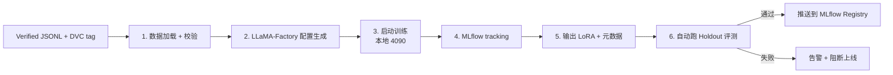

# 组件 04：LLaMA-Factory 手动微调

> [!NOTE] **[TRACEBACK]**
> - **维度概览**: [README](../README.md)
> - **L3 子模块**: `super_evo.training_orchestrator`
> - **DNA 配置键**: `_System_DNA/super_evo/components/llama_factory.yaml`

## 一、组件定位与目标

| 项 | 内容 |
|---|---|
| **一句话定位** | 本地 4090 + LLaMA-Factory + LoRA 微调 Qwen2.5-7B，Stage A 用 |
| **战略目标** | 跑通"verified JSONL → 微调 LoRA"链路，证明 LoRA 可控可复现 |
| **优先级** | **P0**（维度五第 4 个组件） |
| **决策机制** | 不做决策；执行训练 |
| **能力边界** | 不做超大模型训练（> 13B）；不做完整 RLHF（DPO 在 P1 引入） |

## 二、组件设计

### 2.1 工作流程图



### 2.2 输入契约

```yaml
input:
  training_data_dvc_tag: "financial_fraud_v2"
  base_model: "Qwen/Qwen2.5-7B-Instruct"
  lora_config:
    rank: 16
    alpha: 32
    dropout: 0.05
    target_modules: ["q_proj", "v_proj", "k_proj", "o_proj"]
  training_args:
    epochs: 3
    learning_rate: 2e-4
    batch_size: 8
    gradient_accumulation_steps: 4
    warmup_ratio: 0.1
  holdout_dvc_tag: "cryo_holdout_v1"
  metric_thresholds:
    recall: 0.95
    precision: 0.70
```

### 2.3 输出契约

```yaml
output:
  run_id: "abc123def456"  # MLflow run_id
  lora_path: "diting-data/super_evo/lora_registry/cryo_guard/financial_fraud_v2/"
  base_model: "Qwen/Qwen2.5-7B-Instruct"
  training_data_dvc_tag: "financial_fraud_v2"
  holdout_metrics:
    recall: 0.97
    precision: 0.73
    f1: 0.83
  passed_threshold: true
  pushed_to_registry: true
```

### 2.4 LLaMA-Factory 配置示例

```yaml
# diting-src/super_evo/llama_factory/configs/financial_fraud_v2.yaml
model_name_or_path: Qwen/Qwen2.5-7B-Instruct
stage: sft
finetuning_type: lora
lora_target: q_proj,v_proj,k_proj,o_proj
lora_rank: 16
lora_alpha: 32
lora_dropout: 0.05

dataset: financial_fraud_v2
dataset_dir: diting-data/cryo_guard/sft_data/

output_dir: ./outputs/financial_fraud_v2
overwrite_output_dir: true

per_device_train_batch_size: 8
gradient_accumulation_steps: 4
num_train_epochs: 3
learning_rate: 2e-4
warmup_ratio: 0.1

logging_steps: 10
save_steps: 200
save_total_limit: 2
load_best_model_at_end: true

bf16: true
flash_attn: true
```

### 2.5 与其他组件的协作

- **上游**：数据湖（DVC tag）+ Verified JSONL
- **下游**：MLflow Registry + 评测回放器
- **跨维度**：所有 4 维度的首引擎都需要本组件

### 2.6 L3 子模块映射

- `super_evo.training_orchestrator.config_generator`：配置生成
- `super_evo.training_orchestrator.trainer_runner`：训练执行
- `super_evo.training_orchestrator.mlflow_tracker`：MLflow 追踪
- `super_evo.training_orchestrator.holdout_evaluator`：Holdout 评测

## 三、首次实现方案（Stage A）

### 3.1 Step 1：本地环境准备

```bash
# 4090 GPU + CUDA 12.1
conda create -n diting-train python=3.10
conda activate diting-train

# 安装 LLaMA-Factory
git clone https://github.com/hiyouga/LLaMA-Factory.git
cd LLaMA-Factory
pip install -e ".[torch,metrics,vllm]"

# 下载基座模型
huggingface-cli download Qwen/Qwen2.5-7B-Instruct
```

### 3.2 Step 2：DVC 数据加载

```python
def load_training_data(dvc_tag: str):
    # 切到对应 tag
    subprocess.run(["git", "-C", "diting-data", "checkout", dvc_tag])
    # DVC pull
    subprocess.run(["dvc", "-C", "diting-data", "pull"])
    # 返回 JSONL 路径
    return f"diting-data/cryo_guard/sft_data/{dvc_tag}.jsonl"
```

### 3.3 Step 3：训练触发脚本

```python
def train_lora(config_path: str, mlflow_run_name: str):
    with mlflow.start_run(run_name=mlflow_run_name):
        # 记录超参
        mlflow.log_params(load_yaml(config_path))
        
        # 启动 LLaMA-Factory
        subprocess.run([
            "llamafactory-cli", "train", config_path
        ], check=True)
        
        # 记录 artifact
        mlflow.log_artifacts("./outputs/")
        
        # 自动跑 Holdout
        metrics = run_holdout(...)
        mlflow.log_metrics(metrics)
        
        # 阈值检查
        if metrics["recall"] >= 0.95 and metrics["precision"] >= 0.70:
            push_to_registry(...)
        else:
            send_alert(metrics)
```

### 3.4 Step 4：Holdout 评测

```python
def run_holdout(lora_path: str, holdout_dvc_tag: str):
    # 加载 Holdout
    holdout = load_holdout(holdout_dvc_tag)
    
    # 加载 LoRA 推理
    from vllm import LLM, SamplingParams
    llm = LLM(model=base_model, enable_lora=True)
    
    predictions = []
    for case in holdout:
        result = llm.generate(case["input"], lora_request=lora_path)
        predictions.append(result)
    
    # 计算指标
    return calculate_metrics(predictions, holdout)
```

### 3.5 Step 5：Make 集成

```makefile
train-financial-fraud-v2:
	python -m super_evo.training.train \
		--config diting-src/super_evo/llama_factory/configs/financial_fraud_v2.yaml \
		--data-tag financial_fraud_v2 \
		--holdout-tag cryo_holdout_v1 \
		--mlflow-run-name "financial_fraud_v2_$(shell date +%Y%m%d_%H%M%S)"
```

### 3.6 Step 6：训练完成后的"绿灯部署"流程

| 检查项 | 阈值 | 动作 |
|---|---|---|
| Holdout Recall | ≥ 0.95 | 通过则推送 Registry |
| Holdout Precision | ≥ 0.70 | 通过则推送 Registry |
| MLflow tracking | 完整 | 必填 |
| DVC tag | 存在 | 必填 |
| 任意失败 | - | 阻断推送 + 告警 |

## 四、组件成熟度路径（Stage A → E）

| 阶段 | 关键动作 | 完成标志 |
|---|---|---|
| A | 本地 4090 + LLaMA-Factory + Qwen2.5-7B + LoRA 跑通 | 第一个引擎完成首次微调 |
| B | 加 K8s GPU Job 自动触发 | 训练触发不需要本地启动 |
| C | 加 DPO 流水线 | DPO 训练能跑 |
| D | 加超参自动搜索（W&B Sweep 或 Optuna） | 超参可自动优化 |
| E | 加多 LoRA 联合训练 | 多 LoRA 合并能力 |

## 五、数据依赖梯次表

| 阶段 | 数据类别 | 来源 | 用途 |
|---|---|---|---|
| 前期 | Verified JSONL | Label Studio 导出 | 训练 |
| 前期 | 基座模型 | HuggingFace（Qwen2.5-7B） | 训练 |
| 前期 | Holdout JSONL | DVC 锁定 | 评测 |
| 中期 | DPO 对子 | Label Studio | DPO 训练 |
| 中期 | 训练 metadata | MLflow tracking | 可追溯 |
| 后期 | 多 LoRA 配置 | 自建 | 多 LoRA 合并 |

## 六、组件 SLO

| SLO | 目标 |
|---|---|
| 单次训练耗时 | < 4h（4090 单卡，3000 条样本，3 epoch） |
| 训练成功率 | ≥ 95% |
| MLflow tracking 完整率 | 100% |
| Holdout 评测覆盖率 | 100%（任何 LoRA 必须经 Holdout） |

## 七、与上下游组件的衔接

- **上游**：数据湖 + DVC（训练数据）+ Label Studio（verified）
- **下游**：MLflow Registry + 评测回放器 + vLLM 推理网关
- **跨维度**：所有 4 维度的首引擎都需要本组件

## 八、L3 / L4 / L5 / DNA 映射

- **L3 子模块**: `super_evo.training_orchestrator`
- **L4 阶段实践**: `04_阶段规划与实践/Stage3_模块实践/09_LLaMA_Factory_微调/`
- **L5 验收行 ID**: `l5-evo-llama-factory`
- **DNA 配置键**: `_System_DNA/super_evo/components/llama_factory.yaml`
- **代码仓路径**: `diting-src/super_evo/llama_factory/`
- **训练 metadata 路径**: `diting-data/super_evo/training_runs/` + `diting-data/super_evo/mlflow_artifacts/`
