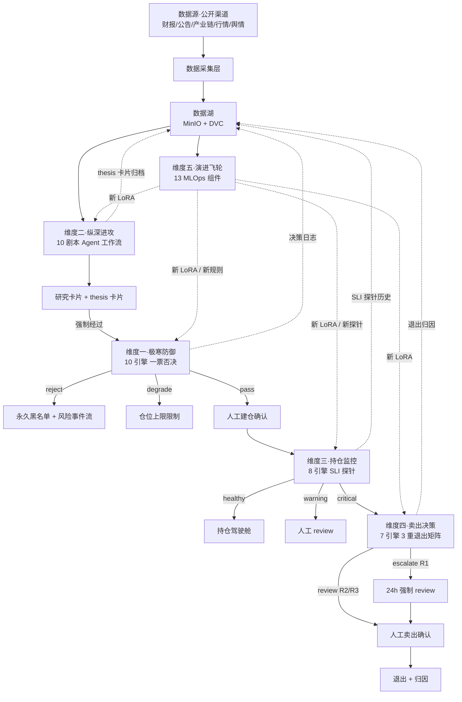
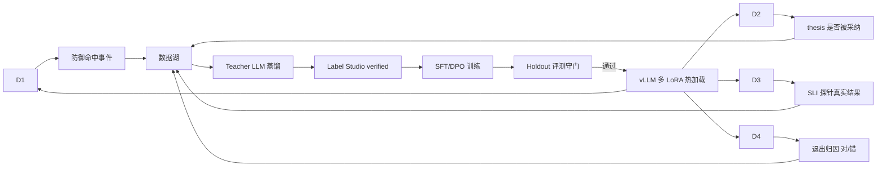

# 5 维度协作关系图

> [!NOTE] **[TRACEBACK]**
> - **同层引用**: [00_双目标与战略维度关系](../00_双目标与战略维度关系.md)

## 一、整体数据流与决策流

## 二、5 维度的"防御 + 进攻 + 观察 + 退出 + 进化"角色对照

| 维度 | 角色 | 主要决策 | 决策风格 |
|---|---|---|---|
| 维度一·极寒防御 | 防御官 | pass / degrade / reject | 一票否决 / 极保守 |
| 维度二·纵深进攻 | 进攻官 | propose / watch / discard | 在能力圈内大胆进攻 |
| 维度三·持仓监控 | 观察官 | healthy / warning / critical | 中性 / 持续观察 |
| 维度四·卖出决策 | 退出官 | hold / review / escalate | 规则触发 + 人工最终决策 |
| 维度五·演进飞轮 | 进化官 | 训练 / 部署 / 回滚 | 工程化 / 守门 |

## 三、关键协作约定

### 3.1 维度一是"全局熔断器"

- 任何其他维度的对外输出都要先过维度一二次校验
- 维度一一票否决，不允许加权拉低严苛度

### 3.2 维度二的所有 thesis 必须能被维度三/四消费

- thesis 卡片必须显式列出 3–5 个 SLI 探针定义
- 没有 SLI 的 thesis → 维度一直接 reject

### 3.3 维度三 vs 维度四的边界

- 维度三：观察 + 评分 + 信号
- 维度四：决策 + 建议 + 归因
- 维度三 critical 信号 → 维度四 escalate

### 3.4 维度五是 4 维度的"进化引擎"

- 4 维度的所有决策事件都被维度五消费
- 维度五的所有 LoRA 上线必须经过 Holdout 守门

### 3.5 永远不自动下单

- 所有交易动作必须人工确认（架构师亲自点"建仓确认" / "卖出确认"按钮）
- 这是 L1 永久红线

## 四、跨维度反馈闭环

