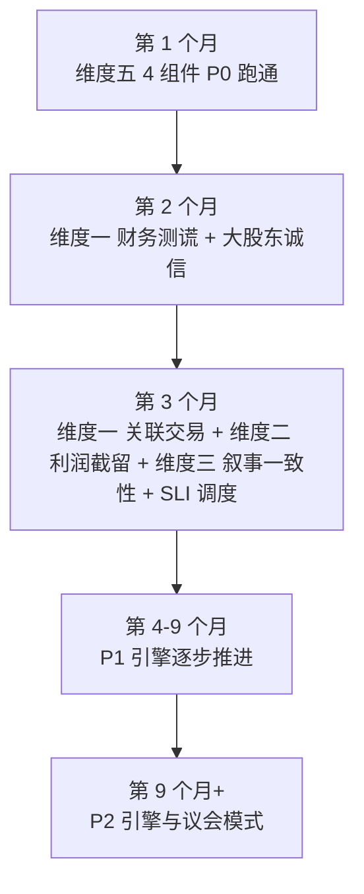

# 5 维度引擎全景与"安全起步套餐"

> [!NOTE] **[TRACEBACK]**
> - **同层引用**: [01_5维度协作关系图](./01_5维度协作关系图.md)、[04_5维度优先级与节奏建议](./04_5维度优先级与节奏建议.md)

## 一、48 引擎/组件全景表

| 维度 | 引擎/组件数 | 性质 | 优先级分布 |
|---|---|---|---|
| 维度一·极寒防御 | 10 引擎 | 风险防御类 | P0:3 / P1:4 / P2:3 |
| 维度二·纵深进攻 | 10 剧本 | 机会发现类 | P0:1 / P1:5 / P2:4 |
| 维度三·持仓监控 | 8 引擎 | 持续观察类 | P0:2 / P1:4 / P2:2 |
| 维度四·卖出决策 | 7 引擎 | 决策建议类 | P0:0 / P1:4 / P2:3 |
| 维度五·演进飞轮 | 13 MLOps 组件 | 基础设施类 | P0:4 / P1:5 / P2:4 |
| **总计** | **48** | - | **P0:10 / P1:22 / P2:16** |

## 二、90 天 P0 安全起步套餐（10 个 P0 引擎/组件）

| # | 维度 | 引擎/组件 | 90 天目标 |
|---|---|---|---|
| 1 | 维度五 | Teacher LLM 蒸馏服务 | 跑通"案例库 → JSONL 蒸馏数据"流水线，第 1 个月 |
| 2 | 维度五 | 数据湖 + DVC 版本化 | MinIO 单节点起，DVC 锁定首批数据，第 1 个月 |
| 3 | 维度五 | Label Studio 人工 verified | 架构师每周 2h verified，第 1 个月 |
| 4 | 维度五 | LLaMA-Factory 手动微调 | 本地 4090 微调 Qwen2.5-7B + LoRA，第 1 个月 |
| 5 | 维度一 | 财务造假测谎引擎 | 30–50 案例 SFT 蒸馏，Holdout Recall ≥ 0.95，第 2 个月 |
| 6 | 维度一 | 大股东诚信验尸引擎 | RAG 调取 5 年公告 + LLM 比对，第 2 个月 |
| 7 | 维度一 | 关联交易/明股实债识别引擎 | 财报附注解析 + 股权穿透，第 3 个月 |
| 8 | 维度二 | 利润截留扫描仪剧本 | LangGraph 编排 + 30 案例蒸馏，第 3 个月 |
| 9 | 维度三 | 叙事一致性评分引擎 | NLI 模型 + thesis 与事实对，第 3 个月 |
| 10 | 维度三 | 核心 SLI 探针调度器 | SLI 探针 schema + 调度引擎，第 3 个月 |

## 三、90 天 P0 闭环示意

## 四、安全起步套餐的"健康度自检"

每个月初架构师自检：

| 检查项 | 标准 |
|---|---|
| 是否所有 P0 组件都按节奏推进？ | 偏离 > 1 个月 → 立刻召开"为什么慢"反思会议 |
| Teacher LLM 月度成本是否在预算内？ | < ¥3000/月 |
| Holdout 守门覆盖率是否 100%？ | 任何 LoRA 上线前必须经 Holdout |
| DVC 版本可追溯率是否 100%？ | 任何 LoRA 必须能回到训练数据 commit |
| 架构师人工 verified 数量是否达标？ | 每月至少 100 条 verified 样本 |

## 五、为什么要"安全起步套餐"

| 原因 | 解释 |
|---|---|
| 个人项目时间精力有限 | 不可能 48 个引擎一起开工 |
| MLOps 飞轮本身需要时间打磨 | 维度五先行 1 个月，让基础设施就位 |
| 维度一的"防御性"优先于维度二的"进攻性" | 没有防御就没有资格进攻 |
| 维度三的 SLI 思想必须在持仓前就准备好 | 没有 SLI 探针就没有可观测的持仓 |
| 维度四的卖出决策依赖维度三的 critical 信号 | 维度四不在 P0 范围 |

> **核心**：90 天 P0 套餐之后，diting 的"防御 + 第一个进攻剧本 + 持仓可观测"最小闭环就成型；之后再按 P1/P2 节奏扩展即可。
