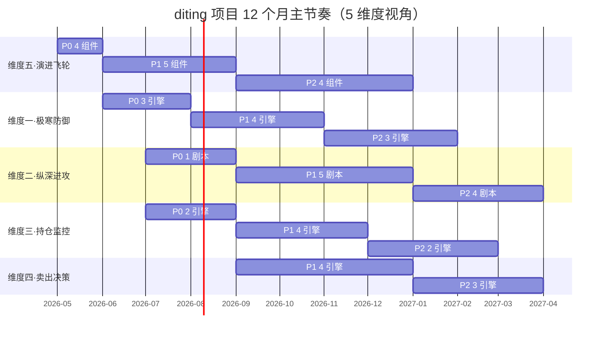

# 5 维度优先级与节奏建议

> [!NOTE] **[TRACEBACK]**
> - **同层引用**: [02_5维度引擎全景与安全起步套餐](./02_5维度引擎全景与安全起步套餐.md)、[10_节奏与交付/01_八个月开发与交付节奏](../../02_战略维度/10_节奏与交付/01_八个月开发与交付节奏.md)

## 一、整体节奏（8 个月主线 + 4 个月扩展）

## 二、维度推进的"三优先级"原则

| 优先级 | 含义 | P0/P1/P2 比例 |
|---|---|---|
| **维度五优先（基础设施）** | 没有飞轮，其他维度都跑不了 | P0 4 组件先行 |
| **维度一优先（防御）** | 没有防御就不许进攻 | P0 3 引擎与维度五同步 |
| **维度二/三同步（首战）** | 第一个剧本 + 第一个 SLI 探针调度 | P0 1 剧本 + 2 引擎 |
| **维度四稍后（依赖维度三）** | 维度四需要维度三的 SLI 历史数据 | 推到 P1 |

## 三、12 个月详细节奏

| 月份 | 维度五 | 维度一 | 维度二 | 维度三 | 维度四 |
|---|---|---|---|---|---|
| M1 | P0·4 组件全部跑通 | - | - | - | - |
| M2 | - | P0·财务测谎 + 大股东诚信 | - | - | - |
| M3 | - | P0·关联交易/明股实债 | P0·利润截留 | P0·叙事一致性 + SLI 调度 | - |
| M4 | P1·MLflow Registry + 评测回放 | - | - | - | - |
| M5 | P1·K8s GPU Job + vLLM 网关 | P1·商誉减值 + 质押爆仓 | P1·S 曲线渗透率 | P1·健康度综合评分 | - |
| M6 | P1·DPO 流水线 | P1·审计师 + 关键人离职 | P1·产业链瓶颈 | P1·预期差余量 | - |
| M7 | - | - | P1·产能出清 | P1·拥挤度 | P1·逻辑破坏熔断 |
| M8 | P2·多 LoRA 多路复用 | P2·海外监管 | P1·国产替代 | P1·行业 Beta 漂移 | P1·估值过载止盈 |
| M9 | P2·数字分身 RAG | P2·舆情品牌信任 | P1·出海全球化 | P2·机构持仓变化 | P1·机会成本调仓 + 分批止盈 |
| M10 | P2·gVisor 沙箱 | P2·行业系统性风险 | P2·中特估 + 政策驱动 | P2·管理层信号 | P2·税费成本优化 |
| M11 | P2·A/B 灰度 | - | P2·困境反转 + 扩品类 | - | P2·多因子聚合 + 退出归因 |
| M12 | 议会模式（5 维度协同） | 全维度议会 | 全维度议会 | 全维度议会 | 全维度议会 |

## 四、节奏 SLO（节奏目标）

| 节奏目标 | 阈值 | 触发动作 |
|---|---|---|
| P0 完成节奏 | 90 天内 | 超过 90 天 → 召开"为什么慢"反思会议 |
| P1 完成节奏 | 9 个月内 | 超过 9 个月 → 重新评估优先级 |
| P2 完成节奏 | 12 个月内 | 超过 12 个月 → 部分 P2 推迟到 V2 |
| Holdout 守门 | 100% LoRA | 任何绕过 Holdout → 立刻回滚 |
| 月度自检 | 每月初执行 | 不执行 → 触发自我惩罚机制 |

## 五、节奏与产出物对照

| 阶段 | 关键产出物 |
|---|---|
| 90 天 P0 完成 | 防御 + 第一个进攻剧本 + 持仓可观测最小闭环；个人简历可写"端到端 LLMOps 实操经验" |
| 9 个月 P1 完成 | 完整的 4 维度运行 + 多 LoRA 并行；个人简历可写"AI Infra 工程师" |
| 12 个月 P2 完成 | 议会模式 + 数字分身雏形；个人项目可向社区/雇主展示 |
