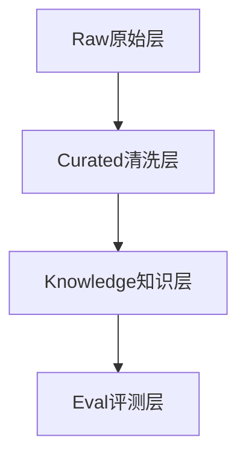

# L2 · 数据体系与分层存储

> [!NOTE] **[TRACEBACK] 战略维度锚点**
> - **顶层概念**: [A股分析追踪平台目标与边界](../../01_顶层概念/04_A股分析追踪平台目标与边界.md)
> - **相关维度**: [评测一致性与发布闭环](./06_评测一致性与发布闭环.md)

## 设计目标

数据体系要同时支撑：

- 研究和跟踪
- RAG 与 Agent 编排
- 复盘与评测
- 后续自托管推理和 Runtime 运行

## 四层数据体系

### Raw 原始层
- 财报 PDF、公告、新闻原文、行业材料、行情原始数据

### Curated 清洗层
- 结构化财务字段
- 事件标签
- 行业与产业链映射
- 候选池与风险池中间结果

### Knowledge 知识层
- 向量检索
- thesis 与证据片段
- 公司、行业、主题、产业链关系

### Eval 评测层
- 人工纠错样本
- Prompt / Workflow 回归集
- 线上问题与失败案例

## 存储建议

| 数据类型 | 主要存储 |
|---|---|
| 结构化业务数据 | PostgreSQL |
| 向量与检索 | pgvector |
| 高速状态 / 缓存 | Redis |
| 大文件与归档 | OSS / S3 |
| 离线分析 | DuckDB |

## 原则

1. 先把原始资料保住，再做抽取和总结。
2. 评测数据必须是独立的一层，不能和普通业务数据混在一起。
3. 数据结构优先服务研究、跟踪与回放，而不是旧交易轨道逻辑。
