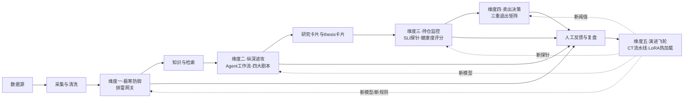
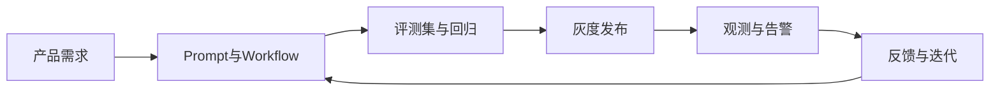

# L2 · 主业务与工程链路图

> [!NOTE] **[TRACEBACK] 战略维度锚点**
> - **顶层概念**: [A股分析追踪平台目标与边界](../../01_顶层概念/04_A股分析追踪平台目标与边界.md)
> - **同层引用**: [06_跨维度协作/01_5维度协作关系图.md](../06_跨维度协作/01_5维度协作关系图.md)、[06_跨维度协作/02_5维度引擎全景与安全起步套餐.md](../06_跨维度协作/02_5维度引擎全景与安全起步套餐.md)

## 主业务链路（标注 5 维度产品设计入口）

## 工程链路

## 链路能力映射

- `知识与检索`、`Agent 工作流`：研究编排能力（→ 维度二）
- `灰度发布`、`回归`：评测与发布能力（→ 维度五）
- `观测与告警`、`推理底座`：基础设施治理能力（→ 维度三/五）
- `Runtime / 沙箱 / 长任务`：运行时与隔离能力（→ 维度一/五的外部动作边界）

## 主业务链路 ↔ 5 维度入口对照

| 主业务链路节点 | 对应产品设计维度 | 在 L3 模块中的归属 |
|---|---|---|
| 数据源 → 采集与清洗 | 共享平台基础（数据采集与输入层规约） | 跨模块共享 |
| 排雷网关 | 维度一·极寒防御 | `cryo_guard` |
| Agent 工作流 · 四大剧本 | 维度二·纵深进攻 | `deep_strike` |
| SLI 探针 · 健康度评分 | 维度三·持仓监控 | `state_watch`（Observer 子域） |
| 三重退出矩阵 | 维度四·卖出决策 | `state_watch`（Exit Engine 子域） |
| CT 流水线 · LoRA 热加载 | 维度五·演进飞轮 | `super_evo` |

详见 [06_跨维度协作/01_5维度协作关系图.md](../06_跨维度协作/01_5维度协作关系图.md)。
