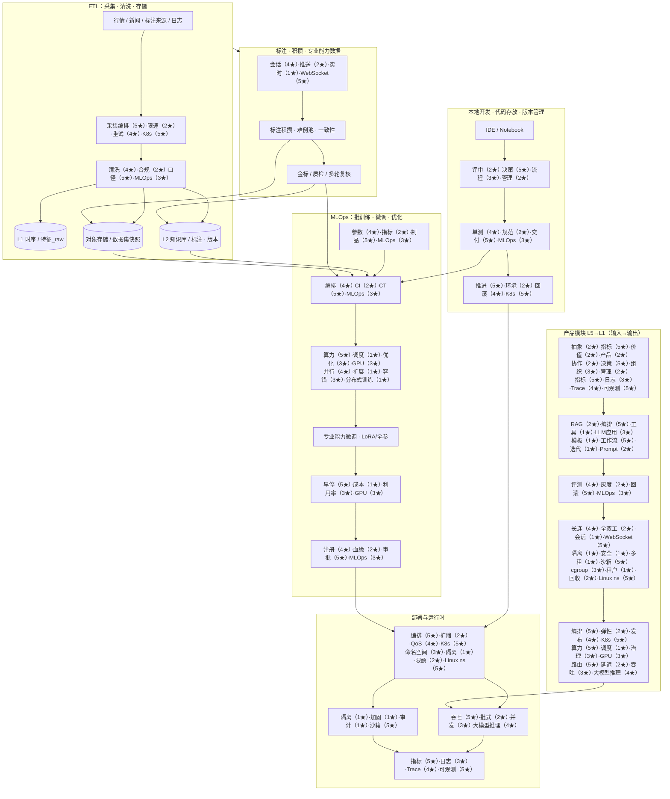

# 全局参考架构：贯穿 MLOps、ETL、专业能力微调与研发部署

> [!NOTE] **导航**：[README.md](./README.md) · **星级原文**：[岗位总览 §五 技术栈差异](../../岗位-技术提升/README-岗位总览与横向对比.md#五技术栈差异岗位画像)

本文总图中，**每个节点所注星级**与《岗位总览》§五 **逐格一致**。图上短句格式为 **`能力₁（01★）·能力₂（02★）·能力₃（03★）·技术名（04★）`**：四个数字依次对应表中该技术行的 **岗位 01～04**，**最后一个短语固定为该条 §五 技术名称**（与前三个能力的侧重点配套，便于扫图）。

> WebSocket 在 §5 表格中 01 列带「（RTC）」说明；图中 01 侧数字仍按 **4** 与表一致。

## 1. 总览图（端到端）

## 2. 双轴说明（便于对 OKR / 门禁）

| 主轴 | 图上对应 | 目标 |
|------|----------|------|
| **数据与标注资产闭环** | ETL + LBL + L2/OBJ | 可追溯、可复现、可评测的数据与标注 |
| **模型与交付闭环** | ML + INF + PROD | 持续训练、安全发布、可观测与成本可控 |
| **工程与协作闭环** | DEV | 代码质量、环境一致性、一键可达生产 |

## 3. 与四岗位的粗映射（选型讨论用）

| 岗位 | 在图上的“主战场” |
|------|------------------|
| 01 AI Infra | INF（K8s、GPU、推理网关、可观测） |
| 02 AI 技术负责人 | PROD 上层（指标、门禁、RAG/Agent、产品抽象） |
| 03 MLOps | ML + L3 门禁、drift/CT、registry |
| 04 Agent Infra | SBX、L2R Runtime、WebSocket、强隔离 |

## 4. 维护约定

- **大改**先改本总图，再拆到 [02_ETL…](./02_ETL数据采集清洗存储_规划设计图.md) / [03_MLOps…](./03_MLOps_产品模型优化流程图.md) / [04_模块工作流…](./04_产品模块工作流_输入输出与目标.md)。
- §五 表格若改版，须同步更新本图及各子图中 **每一档（01～04）数字**（保持与原文一致）。
