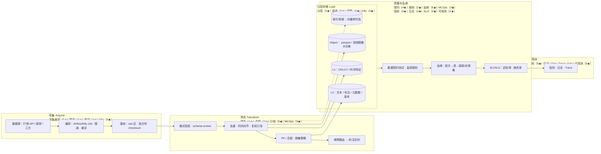

# ETL：数据采集 · 清洗 · 存储（规划设计图）

> [!NOTE] **导航**：[README](./README.md) · **四岗星级原文**：[岗位总览 §五](../../岗位-技术提升/README-岗位总览与横向对比.md#五技术栈差异岗位画像)

## 1. 范围与目标

| 目标 | 说明 |
|------|------|
| **一致性** | 口径、Schema、版本与下游消费契约对齐（对齐 L2 / 规约文档） |
| **可信** | 质检、血缘、可回放；异常可熔断（极寒防御主轴） |
| **可扩展** | 批 / 近实时扩展位；存储分层清晰（冷温热） |
| **工程化** | 可观测、成本可见（FinOps）；K8s Job / 编排友好（星级见下图各段） |

## 2. 端到端流程图

图中采用 **`能力₁（01★）·能力₂（02★）·能力₃（03★）·技术名（04★）`**，数字与 §五 表该行的 **01～04** 一致。

## 3. 流程段落与技术落位

| 技术领域 | 在本图 Mermaid 中的主要段落 |
|----------|------------------------------|
| **K8s / 云原生** | ACQ、STG（编排 Job/Cron）、扩展多副本 |
| **Linux namespace/cgroup** | 批任务隔离、多租户 QoS（与 §五 逐格一致，细节见总图） |
| **可观测性** | QL、OBS |
| **MLOps（CI/CD/CT）** | CLN、QL；Schema/管线发布门禁（与 ACQ–CLN 衔接） |
| **WebSocket / 长连接** | 与实时/人机回环标注联动（出流到 LBL，见 [01_总图](./01_全局参考架构_贯穿MLOps_ETL_研发部署.md)） |
| **系统编程（Go/Rust）** | 可选高吞吐 ingest 网关、校验器 |

其余技术行的 **01～04 星级** 以 [岗位总览 §五](../../岗位-技术提升/README-岗位总览与横向对比.md#五技术栈差异岗位画像) 为准。

## 4. 产出物 checklist（规划级）

- [ ] 数据源清单与 SLA
- [ ] Raw / Curated / Feature 分层与保留策略
- [ ] 与 L1/L2 表及 **数据版本** 规约对齐
- [ ] 批 ID、checksum、回放脚本
- [ ] 仪表盘：体量、迟到、失败重试、成本科目
