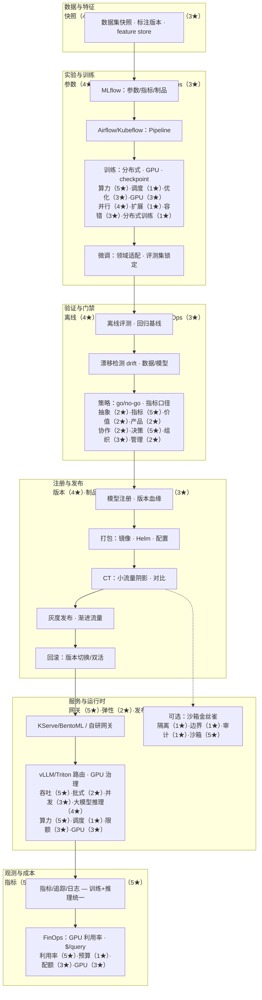
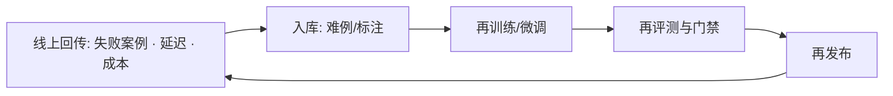

# MLOps：产品模型优化流程图

> [!NOTE] **导航**：[README](./README.md) · **四岗星级原文**：[岗位总览 §五](../../岗位-技术提升/README-岗位总览与横向对比.md#五技术栈差异岗位画像) · **岗位 §四**：[岗位总览](../../岗位-技术提升/README-岗位总览与横向对比.md#四四岗位关键技术覆盖清单按你当前目标)

## 1. 流程总图（实验 → 生产）

融合岗位文档中 **岗位 3** 所列：**MLflow**、**Kubeflow/Airflow**、**KServe/BentoML**、**feature store**、**drift detection**、**灰度/回滚/CT/评测门禁**，并与 **岗位 1/4** 的推理与隔离能力衔接。

图中星级为 **`能力₁（01★）·能力₂（02★）·能力₃（03★）·技术名（04★）`**，与 §五 逐格一致。

## 2. 流程段与技术落位（简表）

| 技术领域（§五） | 主要流程段 |
|------------------|------------|
| **MLOps（CI/CD/CT）** | D、E、V、R |
| **K8s / 云原生** | ORC、R、S |
| **GPU 调度 / 性能** | TR、S、O |
| **大模型推理（vLLM/Triton）** | S |
| **分布式训练** | TR |
| **可观测性** | O |
| **沙箱 / 虚拟化** | SBX |
| **产品 sense / 业务抽象、Leadership** | POL |

各段的 **01～04** 以 [岗位总览 §五](../../岗位-技术提升/README-岗位总览与横向对比.md#五技术栈差异岗位画像) 表格为准。

## 3. 持续优化环（CL）

## 4. 文档化产物建议

- 模型卡（数据范围、评测、偏见与风险）
- 发布 Runbook（灰度步骤、回滚条件）
- Drift 告警与人工复核流程（与岗位 2 指标对齐）
