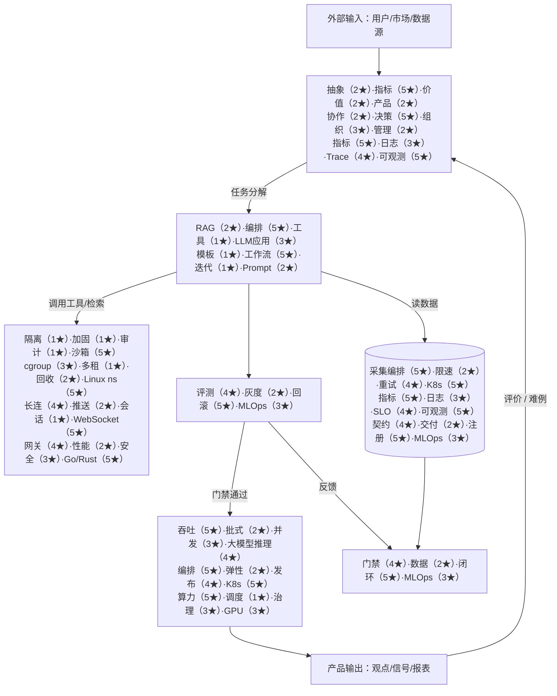

# 产品模块工作流：输入 · 输出 · 目标 · 作用

> [!NOTE] **导航**：[README](./README.md) · **四岗星级原文**：[岗位总览 §五](../../岗位-技术提升/README-岗位总览与横向对比.md#五技术栈差异岗位画像) · **五层对齐**：[岗位总览 §三](../../岗位-技术提升/README-岗位总览与横向对比.md#三与产品结构图的对齐关系重点)

## 1. 模块总表（规划视图）

下列模块与 **五层架构** 对应；**技术锚点** 为 §五 中的行名（各锚点的 **01～04 星级见下图与 §五**，表中不重复粘贴全表）。

| 模块 | 层级 | 输入 | 输出 | 目标 | 作用 | §五 技术锚点（行名） |
|------|------|------|------|------|------|----------------------|
| **交互与跟踪** | L5 | 用户意图、工单、反馈 | 可见结果、指标、审计日志 | 可解释、可复盘 | 对齐产品价值与风险边界 | 产品 sense、Leadership、可观测 |
| **Agent 编排 / 研究流** | L4 | 任务描述、工具、知识 | 结构化步骤、子任务结果 | 稳定、可复现工作流 | 放大「纵深进攻」研究效率 | **LLM 应用（RAG/Agent）**、**Prompt/Workflow**、部分 **WebSocket** |
| **评测与发布** | L3 | 模型版本、评测集、策略 | 报告、门禁结论、发布单 | 效果+安全双达标 | 状态机监控、灰度可控 | **MLOps**、漂移与回滚、指标门禁 |
| **Runtime / 沙箱** | L2 | 代码/插件、会话状态 | 隔离执行结果、资源账单 | 多租户安全 | 超级个体进化的安全底座 | **沙箱**、**Linux ns/cgroup**、**WebSocket**、**Go/Rust** |
| **推理与基础设施** | L1 | 模型制品、流量 | 低延迟推理、弹性伸缩 | 成本/性能最优 | 水电煤级 AI 底座 | **K8s**、**GPU**、**大模型推理**、**可观测**、**分布式训练**（训练侧） |
| **ETL / 数据平台** | 横切 | 原始数据源 | 干净分层数据、特征 | 可信数据资产 | 所有层的「燃料」 | **K8s** 编排作业、**可观测**、契约与 CI |
| **MLOps 平台** | 横切 | 实验配置、数据快照 | 注册模型、部署包 | 持续迭代 | 缩短实验-上线周期 | MLOps、feature store |

## 2. 数据与控制流（简图）

节点内为 **`能力（01★）·能力（02★）·能力（03★）·技术名（04★）`**，与 §五 对应行一致。

## 3. 与战略主轴的映射（可选列 OKR 时用）

| 主轴 | 主要模块 |
|------|----------|
| 极寒防御 | L3 门禁、L2 沙箱、数据合规（ETL） |
| 纵深进攻 | L4 编排 + ETL 广度与深度 |
| 状态机监控 | L3 评测 + L5 跟踪 |
| 超级个体进化 | L5 反馈 → L4/L1 迭代 + MLOps 闭环 |

## 4. 维护说明

- 新增产品线/子系统时：在本表加一行，并标明 **默认层级**，避免「悬空模块」。
- **改名/拆仓库**：同步更新 [01_全局参考架构](./01_全局参考架构_贯穿MLOps_ETL_研发部署.md) 中的命名。
- §五 表改版时：同步校正本节 Mermaid 中 **各档（01～04）数字**。
