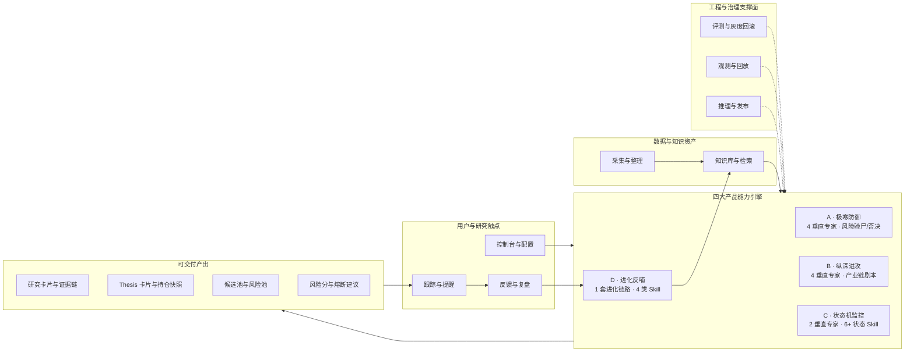

# 产品功能视角：全局架构与价值链

> [!NOTE] **导航**：[目录 README](./README.md) · **技术/工程视角总图**：[01_全局参考架构](./01_全局参考架构_贯穿MLOps_ETL_研发部署.md) · **产品范围定义**：[平台与产品/01_产品范围与优先级](../平台与产品/01_产品范围与优先级.md) · **L3 模型矩阵**：[03_原子目标与规约/平台与产品/02_产品分层设计与双目标实现路径规约.md](../../03_原子目标与规约/平台与产品/02_产品分层设计与双目标实现路径规约.md) · **主业务链路**：[平台与产品/09_主业务与工程链路图](../平台与产品/09_主业务与工程链路图.md)

## 1. 文档定位

| 视角 | 关注点 | 典型读者 |
|------|--------|----------|
| **01 全局参考架构** | ETL、MLOps、K8s、推理、研发流水线 | 架构 / Infra / MLOps |
| **本文（05）** | 用户能用到什么、价值链如何闭合、与四维产品模型如何对应 | 产品 / 业务负责人 / 对外说明 |

本文**不展开**工程星级与组件选型，仅保留产品语言；**专家模型个数与 Skill 名称**以 L3 规约为准（见 **§3**）。工程落地回链 **01** 与 **[04_产品模块工作流](./04_产品模块工作流_输入输出与目标.md)**。

## 2. 总览图（功能域 + 主干价值链）

说明：**实线**为主价值路径（研究/风控/跟踪）；**虚线**为反哺与治理支撑。引擎节点上标注 **L3 规定的专家规模**（与 §3 一致）。



## 3. 四大引擎：专家模型规模与 Skill 能力

> 本节与 [L3 · 产品分层规约 · 模型矩阵规模约束](../../03_原子目标与规约/平台与产品/02_产品分层设计与双目标实现路径规约.md#模型矩阵规模约束强制) 及 [§四 四大战略维度的产品化落点 · 最小能力包](../../03_原子目标与规约/平台与产品/02_产品分层设计与双目标实现路径规约.md#四四大战略维度的产品化落点) **逐条对齐**。  
> **产品侧「完全体」最低规模**：防御 **4** + 进攻 **4** + 监控 **2** = **10 个垂直专家**（均运行在 **1 基座 + 多 LoRA** 的推理约束下，见同文档推理成本约束）；**D** 为反哺链路，**不列入**上述「10 专家」计数。

### 3.1 总览表

| 引擎 | 垂直专家（最低个数） | 专家 / Skill 能力（名称） |
|------|----------------------|---------------------------|
| **A 极寒防御** | **4** | ① 存贷双高 / 现金流测谎　② 并购商誉减值预警　③ 关联交易 / 虚假营收识别　④ 大股东质押与跑路预警 |
| **B 纵深进攻** | **4** | ⑤ 成本剪刀差 / 利润截留推演　⑥ S 曲线 / 产业渗透率识别　⑦ 卖铲人 / 瓶颈环节定位　⑧ 周期底部产能出清识别 |
| **C 状态机监控** | **2**（专家）+ **状态机 Skill** | ⑨ 叙事漂移 / 公关话术一致性对比　⑩ 市场情绪 / 散户拥挤度监控 |
| **D 进化反哺** | **不按垂直专家扩列** | ① 人工高亮反馈 → 规则库 / 样本库　② 规则与评测集版本化　③ 评测失败样本自动回灌　④ 周期性更新与灰度验证 |

### 3.2 A — 最小能力包（Skill 域）

与 L3「极寒防御战略」最小能力包一致，归为四类 **Skill 域**（每域可对应 1 个或多个 LoRA 专家落地）：

- **资产负债异常**：存贷背离、利息悖论  
- **并购与商誉异常**：对赌期、减值风险、跨界并购泡沫  
- **供应链与关联交易异常**：体内循环、回款恶化  
- **治理与人事异常**：高质押、核心高管离职、叙事拉高出货  

**验收 Skill**：每个专家至少具备「触发条件、证据来源、熔断动作、误报复盘」四件套。

### 3.3 B — 最小能力包（四类剧本 Skill）

- 利润**剪刀差**剧本（成本下降 + 售价粘性）  
- **S 曲线**拐点剧本（渗透率临界 + 高频验证点）  
- **卖铲人**瓶颈剧本（上游产能约束 + 下游 CAPEX 爆发）  
- **供给出清**剧本（产能收缩 + 需求弹性恢复）  

**验收 Skill**：每剧本输出「触发信号、证据拼图、胜率赔率假设、失效条件」。

### 3.4 C — 状态机 Skill（必备状态枚举）

持仓生命周期 **状态 Skill**（与 L3 枚举一致；迁移须可回放）：

| 状态 Skill | 含义（摘要） |
|------------|----------------|
| `THESIS_VALID` | 逻辑成立且探针健康 |
| `THESIS_WEAKENING` | 关键探针恶化但未证伪 |
| `THESIS_INVALIDATED` | 逻辑物理证伪，触发熔断 |
| `ALPHA_DECAY` | 共识过载，超额收益衰减 |
| `NARRATIVE_DRIFT` | 持有理由偏离建仓理由 |
| `REBALANCE_REQUIRED` | 机会成本触发重调度 |

**两个垂直专家**（⑨⑩）侧重「信号提取与对比」；**状态迁移**由状态机 Skill 与探针、阈值统一编排。

### 3.5 D — 进化链路 Skill（非专家矩阵）

D 的 **Skill** 是闭环动作而非「第 11～N 号垂直专家」：

| Skill | 说明 |
|-------|------|
| 反馈入库 | 人工高亮、错例、复盘结论进入规则库 / 样本库 |
| 版本治理 | 规则集、评测集、模型/工作流版本可对比、可回滚 |
| 样本回灌 | 失败评测样本自动进入再训练 / 再评测队列 |
| 灰度演进 | 周期性更新 + 灰度验证 + 质量提升证据链 |

**验收 Skill**：每轮迭代有「新增认知 → 更新规则 → 评测提升」可追溯证据。

---

## 4. 与《产品范围》矩阵的一一映射

与 [01_产品范围与优先级 · 产品模型定义矩阵](../平台与产品/01_产品范围与优先级.md#产品模型定义矩阵l2) 对齐：**同一套 A/B/C/D 定义**，此处强调**用户侧能力包装**。**专家个数与 Skill 列表**以 **§3 + L3 规约** 为准。

| 引擎 | 用户可感知能力（摘要） | 典型产出物 | 战略主轴 |
|------|------------------------|------------|----------|
| **A** | 高危信号验尸、欺诈/治理类一票否决入口 | 风险分、熔断建议、黑名单类标签 | 极寒防御 |
| **B** | 产业链与剧本化研究、候选池构建 | 候选池、剧本评分、证据链 | 纵深进攻 |
| **C** | 持仓逻辑与 thesis 绑定、状态迁移与提醒 | Thesis 卡片、探针状态、动作/退出建议 | 状态机监控 |
| **D** | 失败样本与人工反馈进入系统、规则/模型迭代可见 | 更新后的规则集、版本说明、质量对比 | 进化反哺 |

## 5. 按优先级的「现有能力边界」提示

对应 [01_产品范围与优先级 · P0 / P1 / P2](../平台与产品/01_产品范围与优先级.md#p0)；此处从**功能完备度**表述（非排期承诺）。

| 层级 | 产品上应呈现的边界 |
|------|-------------------|
| **P0** | 数据采集整理、财报公告新闻研报摘要、候选池/风险池、thesis 跟踪与提醒、防御规则最小闭环、持仓逻辑快照与探针绑定、**A/C 最小可运行链路**（可观测、可回放、可复盘） |
| **P1** | 多 Agent 编排、自托管推理、证据引用增强、评测/灰度/回滚/CT、指标体系与需求优先级、**B（至少 2 个剧本可验证）/ D 最小反哺闭环** |
| **P2** | 沙箱执行、长任务状态机、强多租户、browser/computer-use、**A/B/C/D 全量协同与 10→30~50 专家扩展** |

## 6. 与主业务链路、工程链路的衔接

- **主业务链路**（[09](../平台与产品/09_主业务与工程链路图.md)）：`数据源 → 采集清洗 → 知识检索 → Agent 工作流 → 卡片产出 → 跟踪 → 反馈 → 回流知识` —— 与上图 **DATA → KNOW → ENG → OUT → TRK → FB → D** 同构。  
- **工程链路**：需求 → Prompt/Workflow → 评测回归 → 灰度 → 观测 → 迭代 —— 对应图中 **GOV** 对 **ENG** 的虚线支撑。

## 7. Architecture as Code 图

同目录脚本可生成功能视角 PNG（引擎节点含 **专家数 + Skill 摘要**）：

- [diagrams_product_feature_architecture.py](./diagrams_product_feature_architecture.py)

```bash
pip install -r requirements-diagrams.txt
# 系统需已安装 graphviz（dot）
python3 diagrams_product_feature_architecture.py
```

生成文件：`diagrams_product_feature_architecture.png`（与脚本同目录）。

> **图示（diagrams 生成）**：[`diagrams_product_feature_architecture.png`](./diagrams_product_feature_architecture.png)

## 8. 维护约定

- **专家个数、枚举或状态 Skill 变更**：以 [L3 产品分层规约](../../03_原子目标与规约/平台与产品/02_产品分层设计与双目标实现路径规约.md) 为唯一溯源，同步本文 **§2 / §3**、Mermaid 与 `diagrams_product_feature_architecture.py`。  
- **产品模型叙事（A/B/C/D）或 P0 变更**：先改 [01_产品范围与优先级](../平台与产品/01_产品范围与优先级.md)，再同步本文 **§4 / §5**。  
- **纯工程结构调整**：改 [01_全局参考架构](./01_全局参考架构_贯穿MLOps_ETL_研发部署.md)；本文仅在「支撑面」不一致时微调 **§2 / §6**。
