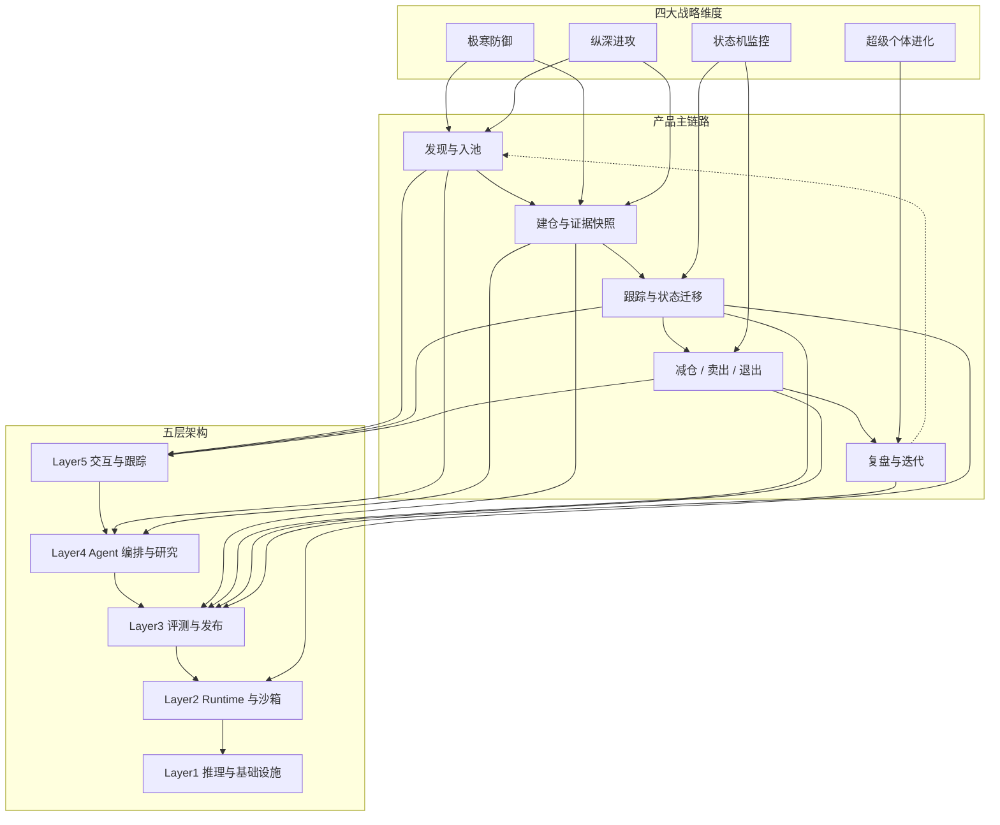

# L2 · 开源项目调研总览

> [!NOTE] **[TRACEBACK] 调研锚点**
> - **相关维度**: [平台技术栈与系统架构](../平台与产品/02_平台技术栈与系统架构.md) | [当前阶段优先开源选型](./02_当前阶段优先开源选型.md)

## 文档作用

本页只做三件事：

1. 说明产品主链路和战略维度如何对应。
2. 说明主链路落在哪些架构层。
3. 给后续选型一个总索引。

具体项目名、阶段优先级、替代方案见 [02_当前阶段优先开源选型](./02_当前阶段优先开源选型.md)。

## 产品结构图

## 关系速记

| 视角 | 结论 |
|---|---|
| **战略 → 主链** | 防御/进攻主要压在入池和建仓；监控压在跟踪和退出；进化压在复盘 |
| **主链 → 架构** | 入池偏 Layer5/4；建仓偏 Layer4/3；跟踪横跨 Layer5/3/2；退出偏 Layer5/3；复盘偏 Layer3 |
| **五层 → 选型簇** | Layer5=采集/提醒，Layer4=RAG/Agent，Layer3=评测/灰度，Layer2=长连接/隔离，Layer1=推理/K8s/GPU |

## 四岗位技术映射（总览）

| 岗位 | 核心技术簇 | 对应架构层 | 对应选型方向 |
|---|---|---|---|
| **岗位 1 AI Infra** | GPU 调度、推理性能、Triton/TGI/vLLM、分布式训练、checkpoint、RTC 基础 | Layer1（主）、Layer3（辅） | vLLM/Triton/TGI、K8s/K3s、训练框架、可观测 |
| **岗位 4 Agent Infra** | WebSocket 长连接、会话恢复、browser/computer-use runtime、seccomp/nsjail/eBPF、多租户隔离 | Layer2（主）、Layer4（辅） | Temporal/Celery、gVisor/Firecracker/nsjail、策略引擎与审计 |
| **岗位 3 MLOps** | MLflow、Kubeflow/Airflow、KServe/BentoML、feature store、drift detection | Layer3（主） | MLflow、编排流水线、模型服务化、监控告警 |
| **岗位 2 AI Tech Lead** | 指标体系、优先级框架、上线门禁、组织协作、商业化判断 | Layer5（主）、全层门禁 | 指标平台、评测门禁、发布治理、ROI 分析 |

## 调研原则（执行版）

1. **先产品闭环**：能否直接缩短“发现-跟踪-复盘”路径。
2. **再关键能力**：优先补齐岗位 1/4 的底层稀缺能力。
3. **再发布可靠性**：是否支持评测、灰度、回滚、审计。
4. **最后看热度**：热门但不落地的方案不优先。

## 当前结论（升级版）

当前应优先吸收的能力，不再是旧交易执行中心叙事，而是以下五条主链：

1. **数据主链**：A 股数据采集、清洗、版本化与证据可追溯。
2. **工作流主链**：RAG + Agent 编排 + 结构化输出。
3. **推理主链**：自托管推理 + LoRA 多路复用 + 性能治理。
4. **Runtime 主链**：长任务状态机 + 会话恢复 + 隔离执行。
5. **治理主链**：评测门禁 + 灰度回滚 + 漂移监测 + 成本治理。
