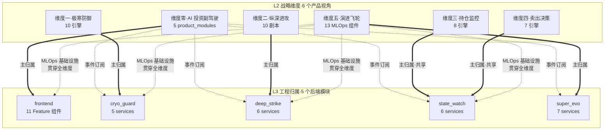

# L2 · 战略维度

> [!NOTE] **[TRACEBACK] 战略维度锚点**
> - **顶层概念**: [项目定义与核心价值](../01_顶层概念/01_项目定义与核心价值.md)
> - **顶层概念**: [战略目标与回报设计](../01_顶层概念/02_战略目标与回报设计.md)
> - **顶层概念**: [双目标系统与五层架构](../01_顶层概念/03_双目标系统与五层架构.md)

## 这一层负责什么

L2 负责把双目标系统拆成可执行的维度：

- 产品上到底做什么（5 维度产品生命周期）
- 技术上如何支撑它（4 主轴 ↔ L3 模块映射）
- 成长上如何映射到岗位能力（每一项工程能力对应招聘市场的高 demand 技能）
- 节奏上如何在 8 个月内推进（90 天 P0 安全起步套餐 → 9 个月 P1 → 12 个月 P2）

## 目录结构（顶层）

### 5 大维度（顶层目录，作为 L2 的"首要顺序与第一部分"）

每个维度都是独立"工程子项目"，含完整的「目标 + 引擎全景 + 数据梯次 + 训练路径 + N 份引擎规约」：

| 序号 | 维度 | 目录 | 引擎数 | 优先级 | L3 主归属 |
|---|---|---|---|---|---|
| 00 | 维度零·AI 投资副驾驶 | [00_维度零_AI投资副驾驶/](./00_维度零_AI投资副驾驶/) | 5 product_modules | **P0** | [L3 frontend](../03_原子目标与规约/00_维度零_AI投资副驾驶/) + 跨四大模块订阅 |
| 01 | 维度一·极寒防御 | [01_维度一_极寒防御/](./01_维度一_极寒防御/) | 10 引擎 | **P0** | [L3 cryo_guard](../03_原子目标与规约/01_维度一_极寒防御/) |
| 02 | 维度二·纵深进攻 | [02_维度二_纵深进攻/](./02_维度二_纵深进攻/) | 10 剧本 | P1 | [L3 deep_strike](../03_原子目标与规约/02_维度二_纵深进攻/) |
| 03 | 维度三·持仓监控 | [03_维度三_持仓监控/](./03_维度三_持仓监控/) | 8 引擎 | P0/P1 | [L3 state_watch](../03_原子目标与规约/03_维度三_持仓监控/)（共享）|
| 04 | 维度四·卖出决策 | [04_维度四_卖出决策/](./04_维度四_卖出决策/) | 7 引擎 | P1 | [L3 state_watch](../03_原子目标与规约/03_维度三_持仓监控/)（共享）|
| 05 | 维度五·演进飞轮 | [05_维度五_演进飞轮/](./05_维度五_演进飞轮/) | 13 MLOps 组件 | **P0** | [L3 super_evo](../03_原子目标与规约/05_维度五_演进飞轮/) |

### 跨维度协作（06_）

- [06_跨维度协作/](./06_跨维度协作/)：5 维度协作图、48 引擎全景、跨维度数据采集、节奏建议、与 L3/L4/L5/DNA 衔接

### 支撑性目录（07_~10_）

| 序号 | 目录 | 内容 |
|---|---|---|
| 07 | [07_平台与产品/](./07_平台与产品/) | 产品范围、平台技术栈、数据体系、可观测性、安全、评测、成本、外部接入、主业务链路图 |
| 08 | [08_全局架构与流程/](./08_全局架构与流程/) | 整体架构图、ETL/MLOps 闭环、研发部署 |
| 09 | [09_技术选型与调研/](./09_技术选型与调研/) | 开源项目调研、当前阶段优先选型 |
| 10 | [10_节奏与交付/](./10_节奏与交付/) | 8 个月节奏、通用落地顺序、双目标落地协作 |

### 顶层入口

- [00_双目标与战略维度关系.md](./00_双目标与战略维度关系.md)：5 维度 ↔ 4 主轴 ↔ L3 映射 + 优先级
- [06_跨维度协作/01_5维度协作关系图.md](./06_跨维度协作/01_5维度协作关系图.md)：5 维度的整体协作流程
- [06_跨维度协作/02_5维度引擎全景与安全起步套餐.md](./06_跨维度协作/02_5维度引擎全景与安全起步套餐.md)：48 引擎/组件全景 + 90 天 P0 起步
- [06_跨维度协作/04_5维度优先级与节奏建议.md](./06_跨维度协作/04_5维度优先级与节奏建议.md)：12 个月详细节奏

## 双视角原则（架构 ↔ 产品）

L2 同时维护两套互补视角，工程交付与产品设计各取所需：

| 视角 | 数量 | 单位 | 落点 | 何时使用 |
|---|---|---|---|---|
| **战略主轴 / 工程模块视角** | 5 | 极寒防御 / 纵深进攻 / 状态机监控 / 超级个体进化 / 前端工程与服务 | 与 L3 五大模块 1:1 对齐 | L3/L4/L5 工程交付、目录组织、验收行集 |
| **产品生命周期设计视角** | 6 | 维度零（产品骨架）+ 维度一~五（5 个业务能力域）| 维度零对应 L3 `frontend`；维度三、四共属 L3 `state_watch` | 产品设计、用户故事、P0/P1/P2 排期 |

详见 [00_双目标与战略维度关系.md](./00_双目标与战略维度关系.md) 与 [06_跨维度协作/05_与L3_L4_L5_DNA衔接.md](./06_跨维度协作/05_与L3_L4_L5_DNA衔接.md)。

## L2 ↔ L3 全景导航图（关键）

> 本图回答："维度的引擎/组件运行在哪个 L3 后端模块/服务上？"
> 详细映射见各维度的 `00_引擎到L3模块的映射.md` / `00_组件到L3模块的映射.md` / `00_产品模块到L3模块的映射.md`。

### 各维度的"引擎到 L3 模块的映射"文档

| 维度 | 映射文档 | 内容 |
|---|---|---|
| 维度零 | [00_产品模块到L3模块的映射.md](./00_维度零_AI投资副驾驶/00_产品模块到L3模块的映射.md) | 5 product_modules → L3 frontend Feature 组件 + 跨四大模块事件流订阅 |
| 维度一 | [00_引擎到L3模块的映射.md](./01_维度一_极寒防御/00_引擎到L3模块的映射.md) | 10 引擎 → L3 cryo_guard 5 services |
| 维度二 | [00_引擎到L3模块的映射.md](./02_维度二_纵深进攻/00_引擎到L3模块的映射.md) | 10 剧本 → L3 deep_strike 6 services |
| 维度三 | [00_引擎到L3模块的映射.md](./03_维度三_持仓监控/00_引擎到L3模块的映射.md) | 8 引擎 → L3 state_watch 6 services（与维度四共享）|
| 维度四 | [00_引擎到L3模块的映射.md](./04_维度四_卖出决策/00_引擎到L3模块的映射.md) | 7 引擎 → L3 state_watch（advisory + notification 主用）+ super_evo（引擎 7）|
| 维度五 | [00_组件到L3模块的映射.md](./05_维度五_演进飞轮/00_组件到L3模块的映射.md) | 13 组件 → L3 super_evo 7 services + 全维度 MLOps 基础设施 |

### L3 五大模块的回看入口

| L3 模块 | L3 主目录 | 5 设计文档 |
|---|---|---|
| 极寒防御 | [03_/极寒防御/](../03_原子目标与规约/01_维度一_极寒防御/) | 01_目标与边界 / 02_后端服务子模块 / 03_接口契约 / 04_数据契约 / 05_实施推演 |
| 纵深进攻 | [03_/纵深进攻/](../03_原子目标与规约/02_维度二_纵深进攻/) | 同上 |
| 状态机监控 | [03_/状态机监控/](../03_原子目标与规约/03_维度三_持仓监控/) | 同上 |
| 超级个体进化 | [03_/超级个体进化/](../03_原子目标与规约/05_维度五_演进飞轮/) | 同上 |
| 前端工程与服务 | [03_/前端工程与服务/](../03_原子目标与规约/00_维度零_AI投资副驾驶/) | 01_用户场景 / 02_组件分层 / 03_API依赖 / 04_技术栈 / 05_实施推演 |

## 使用原则

1. **维度优先**：先按维度（01_~05_）阅读，每个维度自带 5 份维度级文档 + N 份引擎规约
2. **跨维度协作放 06_**：避免在每个维度重复维护通用内容
3. **支撑性目录放 07_~10_**：服务于 5 维度，不替代维度本身
4. **工程归属用 4 主轴，产品设计与排优先级用 5 维度**——两者不冲突，各管一段
5. **每个引擎/组件文档统一 8 节模板**：定位/工作流/首训/多阶段/数据/Holdout/上下游/L3-L4-L5-DNA 映射

## 本次（2026-05-14）重构变更摘要

| 变更 | 内容 |
|---|---|
| 新增 5 维度顶层目录 | 01_~05_，每个维度独立工程子项目（25 份维度级文档） |
| 新增 06_跨维度协作 | 5 份跨维度协作文档（替代原 10_产品生命周期设计维度.md 的部分内容） |
| 重命名 4 个支撑目录 | 平台与产品/ → 07_平台与产品/；全局架构与流程/ → 08_；技术选型/ → 09_；节奏与交付/ → 10_ |
| 删除老 10_文档 | 07_平台与产品/10_产品生命周期设计维度.md 已删除，所有内容迁出到新结构 |
| 完成 10 个 P0 引擎完整版 | 维度一 3 + 维度二 1 + 维度三 2 + 维度五 4 |
| 待办 | P1 18 引擎 + P2 20 引擎将在后续批次补全 |
