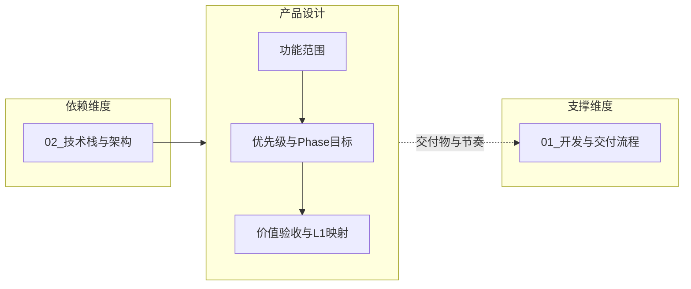

# L2 · 产品设计维度

> [!NOTE] **[TRACEBACK] 战略维度锚点**
> - **顶层概念**: [一句话定义与核心价值](../../01_顶层概念/01_一句话定义与核心价值.md)
> - **顶层概念**: [战略目标与ROI](../../01_顶层概念/02_战略目标与ROI.md)
> - **本文档**: L2 层级，定义产品设计维度

## 维度定义

**产品设计维度**：明确「做什么、为谁做、先做啥」的战略原则，将 L1 不可能三角与核心价值转化为可验收的阶段目标与功能范围，确保各 Phase 交付物与价值标准可追溯、优先级可决策。

## 关键目标

1. **功能范围与优先级**：定义各阶段要交付的能力边界，与 L3 核心模块等能力清单对应；P0/P1 优先级规则可追溯（如生存底线相关先做）。
2. **Phase 目标与验收价值**：每个 Phase 对应明确的阶段目标与可验收的价值标准，与 L1 不可能三角、核心公式、核心价值映射。
3. **需求/路线图与 L1 的映射**：需求与路线图决策可溯源到 L1 价值点，避免「只做功能、不验价值」的断层。

## 覆盖范围

### 功能范围与需求优先级（战略级）

- **功能范围**：各 Phase 交付哪些能力（与 L3 [09_核心模块架构规约](../../03_原子目标与规约/_共享规约/09_核心模块架构规约.md) 的 Module A–F 等能力清单对应）；不在此写具体接口或实现。
- **需求与优先级**：阶段目标、优先级规则（如 P0 生存底线、P1 复利与认知边界）；具体 PRD 与排期归属 L4 或单独需求文档，本维度只定原则。

### 与开发与交付维度的关系

- **产品决定交付物与节奏**：本维度定义「各 Phase 做哪些功能、验收什么价值」；[01_开发与交付流程维度](../开发与交付/01_开发与交付流程维度.md) 定义「在什么环境、按什么流程交付」。
- **交付决定交付方式**：开发与交付维度不定义功能范围，只定义环境阶段与流水线；本维度不定义具体命令或环境，只定义阶段目标与价值验收。

### 与其它维度的关系

- **依赖**：技术栈与架构（02）：产品能力清单依赖既有技术栈与核心模块定义；本维度不选型，只引用。
- **支撑**：开发与交付流程：本维度产出各 Phase 的交付物定义与价值标准，供 L4 阶段步骤与 [04_阶段规划与实践](../../04_阶段规划与实践/README.md) 交叉引用。

## 与不可能三角的映射（可选）

- **认知边界 (Certainty)**：产品阶段目标可包含「可解释性、胜率验证」等验收项，与 L1 认知边界对应。
- **复利增长 (Growth)**：Phase 目标可包含「回测/实盘一致、复利指标可测」等，与 L1 复利目标对应。
- **生存底线 (Survival)**：优先级规则可约定「风控、密钥、回撤相关能力优先」，与 L1 生存底线对应。

## 下一步

→ 主责 L3 规约：[01_需求与产品范围](../../03_原子目标与规约/产品设计/01_需求与产品范围.md)；L4 Phase 步骤须符合该规约并标明对应阶段目标与 L1 价值点。完整对应见 [L2-L3-DNA 映射表](../../06_追溯与审计/00_L2_L3_DNA_映射.md)。
