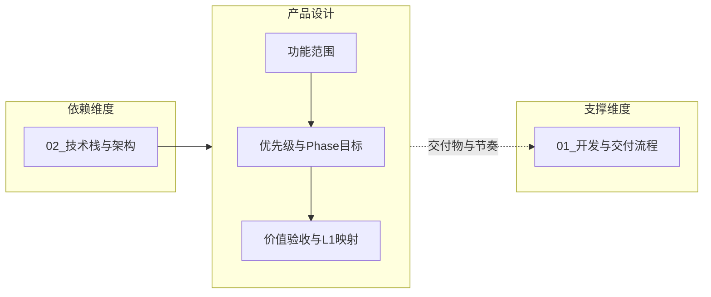

# L2 · 产品设计维度

> [!NOTE] **[TRACEBACK] 战略维度锚点**
> - **顶层概念**: [一句话定义与核心价值](../../01_顶层概念/01_一句话定义与核心价值.md)
> - **顶层概念**: [战略目标与ROI](../../01_顶层概念/02_战略目标与ROI.md)
> - **本文档**: L2 层级，定义产品设计维度

## 维度定义

**产品设计维度**：明确「做什么、为谁做、先做啥」的战略原则，在 L1 双轨制下将 **A 轨不可能三角** 与 **B 轨长期捕手目标** 转化为可验收的阶段目标与功能范围，确保各 Phase 交付物与价值标准可追溯、优先级可决策。

**与 00_维度关系总览的区分**：00 回答各维度间关系、依赖链、优先级与实施顺序；01 回答功能范围、Phase 目标、按轨验收标准及与开发与交付的衔接。

## 关键目标

1. **功能范围与优先级**：定义各阶段要交付的能力边界，与 L3 核心模块等能力清单对应；P0/P1 优先级规则可追溯（如生存底线相关先做）。
2. **Phase 目标与验收价值**：每个 Phase 对应明确的阶段目标与可验收的价值标准，与 L1 不可能三角、核心公式、核心价值映射。
3. **按轨验收**：A 轨验收三角与 2%/现金拖累、WinRate/CAGR/MaxDD 等指标；B 轨验收逻辑证伪与大周期反转可追溯、VC-Agent 信号与执行率、分轨复盘指标（不得用 A 轨标准误评 B 轨）。
4. **需求/路线图与 L1 的映射**：需求与路线图决策可溯源到 L1 价值点，避免「只做功能、不验价值」的断层。

## 覆盖范围

### 功能范围与需求优先级（战略级）

- **功能范围**：各 Phase 交付哪些能力（与 L3 [09_核心模块架构规约](../../03_原子目标与规约/_共享规约/09_核心模块架构规约.md) 的 Module A–F 等能力清单对应）；不在此写具体接口或实现。
- **需求与优先级**：阶段目标、优先级规则（如 P0 生存底线、P1 复利与认知边界）；具体 PRD 与排期归属 L4 或单独需求文档，本维度只定原则。

### 与开发与交付维度的关系

- **产品决定交付物与节奏**：本维度定义「各 Phase 做哪些功能、验收什么价值」；[01_开发与交付流程维度](../开发与交付/01_开发与交付流程维度.md) 定义「在什么环境、按什么流程交付」。
- **交付决定交付方式**：开发与交付维度不定义功能范围，只定义环境阶段与流水线；本维度不定义具体命令或环境，只定义阶段目标与价值验收。

### 与其它维度的关系

- **依赖**：技术栈与架构（02）：产品能力清单依赖既有技术栈与核心模块定义；本维度不选型，只引用。
- **支撑**：开发与交付流程：本维度产出各 Phase 的交付物定义与价值标准，供 L4 阶段步骤与 [04_阶段规划与实践](../../04_阶段规划与实践/README.md) 交叉引用。

## 与 A 轨不可能三角的映射（可选）

- **认知边界 (Certainty)**：产品阶段目标可包含「可解释性、胜率验证」等验收项，与 L1 认知边界对应。
- **复利增长 (Growth)**：Phase 目标可包含「回测/实盘一致、复利指标可测」等，与 L1 复利目标对应。
- **生存底线 (Survival)**：优先级规则可约定「风控、密钥、回撤相关能力优先」，与 L1 生存底线对应。

## 与 B 轨目标的映射

- **时代牛股捕获**：Phase 目标可包含 VC-Agent 上线、B 轨分账与仓位标识、逻辑证伪/大周期反转可追溯。
- **可追溯性**：B 轨验收逻辑证伪与大周期反转触发记录、基本面数据来源可查；复盘与归因分轨统计，见 [03_双轨制与VC-Agent](../../01_顶层概念/03_双轨制与VC-Agent.md)。本维度按轨差异以 [03_双轨制与VC-Agent](../../01_顶层概念/03_双轨制与VC-Agent.md)#AB轨规范边界 为准。
- **具体 B 轨阶段目标与 Phase 对应、验收表**见 L3 [01_需求与产品范围](../../03_原子目标与规约/产品设计/01_需求与产品范围.md)（第二节 Phase 划分与阶段目标、B 轨 Phase 与验收小节）。

## 系统使用者与前端设计

本小节从**系统使用者视角**定义谁用系统、做什么、看到什么，并与 ADR-004（HITL）、可观测性、仪表盘完整性要求衔接。具体界面与接口由 L3 [10_运营治理与灾备规约](../../03_原子目标与规约/_共享规约/10_运营治理与灾备规约.md)「运维与人机交互」及 L4 实现约定。

### 使用者角色与目标

| 角色 | 核心目标 | 使用频率 |
|------|----------|----------|
| **交易确认人** | 对买入/止盈做确认，在限定时间内看到必要信息并一键确认/拒绝 | 事件驱动（有待确认订单时） |
| **守夜人/风控** | 监控异常、熔断、回撤与告警，必要时干预 | 每日/值班 |
| **复盘查看者** | 查看绩效、分轨统计、回测与实盘对比（只读或有限操作） | 每日/每周 |
| **系统管理员** | 配置、权限、运维与审计（若与上述角色分离） | 按需 |

### 核心任务与流程

- **交易确认**：收到待确认 → 打开界面/通知 → 看到标的、方向、量、理由摘要、剩余时间 → 确认/拒绝 → 看到结果；超时、网络失败时用户侧有明确提示。与 [ADR-004](../../06_追溯与审计/ADR/004-human-in-the-loop.md) 一致。
- **监控与告警**：通过入口或通知得知「需要关注」；看到关键指标；区分「仅查看」与「可操作」（如确认、熔断、暂停）。与 [04_生产保障与可观测性维度](../04_生产保障与可观测性维度.md) 及 L5 仪表盘完整性衔接。
- **复盘与统计**：在指定界面查看 A/B 轨绩效、回撤、胜率等；分轨报表不与 A 轨标准混评。与 [03_双轨制与VC-Agent](../../01_顶层概念/03_双轨制与VC-Agent.md) 复盘分轨一致。

### 前端范围（战略级）

- **承载形态**：交易确认可采用手机推送 + Telegram/Web 确认页；守夜人采用 Web 控制台或仪表盘；复盘可采用只读报表/大屏。具体选型由 L3 运维与人机交互约定。
- **关键界面**：待确认列表/单笔确认详情（含超时倒计时、理由摘要）；监控/告警中心；绩效/复盘视图（分轨）。各角色可访问范围与操作权限由 L3 约定。
- **与现有要求衔接**：ADR-004 买入/止盈人工确认、[05_成功标识 03](../../05_成功标识与验证/03_成功标识详细规约.md)「所有模块必须有仪表盘」、可观测性按轨报表，均在本范围内体现。

## 下一步

→ 主责 L3 规约：[01_需求与产品范围](../../03_原子目标与规约/产品设计/01_需求与产品范围.md)；L4 Phase 步骤须符合该规约并标明对应阶段目标与 L1 价值点。完整对应见 [L2-L3-DNA 映射表](../../06_追溯与审计/00_L2_L3_DNA_映射.md)。
