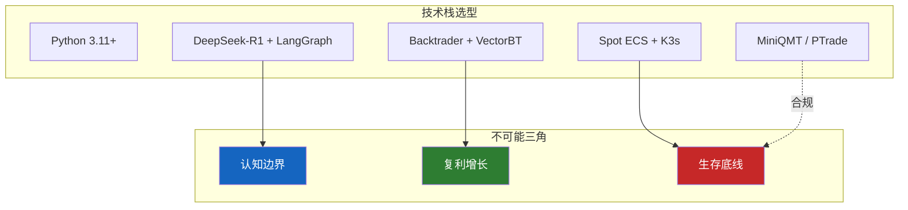

# L2 · 技术栈与架构维度

> [!NOTE] **[TRACEBACK] 战略维度锚点**
> - **顶层概念**: [一句话定义与核心价值](../../01_顶层概念/01_一句话定义与核心价值.md)
> - **顶层概念**: [战略目标与ROI](../../01_顶层概念/02_战略目标与ROI.md)
> - **本文档**: L2 层级，定义技术栈选型与架构维度

## 维度定义

**技术栈与架构维度**：为支撑 Neuro-Symbolic MoE 架构与核心公式 $Alpha = (Quant_{Signal} \cap Router(Experts)) \times Kelly_{Position}$，选择并组合最优的技术栈与基础设施，确保系统在不可能三角约束下稳定运行。

## 关键目标

1. **支撑 MoE 架构**：技术栈必须支持量化信号生成、专家路由、动态仓位计算的全链路
2. **满足性能约束**：全市场扫描+推理 <2. **满足性能约束**：全市场扫描+推理 < 30 分钟，RTO（恢复时间目标）< 5 分钟
文档

## 覆盖范围

### 1.1 开发语言与核心框架

| 组件 | 选型 | 理由 | 约束 |
|------|------|------|------|
| **开发语言** | Python 3.11+ | 金融计算生态标准，量化库丰富 | 强制 Type Hints，Pydantic 验证 |
| **核心大脑** | DeepSeek-R1 (CoT) | **核心大脑** | DeepSeek-R1 (CoT，思维链 Chain-of-Thought) + LangGraph | CoT 推理 + 多专家路由状态机 | 必须支持思维链推理与状态流转 |
 | Backtrader 用于策略验证，VectorBT 用于批量扫描 |
| **执行网关** | MiniQMT / PTrade | 券商官方量化终端，合规接口 | 必须通过| **执行网关** | MiniQMT / PTrade | 券商官方量化终端，合规接口 | 必须通过交易接口抽象层（TAL，Trade Abstraction Layer）封装 |

### 1.2 技术栈与不可能三角关系

### 1.3 架构模式

- **事件驱动架构**：基于 Redis Streams 的事件流，支持实时信号处理
- **微服务架构**：按模块拆分（量化扫描、专家路由、仓位计算、风控、执行），便于独立扩展
- **研产同构**：回测与实盘共享同一套 Strategy 类，避免逻辑不一致

## 约束条件

1. **语言约束**：Python 3.11+，强制类型提示，所有接口使用 Pydantic 验证
2. **性能约束**：全市场扫描 < 30 分钟，单信号推理超时需与整体协调
3. **合规约束**：执行网关必须使用券商官方接口，严禁绕过合规机制
4. **成本约束**：基础设施需支持 Scale-to-Zero，避免闲置资源成本

## 与不可能三角的关系

- **认知边界 (Certainty)**：DeepSeek-R1 CoT（思维链）确保每个信号都有可解释的 reasoning_summary
- **复利增长 (Growth)**：VectorBT 向量化与研产同构支撑复利目标
- **生存底线 (Survival)**：K3s 容器编排支持快速恢复（RTO < 5 分钟），保证系统可用性

## 下一步

→ 主责 L3 规约：[01_核心公式与MoE架构规约](../../03_原子目标与规约/01_核心公式与MoE架构规约.md)；辅规约：02_三位一体仓库规约、09_核心模块架构规约。完整对应见 [L2-L3-DNA 映射表](../../06_追溯与审计/00_L2_L3_DNA_映射.md)。
