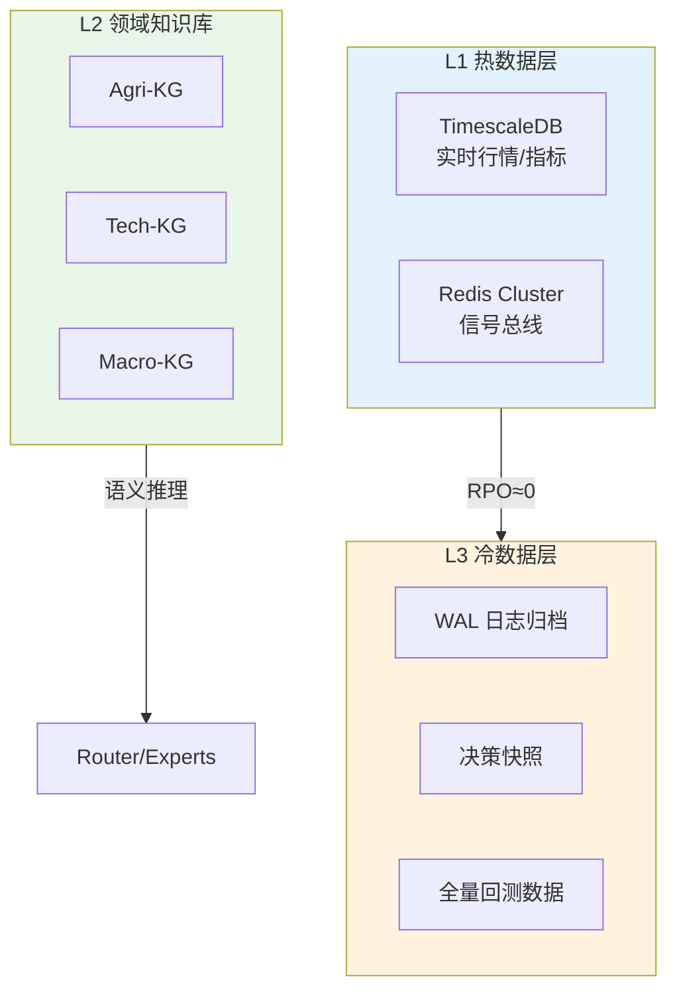

# L2 · 数据架构与分层存储维度

> [!NOTE] **[TRACEBACK] 战略维度锚点**
> - **顶层概念**: [一句话定义与核心价值](../../01_顶层概念/01_一句话定义与核心价值.md)
> - **顶层概念**: [战略目标与ROI](../../01_顶层概念/02_战略目标与ROI.md)
> - **本文档**: L2 层级，定义数据架构与分层存储维度

## 维度定义

**数据架构与分层存储维度**：严格遵循《数据安全与韧性架构规范书》，建立 L1（热数据）、L2（领域知识库）、L3（冷数据）三层数据架构，确保数据安全、可追溯、低成本存储。

## 关键目标

1. **数据安全与韧性**：遵循《数据安全与韧性架构规范书》，WAL（预写日志）日志实时归档（RPO（恢复点目标）≈0）
2. **性能与成本平衡**：热数据快速访问，冷数据低成本归档
3. **知识图谱支撑**：L2 领域知识库支撑专家路由的语义推理

## 覆盖范围

### 三层数据架构逻辑

### 2.1 L1 热数据层（ESSD PL1）

| 组件 | 用途 | 约束 |
|------|------|------|
| **TimescaleDB** | 实时行情/指标存储 | **禁止使用 NAS 跑数据库**，必须使用 ESSD PL1 |
| **Redis Cluster** | 信号总线/去重 | 支持 Redis Streams 事件流，用于实时信号处理 |

**性能要求**：
- 实时行情写入延迟 < 100ms
- 信号总线吞吐量支持全市场扫描并发

### 2.2 L2 领域知识库（NAS/Vector）

| 知识库 | 内容 | 技术栈 |
|--------|------|--------|
| **Agri-KG** | 气候、猪周期、一号文件库 | pgvector |
| **Tech-KG** | 产业链图谱、国产替代率数据 | pgvector |
| **Macro-KG** | 利率汇率、地缘政治事件库 | pgvector |

**用途**：
- 支撑 Router(Experts) 的语义推理
- 为 DeepSeek-R1 提供领域上下文，生成 reasoning_summary

**约束**：
- 向量维度需与 DeepSeek-R1 嵌入模型一致
- 检索超时需与全市场扫描+推理 < 30 分钟协调

### 2.3 L3 冷数据层（OSS，对象存储服务）

| 内容 | 用途 | 存储类型 |
|------|------|---------|
| **WAL 日志** | 实时归档（RPO≈0） | OSS 标准存储 |
| **决策快照** | 审计追溯 | OSS 标准存储 |
| **全量回测数据** | 离线分析（配合 DuckDB） | OSS 冷归档（价格是标准存储的 1/10） |

**成本优化**：
- 历史回测数据使用冷归档存储，降低成本
- DuckDB 支持直接查询 OSS 数据，无需全量加载

## 约束条件

1. **数据安全**：严格遵循《数据安全与韧性架构规范书》
2. **性能约束**：L1 热数据必须使用 ESSD PL1，禁止 NAS
3. **成本约束**：L3 冷数据使用 OSS 冷归档，降低存储成本
4. **可追溯性**：WAL 日志实时归档，RPO≈0，支持数据恢复

## 与不可能三角的关系

- **认知边界 (Certainty)**：L2 领域知识库提供可解释的领域逻辑，支撑 reasoning_summary 生成
- **复利增长 (Growth)**：L1 热数据快速访问支持多策略池并发挖掘
- **生存底线 (Survival)**：WAL 日志实时归档（RPO≈0）保证数据不丢失，支持灾难恢复

## 下一步

→ 主责 L3 规约：[07_数据版本控制规约](../../03_原子目标与规约/_共享规约/07_数据版本控制规约.md)；辅规约：05_接口抽象层、09_核心模块、10_运营治理与灾备。完整对应见 [L2-L3-DNA 映射表](../../06_追溯与审计/00_L2_L3_DNA_映射.md)。
