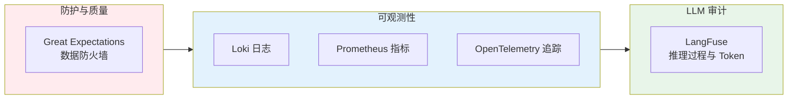

# L2 · 生产保障与可观测性维度

> [!NOTE] **[TRACEBACK] 战略维度锚点**
> - **顶层概念**: [一句话定义与核心价值](../../01_顶层概念/01_一句话定义与核心价值.md)
> - **顶层概念**: [战略目标与ROI](../../01_顶层概念/02_战略目标与ROI.md)
> - **本文档**: L2 层级，定义生产保障与可观测性维度

## 维度定义

**生产保障与可观测性维度**：通过数据防火墙、可观测性体系、LLMOps 工具链，确保系统“垃圾进，灾难出”的防护机制，并实现全链路可追溯、可审计。

## 关键目标

1. **数据质量保障**：拦截 null 或异常价格数据，防止“垃圾进，灾难出”
2. **全链路可观测**：日志、指标、追踪三位一体，支持故障快速定位
3. **LLM（大语言模型）推理可审计**：记录每一次 Agent 的思考过程与 Token（词元）消耗，实现 Prompt 版本回溯

## 覆盖范围

### 生产保障逻辑链路

### 3.1 数据防火墙

| 组件 | 用途 | 规则 |
|------|------|------|
| **Great Expectations** | 数据质量检查 | 拦截 null、异常价格、涨跌幅超阈值等异常数据 |

**战略要求**：
- 所有数据源（行情、指标、信号）必须经过 Great Expectations 验证
- 异常数据直接丢弃或告警，不进入下游处理

### 3.2 可观测性体系

| 组件 | 用途 | 指标 |
|------|------|------|
| **Loki** | 日志聚合 | 应用日志、错误日志、审计日志 |
| **Prometheus** | 业务指标监控 | 延迟、数据新鲜度、信号生成速率、专家路由命中率 |
| **OpenTelemetry** | 全链路追踪 | 从量化扫描 → 专家路由 → 仓位计算 → 风控 → 执行的完整链路 |

**关键指标**：
- **延迟指标**：全市场扫描耗时、单信号推理耗时、仓位计算耗时
- **数据新鲜度**：行情数据延迟、知识库更新延迟
- **业务指标**：信号生成速率、专家路由命中率、风控拦截率

**可观测性按轨**（与 [02_战略目标与ROI](../../01_顶层概念/02_战略目标与ROI.md) A/B 轨关键指标一致；按轨差异以 [03_双轨制与VC-Agent](../../01_顶层概念/03_双轨制与VC-Agent.md)#AB轨规范边界 为准）：
- **A 轨**：胜率/年化/回撤、2% 违反告警、现金拖累告警、Risk Shield 拦截率；分轨报表不混用 B 轨标准。
- **B 轨**：逻辑证伪与大周期反转触发记录、VC-Agent 信号数与执行率、B 轨 MaxDD/持仓周期；监控与复盘分轨统计，分轨报表不与 A 轨混用。

### 3.3 LLMOps

| 组件 | 用途 | 记录内容 |
|------|------|---------|
| **LangFuse** | LLM 推理审计 | 每次 Agent 的思考过程、Token 消耗、Prompt 版本、推理耗时 |

**战略要求**：
- 记录每一次 DeepSeek-R1 的 CoT 推理过程
- 支持 Prompt 版本回溯，便于优化与审计
- Token 消耗统计用于成本治理（见成本治理维度）

## 约束条件

1. **数据质量**：所有数据源必须经过 Great Expectations 验证，异常数据不得进入下游
2. **可观测性覆盖**：日志、指标、追踪必须覆盖核心业务链路
3. **LLM 审计**：所有 LLM 调用必须记录到 LangFuse，支持版本回溯

## 与不可能三角的关系

- **认知边界 (Certainty)**：LangFuse 记录 reasoning_summary 的生成过程，确保可解释性
- **复利增长 (Growth)**：Prometheus 监控信号生成速率与专家路由命中率，优化策略池效率
- **生存底线 (Survival)**：Great Expectations 拦截异常数据，防止“垃圾进，灾难出”；OpenTelemetry 支持故障快速定位

## 下一步

→ 主责 L3 规约：[08_心跳协议与健康检查规约](../../03_原子目标与规约/_共享规约/08_心跳协议与健康检查规约.md)；辅规约：09_核心模块、10_运营治理与灾备、03_架构设计共识。完整对应见 [L2-L3-DNA 映射表](../../06_追溯与审计/00_L2_L3_DNA_映射.md)。
