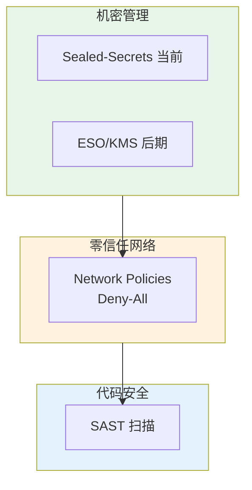

# L2 · 安全与机密治理维度

> [!NOTE] **[TRACEBACK] 战略维度锚点**
> - **顶层概念**: [一句话定义与核心价值](../../01_顶层概念/01_一句话定义与核心价值.md)
> - **顶层概念**: [战略目标与ROI](../../01_顶层概念/02_战略目标与ROI.md)
> - **本文档**: L2 层级，定义安全与机密治理维度

## 维度定义

**安全与机密治理维度**：金融系统的阿喀琉斯之踵是密钥（API Keys）。通过机密管理、零信任网络、代码审计三重防护，确保券商账户密码、阿里云 AccessKey、LLM API Key 等敏感信息不被泄露，防止资产归零。

## 关键目标

1. **机密零泄露**：严禁密钥硬编码；当前通过 Sealed-Secrets 实现关键参数加密，后期可引入 KMS（密钥管理服务）动态注入
2. **零信任网络**：默认拒绝（Deny-All），只有授权 Pod 可访问关键资源
3. **代码安全**：CI 流水线必须包含 SAST 扫描，防止密钥泄露模式入库。凡涉及「CI 必须」等条款，**当前实施方式**见 [03_架构设计共识与协作元规则](../../03_原子目标与规约/_共享规约/03_架构设计共识与协作元规则.md) 中的「当前实施状态」。

## 覆盖范围

### 安全治理三重防护



### 4.1 机密管理

**分阶段实施**（当前阶段与目标状态）：

| 阶段 | 方案 | 说明 |
|------|------|------|
| **当前** | **Sealed-Secrets** | 关键参数以 Sealed-Secrets 加密 YAML 或 Helm 引用形式存于 diting-infra；密钥在集群内由 Sealed-Secrets 控制器解密为 Secret。 |
| **后期** | Vault / KMS / ESO | 可迁移至 Vault 或阿里云 KMS + External Secrets Operator（ESO）；迁移时机与方案由 ADR 约定。 |

**Sealed-Secrets sealing key 管理**（当前阶段）：
- 由**集群管理员**在**安全环境**中生成并备份 sealing key；
- sealing key **不进入 Git**；
- 恢复集群时需用备份 key 恢复 Sealed-Secrets 控制器，方可解密已有 SealedSecret 资源。

**战略要求**（长期）：
- **严禁**将密钥硬编码在 Git 仓库或 ConfigMap 中
- 当前：K3s 中的 Secret 由 Sealed-Secrets 从加密 YAML 生成；后期可改为 ESO 从 KMS 动态注入
- 密钥轮换：后期支持定期轮换、无需重启 Pod；当前阶段按 Sealed-Secrets 文档执行

**敏感信息清单**：
- 券商账户密码（MiniQMT / PTrade）
- 阿里云 AccessKey（OSS（对象存储服务）、ECS 访问）
- LLM API Key（DeepSeek-R1、其他 LLM 服务）

### 4.2 零信任网络

| 组件 | 用途 | 策略 |
|------|------|------|
| **Network Policies (Calico)** | 网络隔离 | 默认拒绝（Deny-All），按需开放 |

**战略要求**：
- **默认拒绝 (Deny-All)**：所有 Pod 默认无法访问任何资源
- **最小权限原则**：只有 Module F (Execution) 的 Pod 有权限访问 MiniQMT 的 IP 和端口
- **防止横向移动**：被攻破的 Pod（如爬虫模块）无法横向移动到执行模块

**网络策略示例**：
```yaml
# 只有 execution 命名空间的 Pod 可以访问 MiniQMT
apiVersion: networking.k8s.io/v1
kind: NetworkPolicy
metadata:
  name: allow-miniqmt-only-execution
spec:
  podSelector:
    matchLabels:
      app: execution
  policyTypes:
  - Egress
  egress:
  - to:
    - namespaceSelector:
        matchLabels:
          name: miniqmt
```

### 4.3 代码审计

| 组件 | 用途 | 规则 |
|------|------|------|
| **SonarQube (Security Profile)** | 静态代码安全分析 | CI 流水线必须包含 SAST 扫描 |

**战略要求**：
- CI 流水线必须包含 SAST（静态应用安全测试）扫描
- 检测密钥泄露模式：API Key、密码、AccessKey 等敏感信息
- **阻断机制**：检测到密钥泄露模式，PR 自动拒绝合并

**检测模式**：
- 硬编码密钥：`api_key = "sk-xxx"`
- 环境变量中的敏感信息：`.env` 文件中的密钥
- 配置文件中的密码：`config.yaml` 中的明文密码

## 约束条件

1. **机密零泄露**：当前阶段所有密钥通过 Sealed-Secrets 加密存储与注入；严禁硬编码。后期可迁移至 KMS + ESO 动态注入。
2. **网络隔离**：默认拒绝，最小权限原则，防止横向移动
3. **代码安全**：CI 必须包含 SAST 扫描，检测到密钥泄露模式自动拒绝（当前实施方式见上「关键目标」引用）。

## 与不可能三角的关系

- **认知边界 (Certainty)**：安全机制确保系统不被攻破，保证交易信号的可靠性
- **复利增长 (Growth)**：零信任网络防止恶意流量影响系统性能
- **生存底线 (Survival)**：机密管理防止资产归零，这是最底线的生存保障

## 下一步

→ 主责 L3 规约：[10_运营治理与灾备规约](../../03_原子目标与规约/_共享规约/10_运营治理与灾备规约.md)；辅规约：02_三位一体、03_架构设计共识、开发与交付/02_基础设施与部署。完整对应见 [L2-L3-DNA 映射表](../../06_追溯与审计/00_L2_L3_DNA_映射.md)。
