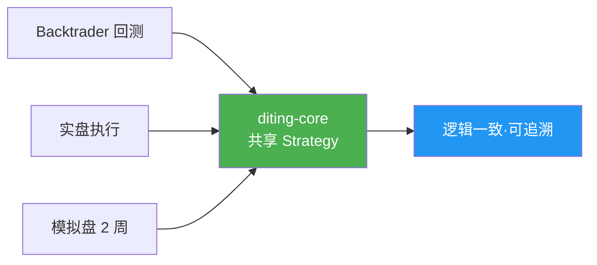

# L2 · 研产同构维度

> [!NOTE] **[TRACEBACK] 战略维度锚点**
> - **顶层概念**: [一句话定义与核心价值](../../01_顶层概念/01_一句话定义与核心价值.md)
> - **顶层概念**: [战略目标与ROI](../../01_顶层概念/02_战略目标与ROI.md)
> - **本文档**: L2 层级，定义研产同构维度

## 维度定义

**研产同构维度**：量化交易最大的痛点是“回测过拟合”和“实盘逻辑不一致”。通过共享内核策略与仿真沙箱，确保回测代码与实盘代码使用同一套逻辑，避免“回测 30% 复利，实盘 -10% 亏损”的悲剧。

## 关键目标

1. **逻辑一致性**：回测与实盘使用同一套 Strategy 类和 Signal 函数，严禁两套逻辑
2. **仿真验证**：上线前必须在模拟盘运行至少 2 周，验证事件驱动逻辑
3. **可追溯性**：回测结果与实盘结果可对比，定位差异原因

## 覆盖范围

### 研产同构逻辑



### 5.1 共享内核策略

| 组件 | 用途 | 机制 |
|------|------|------|
| **Shared Library Strategy** | 回测与实盘共享代码 | Repo-I (diting-core) 设计为可安装的 Python 包 |

**战略要求**：
- Repo-I (diting-core) 必须被设计为一个可安装的 Python 包
- 无论是 Backtrader 回测脚本，还是实盘执行脚本，必须调用同一个 `diting-core` 中的 Strategy 类和 Signal 函数
- **严禁**在 Jupyter 里写一套逻辑，然后手动翻译成实盘代码

**实现方式**：
```python
# 回测脚本（Jupyter）
from diting_core.strategies import TrendStrategy
from backtrader import Cerebro

cerebro = Cerebro()
cerebro.addstrategy(TrendStrategy)  # 使用 diting-core 的 Strategy
cerebro.run()

# 实盘脚本（Python Class）
from diting_core.strategies import TrendStrategy
from diting_core.execution import ExecutionEngine

strategy = TrendStrategy()  # 同一个 Strategy 类
engine = ExecutionEngine(strategy)
engine.run()
```

### 5.2 仿真沙箱

| 组件 | 用途 | 机制 |
|------|------|------|
| **The Matrix (模拟交易所)** | 模拟盘验证 | Redis Streams 回放历史 Tick 数据 |

**战略要求**：
- 在上线实盘前，策略必须在 "Paper Trading Mode"（模拟盘）运行至少 2 周
- 利用 Redis Streams 回放历史 Tick 数据，模拟真实的市场推送频率
- 验证系统的事件驱动（Event-Driven）逻辑是否健壮

**验证内容**：
- 信号生成逻辑：模拟盘与回测结果一致
- 事件驱动逻辑：Redis Streams 事件处理无遗漏、无重复
- 风控逻辑：模拟盘的风控拦截与回测一致
- 性能表现：模拟盘的延迟与吞吐满足实盘要求

## 约束条件

1. **代码一致性**：回测与实盘必须使用同一套代码，严禁手动翻译
2. **仿真时长**：模拟盘必须运行至少 2 周，验证事件驱动逻辑
3. **可追溯性**：回测结果与模拟盘结果可对比，定位差异原因

## 与不可能三角的关系

- **认知边界 (Certainty)**：研产同构确保回测的高胜率能延续到实盘，避免逻辑不一致导致的胜率下降
- **复利增长 (Growth)**：回测的 30% 复利目标必须能在实盘复现，研产同构是前提
- **生存底线 (Survival)**：模拟盘验证风控逻辑，确保实盘回撤 < 12% 的目标可达成

## 下一步

→ 主责 L3 规约：[05_接口抽象层规约](../../03_原子目标与规约/05_接口抽象层规约.md)；辅规约：02_三位一体、03_架构设计共识、07_数据版本控制、09_核心模块。完整对应见 [L2-L3-DNA 映射表](../../06_追溯与审计/00_L2_L3_DNA_映射.md)。
