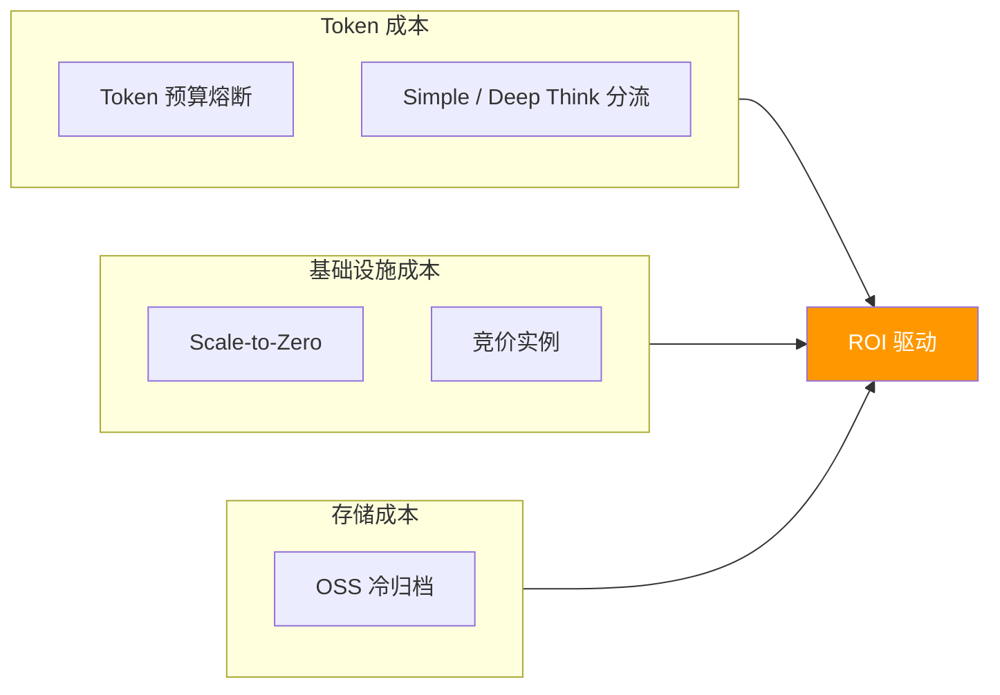

# L2 · 成本治理维度

> [!NOTE] **[TRACEBACK] 战略维度锚点**
> - **顶层概念**: [一句话定义与核心价值](../../01_顶层概念/01_一句话定义与核心价值.md)
> - **顶层概念**: [战略目标与ROI](../../01_顶层概念/02_战略目标与ROI.md)
> - **本文档**: L2 层级，定义成本治理维度

## 维度定义

**成本治理维度**：DeepSeek-R1 的推理是昂贵的（Token（词元）消耗大），阿里云的带宽和存储也是按量计费的。如果系统为了赚 100 块钱，消耗了 80 块钱的算力和 API 费，那这个架构在商业上是失败的。通过 Token 预算熔断与竞价实例套利，确保 ROI（投资回报率）驱动的成本控制。

## 关键目标

1. **Token 成本控制**：ROI 驱动的思考，低胜率场景使用 Simple Mode，关键时刻开启 Deep Think Mode
2. **基础设施成本优化**：Scale-to-Zero 策略，任务结束后缩容到 0，绝不为闲置时间付费
3. **存储成本优化**：历史数据使用 OSS（对象存储服务）冷归档，价格是标准存储的 1/10

## 覆盖范围

### 成本治理逻辑



### 6.1 Token 预算熔断

| 机制 | 用途 | 规则 |
|------|------|------|
| **Token Budgeting** | LLM 推理成本控制 | ROI 驱动的思考，低胜率场景跳过或使用 Simple Mode |

**战略要求**：
- 在 Repo-G 定义 `Max_Token_Per_Decision`
- 对于低胜率的“垃圾时间”，强制 DeepSeek 使用 Simple Mode（不进行长思维链推理）或直接跳过
- 只在关键时刻（高胜率信号、关键决策点）开启 Deep Think Mode

**决策逻辑**：
```python
if signal.technical_score < 60:  # 低胜率信号
    # 跳过 LLM 推理，直接否决
    return None
elif signal.technical_score >= 80:  # 高胜率信号
    # 开启 Deep Think Mode，使用完整 CoT 推理
    return deepseek_r1.deep_think(signal)
else:  # 中等胜率
    # 使用 Simple Mode，快速推理
    return deepseek_r1.simple_mode(signal)
```

**成本监控**：
- LangFuse 记录每次 Token 消耗
- 计算 Token 成本与交易收益的 ROI
- 如果 ROI < 阈值，触发熔断机制

### 6.2 竞价实例套利

| 机制 | 用途 | 规则 |
|------|------|------|
| **Scale-to-Zero** | 基础设施成本优化 | 任务结束后，K3s 集群缩容到 0 |

**战略要求**：
- **零库存策略**：任务结束后，K3s 集群必须缩容到 0（Scale-to-Zero）
- 绝不为闲置时间付费
- 使用 Aliyun Spot ECS（竞价实例），成本是标准实例的 1/3-1/5

**实现方式**：
- K3s 使用 HPA（Horizontal Pod Autoscaler）或 KEDA（Kubernetes Event-driven Autoscaling）
- 任务队列为空时，自动缩容到 0
- 新任务到达时，自动扩容（冷启动时间需 < RTO（恢复时间目标）5 分钟）

### 6.3 存储成本优化

| 机制 | 用途 | 规则 |
|------|------|------|
| **OSS 冷归档** | 历史数据低成本存储 | 全量回测数据使用冷归档，价格是标准存储的 1/10 |

**战略要求**：
- L3 冷数据（历史回测数据、决策快照）使用 OSS 冷归档存储
- 配合 DuckDB 直接查询 OSS 数据，无需全量加载到内存
- 热数据（L1 TimescaleDB）使用 ESSD PL1，保证性能

**成本对比**：
- OSS 标准存储：¥0.12/GB/月
- OSS 冷归档：¥0.012/GB/月（标准存储的 1/10）
- ESSD PL1：¥0.35/GB/月（高性能，仅用于热数据）

## 约束条件

1. **ROI 驱动**：所有成本投入必须能带来对应的收益，Token 成本需与交易收益对比
2. **性能不降级**：成本优化不能影响核心性能指标（全市场扫描 < 30 分钟，RTO < 5 分钟）
3. **可监控**：所有成本（Token、算力、存储）需可监控、可审计

## 与不可能三角的关系

- **认知边界 (Certainty)**：Token 预算熔断确保只在关键时刻使用 Deep Think Mode，避免无效推理成本
- **复利增长 (Growth)**：成本控制确保 30% 年化复利是“净收益”，而非“毛收益 - 成本 = 负收益”
- **生存底线 (Survival)**：成本失控会导致系统无法持续运行，这是商业生存的底线

## 下一步

→ 主责 L3 规约：[10_运营治理与灾备规约](../../03_原子目标与规约/10_运营治理与灾备规约.md)；辅规约：06_动态配置、09_核心模块。成本相关 DNA 见 `global_const.cost_governance`。完整对应见 [L2-L3-DNA 映射表](../../06_追溯与审计/00_L2_L3_DNA_映射.md)。
