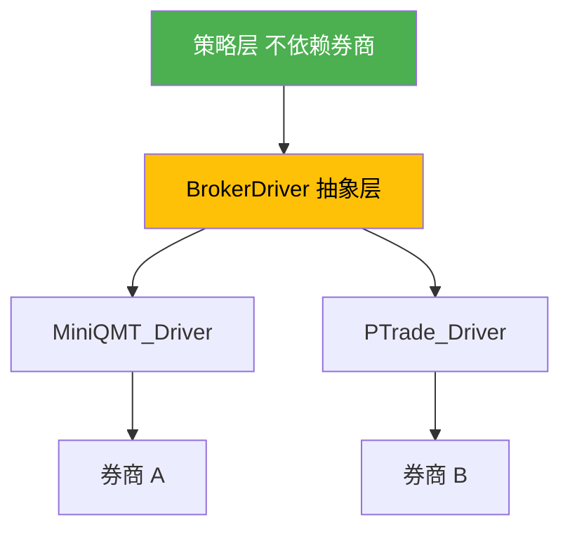

# L2 · 经纪商解耦与冗余维度

> [!NOTE] **[TRACEBACK] 战略维度锚点**
> - **顶层概念**: [一句话定义与核心价值](../../01_顶层概念/01_一句话定义与核心价值.md)
> - **顶层概念**: [战略目标与ROI](../../01_顶层概念/02_战略目标与ROI.md)
> - **本文档**: L2 层级，定义经纪商解耦与冗余维度

## 维度定义

**经纪商解耦与冗余维度**：单点故障（SPOF）不仅在服务器，更在券商。如果代码深度绑定某一家券商，就是把脖子架在别人的刀上。通过交易接口抽象层（TAL）与多账户准备，实现经纪商解耦与冗余，避免因券商故障、接口升级、费率提高导致的系统不可用。

## 关键目标

1. **经纪商解耦**：核心策略代码不依赖具体券商接口，通过 TAL 抽象层实现解耦
2. **多账户准备**：架构上支持 Account_ID 路由，为未来分仓到不同券商预留接口
3. **故障冗余**：支持多券商切换，避免单点故障

## 覆盖范围

### 经纪商解耦逻辑



### 7.1 交易接口抽象层（Trade Abstraction Layer, TAL）

| 组件 | 用途 | 机制 |
|------|------|------|
| **BrokerDriver 接口** | 统一交易接口 | 标准接口（buy(), sell(), get_position()） |
| **MiniQMT_Driver** | MiniQMT 适配器 | 实现 BrokerDriver 接口，封装 MiniQMT 原生方法 |
| **PTrade_Driver** | PTrade 适配器 | 实现 BrokerDriver 接口，封装 PTrade 原生方法 |

**战略要求**：
- Repo-I (diting-core) **严禁**直接调用 `xtquant` 原生方法
- 必须封装一个标准的 `BrokerDriver` 接口（如 `buy()`, `sell()`, `get_position()`）
- 写一个 `MiniQMT_Driver` 适配器。如果未来需要切换到 PTrade 或其他券商接口，只需新写一个 Driver，核心策略代码一行不用改

**接口定义**：
```python
from abc import ABC, abstractmethod

class BrokerDriver(ABC):
    @abstractmethod
    def buy(self, symbol: str, quantity: int, price: float) -> str:
        """买入，返回订单ID"""
        pass
    
    @abstractmethod
    def sell(self, symbol: str, quantity: int, price: float) -> str:
        """卖出，返回订单ID"""
        pass
    
    @abstractmethod
    def get_position(self, symbol: str) -> Position:
        """获取持仓"""
        pass
    
    @abstractmethod
    def cancel_order(self, order_id: str) -> bool:
        """撤单"""
        pass

class MiniQMTDriver(BrokerDriver):
    """MiniQMT 适配器"""
    def buy(self, symbol: str, quantity: int, price: float) -> str:
        # 封装 MiniQMT 原生方法
        return xtquant.order_stock(...)

class PTradeDriver(BrokerDriver):
    """PTrade 适配器"""
    def buy(self, symbol: str, quantity: int, price: float) -> str:
        # 封装 PTrade 原生方法
        return ptrade_api.order(...)
```

### 7.2 多账户准备

| 机制 | 用途 | 规则 |
|------|------|------|
| **Account_ID 路由** | 多账户支持 | 架构上支持 Account_ID 路由，为未来分仓预留接口 |

**战略要求**：
- 架构上支持 `Account_ID` 路由
- 目的：为未来资金扩大后，分仓到不同券商（规避单一席位风控）预留“接口槽位”

**实现方式**：
```python
class ExecutionEngine:
    def __init__(self, account_id: str):
        self.account_id = account_id
        self.driver = self._get_driver_for_account(account_id)
    
    def _get_driver_for_account(self, account_id: str) -> BrokerDriver:
        # 根据 Account_ID 选择对应的 Driver
        config = get_account_config(account_id)
        if config.broker == "miniqmt":
            return MiniQMTDriver(config.credentials)
        elif config.broker == "ptrade":
            return PTradeDriver(config.credentials)
        else:
            raise ValueError(f"Unknown broker: {config.broker}")
```

### 7.3 故障场景与应对

| 故障场景 | 风险 | 应对策略 |
|---------|------|---------|
| **MiniQMT 接口升级** | 接口不兼容，系统无法下单 | TAL 抽象层隔离，只需更新 MiniQMT_Driver，核心代码不变 |
| **券商服务器宕机** | 无法交易，资金被锁定 | 多账户准备，切换到备用券商 |
| **券商提高费率** | 交易成本上升，影响复利 | 多账户准备，切换到费率更低的券商 |

## 约束条件

1. **接口抽象**：核心策略代码严禁直接调用券商原生接口，必须通过 TAL
2. **多账户支持**：架构上必须支持 Account_ID 路由，为未来扩展预留
3. **故障冗余**：至少准备 2 个券商接口适配器，支持快速切换

## 与不可能三角的关系

- **认知边界 (Certainty)**：TAL 抽象层确保交易逻辑的一致性，不因券商接口差异导致逻辑偏差
- **复利增长 (Growth)**：多账户准备支持资金扩大后的分仓策略，提高资金利用率
- **生存底线 (Survival)**：经纪商解耦避免单点故障，确保系统在券商故障时仍能运行

## 下一步

→ 主责 L3 规约：[05_接口抽象层规约](../../03_原子目标与规约/_共享规约/05_接口抽象层规约.md)；辅规约：09_核心模块、10_运营治理与灾备。完整对应见 [L2-L3-DNA 映射表](../../06_追溯与审计/00_L2_L3_DNA_映射.md)。
