# L2 · 通俗易懂的逻辑链路图

> [!NOTE] **[TRACEBACK] 战略维度锚点**
> - **顶层概念**: [一句话定义与核心价值](../../01_顶层概念/01_一句话定义与核心价值.md)
> - **本文档**: L2 层级，用通俗易懂的图表解释各战略维度的逻辑

**一致性约定**：本图与 02～08、开发与交付维度及 [03_原子目标与规约](../../03_原子目标与规约/) 一致；若与 L3 规约冲突，**以 L3 为准**。当 L2 或 L3 发生重大变更时，须同步更新本图（责任：当次变更执行方或文档负责人）。

## 零、双轨制总览：A 轨与 B 轨如何分流

谛听采用**双轨制（Barbell）**：**A 轨（现金奶牛，约 80% 资金）**走不可能三角与 2% 止损/现金拖累；**B 轨（长期捕手，约 20% 资金）**由 VC-Agent/信仰专家驱动，经判官 **TimeHorizon = LONG_TERM** 分流后豁免 2% 与现金拖累，仅施加逻辑证伪与大周期反转。详见 [01_一句话定义与核心价值](../../01_顶层概念/01_一句话定义与核心价值.md)、[03_双轨制与VC-Agent](../../01_顶层概念/03_双轨制与VC-Agent.md)。

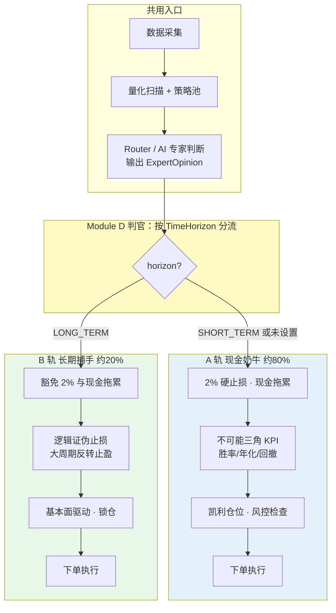

**通俗解释**：所有信号先经数据采集、量化扫描和 AI 专家（Router）判断；专家输出里带有一个「时间视野」标识（`TimeHorizon`）。**判官（Module D）**根据这个标识分流：短期视野走 A 轨（严止损、现金拖累、不可能三角），长期视野走 B 轨（不砍 2%、不监控空仓，只做逻辑证伪和大周期反转）。这样既能拿住时代牛股（B 轨），又不影响短线现金奶牛（A 轨）的纪律。

---

## 一、整体业务流程：从市场数据到交易执行

### 1.1 完整业务流程图（A 轨主流程）

下图为主流程，对应**现金奶牛轨（A 轨）**：2% 硬止损、现金拖累、不可能三角均适用。**B 轨**在判官处根据 `TimeHorizon = LONG_TERM` 分流，不经过下方「第五步」中的 2% 与盈亏比硬约束，见 [03_双轨制与VC-Agent](../../01_顶层概念/03_双轨制与VC-Agent.md)。

```mermaid
flowchart LR
    subgraph 第一步[第一步：数据采集]
        A[市场行情数据<br/>股票价格、成交量等]
    end
    
    subgraph 第二步[第二步：量化扫描]
        B[VectorBT 全市场扫描<br/>找出 Top 50 候选股票]
        C[三大策略池<br/>Trend/Reversion/Breakout]
    end
    
    subgraph 第三步[第三步：AI 专家判断]
        D[DeepSeek-R1 思考<br/>这个信号靠谱吗？]
        E[查询知识库<br/>Agri-KG/Tech-KG/Macro-KG]
        F[生成推理报告<br/>reasoning_summary]
    end
    
    subgraph 第四步[第四步：计算仓位]
        G[动态凯利公式<br/>应该买多少？]
        H[现金拖累监控<br/>空仓太久了吗？]
    end
    
    subgraph 第五步[第五步：风控检查（A 轨）]
        I[单笔风险 < 2%？<br/>盈亏比 > 1.5？]
    end
    
    subgraph 第六步[第六步：下单执行]
        J[通过 MiniQMT/PTrade<br/>买入/卖出]
    end
    
    A --> B
    B --> C
    C --> D
    D --> E
    E --> F
    F --> G
    G --> H
    H --> I
    I -->|通过| J
    I -->|拒绝| K[记录原因，不下单]
    
    style 第一步 fill:#e1f5ff
    style 第二步 fill:#fff4e1
    style 第三步 fill:#e8f5e9
    style 第四步 fill:#f3e5f5
    style 第五步 fill:#ffebee
    style 第六步 fill:#e0f2f1
```

**通俗解释**：
1. **数据采集**（[11_ 规约](../../03_原子目标与规约/_共享规约/11_数据采集与输入层规约.md)、[L4 实践](../../04_阶段规划与实践/Stage2_数据采集与存储/README.md)）：就像看股票行情软件，收集所有股票的价格、成交量等信息
2. **量化扫描**：用数学公式（技术指标）快速扫描全市场，找出 50 个最有潜力的股票
3. **AI 专家判断**：让 AI（DeepSeek-R1）像专业分析师一样思考：这个信号是真的机会还是假突破？AI 会查知识库（农业周期、产业链、宏观政策），然后给出推理报告
4. **计算仓位**：用凯利公式算应该买多少（不能全仓，也不能太少），同时检查是不是空仓太久了（空仓太久会降低复利速度）
5. **风控检查**：最后一道防线，检查单笔风险是否太大、盈亏比是否合理
6. **下单执行**：全部通过后，通过券商接口下单

---

## 二、核心公式的执行流程

### 2.1 核心公式：Alpha = (量化信号 ∩ AI判断) × 仓位

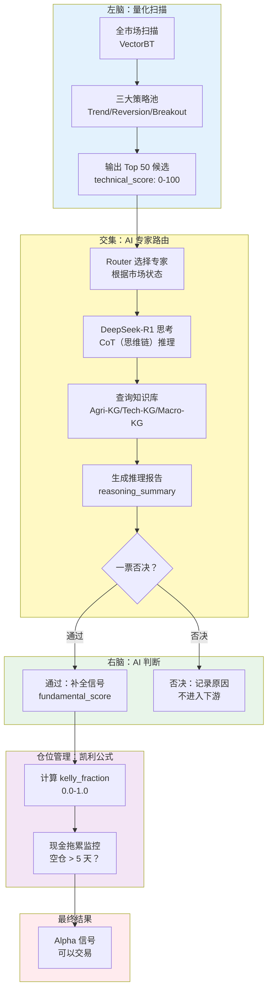

**通俗解释**：
- **左脑（量化）**：用数学公式快速找出 50 个候选股票，给每个打分（0-100分）
- **交集（AI路由）**：AI 像专家一样判断，这个信号是真的还是假的？查知识库，给出推理报告
- **右脑（AI判断）**：如果 AI 觉得不靠谱（假突破、高风险），直接否决；如果通过，补全 AI 逻辑得分
- **仓位管理**：用凯利公式算应该买多少，同时检查是不是空仓太久了
- **最终结果**：全部通过后，生成 Alpha 信号，可以交易

---

## 三、数据如何在三层存储中流转

### 3.1 数据三层架构：热数据 → 知识库 → 冷归档

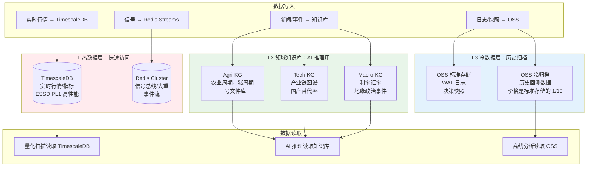

**通俗解释**：
- **L1 热数据**：就像电脑的内存，快速读写。TimescaleDB 存实时行情，Redis 存信号队列
- **L2 知识库**：就像 AI 的大脑知识库，存农业周期、产业链、宏观政策等信息，AI 推理时查这些
- **L3 冷归档**：就像仓库，存历史数据。OSS（对象存储服务）标准存储存重要 WAL（预写日志）日志，冷归档存历史回测数据（便宜）

---

## 四、研产同构：回测与实盘用同一套代码

### 4.1 为什么需要研产同构？

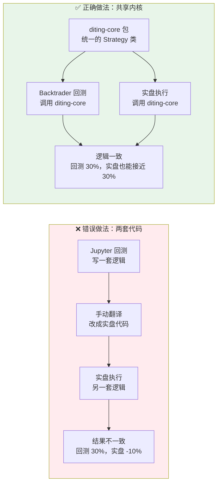

**通俗解释**：
- **错误做法**：在 Jupyter 里写回测代码，然后手动翻译成实盘代码。结果两套逻辑不一样，回测赚 30%，实盘亏 10%
- **正确做法**：写一个 `diting-core` Python 包，回测和实盘都调用同一个 Strategy 类。这样逻辑一致，回测的结果才能延续到实盘

### 4.2 仿真沙箱：模拟盘验证

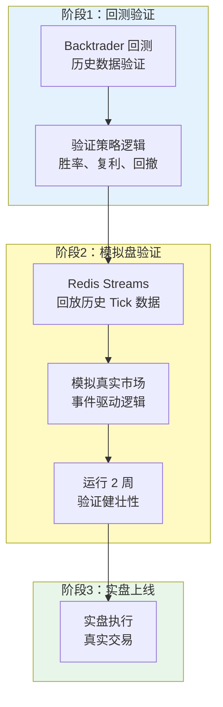

**通俗解释**：
1. **回测**：用历史数据验证策略，看胜率、复利、回撤是否达标
2. **模拟盘**：用 Redis 回放历史数据，模拟真实市场，运行 2 周验证系统是否健壮
3. **实盘**：全部验证通过后，才上线实盘交易

---

## 五、安全治理：密钥管理流程

### 5.1 密钥如何安全存储和使用？

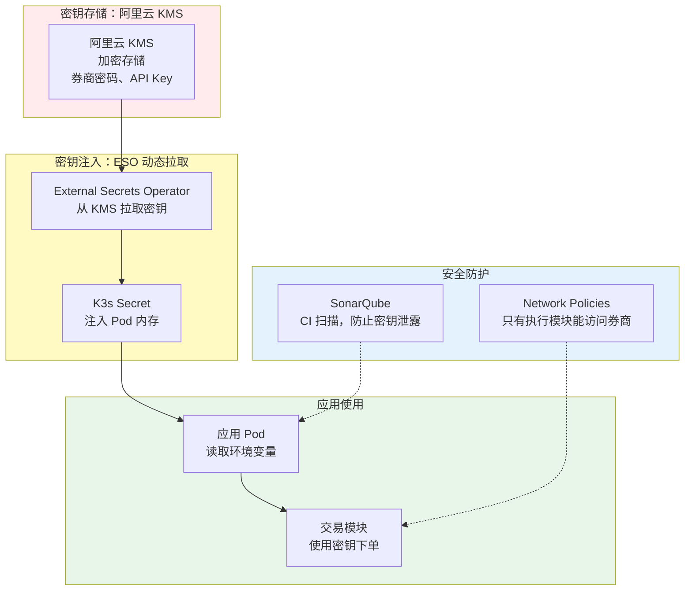

**通俗解释**：
- **存储**：所有密钥（券商密码、API Key）存在阿里云 KMS（密钥管理服务），加密存储
- **注入**：ESO（外部密钥操作符）从 KMS 拉取密钥，注入到 Pod 的内存中（不存文件）
- **使用**：应用读取环境变量使用密钥
- **防护**：Network Policies 确保只有执行模块能访问券商；SonarQube 扫描代码，防止密钥泄露

---

## 六、成本治理：如何控制成本？

### 6.1 Token（词元）预算熔断：什么时候用 AI，什么时候不用？

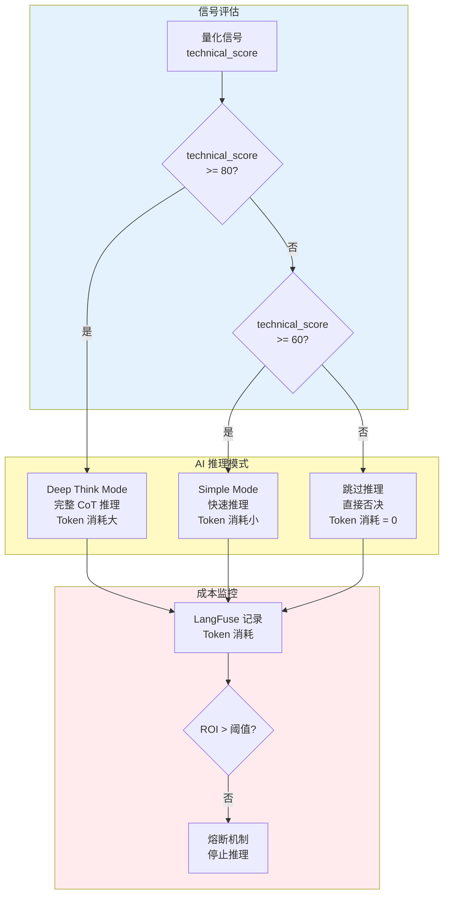

**通俗解释**：
- **高分信号（≥80分）**：用 Deep Think Mode，完整推理，Token 消耗大但值得
- **中等信号（60-80分）**：用 Simple Mode，快速推理，Token 消耗小
- **低分信号（<60分）**：跳过推理，直接否决，不浪费 Token
- **成本监控**：如果 ROI（投资回报率）太低（赚的钱不够付 Token 费），触发熔断，停止推理

### 6.2 Scale-to-Zero：任务结束就缩容

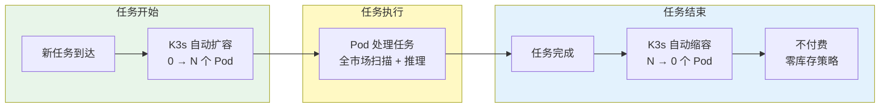

**通俗解释**：
- **任务开始**：有新任务时，K3s 自动扩容（从 0 个 Pod 扩容到 N 个）
- **任务执行**：Pod 处理任务（全市场扫描、AI 推理）
- **任务结束**：任务完成后，K3s 自动缩容到 0，不付费（零库存策略）

---

## 七、经纪商解耦：如何避免单点故障？

### 7.1 TAL（交易接口抽象层）抽象层：核心代码不依赖具体券商

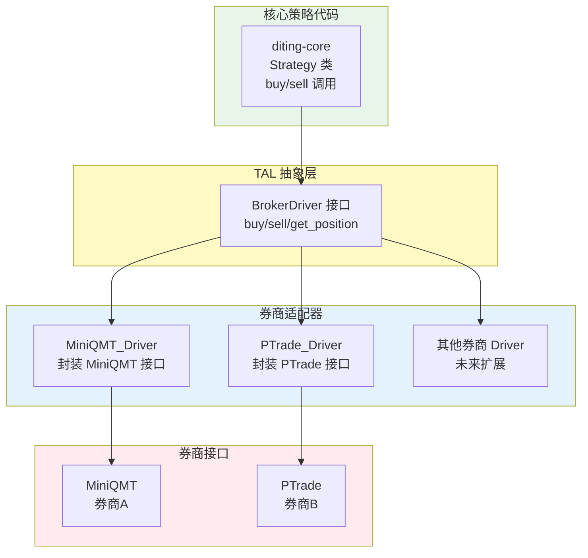

**通俗解释**：
- **核心代码**：策略代码只调用 `buy()`、`sell()` 等标准接口，不关心具体券商
- **抽象层**：定义标准接口（BrokerDriver）
- **适配器**：每个券商写一个适配器（MiniQMT_Driver、PTrade_Driver），封装券商的具体接口
- **好处**：如果券商A挂了，只需切换到券商B的适配器，核心代码一行不用改

---

## 八、各战略维度如何协作？

### 8.1 维度协作关系图

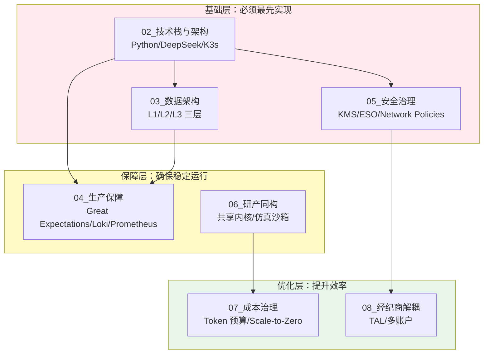

**通俗解释**：
- **基础层**：技术栈、数据架构、安全治理是基础，必须先实现
- **保障层**：生产保障（监控、日志）和研产同构（确保逻辑一致）确保系统稳定运行
- **优化层**：成本治理和经纪商解耦是优化，提升效率和可靠性

---

## 九、不可能三角如何通过各维度实现？（仅 A 轨）

### 9.1 不可能三角的实现路径（仅 A 轨）

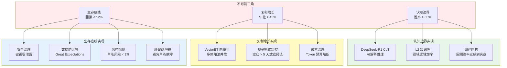

**通俗解释**：
- **认知边界（胜率 ≥ 85%）**：通过 DeepSeek-R1 的可解释推理、知识库的领域逻辑支撑、研产同构确保回测胜率延续到实盘
- **复利增长（年化 ≥ 45%）**：通过 VectorBT 向量化扫描多策略池并发、现金拖累监控提高资金利用率、成本治理确保 ROI 为正
- **生存底线（回撤 < 12%）**：通过安全治理防止密钥泄露、数据防火墙拦截异常数据、风控规则硬编码、经纪商解耦避免单点故障

---

## 总结

产品设计轴线（含 01 总纲与 02～09）与开发与交付轴线共同支撑不可能三角的实现：

1. **技术栈与架构**：提供基础能力（量化扫描、AI 推理、容器编排）
2. **数据架构**：提供数据支撑（热数据、知识库、冷归档）
3. **生产保障**：确保系统稳定（数据质量、可观测性、LLMOps）
4. **安全治理**：防止资产归零（密钥管理、网络隔离、代码审计）
5. **研产同构**：确保逻辑一致（回测与实盘用同一套代码）
6. **成本治理**：确保商业可行（Token 预算、Scale-to-Zero、存储优化）
7. **经纪商解耦**：避免单点故障（TAL 抽象层、多账户准备）

所有维度最终都服务于一个目标：**在胜率 ≥ 85%、年化复利 ≥ 45%、回撤 < 12% 的约束下，稳定运行并持续盈利**。
