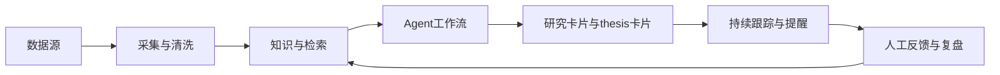
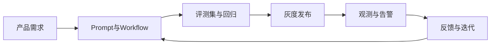

# L2 · 主业务与工程链路图

> [!NOTE] **[TRACEBACK] 战略维度锚点**
> - **顶层概念**: [A股分析追踪平台目标与边界](../../01_顶层概念/04_A股分析追踪平台目标与边界.md)

## 主业务链路

## 工程链路

## 链路能力映射

- `知识与检索`、`Agent 工作流`：研究编排能力
- `灰度发布`、`回归`：评测与发布能力
- `观测与告警`、`推理底座`：基础设施治理能力
- `Runtime / 沙箱 / 长任务`：运行时与隔离能力
