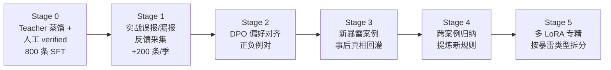
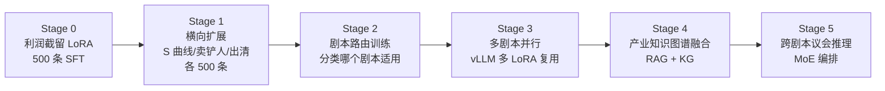
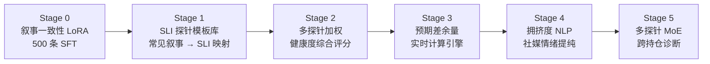
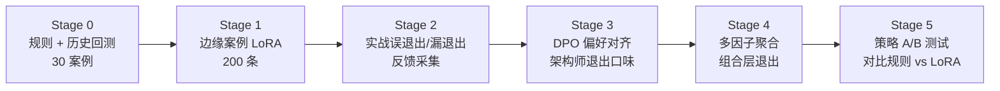
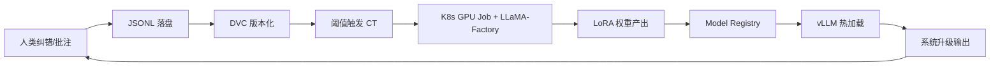
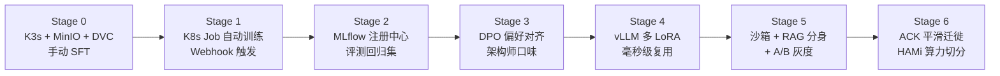
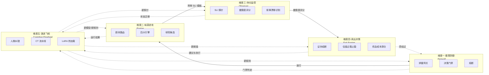
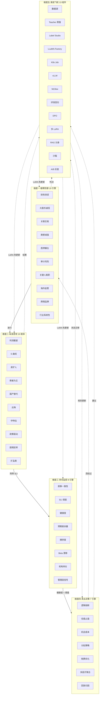

# L2 · 产品生命周期设计维度（5 维度完整版）

> [!NOTE] **[TRACEBACK] 战略维度锚点**
> - **顶层概念**: [项目定义与核心价值](../../01_顶层概念/01_项目定义与核心价值.md)
> - **顶层概念**: [双目标系统与五层架构](../../01_顶层概念/03_双目标系统与五层架构.md)
> - **顶层概念**: [A股分析追踪平台目标与边界](../../01_顶层概念/04_A股分析追踪平台目标与边界.md)
> - **同层引用**: [00_双目标与战略维度关系](../00_双目标与战略维度关系.md) §四大战略维度
> - **同层引用**: [01_产品范围与优先级](./01_产品范围与优先级.md) §产品模型定义矩阵
> - **L3 对应**: [四大模块抽象总纲](../../03_原子目标与规约/00_四大模块抽象总纲.md)

## 一、为什么需要"5 个产品设计维度"

L2 已经定义了 **4 个战略主轴**（与 L3 四大模块 1:1 对齐）：极寒防御、纵深进攻、状态机监控、超级个体进化。这 4 个主轴解决的是**架构层面的纵向归属**——任何能力都必须挂到其中一条主轴上，避免漂移。

但当从**产品视角**回到"投资全生命周期"视角时，L2 需要一个**更细颗粒度的产品设计视图**。原因：

1. **状态机监控主轴在产品语义上覆盖了两个差异极大的子能力**：
   - **持仓监控（Observer）**：被动观察、SLI 探针、健康度评分、叙事漂移识别
   - **卖出决策（Exit Engine）**：主动建议、三重退出矩阵（证伪熔断/估值过载/机会成本）
   - 二者触发条件、产物形态、用户交互模型完全不同，混在一个主轴里会让 P0/P1 优先级失真。
2. **产品迭代节奏需要按生命周期推进**，不能只按主轴并行铺开。投资生命周期天然分为 5 段：买前防御 → 买入进攻 → 持有监控 → 退出决策 → 系统进化。

**结论**：产品设计层引入 **5 维度视图**作为 4 主轴的"产品视角细化"，与 4 主轴形成 **5↔4 的映射关系**（不是替代，是细化）。架构层面 L3 仍是 4 大模块，不破坏 L2↔L3 的 1:1 对齐。

## 二、5 维度 ↔ 4 主轴 / L3 模块映射表

| 产品设计维度 | L2 战略主轴 | L3 模块（英文代号） | 在 L3 内的子能力域 |
|---|---|---|---|
| **维度一：极寒防御**（Firewall） | 极寒防御 | 极寒防御（`cryo_guard`） | 全模块 |
| **维度二：纵深进攻**（Engine） | 纵深进攻 | 纵深进攻（`deep_strike`） | 全模块 |
| **维度三：持仓监控**（Observer） | 状态机监控 | 状态机监控（`state_watch`） | `state_machine_registry` + `probe_scheduler` + `transition_engine` 子域（被动观察、健康度评分） |
| **维度四:卖出决策**（Exit Engine） | 状态机监控 | 状态机监控（`state_watch`） | `rebalance_advisor` + `invalidation_auditor` + `notification_dispatcher` 子域（主动建议、退出/调仓） |
| **维度五：演进飞轮**（Cognitive Flywheel） | 超级个体进化 | 超级个体进化（`super_evo`） | 全模块（横切：贯穿其他四个维度的反馈反哺） |

> 维度三、四在 L3 落地时**共属同一模块** `state_watch`，但作为两个**产品子能力域**独立设计、独立验收、独立排优先级。这种"L2 产品视角拆 5、L3 工程实现合 1"的安排，既保留了产品语义清晰度，又不增加 L3 模块数。

## 三、五个产品设计维度详细规约

### 维度一：极寒防御战略 —— 绝对生存与全局安检防火墙（The Firewall）

> 定位：**L1 层 · 全局安检网关**。系统的最高优先级、一票否决层。

**战略目标**：彻底根绝本金的永久性损失（避雷退市、财务造假、管理层跑路、商业逻辑伪命题）。在 A 股，能 100% 防住死局，就已战胜 90% 的投资者。

**核心使命**：充当无情的"安检网关"。所有标的进入"进攻路由层"之前，必须先通过 SFT（监督微调）后的排雷模型验尸。任何触发红线的标的，无论市面概念炒得多疯，**物理切断交易路径**，无谈判余地。

**关键能力**：

- **财务造假测谎**：识别现金流造假、存贷双高、研发资本化突变、应收/存货周转异动等典型粉饰手法。
- **高管诚信验尸**：用 RAG 调取 CEO 过去 5 年公开发言，比对实际资本开支（CAPEX）流向，识别"言行不一"。
- **关联交易/明股实债识别**：通过表外结构与关联方网络穿透，识别隐藏负债。
- **商业逻辑伪命题识别**：识别管理层用新概念（互联网+ → 元宇宙 → AI）粉饰同一笔去向不明的研发资金。

**决策机制**：一票否决制。一旦命中防御红线，系统直接锁死该标的的"可买入状态"，并写入永久黑名单，需要架构师手动覆盖才能解除。

**承接 L3 子模块**：`risk_event_bus` / `decision_gate` / `circuit_breaker` / `input_sanitizer` / `audit_log_service`

#### 维度一·A. AI 引擎工作流扩展计划（10 引擎，三阶段）

| 阶段 | # | 引擎名称 | 主要工作目标 | 能力边界（不做） |
|---|---|---|---|---|
| **初期 P0** | 1 | **财务造假测谎引擎**（首引擎） | 识别存贷双高、现金流背离、研发资本化突变、应收/存货周转异动等 6 类典型粉饰手法；输出风险分（0–100）+ 触发线索 | 不做最终投资建议；不做估值判断 |
| **初期 P0** | 2 | **大股东诚信验尸引擎** | 用 RAG 调取 5 年公开发言/承诺，与实际 CAPEX 流向、并购/减持记录交叉比对；识别"言行不一"指数 | 不做主观品德评价；不涉及未公开信息 |
| **初期 P0** | 3 | **关联交易/明股实债识别引擎** | 通过股权穿透 + 财报附注，识别表外结构、关联方循环交易、隐藏负债 | 不做合规法律意见；仅给出风险标签 |
| **中期 P1** | 4 | **商誉减值预警引擎** | 监控跨界并购溢价、商誉/总资产比例、被并购方业绩对赌履约率；触发减值早期预警 | 不预测减值具体金额 |
| **中期 P1** | 5 | **质押爆仓与控制权稳定性引擎** | 监控大股东质押率、股价距平仓线、质权人纠纷诉讼 | 不做股价短期波动预测 |
| **中期 P1** | 6 | **审计师与监管问询风险引擎** | 监控审计师变更/出具非标意见、交易所问询函密度与回复质量 | 不替代专业审计判断 |
| **中期 P1** | 7 | **关键人离职/治理崩塌引擎** | 监控董秘/CFO/审计/独董短期内多人辞任、核心研发人员领英状态变化 | 不评判个人去留动机 |
| **后期 P2** | 8 | **海外监管风险引擎**（中概股专用） | 扫描 SEC/FDA/欧盟监管警告、被列入观察名单、ADR 退市风险 | 仅覆盖海外上市/海外业务标的 |
| **后期 P2** | 9 | **舆情与品牌信任崩盘引擎** | 监控雪球/小红书/微博的群体性差评、产品退坑率、维权群激增 | 不做情绪短线交易信号 |
| **后期 P2** | 10 | **行业系统性风险引擎** | 监控政策/监管/反垄断/双减式黑天鹅，对持仓行业敞口预警 | 不预测政策本身；只在政策出后判断行业冲击 |

#### 维度一·B. 引擎实现优先级与排序理由

按"风险防御重要性 × 数据获取成本 × 历史防住的死局数量"综合排序：

| 排序 | 引擎 | 排序理由 |
|---|---|---|
| 1 | **财务测谎** | 防住康得新（300 亿现金造假）、康美（300 亿货币资金虚增）、瑞幸（22 亿营收造假）等死局；A 股 90% 的雷都是财务雷 |
| 2 | **关联交易/明股实债** | 防住乐视网、暴风、华谊兄弟等一系列资金腾挪型暴雷；财报附注就能看出端倪 |
| 3 | **大股东诚信** | 防住反复爽约的 CEO 类暴雷；只需要 RAG + 历史公告比对，工程门槛低 |
| 4 | **商誉减值** | 防住 2018 年商誉减值潮（创业板大量爆雷），单季计提即可吞掉 N 年利润 |
| 5 | **质押爆仓** | 防住爆仓引发的踩踏（如 2018 年民营龙头股权被强平） |
| 6 | **审计师与问询** | 审计师变更是经典领先信号（康美案审计师签字律师都被罚） |
| 7 | **关键人离职** | 解决信号弱、噪声大问题；但作为多源交叉验证依据极有价值 |
| 8 | **海外监管** | 仅覆盖少数中概/出海标的，但一旦发生影响极大（瑞幸/滴滴） |
| 9 | **舆情与品牌信任** | 数据噪声较大，需较强的 NLP 提纯；适合在飞轮成熟后引入 |
| 10 | **行业系统性风险** | 政策本身不可预测，但事后冲击的快速识别仍有价值（教培双减、地产三道红线） |

#### 维度一·C. 首引擎（财务测谎）标注数据合成方案

> 目标：**90 天内**用 Teacher LLM 蒸馏 + 人工 verified，产出 **800–1000 条 Alpaca JSONL 高质量 SFT 数据**，炼出第一个可用 LoRA。

**Step 1 · 圈定 A 股"尸体库"（约 50 家暴雷标的）**：

| 暴雷类型 | 代表公司 | 暴雷年份 | 案发前可用语料 |
|---|---|---|---|
| 货币资金/存贷双高 | 康得新、康美药业 | 2019 / 2018 | 暴雷前 2 年的年报、半年报、问询函 |
| 营收/收入造假 | 瑞幸咖啡、康得新 | 2020 / 2019 | 暴雷前年报、券商研报 |
| 存货造假 | 獐子岛、辉山乳业 | 2018 / 2017 | 暴雷前 3 年存货周转数据 + 经营审计意见 |
| 关联交易腾挪 | 乐视网、暴风集团、贾跃亭系 | 2017–2019 | 关联方表、其他应收款附注 |
| 商誉爆雷 | 中文在线、坚瑞沃能 | 2018–2019 | 并购公告、商誉减值测试 |
| 大股东掏空 | 雏鹰农牧、华谊兄弟 | 2019 | 股权质押公告、其他应收款异常 |
| 实控人跑路 | 三七互娱（部分）、ST 大族 | 各年份 | 高管减持公告、董事会换届 |

**Step 2 · 抓取案发前 1–2 年原始语料**（约 100GB 文本）：
- 从巨潮资讯网/交易所网站下载 PDF 财报、公告、问询函（用 Go 并发爬虫）
- 用 PDF 解析（pypdf / PyMuPDF）切片为段落级文本
- 重点抓取：「管理层讨论与分析」「财务报表附注」「重大事项」「关联交易」「股权变动」章节

**Step 3 · 构造"教师级审讯 Prompt"**（核心萃取，调用 Claude 3.5 / GPT-4o）：

```
你现在是曾做空过瑞幸咖啡的浑水公司（Muddy Waters）首席调查员。
以下是【某 A 股公司暴雷前 1 年的财报节选】。已知该公司后来因【虚增货币资金 / 渠道压货 / 关联方掏空】暴雷。

请你以事后诸葛亮视角，从这段文本中揪出 3 个当时已经显露的财务异常蛛丝马迹，并给出严密的推导逻辑。
输出格式严格遵守 JSON：
{
  "risk_signals": [
    {"signal": "...", "evidence": "...原文证据片段...", "reasoning": "...推导链..."}
  ],
  "verdict": "high_risk | medium_risk | low_risk",
  "verdict_reasoning": "..."
}
```

**Step 4 · 格式化为 LLaMA-Factory Alpaca JSONL**：

```json
{
  "instruction": "请作为严格的财务审计员，分析以下财报文本是否存在潜在欺诈风险。",
  "input": "[抓取的康美药业暴雷前财报关于货币资金的描述...]",
  "output": "【高危预警】发现典型存贷双高特征。账面拥有 300 亿现金，但利息收入极低，同时仍在大量发行高息短融券。该货币资金存在被大股东挪用或凭空伪造的极大可能，建议物理熔断。"
}
```

**Step 5 · 人工 verified 校验**（用 Label Studio）：
- 架构师每天下班后扫一遍 Teacher 输出，标记 `verified / rejected / needs_revision`
- 拒绝率 >30% 时回头修 Prompt；通过率达标后批量入库
- 目标：**verified 率 ≥ 80%，最终入库 ≥ 800 条**

**Step 6 · 第一次微调（在单卡 A10/V100 上 15–30 分钟）**：
- 基座：Qwen-2-7B-Instruct（或 DeepSeek-V2-Lite）
- LoRA 配置：rank=16, alpha=32, target_modules=q_proj,k_proj,v_proj,o_proj
- 评测集：留出 100 条作为 holdout，目标 F1 ≥ 0.80

#### 维度一·D. 后续训练学习路径（多阶段进化）



| 阶段 | 关键动作 | 数据增量来源 | 训练方式 | 预期能力跃升 |
|---|---|---|---|---|
| Stage 0 | Teacher 蒸馏起步 | 50 家历史暴雷公司案发前财报 | LoRA SFT | 识别已知 6 类粉饰模式 |
| Stage 1 | 实战误报/漏报采集 | 当前实盘 / 复盘的人工纠错 | LoRA SFT 增量 | 减少误报，提升精确率 |
| Stage 2 | DPO 偏好对齐 | 由 Stage 1 的 verified vs rejected 构造 (chosen, rejected) 偏好对 | DPO | 学会架构师的"严苛口味" |
| Stage 3 | 新暴雷事后真相回灌 | 每季度新增 1–3 家新暴雷标的回填语料库 | LoRA SFT 增量 | 跟上市场新型造假手法 |
| Stage 4 | 跨案例归纳 | 用 Teacher LLM 在已 verified 数据上做"跨案例规律提炼" | RAG 知识库 + 规则模板 | 形成可显式查询的"规则字典" |
| Stage 5 | 按暴雷类型拆分多 LoRA | 财务造假 LoRA / 关联交易 LoRA / 商誉 LoRA 等 | 多 LoRA 训练 + vLLM 多路复用 | 单卡承载 N 个专精模型 |

#### 维度一·E. 数据依赖梯次表（前/中/后期数据采集清单）

| 阶段 | 数据类别 | 必要数据源 | 关键字段/采集要点 | 采集频率 | 是否结构化 |
|---|---|---|---|---|---|
| **前期** | 财报与公告 | 巨潮资讯网、交易所披露 | 年报/半年报/季报 PDF、临时公告、招股书 | 实时跟随披露 | 半结构化 |
| **前期** | 行情数据 | AkShare / Tushare / 通达信 | OHLCV、复权因子、ST 标记、停牌状态 | 日级 | 结构化 |
| **前期** | 财务字段 | AkShare / 同花顺 | 三大表关键字段（现金、应收、存货、CAPEX、研发等） | 季度 | 结构化 |
| **前期** | 监管问询 | 上交所/深交所问询函专栏 | 问询函原文、回函原文、问询时间 | 实时 | 半结构化 |
| **中期** | 股权与质押 | Wind / 东财 Choice | 大股东持股、质押率、解押记录、增减持公告 | 每周 | 结构化 |
| **中期** | 审计与中介 | 财报附注 + 公告 | 审计师变更、出具非标意见、会计政策变更 | 半年/年 | 文本 |
| **中期** | 关联方与并购 | 财报附注 + 重大事项公告 | 关联方清单、并购对手方、对赌业绩、商誉余额 | 季度 | 半结构化 |
| **中期** | 治理人事 | 公告 + 领英/猎聘 | 高管变动、董秘/CFO/独董辞任、核心研发离职 | 实时 | 半结构化 |
| **后期** | 海外监管 | SEC EDGAR / FDA / 欧盟官网 | 警告函、调查通报、ADR 退市预警 | 每周 | 文本 |
| **后期** | 舆情品牌 | 雪球 / 小红书 / 黑猫投诉 / 知乎 | 群体性差评帖、品牌话题量、维权群存在 | 每日 | 非结构化 |
| **后期** | 政策/行业 | 国务院/部委网站 + 央媒社论 | 行业政策原文、监管征求意见稿 | 实时 | 文本 |

> **采集顺序建议**：先把"前期"7 个数据源在 30 天内全部接入，足以支撑首引擎跑起来；中期数据源在 P1 阶段再扩展；后期数据源等飞轮成熟后引入。

---

### 维度二：纵深进攻战略 —— 产业链穿透与非结构化 Alpha 捕获（The Engine）

> 定位：**L2 层 · 产业剧本与基本面路由网格（Industry Playbook Mesh）**。系统的进攻火力中枢。

**战略目标**：超越单点公司财务视角，建立全景式产业图谱。在传统量化机构（看财报数字）和游资（看资金流向）的盲区中，挖掘 1–3 个月内即将兑现的非对称预期差，提前捕获**戴维斯双击**（盈利上修 + 估值倍数提升）。

**核心使命**：将宏观政策研报、海外 TikTok 流量变动、小红书退坑率、高管业绩会实录、海关数据、招聘网站、破产文书等**海量跨界非结构化文本**，实时转化为可计算的预期差评分，并通过路由网格匹配到对应的"剧本智能体（Playbook Agent）"。

**四大核心剧本引擎**（暂定，可扩展至 N 个）：

#### 引擎 1：产业生态定价权扫描仪（Ecological Pricing Power Scanner）
- **业务逻辑**：利润从不平均分配，永远向"定价权"环节集中。
- **AI 穿透动作**：当上游大宗商品降价或技术突破时，AI 不去买上游；而是通过产业链知识图谱（Knowledge Graph）瞬间推演出中下游哪个环节既能享受成本下降、又能对终端保持原价。
- **专业产出案例**：*"检测到碳酸锂价格暴跌，电池厂毛利率迎来修复但整车厂正掀起价格战。结论：利润将截留在中游核心电池组件环节。"*
- **实战参照**：2023 年赛轮轮胎、2018 年美的集团。

#### 引擎 2：S 曲线"主升浪"模型（S-Curve & Penetration Rate Monitor）
- **业务逻辑**：颠覆性新产品在 0–5% 阶段是炒概念（高风险），**5%–20% 是真金白银的主升浪**（最肥美），>40% 进入红海内卷。
- **AI 穿透动作**：全网聚合产品销量（如交强险上险量）、行业展会订单、专利突破进度、社媒发帖增速等微观高频数据，实时拟合 S 曲线。
- **专业产出案例**：*"新型储能赛道全球渗透率刚越过 4.8% 生死线，即将进入陡峭非线性增长，确立为核心做多方向。"*
- **实战参照**：2020–2021 年比亚迪、2010–2013 年立讯精密。

#### 引擎 3：卖铲人模型（Bottleneck Seller）
- **业务逻辑**：淘金热时不去猜哪个淘金客能挖到金，去买方圆百里唯一卖铲子的人。下游需求指数级爆发但上游扩产周期极长（1–2 年）时，掌握定价权的零部件商享受量价齐升。
- **AI 穿透动作**：解析海外四大云巨头（Meta/Google/MSFT/AWS）英文电话会议实录中 CAPEX 指引；交叉对比 BOM 表，定位全球缺口最大的核心零部件。
- **专业产出案例**：*"北美云厂商 CAPEX 超预期爆发，800G 光模块为产业链绝对瓶颈环节，国内龙头掌握全球 40% 产能。"*
- **实战参照**：2023 年中际旭创、2020–2021 年药明康德。

#### 引擎 4：剩者为王模型（Cyclical Capacity Clearing）
- **业务逻辑**：重资产强周期行业，价格跌破现金成本线时全行业亏损。小玩家被迫退出、产能被暴力摧毁；剩者在需求微幅回暖时迎来火山级爆发。
- **AI 穿透动作**：监控农业部能繁母猪存栏量、地方法院"破产文书网"、CAPEX 收缩、产能利用率等高频信号。
- **专业产出案例**：*"标的 Y 仍巨亏，但全行业 CAPEX 已连续 6 季度大幅收缩、中小玩家破产率达 30%，供需剪刀差已形成，左侧建仓击球区。"*
- **实战参照**：2018–2020 年牧原股份、2016 年陕西煤业。

**为什么必须是 AI 来做**：传统研究员要看透上述逻辑，需翻阅几百篇券商深度研报，且人脑难以并行追踪超过 3 个产业的动态数据。系统本质是用 RAG + 知识图谱，把 A 股所有公司的上下游关系编织成一张"能量传导网"，毫秒内顺着这张网精确计算出利润最终流向哪家公司。

**承接 L3 子模块**：`content_comprehension_service` / `signal_feature_engine` / `research_council_service` / `agenda_orchestrator` / `expectation_gap_quantifier` / `candidate_registry`

#### 维度二·A. AI 引擎工作流扩展计划（10 剧本引擎，三阶段）

| 阶段 | # | 剧本引擎名称 | 主要工作目标 | 能力边界（不做） |
|---|---|---|---|---|
| **初期 P0** | 1 | **利润截留扫描仪**（首引擎） | 监控大宗商品/原材料价格 vs 终端售价的剪刀差，识别下游中价格未传导的"利润蓄水池"标的 | 不预测大宗商品本身价格走势 |
| **中期 P1** | 2 | **S 曲线渗透率监控仪** | 拟合新兴产品/技术的全生命周期渗透率，识别 5%–20% 的"主升浪击球区" | 不做品牌/单品营销建议 |
| **中期 P1** | 3 | **产业链瓶颈嗅探器（卖铲人）** | 解析下游 CAPEX 暴增信号 + 上游 BOM 表，定位全球产能缺口最大的核心零部件商 | 不做下游需求长期预测 |
| **中期 P1** | 4 | **产能出清追踪器（剩者为王）** | 监控强周期行业的破产率、CAPEX 收缩、产能利用率、库存周期反转点 | 不做单标的复苏时间预测 |
| **后期 P2** | 5 | **国产替代攻坚剧本** | 监控被卡脖子的领域（半导体设备、医疗器械、工业软件）的国产化率 + 招标份额 | 不评判技术指标领先度 |
| **后期 P2** | 6 | **出海全球化剧本** | 监控海关出口数据、海外社媒声量、亚马逊/沃尔玛份额、海外建厂进度 | 不做汇率单点预测 |
| **后期 P2** | 7 | **国央企估值重塑剧本（中特估）** | 监控分红率提升、回购、专业化整合公告、央企考核指标变化 | 不评判政策本身合理性 |
| **后期 P2** | 8 | **政策驱动主升浪剧本** | 监控国务院/部委政策原文，做主题性投资标的快速映射（双碳、人形机器人、低空经济） | 不预测政策落地时间表 |
| **后期 P3** | 9 | **困境反转个股剧本** | 监控管理层换人 + 新业务孵化 + 一季度业绩预喜，识别"基本面拐点初现"标的 | 不依赖单季报判断长期反转 |
| **后期 P3** | 10 | **细分龙头扩品类剧本** | 监控龙头公司的产品矩阵扩张（如巨子生物、爱美客式扩品） + 试销数据 | 不评估单品 SKU 销量 |

#### 维度二·B. 引擎实现优先级与排序理由

按"数据获取便利性 × 历史 Alpha 厚度 × 程序员上手难度"综合排序：

| 排序 | 剧本 | 排序理由 |
|---|---|---|
| 1 | **利润截留** | 大宗商品价格 + 终端售价均为公开高频结构化数据，最容易上手；2023 赛轮轮胎复盘案例完整且 Alpha 极厚 |
| 2 | **卖铲人** | 北美四大云厂商英文电话会议易解析（OpenAI Whisper 转写 + GPT 解析 CAPEX 指引），BOM 表可结构化；2023 中际旭创 6 倍涨幅案例新鲜可教学 |
| 3 | **S 曲线** | 数据源是高频微观数据（交强险上险量、电商销量、社媒发帖增速），易爬取；比亚迪/立讯精密多个跨年度案例可作训练集 |
| 4 | **剩者为王** | 农业部存栏量、地方法院破产文书、CAPEX 数据均为公开数据；周期反转 Alpha 最厚但持续时间长，验证周期慢 |
| 5 | **国产替代** | 招标数据需跨多平台爬取，结构化稍难；但是政策红利持续，长期 Alpha 稳定 |
| 6 | **出海** | 海关数据 + 海外社媒数据爬取门槛中等；近 3 年是 A 股 Alpha 主战场之一 |
| 7 | **中特估** | 政策导向强、节奏不可预测；适合作为辅助剧本而非主战场 |
| 8 | **政策驱动** | 数据极易获取（政策原文公开），但需较高的产业链知识图谱才能做映射 |
| 9 | **困境反转** | 数据多源、噪声大；需要积累足够的"反转成功 vs 反转失败"案例库才能训练 |
| 10 | **细分扩品类** | 试销数据获取门槛高（需深度产业渠道），适合在飞轮成熟后引入 |

#### 维度二·C. 首引擎（利润截留）标注数据合成方案

> 目标：**60 天内**用 Teacher LLM + 历史成功案例倒推法，产出 **500–800 条 Alpaca JSONL**。

**Step 1 · 圈定历史"剪刀差成功案例"（约 30 家）**：

| 行业类别 | 代表公司 | 成功年份 | 剪刀差核心特征 |
|---|---|---|---|
| 轮胎 | 赛轮轮胎、玲珑轮胎 | 2023 | 天然橡胶 + 海运费暴跌 vs 终端售价仅微降 |
| 家电白电 | 美的、格力、海尔 | 2018, 2023 | 铜/钢/塑料降价 vs 海外终端售价持平 |
| 工程机械 | 三一重工、中联重科 | 2021 | 钢价回落 vs 海外份额提升下的售价坚挺 |
| 液压件 | 恒立液压 | 2020 | 钢材波动 vs 国产替代溢价 |
| 锂电中游 | 宁德时代、亿纬锂能 | 2023 | 碳酸锂暴跌 vs 电池售价缓降，毛利修复 |
| 光伏组件 | 晶澳、隆基（部分时段） | 2020 | 硅料暴涨期间硅片厂的传导能力 |
| 化工 | 万华化学、华鲁恒升 | 多年份 | 油价波动 vs 化工品价差 |

**Step 2 · 抓取案发前的多源语料**：
- **大宗商品价格曲线**：上海期货交易所 / 文华财经 / Wind（橡胶、铜、铝、钢、油、煤、碳酸锂等）
- **终端售价数据**：京东/天猫/亚马逊历史价格爬虫；可借助慢慢买/什么值得买等比价工具
- **公司财报毛利率**：分季度毛利率、分产品毛利率（如有披露）
- **券商深度研报**：寻找做对了剪刀差判断的卖方研报作为佐料

**Step 3 · Teacher LLM 审讯 Prompt**（产业研究员视角）：

```
你是一位专注于产业链利润分配的资深周期股研究员（10 年以上经验）。
以下是【某公司在 2023 年 Q1–Q3 的财报与产业链数据】，已知该公司在 2023 年实现了"成本剪刀差"驱动的利润翻倍。

请从以下三个维度做事后归因分析：
1. 上游成本的下降幅度与时间窗口（具体数据）
2. 终端售价的传导情况（量化对比）
3. 该公司截留利润的核心原因（议价权、品牌、产品差异化）

输出格式严格 JSON：
{
  "scissor_signals": [
    {"upstream_cost_drop_pct": 0.30, "downstream_price_drop_pct": 0.02, "gross_margin_lift_pct": 0.15, "evidence_refs": [...]}
  ],
  "verdict": "strong_scissor_alpha | medium | weak",
  "verdict_reasoning": "..."
}
```

**Step 4 · 转化为 Alpaca JSONL**：

```json
{
  "instruction": "请作为产业链研究员，分析以下大宗商品价格曲线与公司终端售价数据，判断是否存在'利润截留剪刀差'机会。",
  "input": "[赛轮轮胎 2023 年 Q1 数据：天然橡胶现货价同比 -28%，海运费同比 -65%，公司亚马逊渠道售价同比 -2%...]",
  "output": "【强剪刀差预警】检测到极宽利润传导真空。上游成本同比下降 28%，终端售价仅下调 2%，毛利率有望从 18% 修复至 33%。结合海外建厂红利，Q3 净利润有望同比翻倍。建议左侧建仓。"
}
```

**Step 5 · 微调与评测**：
- 留出 100 条 holdout 作为评测集（含 30 个真实剪刀差案例 + 70 个负例：原材料涨价/终端价格战的伪剪刀差）
- 目标 F1 ≥ 0.75（剪刀差识别比财务测谎噪声更大，门槛适当放低）

#### 维度二·D. 后续训练学习路径



| 阶段 | 关键动作 | 数据增量来源 | 训练方式 |
|---|---|---|---|
| Stage 0 | 利润截留首炼丹 | 30 家剪刀差成功案例倒推 | LoRA SFT |
| Stage 1 | 横向扩展四大剧本 | 各剧本对应 30+ 经典案例 | 4 个独立 LoRA |
| Stage 2 | 剧本路由分类器 | 标注「这条机会该用哪个剧本」的多标签数据 | 小型分类 LoRA |
| Stage 3 | vLLM 多 LoRA 多路复用 | 无新数据，纯工程优化 | 推理网关改造 |
| Stage 4 | 知识图谱融合 | 产业链上下游关系（GICS + 自建） | RAG + KG |
| Stage 5 | MoE 议会编排 | 多剧本同时投票的合议数据 | LangGraph 状态机 |

#### 维度二·E. 数据依赖梯次表

| 阶段 | 数据类别 | 必要数据源 | 关键字段/采集要点 | 采集频率 |
|---|---|---|---|---|
| **前期** | A 股财报 + 行情 | AkShare / Tushare | 分季度毛利率、分产品营收占比、CAPEX、存货 | 季度/日 |
| **前期** | 大宗商品 | 上期所 / 文华 / Wind | 主力合约日 K、现货价、库存、基差 | 日级 |
| **前期** | 产业链知识基础 | GICS 行业分类 + 自建上下游表 | 公司主营 → 上游原材料 → 下游应用 | 季度更新 |
| **中期** | 终端售价数据 | 京东/天猫/亚马逊历史价（慢慢买/什么值得买） | SKU 级日度价格 + 销量等级 | 日级 |
| **中期** | 渗透率数据 | 乘联会上险量 / 工信部电信用户数 / IDC 出货量 | 周度细分品类销量 | 周/月 |
| **中期** | 海关与出口 | 海关总署 / 各港口数据 | 分品类出口金额、目的地、单价 | 月度 |
| **中期** | 北美电话会议 | SeekingAlpha / 巨头官网投资者关系页 | Q&A 中的 CAPEX/Capex Guide / 关键供应商提及 | 季度 |
| **中期** | 券商深度研报 | 慧博 / 东方财富研报 / 巨潮 | PDF 全文 + 行业图表数据 | 实时 |
| **后期** | BOM 物料清单 | 拆解机构（如 iFixit / 第一手机界）| 终端产品零部件成本占比 | 不定期 |
| **后期** | 海外社媒声量 | TikTok / YouTube / Reddit | 品牌话题量、视频播放量、评论情感 | 日级 |
| **后期** | 招标数据 | 中国采招网 / 各地公共资源交易中心 | 中标公告、中标单位、金额、份额 | 实时 |
| **后期** | 政策原文 | 国务院 / 各部委官网 | 政策文件全文 + 配套实施细则 | 实时 |

> **采集顺序建议**：前期 3 个数据源 30 天接入即可支撑利润截留首引擎；中期 6 个数据源在 P1 阶段（约第 4–6 个月）依次接入；后期 4 个数据源待飞轮成熟后引入。

---

### 维度三：持仓监控战略 —— 动态 SLI 验证与逻辑可观测性（The Observer）

> 定位：**L2.5 层 · 逻辑仪表盘（Thesis Dashboard）**。借用 DevOps 的 SLI/SLO 思维管控持仓。

**战略目标**：将模糊的"持仓"转化为高频的**逻辑存续性校验**。确保每一分钟的持仓都有明确的、可被实时验证的理由，彻底消除"因为亏损而被迫长期持仓"的人性弱点。

**核心使命**：为每一笔买入打上"逻辑容器化"的标签——买入瞬间强制定义这笔仓位赖以生存的核心 SLI。系统 24 小时监控这些指标，只要 SLI 跌破阈值，立即触发逻辑破坏警报。**只观察、只评分、只预警，不主动触发卖出**（卖出归维度四）。

**关键能力**：

- **核心指标 SLI 化（Alpha SLIs）**：把"投资逻辑"转化为可量化、可观测的指标矩阵。
  - 例：买入逻辑 = "海外订单爆发"，SLI = `海关出口 + 海外社媒热度 + 港口运力`。
  - 例：买入逻辑 = "S 曲线主升浪"，SLI = `周度上险量 + 渗透率 + 专利突破频率`。
  - 系统不再盯股价，只盯逻辑的"存活探针"。
- **预期差动态衰减分析**：实时对比"你看到的预期差"与"市场目前的价格"。当市场价格逐渐反映你当初看到的逻辑时，计算"预期差余量"，提示超额利润已基本兑现。
- **叙事漂移纠察（Narrative Drift Corrector）**：建仓时拍下"逻辑快照"（如标签"高成长 + 容忍底线 营收增速 >20%"）。当新季报营收降至 5%，AI 立刻识别原始叙事已被破坏，禁止你把它强行解释为"低估值收息股"。

**决策机制**：不主动卖出，但向维度四（卖出战略）持续输出**逻辑健康度评分**与**叙事一致性评分**。健康度跌破阈值时通知卖出引擎接管。

**承接 L3 子模块**：`state_machine_registry` / `probe_scheduler` / `transition_engine`（state_watch 模块的"被动观察 + 状态迁移"子域）

#### 维度三·A. AI 引擎工作流扩展计划（8 引擎，三阶段）

| 阶段 | # | 引擎名称 | 主要工作目标 | 能力边界（不做） |
|---|---|---|---|---|
| **初期 P0** | 1 | **叙事一致性评分引擎**（首引擎） | 拍下建仓时逻辑快照（Tag + 容忍底线），与最新事实持续对比，输出 0–100 一致性评分 | 不做卖出建议（→ 维度四） |
| **初期 P0** | 2 | **核心 SLI 探针调度器** | 为每个持仓注册 1–2 个核心 SLI，按 cron / 事件 / 流式触发探针，记录健康状态 | 不做指标本身的预测 |
| **中期 P1** | 3 | **逻辑健康度综合评分引擎** | 多探针加权汇总为单一健康度评分（0–100），持续输出给维度四 | 不做股价方向预测 |
| **中期 P1** | 4 | **预期差余量计算引擎** | 实时对比当初看到的预期差与市场已消化的部分，输出"剩余 Alpha 空间" | 不做绝对收益预测 |
| **中期 P1** | 5 | **拥挤度监测器** | 监控雪球/股吧发帖增速、券商研报密度、北向持股集中度，输出拥挤度指数 | 不做反向交易策略 |
| **后期 P2** | 6 | **行业 Beta 漂移检测器** | 持仓个股 vs 所属行业指数的相关系数与超额收益偏离，识别"风格漂移" | 不做行业轮动建议 |
| **后期 P2** | 7 | **机构持仓变化引擎** | 监控公募/北向/QFII/社保/陆股通季度持仓变化 + 龙虎榜 | 不抄机构作业 |
| **后期 P2** | 8 | **管理层信号引擎** | 监控增持/减持/回购/分红节奏变化，识别管理层对自身公司前景的隐含态度 | 不做内幕交易解读 |

#### 维度三·B. 引擎实现优先级与排序理由

按"对持仓质量提升直接性 × 数据获取成本 × 防止人性弱点能力"综合排序：

| 排序 | 引擎 | 排序理由 |
|---|---|---|
| 1 | **叙事一致性评分** | 直接对抗"装死抗单"——A 股最致命人性弱点；只需 NLP 比对，工程门槛最低 |
| 2 | **核心 SLI 探针调度器** | 让"逻辑容器化"成为强制约束（无 SLI 不允许进入持仓状态机） |
| 3 | **逻辑健康度综合评分** | 多探针加权后才能驱动维度四的退出决策；需在 1+2 跑通后再聚合 |
| 4 | **预期差余量** | 防止"赚到该赚的还想赚更多"的贪婪；为分批止盈提供量化依据 |
| 5 | **拥挤度监测** | 防止"被套牢在情绪顶部"；网络数据噪声较大，建议在飞轮成熟后引入 |
| 6 | **行业 Beta 漂移** | 防止"赚 Alpha 反而吃了 Beta 暴击"；技术上易实现 |
| 7 | **机构持仓变化** | 季度数据滞后，仅作辅助佐证 |
| 8 | **管理层信号** | 弱信号、强噪声；在飞轮成熟后引入做交叉验证 |

#### 维度三·C. 首引擎（叙事一致性评分）标注数据合成方案

> 目标：**45 天内**用 Teacher LLM + 历史"叙事破灭案例"，产出 **400–600 条 Alpaca JSONL**。

**Step 1 · 圈定历史"叙事漂移案例"（约 40 个）**：

| 漂移类型 | 代表案例 | 漂移特征 |
|---|---|---|
| 高成长 → 低成长 | 片仔癀（2021 顶到 2024）、海天味业、爱尔眼科 | 从 30%+ 增速跌至个位数后被强解为"价值股" |
| 行业政策摧毁 | 教培双减下的新东方/好未来、地产三道红线下的金地/万科 | 整个赛道根基被政策切断 |
| 技术路径颠覆 | 部分 LCD 厂被 OLED 颠覆、传统燃油零部件被电动化颠覆 | 主营产品被新一代替代 |
| 单一爆款消退 | 部分游戏公司爆款生命周期结束后未推新爆款 | 核心收入来源不可持续 |
| 海外扩张失败 | 部分企业海外子公司出现重大经营挫败 | "海外增长"叙事被证伪 |
| 品牌信任崩塌 | 因质量/食安/丑闻引发的品牌资产毁损 | 复购率断崖 |

**Step 2 · 抓取建仓期叙事 + 漂移期事实**：
- **建仓期叙事来源**：当时主流券商深度研报、公司业绩说明会、雪球/集思录看多帖
- **漂移期事实来源**：后续 4–8 个季度的财报实际数据、政策原文、新闻报道

**Step 3 · Teacher LLM 标注 Prompt**（资深价值投资者视角）：

```
你是一位有 15 年经验的价值投资者，曾在多次「白马陨落」中保住本金。
以下提供两段输入：
A. 【某标的在 2021 年 1 月被市场普遍认可的核心叙事】（包含原始研报与公司表态）
B. 【该标的在 2022 年 4 月（一年后）的实际财报与新闻】

请给出"叙事一致性评分"（0–100，0 = 完全破裂，100 = 完全延续）并给出关键漂移点列表。

输出严格 JSON：
{
  "consistency_score": 35,
  "drift_points": [
    {"original_narrative": "30% 高成长", "actual": "10%", "drift_severity": "high"},
    ...
  ],
  "verdict": "narrative_broken | partially_drifted | intact",
  "advisory_to_holder": "..."
}
```

**Step 4 · Alpaca JSONL 格式化**：

```json
{
  "instruction": "请基于建仓时叙事快照与最新事实，给出叙事一致性评分（0-100）并指出漂移点。",
  "input": "建仓快照（2021 Q1）：'高成长 30%+，PE 60 倍合理，主营业务护城河深'\n最新事实（2022 Q4）：'营收增速 5%，毛利率下滑 8 个百分点，主营业务受政策冲击'",
  "output": "【叙事破裂】评分 25/100。漂移点：①增速从 30% 滑至 5%（高危）；②政策冲击导致基本面根基动摇（高危）；③高估值已无成长支撑。建议：原始叙事已死，禁止强行解释为'价值股'，触发维度四退出引擎。"
}
```

**Step 5 · 微调与评测**：
- 留出 80 条 holdout（含 50 个真实漂移案例 + 30 个延续案例）
- 目标：评分误差 RMSE < 15，漂移识别召回率 ≥ 0.85（宁可误报，不可漏报）

#### 维度三·D. 后续训练学习路径



| 阶段 | 关键动作 | 数据增量来源 | 训练方式 |
|---|---|---|---|
| Stage 0 | 叙事一致性首炼丹 | 40 个漂移案例的建仓叙事 + 漂移事实对 | LoRA SFT |
| Stage 1 | SLI 探针模板库 | 由维度二每个剧本附带的 SLI 模板（如 S 曲线 → 上险量） | 规则 + 配置 |
| Stage 2 | 健康度评分模型 | 历史持仓的多探针时序数据 + 事后涨跌结果 | XGBoost / LR 加权 |
| Stage 3 | 预期差余量 | 建仓时的 Alpha 估算 + 后续股价兑现路径 | 时序模型 |
| Stage 4 | 拥挤度 NLP | 雪球/股吧海量帖文 + 历史顶/底标记 | NLP 情感模型 + 拥挤度回归 |
| Stage 5 | 多探针 MoE | 跨持仓的探针组合诊断数据 | LangGraph 多 Agent |

#### 维度三·E. 数据依赖梯次表

| 阶段 | 数据类别 | 必要数据源 | 关键字段 | 采集频率 |
|---|---|---|---|---|
| **前期** | 持仓档案 | 系统内部维护 | 建仓时间、价格、SLI 列表、容忍底线、原始叙事文本 | 建仓即写入 |
| **前期** | 实时行情 | 通达信 / Tushare | OHLCV、复权因子、停牌 | 分钟/日 |
| **前期** | 财报核心字段 | AkShare | 营收增速、毛利率、净利润增速、ROE | 季度 |
| **前期** | 一致预期 | 同花顺 iFinD / 万得 | 卖方一致预期 EPS、目标价 | 月度 |
| **中期** | 高频 SLI 数据 | 维度二附带的 SLI 模板对应数据源 | 上险量、海关出口、电商销量、海外社媒等 | 周/日 |
| **中期** | 估值历史分位 | 系统计算 | PE/PB/PS/EV-EBITDA 历史 N 年分位 | 日级 |
| **中期** | 拥挤度数据 | 雪球 API / 东方财富股吧爬虫 | 该标的当周发帖量、关注度、评论情感 | 日级 |
| **中期** | 券商研报密度 | 慧博 / 东财研报 | 该标的本周新增研报数、评级分布 | 日级 |
| **后期** | 北向资金 | Wind / 港交所 | 北向持股数量、买入卖出明细 | 日级 |
| **后期** | 公募/QFII 持仓 | 基金季报 + 中报 | 重仓股清单、加减仓动作 | 季度 |
| **后期** | 龙虎榜 | 交易所披露 | 当日机构席位买卖明细 | 日级 |
| **后期** | 增减持/回购 | 巨潮公告 | 大股东/高管增减持公告、回购公告与执行 | 实时 |

> **采集顺序建议**：前期 4 类数据是叙事一致性引擎的最小集；中期数据在 P1 中后段引入；后期数据等飞轮成熟后引入。

---

### 维度四：卖出决策战略 —— 确定性终结与资产效率再平衡（The Exit Engine）

> 定位：**L3 层 · 退出决策引擎**。系统的"无情清算者"。

**战略目标**：在**逻辑破坏时断然止损、逻辑兑现时优雅获利、出现更高效率标的时主动算力重调度**。把投资变成 K8s 调度 Pod，把股票当"牲口（Cattle）"而非"宠物（Pet）"。

**核心使命**：彻底剔除投资中的感情色彩。用冷酷的告警 + 自动建议机制，对抗人类"亏钱死扛、赚钱拿不住"的双重弱点。

**三重退出矩阵**：

#### 1. 逻辑破坏强制熔断（Thesis-Breaker）
- **触发条件**：维度三的 SLI 探针失效，或公司主营逻辑发生根本性逆转（技术路径被颠覆、核心管理层丑闻、底层供需结构反转）。
- **系统动作**：**不看股价**，直接触发"逻辑死亡"警报，建议无条件清仓。沉没成本不应阻碍决策。
- **典型案例**：固态电池公司行业招投标设备采购数月无新增 + 猎聘上核心研发人员高频离职 → 强制清仓。

#### 2. 估值天花板流动性收获（Valuation Ceiling Harvest）
- **触发条件**：标的进入疯狂炒作期，偏离基本面 3 个标准差以上 + 散户拥挤度暴涨（股吧发帖量暴增 10 倍 + 一周内券商密集发布 10+ 篇强烈推荐）+ 股价偏离 120 日均线超 3 标准差。
- **系统动作**：识别为"情绪泡沫区"，执行**分批止盈**策略，把筹码卖给追高的接盘者。
- **典型案例**：2021 年中远海控、爆款游戏拉升的传媒股顶部。

#### 3. 机会成本重调度（Opportunity Cost Reallocation）
- **触发条件**：当前持仓 A 逻辑仍在但走势疲软（胜率/赔率比 1.5），全局扫描发现观察池里的标的 B 出现胜率/赔率比 4.0 的罕见拐点。
- **系统动作**：哪怕 A 浮亏 10%，也建议立刻换仓到 B。像 K8s 把资源从低效 Pod 调度到高效 Pod。
- **典型案例**：长期阴跌但逻辑未破的白马股 ↔ 出海/AI 板块新出现的业绩拐点标的之间的换仓。

**决策机制**：默认**只建议、不执行**（保留人类的最终扣扳机权）；可选配置为"强信号自动执行 + 人类否决窗口"。所有建议执行前必须先过维度一（极寒防御）的决策门禁。

**承接 L3 子模块**：`rebalance_advisor` / `invalidation_auditor` / `notification_dispatcher`（state_watch 模块的"主动建议 + 退出 + 通知"子域）

#### 维度四·A. AI 引擎工作流扩展计划（7 引擎，三阶段）

| 阶段 | # | 引擎名称 | 主要工作目标 | 能力边界（不做） |
|---|---|---|---|---|
| **初期 P0**（人工兜底） | — | 由人工 + 维度三的告警手工驱动卖出，不建独立引擎 | 在持仓样本不足时不冒进做自动化退出 | 不做任何自动平仓 |
| **中期 P1** | 1 | **逻辑破坏熔断引擎**（首引擎） | 订阅维度三健康度评分 < 阈值 + 主营逻辑根本性逆转事件，触发"建议无条件清仓" | 不直接执行下单 |
| **中期 P1** | 2 | **估值过载止盈引擎** | 综合判断估值偏离 + 拥挤度 + 技术超买，触发分批止盈建议 | 不做做空建议 |
| **中期 P1** | 3 | **机会成本调仓引擎** | 横向对比当前持仓 vs 观察池胜率/赔率，触发换仓建议 | 不做高频换股 |
| **后期 P2** | 4 | **分批止盈策略生成器** | 根据流动性、波动率、剩余 Alpha 分布，给出动态分批量与价位 | 不替代专业流动性算法 |
| **后期 P2** | 5 | **税费/印花成本优化器** | A 股印花税 0.05% 单边 + 佣金，避免高频换仓抹掉 Alpha | 不做避税建议 |
| **后期 P3** | 6 | **多因子退出风控引擎** | 综合 4 大引擎信号 + 仓位集中度 + 行业敞口，输出"组合层退出建议" | 不做自动建仓 |
| **后期 P3** | 7 | **退出回放与 Alpha 衰减归因引擎** | 对历史退出做事后归因，沉淀退出规则到知识库 | 不做事后追加买入 |

#### 维度四·B. 引擎实现优先级与排序理由

按"对资金效率提升直接性 × 防止人性弱点能力 × 数据成熟度"综合排序：

| 排序 | 引擎 | 排序理由 |
|---|---|---|
| 1 | **逻辑破坏熔断** | 直接对抗"逻辑死了还在死扛"的 A 股最致命弱点；上游来自维度三健康度评分，工程门槛极低 |
| 2 | **机会成本调仓** | 解决"长期阴跌但逻辑未破"的隐性损失；类似 K8s 资源调度，易工程化 |
| 3 | **估值过载止盈** | 防止"赚到一倍还想要两倍"的贪婪；估值数据已有，拥挤度数据复用维度三 |
| 4 | **分批止盈策略** | 提升单次退出的执行质量；需有足够的真实退出样本回测 |
| 5 | **税费/成本优化** | 高频换仓后才需要；早期可忽略 |
| 6 | **多因子退出风控** | 组合层视角，需 1–4 跑通后再做聚合 |
| 7 | **退出回放归因** | 飞轮反哺端，依赖维度五的评测能力 |

#### 维度四·C. 首引擎（逻辑破坏熔断）训练数据合成方案

> **特别说明**：维度四的首引擎本质上是"规则引擎 + 简单分类器"，**不需要大规模 SFT**。重点在于规则阈值的标注与历史回测。

**Step 1 · 圈定历史"逻辑破坏后未及时清仓 → 重大损失"案例（约 30 个）**：

| 类别 | 案例 | 教训点 |
|---|---|---|
| 政策摧毁 | 2021 教培双减下的新东方/好未来 | 政策出台当日即应清仓，反弹幻想代价惨重 |
| 财务雷 | 2019 康得新 / 康美 | 监管定性后再清仓损失已超过 80% |
| 主营逆转 | 部分 LCD/燃油零部件公司 | 技术路径颠覆信号出现后 6 个月仍可清仓 |
| 管理层崩塌 | 部分公司核心 CEO 失联/被调查 | 失联当日即应清仓 |
| 业绩雪崩 | 部分单季业绩同比 -50%+ 且无解释 | 业绩快报当日即应清仓 |

**Step 2 · 标注"应清仓的触发条件矩阵"**（架构师 + Teacher LLM 协作）：

```yaml
# 阈值标注示例（用于 _System_DNA/state_watch/exit_engine.yaml）
breaker_rules:
  - name: 健康度跌破生死线
    condition: thesis_health_score < 30
    action: advise_full_exit
    confidence: high

  - name: 政策摧毁性事件
    condition: policy_event.severity == "industry_killing"
    action: advise_immediate_exit
    confidence: high
    historical_examples: ["教培双减", "互联网反垄断 2021Q1", "地产三道红线"]

  - name: 财务造假被监管定性
    condition: regulatory_event.type == "fraud_confirmed"
    action: advise_immediate_exit
    confidence: high

  - name: 主营业务技术颠覆
    condition: narrative_drift_score < 20 AND drift_category == "tech_disruption"
    action: advise_full_exit_within_n_days
    n_days: 30
```

**Step 3 · 历史回测验证**：
- 在 30 个历史案例上回测：若按本规则清仓，相比"装死扛到底"的损失减少幅度
- 目标：损失减少 ≥ 50%（说明规则有效）
- 如未达标：迭代规则阈值或拆分子规则

**Step 4 · 微调（可选，仅在规则边缘案例较多时）**：
- 用 200–300 条边缘案例（规则未覆盖但应清仓的复杂场景）做小型 SFT
- 训练一个"边缘案例分类 LoRA"，与规则引擎结果做加权融合

#### 维度四·D. 后续训练学习路径



| 阶段 | 关键动作 | 数据增量来源 | 训练方式 |
|---|---|---|---|
| Stage 0 | 规则 + 历史回测 | 30 个历史损失案例 | YAML 规则 + 回测脚本 |
| Stage 1 | 边缘案例 LoRA | 规则未覆盖但应清仓的复杂场景 | 小型 SFT |
| Stage 2 | 实战反馈采集 | 系统建议 vs 架构师采纳/拒绝 + 后续股价表现 | 反馈日志 |
| Stage 3 | DPO 偏好对齐 | (chosen, rejected) 退出建议对 | DPO |
| Stage 4 | 多因子组合层 | 跨持仓的退出决策时序数据 | 集成模型 |
| Stage 5 | 策略 A/B | 规则路径 vs LoRA 路径并行运行 | 在线 A/B 框架 |

#### 维度四·E. 数据依赖梯次表

| 阶段 | 数据类别 | 必要数据源 | 关键字段 | 采集频率 |
|---|---|---|---|---|
| **前期** | 维度三输出 | 系统内部 | 健康度评分、叙事一致性评分、SLI 失活清单 | 实时 |
| **前期** | 行情与估值 | Tushare / Wind | 实时价格、PE/PB/PS 历史分位、120 日均线偏离 | 日级 |
| **前期** | 政策与监管事件流 | 国务院/部委/交易所 | 政策原文、监管定性公告 | 实时 |
| **中期** | 拥挤度数据 | 维度三复用 | 雪球/股吧发帖增速、券商研报密度 | 日级 |
| **中期** | 全市场候选池 | 维度二输出 | 观察池标的的胜率/赔率比 | 日级 |
| **中期** | 流动性指标 | 行情数据 | 当日成交额、5 日均量、买卖盘深度 | 实时 |
| **中期** | 历史退出回放 | 系统内部 | 历史建议退出时间、采纳/拒绝、后续 30/60/90 天表现 | 持续累积 |
| **后期** | 税费与佣金 | 券商接口 | 实时印花税、过户费、佣金费率 | 实时 |
| **后期** | 组合层风险敞口 | 系统计算 | 行业敞口、风格暴露、个股集中度 | 日级 |

> **采集顺序建议**：维度四的数据来源高度依赖维度二、三的输出，因此其首引擎建设应在维度二、三 P1 阶段完成后启动。

---

### 维度五：演进飞轮战略 —— 闭环驱动的认知飞轮（The Cognitive Flywheel）

> 定位：**贯穿全局的 LLMOps 数据飞轮 + DPO 人类偏好对齐管道**。系统的"自进化基因"。

**战略目标**：告别静态策略，让系统**每天都比昨天更聪明，且越来越像架构师本人的直觉**。最终形成"边际成本归零的认知印钞机"。**承接 L1 双目标的"个人 AI 成长"目标**。

**核心使命**：把架构师对系统输出的每一次纠错（点踩、批注、改写），都静默捕获并转化为高质量微调语料；当数据达到阈值（如某剧本 +200 条 verified 数据）自动触发 LLaMA-Factory 的 LoRA 微调，并通过 vLLM 热更新到推理网关，实现业务零中断的认知升级。

**关键能力**：

- **极度低摩擦的 RLHF 反馈链路**：前端"高亮 + 一句话批注"即触发数据落盘。如*"注意，这是通过表外基金进行的财务粉饰，应视为高危负债"*。
- **数据资产化（DVC + 对象存储）**：所有原始 raw、Teacher LLM 合成的 SFT、人工 verified 三类数据分桶存储；每次训练使用的数据集快照可追溯。
- **持续训练流水线（CT Pipeline）**：Webhook → K8s GPU Job → LLaMA-Factory → 几十 MB 的 LoRA 权重 → Model Registry → vLLM 热加载。
- **多 LoRA 多路复用（LoRA Multiplexing）**：1 个基座模型 + N 个剧本专属 LoRA，单卡支撑十几到几十个专家 Agent，FinOps 成本压缩 70%+。
- **数字分身的资产化**：长期沉淀后，这套系统就是架构师的"数字克隆体"——它学会架构师的怀疑、敏锐、纪律，可以一秒钟看 100 份财报。

**飞轮闭环**：



**承接 L3 子模块**：`eval_replay_service` / `knowledge_base_service` / `feedback_collector` / `model_registry` / `growth_dashboard_service` / `external_action_boundary`

#### 维度五·A. MLOps 组件扩展计划（13 组件，三阶段）

> 维度五的"引擎"形态与其他四个维度不同：它是 **MLOps 流水线 + 服务组件**，目标是支撑其他四个维度的所有引擎持续进化。

| 阶段 | # | 组件名称 | 主要工作目标 | 能力边界（不做） |
|---|---|---|---|---|
| **初期 P0** | 1 | **Teacher LLM 蒸馏服务** | 调用商业大模型（Claude/GPT-4o），通过结构化 Prompt 自动产出 SFT 候选数据 | 不替代人工最终 verified |
| **初期 P0** | 2 | **数据湖 + DVC 版本化**（MinIO） | 三桶分层存储：raw / sft-candidates / verified-datasets；每次训练数据集快照可追溯 | 不存储个人隐私数据 |
| **初期 P0** | 3 | **Label Studio 人工 verified** | 架构师高效审核 Teacher 输出；标记 verified / rejected / needs_revision | 不做众包标注 |
| **初期 P0** | 4 | **手动 LLaMA-Factory 微调** | 单卡上手动跑 LoRA 微调，产出第一个 LoRA 权重 | 不追求多机分布式 |
| **中期 P1** | 5 | **Webhook + K8s GPU Job 自动训练触发器** | 监听 verified 数据满阈值，自动拉起 K8s Job 跑微调 | 不做无监督训练 |
| **中期 P1** | 6 | **vLLM 推理网关（单 LoRA）** | 部署 vLLM 容器加载基础大模型 + 单个 LoRA，提供 OpenAI 兼容接口 | 不做超大规模推理 |
| **中期 P1** | 7 | **Model Registry**（MLflow） | 注册每个 LoRA 版本、训练数据集快照、评测指标；支持回滚 | 不做模型本身的展示 |
| **中期 P1** | 8 | **评测回归集与回放器** | 每个 LoRA 必须通过 holdout 评测才能上线；支持历史样本回放对比 | 不做线上 A/B（→ Stage 后期） |
| **中期 P1** | 9 | **DPO 偏好对齐流水线** | 收集 (chosen, rejected) 对，自动跑 DPO 让模型更贴架构师"严苛口味" | 不做 RLHF 全流程（成本太高） |
| **后期 P2** | 10 | **vLLM 多 LoRA 多路复用** | 1 个基座 + N 个 LoRA 毫秒级热插拔，单卡承载 10–50 个专家 Agent | 不做跨基座迁移 |
| **后期 P2** | 11 | **数字分身 RAG 系统** | 个人决策档案库（每次纠错、批注、复盘的检索增强） | 不暴露原始决策给外部 |
| **后期 P3** | 12 | **gVisor / Firecracker 沙箱** | 安全执行 LLM 生成的 Python 估值代码（动态 DCF、复杂财务模型） | 不做通用容器编排 |
| **后期 P3** | 13 | **跨版本 A/B 与灰度发布** | 新 LoRA 上线时按比例分流，对比效果；支持秒级回滚 | 不替代发布审批流程 |

#### 维度五·B. 组件实现优先级与排序理由

按"飞轮启动必备性 × 简历价值 × 工程复杂度"综合排序：

| 排序 | 组件 | 排序理由 |
|---|---|---|
| 1 | **数据湖 + DVC** | 飞轮一切的起点；越早开始版本化数据，资产积累越值钱；K3s + MinIO 半天搭起 |
| 2 | **Teacher LLM 蒸馏** | 没它就没第一批 SFT；Python 脚本即可，门槛最低 |
| 3 | **Label Studio 人工 verified** | 数据质量的最后防线；开源工具直接 docker-compose 起 |
| 4 | **手动 LLaMA-Factory 微调** | 验证整条数据 → 模型的物理可行性；先手动一遍再自动化 |
| 5 | **vLLM 推理网关（单 LoRA）** | 替换商业 API 完成"换心手术"；FinOps 价值显著（简历靓点） |
| 6 | **Webhook + K8s GPU Job** | 把手动微调流程化；K8s/Helm 模板熟悉即可 |
| 7 | **Model Registry（MLflow）** | 进入工业级版本治理阶段；防止"找不到上次哪个版本最好" |
| 8 | **评测回归集** | 没评测就不能上线；护住模型迭代质量底线 |
| 9 | **DPO 偏好对齐** | 让模型贴架构师口味的关键武器；技术深度高，简历加分 |
| 10 | **vLLM 多 LoRA 多路复用** | FinOps 巅峰能力；面试直接秒杀大厂候选人 |
| 11 | **数字分身 RAG** | 个人决策档案数字资产化；长期价值高 |
| 12 | **gVisor / Firecracker 沙箱** | 直接对标 Agent 底层基础设施岗（年薪百万级） |
| 13 | **A/B 与灰度发布** | 完整 MLOps 闭环最后一块拼图 |

#### 维度五·C. 首组件（Teacher LLM 蒸馏 + 数据湖）启动方案

> 与其他维度不同，维度五的"首组件"启动是**搭建数据资产化底座**，而非训练单个模型。

**Step 1 · 部署单节点 K3s + MinIO 数据湖（1 天）**：

```bash
# 阿里云 ECS（带单卡 GPU 如 A10/V100）
curl -sfL https://get.k3s.io | sh -
helm repo add minio https://operator.min.io/
helm install minio minio/operator
# 创建三个 Bucket
mc mb minio/raw-data
mc mb minio/sft-candidates
mc mb minio/verified-datasets
mc mb minio/model-registry
```

**Step 2 · 编写第 1 个 Teacher 蒸馏脚本（半天）**：

```python
# teacher_distill.py（伪代码示意）
import anthropic, json, boto3
client = anthropic.Anthropic()
s3 = boto3.client("s3", endpoint_url="http://minio:9000")

raw_text = load_from_minio("raw-data/kangmei_2018_annual.txt")

resp = client.messages.create(
    model="claude-3-5-sonnet-latest",
    system="你是浑水公司首席调查员...",
    messages=[{"role": "user", "content": f"分析以下财报：{raw_text}"}],
    max_tokens=2000,
)

sft_record = {
    "instruction": "请作为严格的财务审计员...",
    "input": raw_text[:2000],
    "output": resp.content[0].text
}
upload_to_minio("sft-candidates/kangmei_2018.jsonl", json.dumps(sft_record))
```

**Step 3 · 部署 Label Studio 人工 verified（半天）**：

```bash
docker run -p 8080:8080 heartexlabs/label-studio:latest
# 配置项目：导入 sft-candidates 桶；标签：verified / rejected / needs_revision
```

**Step 4 · 第一次手动 LLaMA-Factory 微调（1 天）**：

```bash
# 在 K3s 集群上拉起带 LLaMA-Factory 镜像的 Pod
kubectl run llama-factory --image=hiyouga/llama-factory:latest --gpu=1 \
  --command -- llamafactory-cli train \
    --model_name_or_path Qwen/Qwen2-7B-Instruct \
    --dataset verified_v1 \
    --finetuning_type lora \
    --lora_rank 16 \
    --output_dir /minio/model-registry/cryo_guard_v1
```

**Step 5 · 部署 vLLM 单 LoRA 推理网关（半天）**：

```bash
vllm serve Qwen/Qwen2-7B-Instruct \
  --enable-lora \
  --lora-modules cryo_guard_v1=/minio/model-registry/cryo_guard_v1
```

**Step 6 · 业务联调闭环**：
- 在 LangGraph 中将原本调用 Claude API 的「财务排雷 Agent」节点切换为本地 vLLM
- 至此完成 0→1 的完整 MLOps 物理闭环

#### 维度五·D. 后续训练与平台进化路径



| 阶段 | 关键动作 | 工程能力跃升 | 简历价值锚点 |
|---|---|---|---|
| Stage 0 | K3s + MinIO + 手动 SFT | 容器化数据底座 + 微调初体验 | 入门 AI Infra |
| Stage 1 | Webhook + K8s GPU Job 自动触发 | CI/CD/CT 流水线 | DevOps → MLOps 平滑过渡 |
| Stage 2 | MLflow 模型注册 + 评测回归 | 工业级模型版本治理 | 对标大厂模型治理岗 |
| Stage 3 | DPO 偏好对齐 | 算法深度（不止微调，懂偏好对齐） | 算法岗 / Tech Lead |
| Stage 4 | vLLM 多 LoRA 多路复用 | FinOps 巅峰（成本压缩 70%+） | 大厂 AI Infra 核心面试题 |
| Stage 5 | gVisor 沙箱 + RAG 分身 + A/B | Agent 底层 + 安全沙箱 | 顶级 Agent 初创公司 |
| Stage 6 | ACK 迁徙 + HAMi 切分 | 生产级 K8s + 异构算力调度 | 大厂 AI 平台架构师 |

#### 维度五·E. 数据依赖梯次表

| 阶段 | 数据类别 | 必要数据源 | 关键字段 | 采集频率 |
|---|---|---|---|---|
| **前期** | 原始语料 | 维度一/二的爬虫产物 | 财报 PDF、研报、公告全文 | 跟随业务 |
| **前期** | Teacher LLM 输出 | Claude / GPT-4o API | JSON 格式的 SFT 候选 | 按蒸馏批次 |
| **前期** | 人工 verified 数据 | Label Studio 输出 | (instruction, input, output, status, reviewer, timestamp) | 持续累积 |
| **中期** | 实战反馈 | 系统前端的批注/纠错 | (engine_id, original_output, human_correction, timestamp, user_id) | 实时 |
| **中期** | 评测样本 | 历史 verified 数据按 hash 分桶 | 留 10–20% 作为永久 holdout | 持续维护 |
| **中期** | DPO 偏好对 | 人工纠错前后的输出对 | (prompt, chosen, rejected, weight) | 持续累积 |
| **后期** | 长期决策档案 | 系统所有维度运行日志 | (decision_id, context, output, outcome, lessons) | 持续累积 |
| **后期** | 个人成长指标 | 系统统计 | 推理 / Agent / Ops / Runtime 四岗位能力时序数据 | 月度 |
| **后期** | 模型版本元数据 | MLflow Registry | (model_version, dataset_snapshot, metrics, deployment_status) | 持续累积 |

> **采集顺序建议**：前期 3 类数据是飞轮启动必备，必须 day1 就全部接入；中期数据在飞轮启动后第 1–2 个月内自然产生；后期数据在 P2/P3 阶段引入。

---

## 四、5 维度协作关系图



**核心协作约定**：

1. **任何维度的对外输出都必须先过维度一（极寒防御）**：决策门禁 + 熔断检查。
2. **SLI 模板由维度二（纵深进攻）在产出研究结论时附带建议**，由维度三（持仓监控）注册并执行。
3. **维度三只观察、不卖出**；维度四只在收到健康度评分跌破阈值时接管，**互不抢占**。
4. **维度五是闭环的"反馈端"**：所有运行事件都流入评测，反过来补充知识库与模型版本。

## 四·B、5 维度引擎全景与"安全起步套餐"

### 1. 引擎数量全景

| 维度 | 引擎数量 | 初期 P0 | 中期 P1 | 后期 P2/P3 |
|---|---|---|---|---|
| 维度一·极寒防御 | 10 引擎 | 3（财务测谎/大股东诚信/关联交易） | 4（商誉/质押/审计/治理） | 3（海外监管/舆情/行业系统性） |
| 维度二·纵深进攻 | 10 剧本 | 1（利润截留） | 3（S 曲线/卖铲人/出清） | 6（国产替代/出海/中特估/政策/反转/扩品类） |
| 维度三·持仓监控 | 8 引擎 | 2（叙事一致性/SLI 调度器） | 3（健康度/预期差/拥挤度） | 3（行业 Beta/机构持仓/管理层信号） |
| 维度四·卖出决策 | 7 引擎 | 0（人工兜底） | 3（熔断/止盈/调仓） | 4（分批/税费/多因子/回放归因） |
| 维度五·演进飞轮 | 13 组件 | 4（数据湖/Teacher/Label Studio/手动微调） | 5（K8s Job/vLLM/MLflow/评测/DPO） | 4（多 LoRA/RAG 分身/沙箱/A/B 灰度） |
| **合计** | **48 引擎/组件** | **10** | **18** | **20** |

### 2. "安全起步套餐"（90 天 P0 闭环）

> **目标**：90 天内拼出"排雷 + 1 个剧本 + 持仓监控最小集 + 飞轮启动"的端到端闭环，验证整套架构可行性。

| 套餐项 | 维度 | 引擎/组件 | 90 天交付物 |
|---|---|---|---|
| 1 | 维度五 | 数据湖（K3s + MinIO + DVC）+ Teacher LLM 蒸馏脚本 + Label Studio | 数据资产化底座可用 |
| 2 | 维度一 | 财务测谎首引擎 LoRA | 800 条 SFT，F1 ≥ 0.80 |
| 3 | 维度二 | 利润截留首引擎 LoRA | 500 条 SFT，F1 ≥ 0.75 |
| 4 | 维度三 | 叙事一致性评分引擎 LoRA + SLI 探针调度器 | 400 条 SFT，叙事识别召回率 ≥ 0.85 |
| 5 | 维度五 | 单卡 LLaMA-Factory 微调 + vLLM 单 LoRA 推理网关 | 至少 3 个 LoRA 在 vLLM 上跑通 |
| 6 | 维度二/三/五 | LangGraph 状态机骨架 + 业务联调 | 端到端跑通 1 个完整研究决策 |

**90 天后里程碑事件**：

- 收到第一个由系统输出的"高危排雷预警 + 利润截留剧本机会"组合判决
- 攒下首批 100 条架构师人工 verified 数据进入下一轮 CT 训练
- 在简历上能写下：「主导 K8s + vLLM + LLaMA-Factory MLOps 闭环；产出 3 个领域专精 LoRA」

### 3. 引擎跨维度横向映射（产业链协同视角）



## 五、与产品模型矩阵（A/B/C/D）的兼容映射

[01_产品范围与优先级](./01_产品范围与优先级.md) §产品模型定义矩阵 中的 4 模型矩阵（A/B/C/D）对应 4 主轴。本文 5 维度与之的兼容映射：

| 产品模型矩阵（4 模型） | 本文产品设计维度（5 维度） |
|---|---|
| A 极寒防御（欺诈解构与风险验尸引擎） | 维度一·极寒防御 |
| B 纵深进攻（产业链拼图与预期差剧本引擎） | 维度二·纵深进攻 |
| C 状态机监控（Thesis 生命周期状态机） | **维度三·持仓监控 + 维度四·卖出决策**（同一 L3 模块的两个产品子视角） |
| D 进化反哺（人机共进化与规则更新引擎） | 维度五·演进飞轮 |

> **使用建议**：在工程交付（L3/L4/L5）层面用 4 模型矩阵；在产品设计与生命周期排优先级时用本文 5 维度视图。

## 六、5 维度的优先级与节奏建议

| 优先级 | 维度 | 理由 |
|---|---|---|
| **P0** | 维度一·极寒防御 + 维度五·演进飞轮（最小数据飞轮） | 防御是生存底线；飞轮是数据资产积累的起点，越早开始越值钱。 |
| **P0** | 维度二·纵深进攻（首个剧本：财务排雷） | 与维度一形成最小闭环：排雷模型 + 一个剧本智能体，验证整条数据→AI→输出的链路。 |
| **P1** | 维度三·持仓监控 | 在第一批研究候选产生后才有意义；先以"叙事一致性 + 1–2 个 SLI"为最小集。 |
| **P1** | 维度二的剩余三大剧本（S 曲线 / 卖铲人 / 剩者为王） | 在第一个剧本跑通后横向扩展。 |
| **P2** | 维度四·卖出决策（三重退出矩阵） | 需要持仓监控积累足够样本后，再设计退出阈值；早期可由人工兜底。 |
| **P2** | 维度二/五的高级能力（多 LoRA 复用、知识图谱、数字分身） | 在 P0/P1 跑通后再投入。 |

## 七、跨维度数据采集依赖总表（去重视角）

> 把 5 个维度的数据需求**去重合并**，按数据源类别给出"对接顺序 + 跨维度复用度"，避免重复爬取与维护。

| 优先级 | 数据源类别 | 主要数据源 | 跨维度复用范围 | 接入工程量 |
|---|---|---|---|---|
| 🔥 P0 | A 股财报 + 公告 | 巨潮资讯 / 交易所 | 维度一/二/三/五 | 中（PDF 解析） |
| 🔥 P0 | A 股结构化财务字段 | AkShare / Tushare | 维度一/二/三/四 | 低 |
| 🔥 P0 | 实时行情 | Tushare / 通达信 | 维度二/三/四 | 低 |
| 🔥 P0 | 大宗商品价格 | 上期所 / 文华 / Wind | 维度二（利润截留） | 低 |
| 🔥 P0 | Teacher LLM API | Claude / GPT-4o | 维度五（飞轮） | 极低 |
| ⚡ P1 | 监管问询函 | 上交所/深交所 | 维度一 | 低 |
| ⚡ P1 | 估值历史分位 | 系统计算（基于行情+财报） | 维度三/四 | 低（自建） |
| ⚡ P1 | 终端电商售价 | 慢慢买 / 京东/天猫/亚马逊爬虫 | 维度二（利润截留） | 高（反爬） |
| ⚡ P1 | 渗透率/上险量 | 乘联会 / 工信部 / IDC | 维度二（S 曲线） | 中 |
| ⚡ P1 | 海关出口 | 海关总署 | 维度二（出海） | 中 |
| ⚡ P1 | 北美电话会议 | SeekingAlpha + 巨头 IR 页 | 维度二（卖铲人） | 中（Whisper 转写） |
| ⚡ P1 | 券商深度研报 | 慧博 / 东财研报 | 维度二/三 | 中 |
| ⚡ P1 | 股权质押 / 大股东数据 | Wind / 东财 Choice | 维度一 | 中 |
| ⚡ P1 | 雪球 / 股吧拥挤度 | 雪球 API + 东财股吧爬虫 | 维度三/四 | 高（反爬） |
| 🌱 P2 | 破产文书 | 全国法院公告网 | 维度二（出清）/ 维度一 | 中 |
| 🌱 P2 | 招聘/领英人才流动 | 领英 / 猎聘 / Boss 直聘 | 维度一/二 | 高（反爬） |
| 🌱 P2 | 海外社媒 | TikTok / YouTube / Reddit | 维度二（出海） | 高 |
| 🌱 P2 | 招标数据 | 中国采招网 / 各地公共资源交易中心 | 维度二（国产替代） | 中 |
| 🌱 P2 | 北向 / 公募 / QFII 持仓 | Wind / 港交所 / 基金报告 | 维度三 | 中 |
| 🌱 P2 | 海外监管文件 | SEC EDGAR / FDA / 欧盟 | 维度一 | 中 |
| 🌱 P2 | 政策原文 | 国务院 / 部委官网 | 维度一/二 | 低 |
| 🌱 P2 | 拆解/BOM | iFixit / 第一手机界 | 维度二（卖铲人） | 高（数据稀缺） |
| ❄️ P3 | 知识图谱 | GICS + 自建产业链关系 | 维度二（全部剧本） | 极高 |
| ❄️ P3 | 替代数据（卫星 / 信用卡） | 第三方供应商 | 维度二（高阶剧本） | 极高（成本） |

**总数据接入路线建议**：

- **第 1–2 个月**：完成 P0 全部 5 类数据接入，足以支撑 90 天安全起步套餐
- **第 3–6 个月**：依需逐步接入 P1 9 类数据，匹配维度二剩余剧本与维度三完整能力
- **第 7–12 个月**：按需接入 P2 8 类数据，匹配后期高阶剧本与维度四完整能力
- **第 12 个月后**：评估 P3 数据的 ROI 后再投入

## 八、训练与评测资产多阶段路径

> 5 个维度的所有引擎，本质上都遵循统一的"数据 → 模型 → 评测 → 发布"演进范式。该范式在维度五的 MLOps 流水线上落地，对所有引擎复用。

### 8.1 训练资产的统一阶段模板

```mermaid
flowchart TB
  subgraph stage_a[Stage A · 启动期：Teacher 蒸馏]
    a1[圈定 30-50 历史案例]
    a2[Go 爬虫采原始语料]
    a3[Teacher LLM Prompt 提取]
    a4[Label Studio 人工 verified]
    a5[首炼丹 LoRA v1]
  end

  subgraph stage_b[Stage B · 实战期：增量反馈]
    b1[实战误报/漏报采集]
    b2[每 200 条 verified 触发 CT]
    b3[LoRA 增量微调 v2..vN]
    b4[评测回归集守门]
  end

  subgraph stage_c[Stage C · 偏好期：DPO 对齐]
    c1[(chosen, rejected) 偏好对]
    c2[DPO 训练]
    c3[偏好对齐 LoRA vN+1]
  end

  subgraph stage_d[Stage D · 专精期：多 LoRA]
    d1[按子领域拆分专精 LoRA]
    d2[vLLM 多路复用]
    d3[路由分类器]
  end

  subgraph stage_e[Stage E · 议会期：MoE]
    e1[多 LoRA 同时投票]
    e2[LangGraph 状态机]
    e3[共识/分歧合议]
  end

  stage_a --> stage_b --> stage_c --> stage_d --> stage_e
```

### 8.2 各维度首引擎的"5 阶段进化时间表"参考

| 维度 | Stage A 启动 | Stage B 增量 | Stage C 偏好 | Stage D 多 LoRA | Stage E 议会 |
|---|---|---|---|---|---|
| 维度一·财务测谎 | M1–M2（800 条） | M3+（每月 +100） | M5+ | M8+（按暴雷类型拆分 5 个 LoRA） | M12+ |
| 维度二·利润截留 | M2–M3（500 条） | M4+ | M6+ | M9+（4 大剧本各 1 LoRA） | M12+ |
| 维度三·叙事一致性 | M3（400 条） | M4+ | M7+ | M10+（按行业拆 LoRA） | M12+ |
| 维度四·逻辑熔断 | M5（规则 30 案例） | M6+（实战反馈） | M8+ | M10+（多因子聚合） | M12+ |
| 维度五·MLOps 自身 | M1（数据湖搭建） | M2+（自动触发） | M5+（DPO 流水线） | M7+（多 LoRA 网关） | M10+（A/B + 沙箱） |

> M1 = 项目启动后第 1 个月。该表为参考节奏，实际可根据实战数据积累速度调整。

### 8.3 评测资产持续维护

每个引擎都必须维护一组**永久 holdout 评测集**（数据集大小、标注严苛度、引擎对应表）：

| 引擎 | Holdout 大小 | 数据特点 | 主指标 | 副指标 |
|---|---|---|---|---|
| 维度一·财务测谎 | 100 条 | 50 个真实暴雷 + 50 个伪装健康 | F1 | 召回率（漏报代价高） |
| 维度二·利润截留 | 100 条 | 30 个真剪刀差 + 70 个伪剪刀差 | F1 | 精确率（误报代价高） |
| 维度三·叙事一致性 | 80 条 | 50 个漂移 + 30 个延续 | RMSE 评分误差 | 漂移召回率 |
| 维度四·逻辑熔断 | 30 案例 | 历史"应清仓未清仓"经典案例 | 损失减少幅度 | 误清仓率 |
| 维度五·MLOps 自身 | — | （维度五的评测就是其他维度的评测集） | 流水线 SLA | 训练耗时 |

> **守门规则**：任何 LoRA 新版本上线前，必须在永久 holdout 上对比 baseline，主指标退化 > 5% 则自动拒绝发布并告警。

## 九、与 L3 / L4 / L5 / DNA 的衔接

- **L3**：本 5 维度在 L3 落地为 4 大模块（[四大模块抽象总纲](../../03_原子目标与规约/00_四大模块抽象总纲.md)）；维度三、四共属 `state_watch` 模块的两个子域。
- **L4**：阶段实践仍按 4 模块组织目录（`04_阶段规划与实践/极寒防御/`、`/纵深进攻/`、`/状态机监控/`、`/超级个体进化/`）；在 `状态机监控/` 阶段实践内部，按"持仓监控（被动）→ 卖出决策（主动）"两个子阶段展开。
- **L5**：验收行集仍以 4 模块为单位；维度三、四在 `l5-pillar-watch-*` 行内细分为 `l5-pillar-watch-observer-*` 与 `l5-pillar-watch-exit-*` 子行。每个引擎对应一个 `l5-engine-*` 子行（如 `l5-engine-cryo-fraud-detector`、`l5-engine-deep-scissor-scanner` 等共 48 行）。
- **DNA**：
  - `_System_DNA/cryo_guard/engines.yaml`：10 个防御引擎参数
  - `_System_DNA/deep_strike/playbooks.yaml`：10 个剧本引擎配置
  - `_System_DNA/state_watch/observer.yaml`（探针、健康度阈值）
  - `_System_DNA/state_watch/exit_engine.yaml`（三重退出矩阵参数）
  - `_System_DNA/super_evo/mlops_components.yaml`：13 个 MLOps 组件配置
  - `_System_DNA/global_const.yaml`：跨维度共享数据源清单

## 十、原则

1. **5 维度是产品视角，不是架构视角**：架构层始终以 4 主轴 / 4 模块为唯一组织单位。
2. **维度三、四在产品设计上必须独立排优先级**：它们的用户交互模型、产物形态、触发条件都不同。
3. **维度五是横切的，不是末端**：所有维度都要从 day1 开始就把"运行结果如何回流到飞轮"设计进去。
4. **任何维度的输出都先过维度一**：维度一是全局熔断器，不是某个串行步骤。
5. **优先级遵循"最小闭环优先"**：P0 必须能拼出"排雷 + 1 个剧本 + 持仓监控最小集 + 反馈飞轮"的端到端链路（10 个 P0 引擎组件）。
6. **每个引擎首训采用"Teacher LLM 蒸馏 + 历史案例倒推"统一范式**：先圈定 30–50 个历史成功/失败案例，再用 Claude/GPT-4o 以"事后诸葛亮"视角提取 SFT；架构师人工 verified 后入库，500–1000 条即可炼出第 1 个 LoRA。
7. **数据采集严格按优先级 P0→P3 接入**：避免在飞轮启动前就把工程精力消耗在 P2/P3 数据源上。
8. **所有 LoRA 上线前必须通过永久 holdout 评测**：主指标退化 > 5% 自动拒绝发布。
