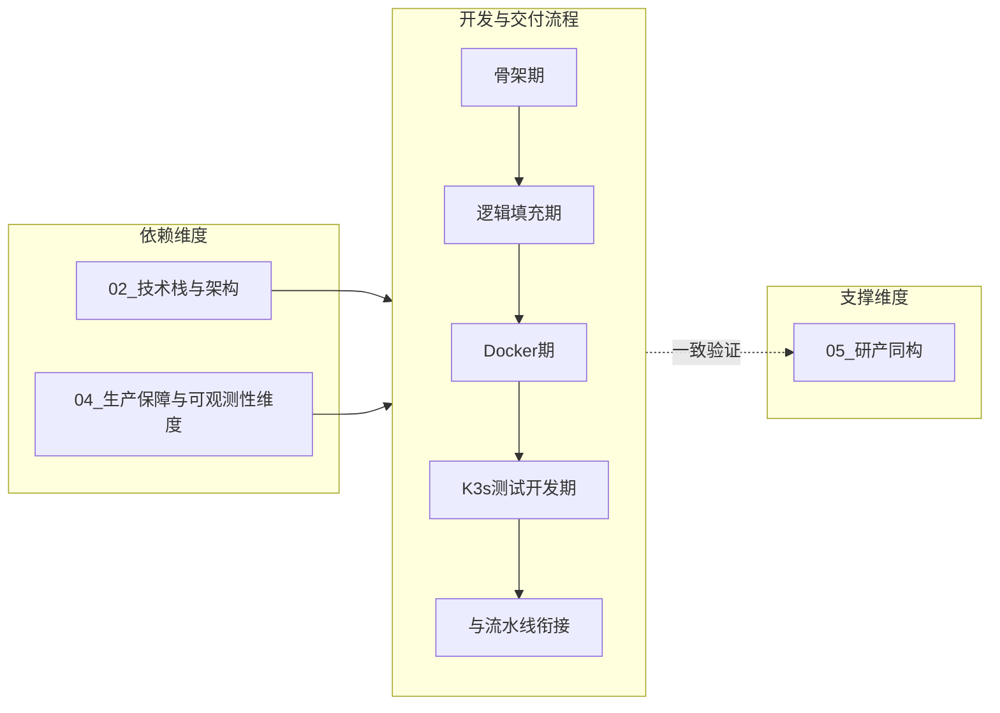

# L2 · 开发与交付流程维度

> [!NOTE] **[TRACEBACK] 战略维度锚点**
> - **顶层概念**: [一句话定义与核心价值](../../01_顶层概念/01_一句话定义与核心价值.md)
> - **顶层概念**: [战略目标与ROI](../../01_顶层概念/02_战略目标与ROI.md)
> - **本文档**: L2 层级，定义开发与交付流程维度

## 维度定义

**开发与交付流程维度**：明确从「可执行的代码骨架」或「技术方案与骨架确定」到「最终在 K3s 上可交付」的开发者工作流与实践流程的战略原则与阶段划分，确保先验证后铺基础设施、环境逐级统一、过渡时机可审计。

## 关键目标

1. **第一步优先验证**：优先「代码骨架 + 本地可测」，再考虑 IaC/ECS（避免先铺云再改代码导致浪费）。
2. **环境逐级统一**：本地 → Docker 统一依赖与服务 → K3s 测试开发 → 与发布流水线衔接。
3. **测试-开发循环明确**：各阶段对应明确的测试类型（本地单测、Docker 内集成、K3s 上 E2E/仿真）。
4. **过渡时机可定义、可追溯**：何时引入 Docker、何时上 K3s 由规约约定，L4 步骤可引用并验收。

## 覆盖范围

### 开发生命周期阶段划分（战略级）

- **骨架期**：可运行的代码骨架（目录、接口、占位实现），本地单测可绿。
- **逻辑填充期**：在骨架上按 L3 规约与 5D 填充业务逻辑，本地单测与必要集成测试可绿。
- **Docker 统一环境期**：用 Docker 统一基础环境与服务依赖，在容器内跑开发与测试。
- **K3s 测试开发期**：在 K3s 上跑测试/开发用部署，验证编排、Secret、网络策略等，与最终 K3s 生产环境一致。
- **与提交/发布流水线衔接**：产出满足「三级流水线」（见 L3 架构设计共识）入口要求，进入 Level 1/2/3。

### 与提交/发布流水线的衔接点

- 开发生命周期产出「可提交的代码与镜像」；提交/发布流水线负责「提交后的验证与部署」（commit → Level1 单测；merge develop → Level2 Staging；tag → Level3 Live）。具体衔接见 L3 [01_开发生命周期与实践流程规约](../../03_原子目标与规约/开发与交付/01_开发生命周期与实践流程规约.md)。

### 与其它维度的关系

- **依赖**：技术栈与架构（Docker、K3s、Spot ECS 选型）、生产保障（可观测性在各环境的落地）。
- **支撑**：研产同构（回测与实盘逻辑在本地/Docker/K3s 中一致验证）。
- **边界**：产品/需求设计（做哪些功能、优先级、路线图）归属 [01_产品设计维度](../产品设计/01_产品设计维度.md)，本维度仅负责交付流程与环境阶段。

## 与不可能三角的映射

- **生存底线 (Survival)**：开发流程的「先验证后铺 infra」减少返工与云资源浪费，降低交付风险。
- **认知边界 (Certainty)**：各阶段可观测与测试锚定支撑可解释、可审计的交付物。

## 下一步

→ 主责 L3 规约：[01_开发生命周期与实践流程规约](../../03_原子目标与规约/开发与交付/01_开发生命周期与实践流程规约.md)；L4 阶段实践须符合该规约并标明环境阶段。完整对应见 [L2-L3-DNA 映射表](../../06_追溯与审计/00_L2_L3_DNA_映射.md)。

本轴线后续可扩展更多文档（如专项流水线、环境检查清单等），与 L3 规约保持同步。
