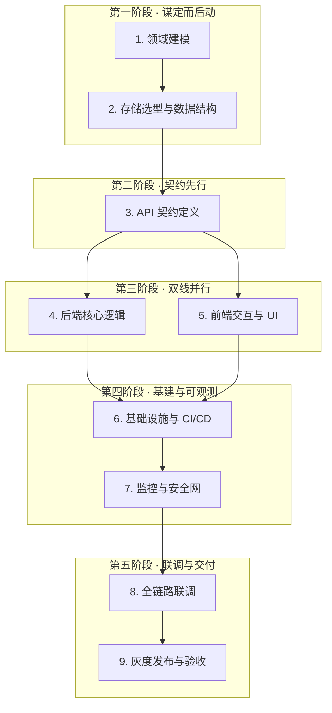

# L2 · 落地操作顺序与协作战略

> [!NOTE] **[TRACEBACK] 战略追溯锚点**
> - **顶层概念**: [一句话定义与核心价值](../../01_顶层概念/01_一句话定义与核心价值.md)
> - **顶层概念**: [战略目标与 ROI](../../01_顶层概念/02_战略目标与ROI.md)
> - **战略维度**: [01_开发与交付流程维度](01_开发与交付流程维度.md)
> - **本文档**: L2 层级，定义落地操作顺序与协作原则的战略维度

## 维度定义

**落地操作顺序与协作战略**：明确从「业务理解」到「生产交付」的标准执行顺序与协作原则，通过**前置风险**、**契约先行**、**利他协作**与**结果导向**，确保系统既能按时交付，更能长期稳定运行。

本维度与 [01_开发与交付流程维度](01_开发与交付流程维度.md) 互补：01_ 定义**环境阶段**（骨架期 → 逻辑填充期 → Docker 期 → K3s 期 → 流水线衔接），本维度定义**任务顺序与协作方式**——两者共同构成完整的开发交付战略。

## 核心价值主张

| 原则 | 含义 | 落地体现 |
|------|------|----------|
| **前置风险** | 将架构与设计风险尽早暴露、尽早决策 | 领域建模、存储选型、API 契约均在编码前锁定 |
| **利他协作** | 为下游与协作方提供可预期、可消费的产出 | API First 让前端可 Mock 并行开发；契约评审消除对接推诿 |
| **结果导向** | 以可验证的交付物与可观测的质量为准出条件 | 每阶段有明确产出；联调、灰度、验收闭环 |
| **主人翁意识** | 对系统全生命周期负责，而非「写完代码即完成」 | 基建、可观测性、安全网在交付前就绪 |
| **面向失败** | 局部故障时整体仍能提供降级服务，且能自动恢复 | 熔断、限流、重试+抖动、优雅降级；利他精神向用户侧延伸 |

## 跨阶段高阶原则

以下原则贯穿五阶段九步，不依赖具体步骤顺序。

### 架构演进原则（Evolutionary Architecture）

不要第一天就设计「完美」的微服务，而是设计**容易被拆分**的系统。很多团队从 0 到 1 时追求技术光环，直接上复杂的微服务，导致早期沟通与基建成本极高。

**最佳实践**：采用**模块化单体**（Modular Monolith）作为起点。在同一个代码库中，按领域驱动设计（DDD）划分模块；模块间仅通过本地接口调用，**严禁跨模块直接读写数据库**。既能保证早期快速验证产品价值（务实），又为未来流量爆发时按模块平滑拆分为微服务留下清晰边界（进取）。

### 组织与架构映射（Conway's Law）

「设计系统的架构受制于产生这些设计的组织的沟通结构。」若将前端、后端、DBA、测试分为完全独立的部门，交付的系统大概率层层孤立、沟通成本极高。

**最佳实践**：打造**跨职能业务闭环团队**（Cross-functional Teams）。让负责「源数据接入」「后端业务逻辑」「前端交互体验」的工程师在同一目标下协作。契约不再是部门间推诿的挡箭牌，而是团队内拉齐认知的共识；上下游共同对最终业务结果负责（利他协作）。

### 专业沉淀：ADR 强制

从 0 到 1 过程中，团队会做无数技术选型（如：为何选 PostgreSQL 而非 MySQL？为何用 gRPC 而非 REST？）。数月后，没人记得当时的原因。

**强制方案**：每次重大架构决策，必须用简短的 Markdown 记录为 **ADR（Architecture Decision Records）**：背景、考虑的选项、最终决策及原因、带来的影响。这不仅是对当前代码的解释，更是对未来接手同事最大的利他——避免他们重复踩坑。详见 [06_追溯与审计/ADR/](../../06_追溯与审计/ADR/)、[04_追溯与审计详细规约](../../06_追溯与审计/04_追溯与审计详细规约.md)。

## 五阶段九步标准操作顺序

以下顺序能**最大化前置风险**，并在团队协作中充分体现利他与结果导向，确保系统不仅能按时交付，更能长期稳定运行。

### 第一阶段：全局视角，谋定而后动（Planning & Modeling）

#### 1. 业务领域建模与边界划定（Domain Modeling）

| 动作 | 产出 |
|------|------|
| 不要急于写代码，首先梳理业务全景图。明确：模块的**核心目标**是什么？**输入数据源**（水源）在哪？**输出的业务价值**（终态）是什么？ | 领域模型图、状态流转图；确立「核心业务逻辑层」的骨架 |

**风险前置**：边界不清或目标漂移，是后期返工的主要原因。本步将业务共识固化，避免在实现阶段反复争论；同时为后续演进式架构（模块化单体 → 微服务）预留边界。

#### 2. 存储选型与数据结构设计（Storage Design）

| 动作 | 产出 |
|------|------|
| 业务模型清晰后，将其映射为底层数据存储方案。根据**读写频率**、**一致性要求**、**扩展性**选择合适的 RDBMS（关系型）、NoSQL 或 MQ（消息队列）。 | 数据库 ER 图、表结构设计、缓存策略；夯实「数据持久化」基石 |

**风险前置**：选型失误会导致后期大规模重构；本步将数据层约束确定，为 API 与业务逻辑提供稳定底座。

---

### 第二阶段：契约先行，高效协同（Contract-First Design）

#### 3. API 接口与数据契约定义（API First）

| 动作 | 价值 | 产出 |
|------|------|------|
| 在后端编写具体逻辑、前端画 UI 之前，前后端**共同定义并评审** API 契约（如 OpenAPI / Swagger 规范）。 | **利他协作**最关键一环：契约一旦敲定，前后端可完全解耦；前端可使用 Mock 数据并行开发，彻底消除后期对接推说。 | 标准化的接口文档（请求体、响应体、错误码定义） |

**工程红线**：禁止在契约未评审通过前大规模实现；契约变更须同步通知所有消费方并更新文档。

**组织映射**：契约先行要落地，须有跨职能团队支撑；若前后端割裂为不同部门，契约易沦为「接口甩锅」工具。谁痛苦谁改进，上下游共同对业务结果负责（康威定律）。

---

### 第三阶段：双线并行，硬核实现（Parallel Development）

#### 4. 后端：核心业务逻辑与数据接入（Core Logic & Integration）

| 动作 | 标准 |
|------|------|
| 围绕预定的契约，开发底层 Service 逻辑；处理算法、事务、外部数据接入与清洗。 | 确保接口**幂等性**；防范异常数据污染系统；与 L3 规约及 5D（Design-Drive-Decompose-Defense）一致。**面向失败**：在调用外部服务（数据接入层）与内部核心逻辑之间，强制引入**熔断**（Circuit Breaker）和**限流**（Rate Limiting）；失败重试须加入**随机延迟**（Retry with Jitter），避免故障恢复瞬间被重试风暴击垮。 |

#### 5. 前端：交互体验与表现层研发（Interaction & UI）

| 动作 |
|------|
| 关注用户界面的响应速度与操作的直观性；处理复杂数据的可视化，将数据转化为用户可高效理解的视图。 |

**并行前提**：步骤 3 的契约已锁定；Mock 数据或契约驱动的 stub 已就绪。

---

### 第四阶段：环境基建与可观测性兜底（Infrastructure & SRE）

#### 6. 基础设施编排与部署（Infra & CI/CD）

| 动作 | 工程红线 |
|------|----------|
| 体现对系统**全生命周期负责**的主人翁意识。编写 Dockerfile 并将应用接入 CI/CD 流水线；进行 K8s / Helm 等云原生环境的部署编排。 | **严禁臆造参数**。面对不同中间件版本差异：① 对不确定的配置项必须使用占位符（如 `<volume_parameter_name>`、`<ingress_api_version>`）并明确标注「需根据实际 Chart 版本确认」；② **版本锚定优先**：配置推导须优先基于官方源码、现网 `helm inspect` 输出或明确文档片段；③ **范围表达**：涉及跨版本差异（如 K8s 1.25 与 1.28，或不同 Chart 的 `runner.extraVolumes` vs `runner.additionalVolumes`）时，必须显式标注版本区间；④ **强制风险提示**：提供任何基建配置建议时，必须包含「请查阅官方定义或执行 `helm inspect` 确认参数适配区间」。若无源数据支持，须主动要求上游提供明确定义，**拒绝盲目执行**。 |

#### 7. 监控与安全网接入（Observability & Security）

| 动作 |
|------|
| 在系统上线前，埋入可观测性探针（日志收集、链路追踪、核心 Metrics 指标）；并进行必要的安全扫描（权限校验、漏洞扫描）。确保系统上线后不是一个「黑盒」。**面向失败**：核心组件挂掉时，前端（表现层）应能展示**友好兜底**（降级数据或提示），而非抛出 500 错误——这正是利他精神向用户侧的延伸（Graceful Degradation）。验证优雅降级路径是否就绪。 |

---

### 第五阶段：联调、灰度与交付（Integration & Delivery）

#### 8. 全链路联调与自动化测试

| 动作 |
|------|
| 废弃 Mock 数据，真实环境对接。执行预设的集成测试用例，验证系统各维度的连通性与健壮性。 |

#### 9. 灰度发布与生产验收

| 动作 |
|------|
| 遵循**结果导向**：通过蓝绿部署或金丝雀发布，将流量逐步引入新系统；观察可观测性大盘，确认无误后全量交付。 |

---

## 阶段总览图

## 与环境阶段的映射

本维度的五阶段九步可与 [01_开发与交付流程维度](01_开发与交付流程维度.md) 的环境阶段建立对应关系：

| 落地操作顺序（本维度） | 环境阶段（01_ 开发与交付流程） |
|------------------------|-------------------------------|
| 1～2：领域建模、存储设计 | 骨架期前的规划与规约 |
| 3：API 契约 | 骨架期（接口占位、Proto） |
| 4～5：后端逻辑、前端 UI | 逻辑填充期、Docker 期 |
| 6～7：基建、可观测性 | Docker 期、K3s 期 |
| 8～9：联调、灰度 | K3s 期、与流水线衔接 |

## 与其它维度的关系

- **依赖**：[02_技术栈与架构维度](../产品设计/02_技术栈与架构维度.md)（存储选型、API 技术栈）、[03_数据架构与分层存储维度](../产品设计/03_数据架构与分层存储维度.md)（数据结构设计）。
- **支撑**：[04_生产保障与可观测性维度](../产品设计/04_生产保障与可观测性维度.md)（步骤 7 监控与安全网）、[05_安全与机密治理维度](../产品设计/05_安全与机密治理维度.md)（安全扫描与权限校验）。
- **边界**：本维度定义**顺序与协作原则**，不替代具体规约；实现细节见 L3 [01_开发生命周期与实践流程规约](../../03_原子目标与规约/开发与交付/01_开发生命周期与实践流程规约.md)、[03_项目全功能开发测试实践工作流详细规划](../../03_原子目标与规约/开发与交付/03_项目全功能开发测试实践工作流详细规划.md)。

## 下一步

→ 主责 L3 规约：[01_开发生命周期与实践流程规约](../../03_原子目标与规约/开发与交付/01_开发生命周期与实践流程规约.md)、[03_项目全功能开发测试实践工作流详细规划](../../03_原子目标与规约/开发与交付/03_项目全功能开发测试实践工作流详细规划.md)。  
→ L2-L3-DNA 映射：[00_L2_L3_DNA_映射](../../06_追溯与审计/00_L2_L3_DNA_映射.md)。  
→ 谛听专属版本：[03_谛听落地操作顺序与协作战略](03_谛听落地操作顺序与协作战略.md)（将五阶段九步映射至双轨制、MoE、VC-Agent）。
