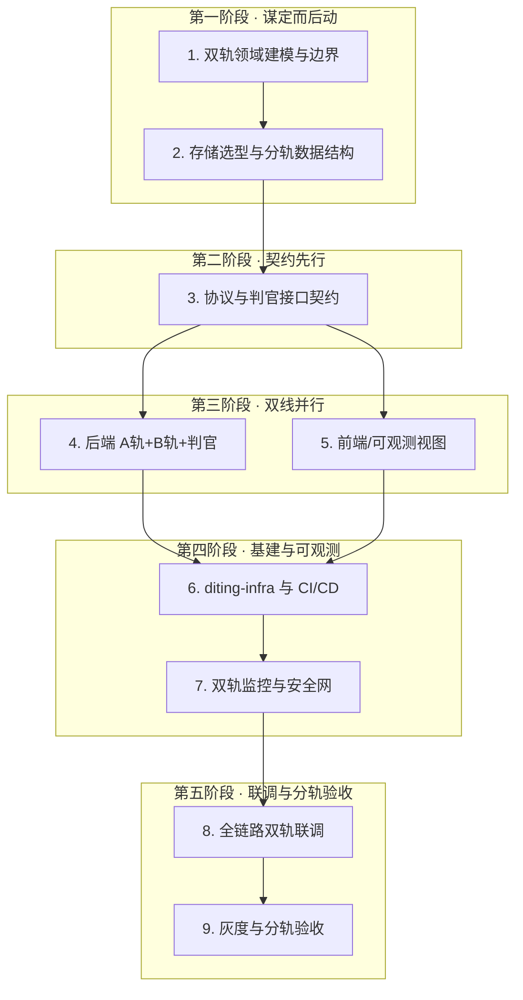

# L2 · 谛听落地操作顺序与协作战略

> [!NOTE] **[TRACEBACK] 战略追溯锚点**
> - **顶层概念**: [01_一句话定义与核心价值](../../01_顶层概念/01_一句话定义与核心价值.md)
> - **顶层概念**: [02_战略目标与ROI](../../01_顶层概念/02_战略目标与ROI.md)
> - **顶层概念**: [03_双轨制与VC-Agent](../../01_顶层概念/03_双轨制与VC-Agent.md)
> - **战略维度**: [01_开发与交付流程维度](01_开发与交付流程维度.md) | [02_落地操作顺序与协作战略](02_落地操作顺序与协作战略.md)
> - **本文档**: L2 层级，定义谛听项目的落地操作顺序与协作原则，将通用战略映射至双轨制、MoE 与 VC-Agent 体系

## 维度定义

**谛听落地操作顺序与协作战略**：在 [02_落地操作顺序与协作战略](02_落地操作顺序与协作战略.md) 五阶段九步基础上，结合谛听**双轨制**、**Neuro-Symbolic MoE**、**VC-Agent（信仰专家）**及**不可能三角**约束，明确从「双轨边界与领域建模」到「两轨分轨验收」的标准执行顺序与协作原则。通过**前置风险**、**契约先行**、**利他协作**与**结果导向**，确保系统既能按时交付，更能满足 A/B 轨差异化规则与 ROI 目标。

## 本战术的边界

- **本战术规定**：五阶段九步的**顺序**；每步的**输入、产出、准出**及**消费**；与 [01_开发与交付流程维度](01_开发与交付流程维度.md) 的分工（本战术管任务顺序与准出，01_ 管环境阶段）。
- **本战术不规定**：具体技术实现、详细验收条目；由 L3/L4/L5 规约与实践文档承担，本战术仅引用。

## 谛听特有约束与映射

| 通用原则 | 谛听落地体现 |
|----------|--------------|
| **前置风险** | 双轨边界、TimeHorizon 分流规则、判官豁免逻辑在编码前锁定；A 轨不可能三角、B 轨逻辑证伪/大周期反转规则提前规约 |
| **利他协作** | 协议 `expert.proto` 与判官接口先行，Module C（专家池）、Module D（判官）与数据接入层可并行开发；A/B 轨分账与复盘分轨为下游审计提供可预期产出 |
| **结果导向** | 每阶段产出可验证：A 轨 WinRate/CAGR/MaxDD、B 轨 VC-Agent 信号与执行率、全市场扫描 < 30min、RTO < 5min |
| **主人翁意识** | diting-infra 基建、可观测性、风控探针在实盘前就绪；B 轨逻辑证伪/大周期反转记录可追溯 |
| **面向失败** | 外部数据接入（如 AkShare）熔断、限流、重试+抖动；判官拦截异常信号；核心组件挂掉时降级展示 |

## 跨阶段高阶原则（谛听版）

### 架构演进：模块化 MoE 起手

不要第一天就设计「完美」的微服务，而是设计**容易被拆分**的 Neuro-Symbolic MoE。以**模块化单体**为起点：在 diting-core 中按 Module A～E 划分领域；模块间仅通过协议与接口调用，严禁跨模块直接读写数据库。既能快速验证双轨价值（务实），又为未来按模块拆分为独立服务预留清晰边界（进取）。

### 组织映射：跨职能双轨闭环团队

若量化、专家、判官、执行分为完全独立部门，交付的系统易出现契约推诿与 A/B 轨规则混用。打造**跨职能双轨闭环团队**：负责「A 轨信号」「B 轨 VC-Agent」「判官分流」「资金调度」的工程师在同一目标下协作。TimeHorizon 与判官豁免规则成为团队内拉齐认知的共识；上下游共同对两轨 ROI 负责（利他协作）。

### ADR 强制：双轨与 MoE 决策留痕

双轨边界、TimeHorizon 语义、判官豁免、VC-Agent 选型等重大决策必须用 **ADR** 记录：背景、选项、最终决策及原因、对 A/B 轨的影响。避免数月后无人记得为何 B 轨豁免 2% 硬止损、为何 VC-Agent 输出 LONG_TERM。详见 [06_追溯与审计/ADR/](../../06_追溯与审计/ADR/)、[04_追溯与审计详细规约](../../06_追溯与审计/04_追溯与审计详细规约.md)。

---

## 顺序逻辑

先建模再存储再契约：前置双轨边界与数据底座，避免实现阶段返工。契约先于实现：利他协作，契约锁定后 Module C/D、数据接入与执行层可并行开发。基建与可观测在实现之后：主人翁意识要求交付前就绪，但避免过早铺基建、先验证逻辑。联调与灰度在最后：结果导向，以可验证的交付物与可观测质量为准出条件。

## 不可省略与不可调序

- 步骤 **1～3 不可省略**；未达步骤 1/3 准出不得进入后续步骤。
- 步骤 **4 与 5 可并行**，但均依赖步骤 3 契约锁定。
- 步骤 **8 全链路联调**前，须步骤 4～7 准出。

## 五阶段九步：谛听落地操作顺序

以下顺序将通用五阶段九步映射至谛听功能目标、模块与机制，确保**前置风险**并充分体现**双轨分轨**与**利他协作**。每步采用**输入 → 动作 → 产出 → 准出 → 消费**五元结构。

### 第一阶段：全局视角，谋定而后动（Planning & Modeling）

#### 1. 业务领域建模与双轨边界划定（Domain Modeling）

- **输入**：来自 L1/L2，无前序步骤。[01_一句话定义与核心价值](../../01_顶层概念/01_一句话定义与核心价值.md)、[02_战略目标与ROI](../../01_顶层概念/02_战略目标与ROI.md)、[03_双轨制与VC-Agent](../../01_顶层概念/03_双轨制与VC-Agent.md)、[01_开发与交付流程维度](01_开发与交付流程维度.md)、[03_双轨制与VC-Agent](../../01_顶层概念/03_双轨制与VC-Agent.md)#分账。
- **动作**：基于上述输入，梳理谛听业务全景（双轨目标、水源、输出价值、Module A～E 职责、Router 与专家池边界、判官分流点、再平衡与资金调度、研产同构），产出步骤 1 **唯一凝固物**。
- **产出**：**唯一可验收产出** = [步骤1_领域建模与双轨边界](步骤1_领域建模与双轨边界.md)（含操作事项清单）；存放路径 `02_战略维度/开发与交付/步骤1_领域建模与双轨边界.md`。
- **准出**：上述文档已就绪，且**步骤 1 操作事项清单**全部勾选（或评审通过）；**未达准出不得进入步骤 2**。
- **消费**：步骤 2（领域模型图、资金调度边界）；步骤 3（领域模型图、双轨状态流转图、MoE 模块骨架、判官分流骨架）；步骤 4（同上 + 研产同构约束、资金调度边界）；步骤 8（双轨状态、判官分流、研产同构验收）。

**步骤 1 操作事项清单**（准出依据；完整版见 [步骤1_领域建模与双轨边界](步骤1_领域建模与双轨边界.md)#步骤1操作事项清单）：

| # | 操作事项 | 状态 | 权威来源 |
|---|----------|------|----------|
| 1 | 双轨目标与输出价值已收敛并记录（A 轨生存与现金流、B 轨时代级牛股；Alpha、两轨分轨指标） | ☐ | [01_一句话定义与核心价值](../../01_顶层概念/01_一句话定义与核心价值.md)、[02_战略目标与ROI](../../01_顶层概念/02_战略目标与ROI.md) |
| 2 | 输入数据源（水源）已明确并记录（行情、基本面、AkShare 等；与采集/输入层规约一致） | ☐ | [11_数据采集与输入层规约](../../03_原子目标与规约/_共享规约/11_数据采集与输入层规约.md) 或对应 L3 |
| 3 | 领域模型图已就绪（双轨目标、水源、输出价值、核心实体与边界） | ☐ | 步骤1 文档或 [09_核心模块架构规约](../../03_原子目标与规约/_共享规约/09_核心模块架构规约.md) |
| 4 | 双轨状态与判官分流已就绪（A/B 轨状态流转、TimeHorizon 语义、判官分流点） | ☐ | [03_双轨制与VC-Agent](../../01_顶层概念/03_双轨制与VC-Agent.md)、09_ Module D |
| 5 | MoE 模块骨架已就绪（Module A～E 职责、Router 与专家池边界） | ☐ | [09_核心模块架构规约](../../03_原子目标与规约/_共享规约/09_核心模块架构规约.md) |
| 6 | 研产同构约束已就绪（回测与实盘逻辑在本地/Docker/K3s 一致验证的约定） | ☐ | [01_开发与交付流程维度](01_开发与交付流程维度.md)、[06_研产同构维度](../产品设计/06_研产同构维度.md) |
| 7 | 资金调度边界已就绪（再平衡、A 轨利润输血、B 轨初始划拨的职责与边界） | ☐ | [03_双轨制与VC-Agent](../../01_顶层概念/03_双轨制与VC-Agent.md)#分账、[08_经纪商解耦与冗余维度](../产品设计/08_经纪商解耦与冗余维度.md) |

**风险前置**：双轨边界不清或 TimeHorizon 使用场景未锁定，是后期判官规则返工主因；研产同构未提前约定会导致回测与实盘逻辑漂移。本步将 A/B 轨共识固化，避免实现阶段对「豁免 2% 硬止损」的误解；同时为 [03_双轨制与VC-Agent](../../01_顶层概念/03_双轨制与VC-Agent.md)#AB轨规范边界 落地奠定基础。

#### 2. 存储选型与数据结构设计（Storage Design）

- **输入**：步骤 1 产出 [步骤1_领域建模与双轨边界](步骤1_领域建模与双轨边界.md)（领域模型图、资金调度边界）。
- **动作**：将双轨业务模型映射为底层存储；根据读写频率、一致性要求、扩展性选择 RDBMS/NoSQL/MQ；A/B 轨分账、仓位标识、逻辑证伪/大周期反转触发记录可持久化与追溯。
- **产出**：数据库 ER 图、分轨表设计、缓存策略。
- **准出**：ER 图与分轨表设计已评审通过。
- **消费**：步骤 3、4。

**风险前置**：分账与仓位标识设计失误会导致 B 轨仓位被 A 轨风控误伤；本步将数据层约束确定，为协议与判官逻辑提供稳定底座。

---

### 第二阶段：契约先行，高效协同（Contract-First Design）

#### 3. 协议、接口与数据契约定义（API First）

- **输入**：步骤 1 产出（领域模型图、双轨状态流转图、MoE 模块骨架、判官分流骨架）；步骤 2 产出（ER 图、分轨表设计）。
- **动作**：在编写 Router、VC-Agent、判官具体逻辑之前，共同定义并评审：`expert.proto` 及 TimeHorizon 语义；判官输入/输出接口；专家池与 Router 的契约；A 轨 `reasoning_summary` 字段；执行层与经纪商解耦接口（见 [08_经纪商解耦与冗余维度](../产品设计/08_经纪商解耦与冗余维度.md) 或 L3）。
- **产出**：标准化 proto 与接口文档（ExpertOpinion、horizon、reasoning_summary、判官分流规则、错误码定义、执行层契约）。
- **准出**：proto/判官/执行层契约已评审并入库；**未达准出不得大规模开展步骤 4/5**。
- **消费**：步骤 4、5。

**工程红线**：禁止在 TimeHorizon 与判官分流规则未评审通过前大规模实现；契约变更须同步通知所有消费方并更新 diting-doc。

**组织映射**：契约先行须有跨职能团队支撑；量化、专家、判官、执行共同对双轨 ROI 负责。

---

### 第三阶段：双线并行，硬核实现（Parallel Development）

#### 4. 后端：双轨核心逻辑与数据接入（Core Logic & Integration）

- **输入**：步骤 1 产出（双轨状态流转图、MoE 模块骨架、判官分流骨架、研产同构约束、资金调度边界）；步骤 2、3 产出。
- **动作**：按 L3 [09_核心模块架构规约](../../03_原子目标与规约/_共享规约/09_核心模块架构规约.md)、[01_核心公式与MoE架构规约](../../03_原子目标与规约/_共享规约/01_核心公式与MoE架构规约.md)、[10_运营治理与灾备规约](../../03_原子目标与规约/_共享规约/10_运营治理与灾备规约.md) 实现 A 轨/B 轨/判官（Module D）与资金调度/再平衡；具体风控数值与实现见 L3。
- **产出**：后端双轨逻辑与数据接入实现；接口幂等、面向失败（熔断、限流、重试+抖动）按 L3 落地。
- **准出**：满足 L3 定义之接口与风控约束。
- **消费**：步骤 6、7、8。

#### 5. 前端/交互：表现层与可观测视图（若有）

- **输入**：步骤 3 产出（契约、Mock/stub）。
- **动作**：双轨指标可视化；核心组件挂掉时友好兜底（Graceful Degradation）。具体见 L3/L4。
- **产出**：前端/可观测视图实现。
- **准出**：满足步骤 3 契约与 L3 前端/可观测约定。
- **消费**：步骤 6、7、8。

**并行前提**：步骤 3 的 proto 与判官接口已锁定；Mock 或契约驱动的 stub 已就绪。

---

### 第四阶段：环境基建与可观测性兜底（Infrastructure & SRE）

#### 6. 基础设施编排与部署（Infra & CI/CD）

- **输入**：步骤 4、5 产出。
- **动作**：diting-infra 编写 Dockerfile，接入 CI/CD；K8s/Helm 部署编排；竞价实例与 RTO 灾备验证见 [10_运营治理与灾备规约](../../03_原子目标与规约/_共享规约/10_运营治理与灾备规约.md)。
- **产出**：基建编排与部署产物。
- **准出**：基建配置可追溯、无臆造参数；占位符、版本锚定、范围表达、风险提示等详见 [02_落地操作顺序与协作战略](02_落地操作顺序与协作战略.md)#步骤6 及 L3。
- **消费**：步骤 7、8。

#### 7. 监控与安全网接入（Observability & Security）

- **输入**：步骤 4、5、6 产出。
- **动作**：埋入可观测性探针（A/B 轨分轨指标、双轨监控、安全扫描）；具体指标与实现见 L3 [04_生产保障与可观测性维度](../产品设计/04_生产保障与可观测性维度.md)、L5 验收规约。
- **产出**：可观测性与安全网就绪。
- **准出**：两轨指标分轨统计、可追溯；核心组件挂掉时前端友好兜底就绪。
- **消费**：步骤 8、9。

---

### 第五阶段：联调、灰度与分轨验收（Integration & Delivery）

#### 8. 全链路联调与双轨自动化测试

- **输入**：步骤 1（双轨状态、判官分流、研产同构）、步骤 4～7 产出。
- **动作**：废弃 Mock，真实环境对接；执行 L3/L5 规定的联调与双轨验收项。具体测试项（A 轨风控、B 轨判官分流、分账隔离、研产同构、性能与灾备）见 L3 [10_运营治理与灾备规约](../../03_原子目标与规约/_共享规约/10_运营治理与灾备规约.md) 及 L5 联调与验收规约。
- **产出**：全链路联调通过、双轨自动化测试通过。
- **准出**：满足 L3/L5 联调与双轨验收清单；**未达准出不得进入步骤 9**。
- **消费**：步骤 9。

#### 9. 灰度发布与分轨验收

- **输入**：步骤 8 产出。
- **动作**：蓝绿或金丝雀发布；观察可观测性大盘；A 轨按 WinRate/CAGR/MaxDD 验收，B 轨按分轨指标验收；不得用 A 轨标准误评 B 轨。具体见 L5 验收规约。
- **产出**：生产交付、分轨验收通过。
- **准出**：分轨验收通过；全量交付后持续分轨复盘。
- **消费**：无（交付终点）。

---

## 阶段总览图（谛听版）

## 与环境阶段的映射

| 落地操作顺序（本维度） | 环境阶段（01_ 开发与交付流程） |
|------------------------|-------------------------------|
| 1～2：双轨建模、存储设计 | 骨架期前的规划与规约 |
| 3：协议与判官契约 | 骨架期（proto、接口占位） |
| 4～5：A轨+B轨+判官、前端 | 逻辑填充期、Docker 期 |
| 6～7：diting-infra、可观测 | Docker 期、K3s 期 |
| 8～9：联调、分轨验收 | K3s 期、与流水线衔接 |

## 与谛听顶层概念的映射

| 顶层概念 | 本维度落地体现 |
|----------|----------------|
| [01_一句话定义与核心价值](../../01_顶层概念/01_一句话定义与核心价值.md) | 双轨边界、MoE 骨架、核心公式 Alpha = (Quant ∩ Router) × Kelly 贯穿各阶段 |
| [02_战略目标与ROI](../../01_顶层概念/02_战略目标与ROI.md) | A 轨 WinRate/CAGR/MaxDD、B 轨分轨指标在步骤 7～9 落地；RTO < 5min、全市场扫描 < 30min |
| [03_双轨制与VC-Agent](../../01_顶层概念/03_双轨制与VC-Agent.md) | TimeHorizon 语义、判官豁免规则、VC-Agent 位置与输出在步骤 1、3、4 锁定；分账与复盘分轨在步骤 2、8、9 验证 |

## 与其它维度的关系

- **依赖**：[02_技术栈与架构维度](../产品设计/02_技术栈与架构维度.md)、[03_数据架构与分层存储维度](../产品设计/03_数据架构与分层存储维度.md)（分轨存储设计）、[08_经纪商解耦与冗余维度](../产品设计/08_经纪商解耦与冗余维度.md)（执行层契约与资金调度）。
- **支撑**：[01_开发与交付流程维度](01_开发与交付流程维度.md)（研产同构、环境阶段）、[04_生产保障与可观测性维度](../产品设计/04_生产保障与可观测性维度.md)（双轨监控）、[05_安全与机密治理维度](../产品设计/05_安全与机密治理维度.md)。
- **边界**：本维度定义**谛听专属的顺序与协作原则**，具体实现见 L3 [01_开发生命周期与实践流程规约](../../03_原子目标与规约/开发与交付/01_开发生命周期与实践流程规约.md)、[09_核心模块架构规约](../../03_原子目标与规约/_共享规约/09_核心模块架构规约.md) Module C / D / E、[10_运营治理与灾备规约](../../03_原子目标与规约/_共享规约/10_运营治理与灾备规约.md)。

## 步骤产出-消费矩阵

| 步骤 | 主要产出 | 消费步骤 |
|------|----------|----------|
| 1 | 步骤1_领域建模与双轨边界（含操作事项清单） | 2, 3, 4, 8 |
| 2 | ER 图、分轨表设计、缓存策略 | 3, 4 |
| 3 | proto 与接口文档（ExpertOpinion、判官、执行层契约） | 4, 5 |
| 4 | 后端双轨逻辑与数据接入 | 6, 7, 8 |
| 5 | 前端/可观测视图 | 6, 7, 8 |
| 6 | 基建编排与部署 | 7, 8 |
| 7 | 可观测性与安全网 | 8, 9 |
| 8 | 全链路联调与双轨测试通过 | 9 |
| 9 | 生产交付、分轨验收通过 | — |

## 下一步

→ 主责 L3 规约：[01_开发生命周期与实践流程规约](../../03_原子目标与规约/开发与交付/01_开发生命周期与实践流程规约.md)、[09_核心模块架构规约](../../03_原子目标与规约/_共享规约/09_核心模块架构规约.md)。  
→ L2-L3-DNA 映射：[00_L2_L3_DNA_映射](../../06_追溯与审计/00_L2_L3_DNA_映射.md)。
