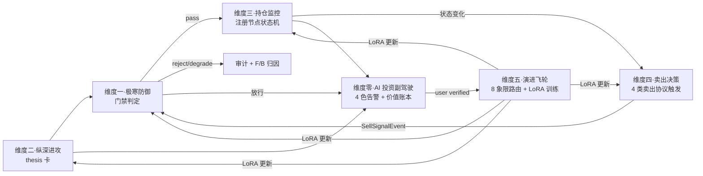

# L3 · 六大模块抽象总纲（Six Pillars）

> [!NOTE] **[TRACEBACK] 原子规约锚点**
> - **顶层概念**：[项目定义与核心价值](../01_顶层概念/01_项目定义与核心价值.md) / [双目标系统与五层架构](../01_顶层概念/03_双目标系统与五层架构.md) / [投资哲学体系总纲](../01_顶层概念/06_投资哲学体系总纲.md)
> - **战略维度**：[双目标与战略维度关系](../02_战略维度/00_双目标与战略维度关系.md)
> - **本文档**：L3 顶层抽象总纲——按 L2 六维度（0~5）严格 1:1 对应的六大 L3 模块；定义各模块的内涵、职责、I/O、边界、相互协作以及与旧 ABCDEF / 旧四大模块（cryo_guard / deep_strike / state_watch / super_evo + frontend）的演化映射。
> - **同层 README**：[维度零_AI 投资副驾驶](./00_维度零_AI投资副驾驶/README.md) · [维度一_极寒防御](./01_维度一_极寒防御/README.md) · [维度二_纵深进攻](./02_维度二_纵深进攻/README.md) · [维度三_持仓监控](./03_维度三_持仓监控/README.md) · [维度四_卖出决策](./04_维度四_卖出决策/README.md) · [维度五_演进飞轮](./05_维度五_演进飞轮/README.md)
> - **历史归档**：[_legacy/00_四大模块抽象总纲_原始.md](./_legacy/00_四大模块抽象总纲_原始.md)（旧版"四大模块"——已废止）
> - **上架与环境（ECS/K3s/Helm/ACR）**：[16_阿里云ECS_K3s_ACR_Helm部署与deploy-engine链路](./_共享规约/16_阿里云ECS_K3s_ACR_Helm部署与deploy-engine链路.md)；全局：**[00_系统规则 §十一](../../00_系统规则_通用项目协议.md#diting-ecs-k3s-helm-acr-deploy-engine)**

> [!IMPORTANT] **验证后资源释放（全模块强制）**
> 六大维度各 `*_设计.md` 正文均含统一引用。凡 **本地/联调验证**（单测、集成测、`docker compose`、dev server、`uvicorn` 等），在 **准出/实践记录** 完成后须 **停止进程并释放资源**。细则见 [_共享规约/17_L3设计文档_验证后资源释放规约.md](./_共享规约/17_L3设计文档_验证后资源释放规约.md)。

## 〇、部署与环境（六维度共通 · 不写具体 config 键）

- **运行时**：**阿里云 ECS + K3s**；负载 **Helm Chart**（归属 **diting-infra**）；镜像 **阿里云 ACR**。
- **执行入口**：在 **diting-infra** 调用 **deploy-engine**（须在**与子模块平级的独立仓库**开发 `deploy-engine`，禁止在 `diting-infra/deploy-engine` 拷贝内改工作树后再提交）。
- **L3 权威展开**（拓扑、与用户价值对齐、哲学挂钩、启动期上架节奏闸、`steps` 必选引用）：[**_共享规约/16_阿里云ECS_K3s_ACR_Helm部署与deploy-engine链路.md**](./_共享规约/16_阿里云ECS_K3s_ACR_Helm部署与deploy-engine链路.md) · [**L3步骤文档_部署价值哲学_必选引用**](./_共享规约/L3步骤文档_部署价值哲学_必选引用.md)
- **L4**：每份实践记录须有 **部署/部署快照**，见 **[04_/README §3.3](../../04_阶段规划与实践/README.md)**；**全局协议**见 **[00_系统规则](../../00_系统规则_通用项目协议.md#diting-ecs-k3s-helm-acr-deploy-engine)**。

## 一、为什么从"四大"演化为"六大"

### 1.1 旧四大模块抽象的问题

| 旧四大模块（cryo_guard / deep_strike / state_watch / super_evo）+ 前端 | 与 L2 六维度的对齐 |
|---|---|
| 极寒防御 = 维度一 | ✅ 1:1 对齐 |
| 纵深进攻 = 维度二 | ✅ 1:1 对齐 |
| **状态机监控** = 维度三+维度四共享 | ❌ **2 个 L2 维度被压成 1 个 L3 模块**（持仓监控与卖出决策的工程命运混在一起）|
| 超级个体进化 = 维度五 | ✅ 1:1 对齐 |
| 前端工程与服务 = 维度零（产品骨架） | ⚠️ 命名隐含"附属层"语义，未承认其作为产品出口的同等地位 |

### 1.2 六大模块抽象的优势

| 改进点 | 影响 |
|---|---|
| L3 与 L2 严格 **1:1 对齐**（六对六） | 任何 L2 维度的设计调整可直接映射到 L3 实现规约 |
| **持仓监控** 与 **卖出决策** 分立为两个 L3 模块 | 持仓状态机的"观测/评分"职责 与 "卖出协议执行"职责分离，便于独立演进、独立部署、独立训练 LoRA |
| **AI 投资副驾驶** 取代"前端工程与服务" | 命名上承认产品骨架的核心地位；前端 + 主动通道 + 价值账本 + 反馈闭环统一收敛 |
| 每个 L3 模块下内置 `stages/stage_1_启动期 / stage_2_扩展期 / stage_3_完善期/` 三段实践目录 | L3 不再是"抽象规约"的单一形态，而是"规约 + 阶段实践索引"的统一承载 |

## 二、六大模块速览

| # | L2 维度 | L3 模块名 | 英文代号 | 一句话定位 | 核心交付物 |
|---|---|---|---|---|---|
| **0** | [维度零·AI 投资副驾驶](../02_战略维度/00_维度零_AI投资副驾驶/README.md) | **AI 投资副驾驶** | `co_pilot`（产品骨架）| 把后端五维度能力翻译成"主动陪伴 + 量化价值"的真实投资副驾驶 | 持仓体检 / 推荐池 / 紧急告警 / 价值账本 / 反馈闭环 |
| **1** | [维度一·极寒防御](../02_战略维度/01_维度一_极寒防御/README.md) | **极寒防御** | `cryo_guard` | 不可信不放过、坏环境进入冻结、坏决策不出门 | 风险事件 / 门禁判定 / 熔断状态 / 审计证据链 / reject 配额 / F-B 归因 |
| **2** | [维度二·纵深进攻](../02_战略维度/02_维度二_纵深进攻/README.md) | **纵深进攻** | `deep_strike` | 把高维碎片信息压缩为有解释、有证据、有失败兜底的研究结论 | thesis 卡（5 必填 + 三门槛）/ 议会会议记录 / 战场分类 |
| **3** | [维度三·持仓监控](../02_战略维度/03_维度三_持仓监控/README.md) | **持仓监控** | `holding_watch` | 让"逻辑何时失效"成为可观测事件，逻辑失效必有预警 | 节点 4 态状态机 / SLI 探针 / 4×4 调仓矩阵 / 4 战场审计 / 收益仓库控制 |
| **4** | [维度四·卖出决策](../02_战略维度/04_维度四_卖出决策/README.md) | **卖出决策** | `exit_engine` | 把"什么时候卖"从主观感觉变成 4 类协议自动触发 + 人确认 | 4 类卖出协议 / 缓冲期管理 / 卖飞豁免 180 天 / 不正确卖出拦截 |
| **5** | [维度五·演进飞轮](../02_战略维度/05_维度五_演进飞轮/README.md) | **演进飞轮** | `super_evo` | 把"运行结果"变成"下一轮训练数据 + 知识资产 + 个人能力成长" | 8 象限路由 / LoRA 守门人 / 双盲 Kappa / 议会模式 / 月度成本控制 |

> 英文代号用于 DNA 键、目录、配置项；中文名对外/对内交流主用。

## 三、六大模块的协作总览（系统级数据流）



## 四、六大模块详细规约

### 4.1 维度零·AI 投资副驾驶（`co_pilot`）

**定位**：产品骨架——把维度一/二/三/四/五的所有后端能力翻译成"主动陪伴 + 量化价值"的真实投资副驾驶。

**职责清单**：
1. **5 product modules**：持仓体检报告 / 推荐池与 thesis 卡 / 紧急告警系统 / 价值账本 / 反馈闭环
2. **主动通道**：日报 / 周报 / 月报 / 4 红 + 2 橙告警 + 三通道（微信/Telegram/邮件）+ 电话告警（Stage 3）
3. **价值账本**：SCS / EV / 8 象限分布 / 5 句价值证明 / 自我熔断
4. **批量决策会**：周末 5 min 完成本周全部决策 + 取消勾选率监控
5. **双盲 Kappa 面板** + **议会模式投票面板**（Stage 3）

**输入**：维度一/二/三/四/五 的所有事件流（SSE + API）  
**输出**：用户感知的产品体验 + verified 反馈 → 演进飞轮

**边界（不做什么）**：不做后端引擎判定（消费方）；不直接下单（仅人确认入口）；不维护飞轮训练（属于演进飞轮）

**后端服务子模块**：见 [维度零_AI 投资副驾驶/02_后端服务子模块_设计.md](./00_维度零_AI投资副驾驶/02_后端服务子模块_设计.md)

### 4.2 维度一·极寒防御（`cryo_guard`）

**定位**：跨整条研究→决策→动作链路的"风险解构 + 门禁 + 熔断 + 失败保护"统一抽象。任何模块对外的输出都必须先穿过极寒防御。

**职责清单**：
1. **10 个防御引擎**（财务测谎/大股东诚信/关联交易/商誉减值/质押爆仓/审计监管/关键人/海外监管/舆情/行业系统性）
2. **5 维认知边界检查**（行业/数据完整度/SLI 可监控性/历史可比性/复杂度）
3. **reject 配额管理**（日/周/月 ≤ 50% + 认知边界占比 ≤ 30%）
4. **多源弱信号汇聚**（≥ 2 引擎共同触发升级）
5. **黑名单生命周期**（active → warning → watchlist → released → permanent_banned）
6. **F vs B 归因**（T+90/180 价格回顾路由到演进飞轮 8 象限）

**输入**：维度二的 thesis 草稿 / 维度三的状态迁移事件 / 维度五的评测信号 / 数据层质量信号  
**输出**：门禁判定（pass/degrade/reject + reason + evidence_ref）/ 熔断状态变更 / 风险事件流 / 审计日志

**边界**：不产生研究结论（属于维度二）；不维护节点状态机（属于维度三）；不直接执行外部动作（执行属于维度五的外部动作边界）

**详细规约**：[维度一_极寒防御/](./01_维度一_极寒防御/README.md)

### 4.3 维度二·纵深进攻（`deep_strike`）

**定位**：项目的 Alpha 引擎——把高维碎片信息压缩为有解释、有证据、有失败兜底的研究结论。

**职责清单**：
1. **8 个进攻引擎**（利润截留 P0 + 行业景气拐点 / 季报兑现 / 产业链景气 / 预期差量化 / 行业大周期 / 商业模式转型 / 行业整合）
2. **5 必填元素 thesis 卡 schema**（逻辑链节点 + SLI 探针 + 战场窗口期 + 收益门槛 + 认知边界检查）
3. **三门槛强制检查**（confidence ≥ 0.70 / payoff ≥ 2.0 / win_rate ≥ 0.55）
4. **5 步生成工作流**（议程→内容→特征→议会→finalize）
5. **战场 × thesis 类型分类**（超短/主战场/中战场/长战场）
6. **单周推荐 ≤ 5**（基石⑥）

**输入**：维度一 PassEvent（30 天有效期）/ 数据湖（财报/公告/新闻）/ 演进飞轮 RAG  
**输出**：ThesisProposedEvent / 议会会议记录 / G/H 归因事件

**边界**：不做防御判定（属于维度一）；不维护持仓状态（属于维度三）；不做卖出决策（属于维度四）

**详细规约**：[维度二_纵深进攻/](./02_维度二_纵深进攻/README.md)

### 4.4 维度三·持仓监控（`holding_watch`）

**定位**：投资逻辑的"DevOps 监控系统"——把"持仓 thesis"当作被持续监控的服务，让"逻辑何时失效"成为可观测、可预警、可回放的工程事件。

**职责清单**：
1. **节点 4 态状态机**（active / validated / weakened / broken）
2. **SLI 探针调度**（日/周/月/季/事件触发）
3. **健康度算法**（strong / healthy / weakening / broken_any）
4. **4×4 调仓矩阵建议**（健康度 × 价格走势 → 16 单元 action）
5. **4 战场健康度阈值 + 加速规则**（超短/主战场/中战场/长战场，缓冲期 1-20 个交易日）
6. **战场分配饼图 + 月度审计**（健康范围 + 异常告警）
7. **收益仓库控制**（止盈 30% 入仓库，回撤期取用）
8. **失效复盘**（与演进飞轮联动）

**输入**：维度二 ThesisProposedEvent / 维度一 RejectEvent（强制 broken_any）/ 价格行情 / SLI 数据源  
**输出**：HealthChangeEvent / RebalanceAdviceEvent（仅建议，不触发卖出）/ BattlefieldAuditEvent

**边界**：**只观察、只评分、只产生信号，不做卖出协议触发**（卖出由维度四接管）；不做防御判定（属于维度一）

**详细规约**：[维度三_持仓监控/](./03_维度三_持仓监控/README.md)

### 4.5 维度四·卖出决策（`exit_engine`）

**定位**：把"什么时候卖"从靠感觉/被市场情绪绑架变成"由 4 类卖出协议触发 + 人确认"。

**职责清单**：
1. **4 类卖出协议**（take_profit / logic_break_exit / opportunity_cost_reset / battlefield_failure_exit）
2. **协议优先级评估**（按从严到松，仅 1 个最终触发）
3. **缓冲期管理**（5 个交易日窗口，用户可撤销）
4. **卖飞豁免 180 天**（防止"卖飞焦虑"扭曲未来卖出决策）
5. **不正确卖出拦截器**（拦截"仅基于价格"的卖出，必须 ≥ 1 个 thesis 状态原因）
6. **卖出复盘**（与演进飞轮 8 象限归因联动）

**输入**：维度三 HealthChangeEvent + RebalanceAdviceEvent / 维度一 RejectEvent / 价格行情  
**输出**：SellSignalEvent（含 urgency + buffer_period + sell_fly_immunity 标记）/ SellAttributionEvent

**边界**：永远不直接下单（仅前端确认入口）；不做持仓监控评分（属于维度三）；不做防御判定（属于维度一）

**详细规约**：[维度四_卖出决策/](./04_维度四_卖出决策/README.md)

### 4.6 维度五·演进飞轮（`super_evo`）

**定位**：把"运行结果"变成"下一轮训练数据 + 知识资产 + 个人能力成长"，让人 + 系统在每个周期都能可衡量地变得更强。

**职责清单**：
1. **13 个 MLOps 组件**（Teacher LLM 蒸馏 + LLaMA-Factory + DVC + Label Studio + K8s GPU Job + vLLM + MLflow + 评测回放器 + DPO + 多 LoRA + 数字分身 + 沙箱 + A/B 测试）
2. **8 象限决策路由**（A/B/C/D/E/F/G/H → gold_library / violation_archive / pending / noise / window_calibration / failure_for_dpo）
3. **LoRA 守门人 6 指标 + 灰度发布**（10% → 50% → 100%）
4. **双盲 Kappa 标定**（每 50 条抽 10 条，Kappa < 0.70 暂停训练）
5. **议会模式 4 维度 LoRA + Judge LLM**（Stage 3）
6. **训练频率 × 战场矩阵**（超短/主战场月度 + 中战场季度 + 长战场半年）
7. **月度成本约束 ≤ ¥10000**
8. **B 象限永久隔离**（防"赌庄家"思维污染训练数据）

**输入**：维度一 F/B 归因 / 维度二 A/G/H 归因 / 维度四 卖出归因（含卖飞豁免）/ 维度零 双盲标注  
**输出**：LoRAUpdatedEvent / TrainingCompletedEvent / KappaCalibrationCompleted / ParliamentDecisionEvent

**边界**：不做实时业务判定（飞轮是离线训练 + 灰度上线）；不做产品体验（属于维度零）

**详细规约**：[维度五_演进飞轮/](./05_维度五_演进飞轮/README.md)

## 五、L3 ↔ L2 ↔ L1 全栈对齐表

| L1 哲学基石 | L2 维度 | L3 六大模块 |
|---|---|---|
| 整套体系产品骨架 + 全部 9 块基石的产品出口 | 维度零·AI 投资副驾驶 | **co_pilot** |
| ⑤防御（一票否决）+ ④八象限（F/B） | 维度一·极寒防御 | **cryo_guard** |
| ⑥进攻 + ②工程化（5 必填）+ ③时间边界 | 维度二·纵深进攻 | **deep_strike** |
| ⑦持仓监控 + ③时间边界 | 维度三·持仓监控 | **holding_watch** |
| ⑧卖出决策 + ③时间边界 + ⑦收益仓库 | 维度四·卖出决策 | **exit_engine** |
| ⑨演进 + ④八象限 | 维度五·演进飞轮 | **super_evo** |

## 六、L3 模块内部目录结构（统一约定）

```
03_原子目标与规约/
├── 00_六大模块抽象总纲.md（本文档）
├── README.md（索引）
├── _System_DNA/（机器可读 YAML 配置）
├── _共享规约/（跨模块协议）
├── 维度{N}_{中文模块名}/
│   ├── README.md（模块概览 + 设计文档清单 + stages 索引）
│   ├── 01_目标与边界_设计.md
│   ├── 02_后端服务子模块_设计.md
│   ├── 03_接口契约_设计.md
│   ├── 04_数据契约_设计.md
│   ├── 05_实施推演_设计.md
│   ├── 06_L2落地清单_设计.md（与 L2 维度全量对齐）
│   └── stages/
│       ├── README.md（3 阶段总览）
│       ├── stage_1_启动期/
│       │   ├── README.md（启动期目标 + 步骤清单）
│       │   ├── step_01_xxx/
│       │   │   └── README.md（7 要素：设计/技术/代码/数据/标准/验证/策略）
│       │   ├── step_02_xxx/
│       │   └── ...
│       ├── stage_2_扩展期/
│       └── stage_3_完善期/
├── 平台与产品/（保留）
├── 节奏与交付/（保留）
└── _legacy/（归档：旧四大总纲 + 旧状态机监控目录）
```

### 6.1 L3 内部 stages/ 与 L4 04_阶段规划与实践 的关系

| 层级 | 内容 | 关系 |
|---|---|---|
| **L3 维度{N}/stages/stage_1_启动期/step_xx/** | 该步骤的**完整 7 要素实践设计**（设计目标 + 技术选型 + 代码清单 + 数据采集 + 完成标准 + 验证方法 + 实施策略）| L3 的"实现设计"延伸 — 实质性的实践规约 |
| **L4 04_阶段规划与实践/{维度}/** | 阶段执行记录、版本日志、回顾报告 | L4 的"实施记录" — 引用 L3 内的 stage 设计 |

## 七、迁移与映射

### 7.1 旧 → 新 模块映射

| 旧（已废止）| 新（六大模块）|
|---|---|
| `cryo_guard`（极寒防御）| 维度一_极寒防御（不变）|
| `deep_strike`（纵深进攻）| 维度二_纵深进攻（不变）|
| `state_watch`（状态机监控，承载维度三+四）| **拆为**：维度三_持仓监控 + 维度四_卖出决策 |
| `super_evo`（超级个体进化）| 维度五_演进飞轮（中文名改）|
| `frontend`（前端工程与服务）| 维度零_AI 投资副驾驶 |

### 7.2 旧 ABCDEF 模块映射（向前回溯）

| 旧 Module | 收敛到新 L3 模块 |
|---|---|
| Module A（内容理解与标的画像）| 维度二_纵深进攻 |
| Module B（特征/信号/候选引擎）| 维度二_纵深进攻 |
| Module C（研究议会与 Agent 编排）| 维度二_纵深进攻（+ 议会模式跨维度五）|
| Module D（决策中枢）| **拆**：指标门禁→维度一；持续观察→维度三；卖出协议→维度四 |
| Module E（风控与保护层）| 维度一_极寒防御 |
| Module F（外部动作与发布边界）| 维度五_演进飞轮 `external_action_boundary` |

## 八、一致性检查表

- [x] L3 六大模块与 L2 六维度严格 1:1 对应
- [x] 维度三/维度四 拆分（持仓监控 ≠ 卖出决策）
- [x] 维度零 取代"前端工程与服务"承认产品骨架核心地位
- [x] 每个模块下统一 `stages/stage_1_启动期/2/3` 三段实践目录约定
- [x] 旧"四大模块抽象总纲" + "状态机监控"目录已归档到 `_legacy/`
- [ ] L3 各维度 README + 5 设计文档 + 06_ + stages 骨架已重建（步 4-7 推进中）
- [ ] 全仓对旧路径的引用已修复（步 5）
- [ ] L4 04_阶段规划与实践 已同步指向新结构（步 8）
- [ ] 系统规则 00_系统规则_通用项目协议.md + .cursorrules 已按 §4.5 同步（步 9）

---

## 修订记录

| 日期 | 触发 | 内容 |
|---|---|---|
| 2026-05-16 | **关键重构 §4.5**：L3 从"四大模块"演化为"六大模块"严格 1:1 对应 L2 六维度；新建本总纲；旧 00_四大模块抽象总纲.md + 旧状态机监控/目录已归档 _legacy/ | 本文档新建；维度三/四拆分；维度零取代前端命名；统一 stages/ 三段目录约定 |
