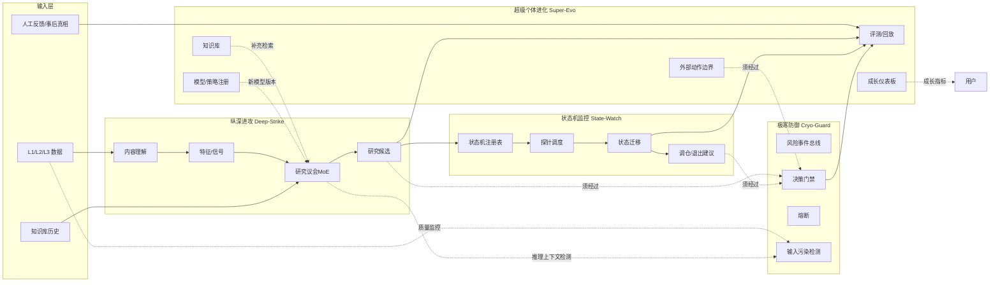

# L3 · 四大模块抽象总纲（Top-Level Pillars）

> [!NOTE] **[TRACEBACK] 原子规约锚点**
> - **顶层概念**：[项目定义与核心价值](../01_顶层概念/01_项目定义与核心价值.md)、[双目标系统与五层架构](../01_顶层概念/03_双目标系统与五层架构.md)
> - **战略维度**：[双目标与战略维度关系](../02_战略维度/00_双目标与战略维度关系.md) §四大战略维度
> - **本文档**：L3 顶层抽象总纲，定义四大模块的内涵、职责、I/O、边界、与旧 ABCDEF 体系的映射，以及前端工程与服务的接入点
> - **同层引用**：[极寒防御/README](./极寒防御/README.md)、[纵深进攻/README](./纵深进攻/README.md)、[状态机监控/README](./状态机监控/README.md)、[超级个体进化/README](./超级个体进化/README.md)、[前端工程与服务/README](./前端工程与服务/README.md)

## 一、为什么要重构为四大模块

**旧 ABCDEF 体系的问题**：

- Module A~F 是"按工程函数命名"（语义分类、量化扫描、MoE 议会、决策中枢、风控、执行网关），更像"流水线工序清单"
- 与 L1 哲学（认识论套利）和 L2 战略主轴（极寒防御/纵深进攻/状态机监控/超级个体进化）**没有结构对齐**
- "执行网关"等术语暗含"下单链路"，与 L1 §"项目不再是什么" §"不把自动下单作为第一阶段核心目标"冲突
- 工序命名导致每个模块的"产品价值"模糊，难以承接 L1 §核心价值（更早 / 更深 / 更稳 / 更可复盘）

**四大模块抽象的优势**：

- 与 L2 战略主轴**1:1 对齐**，L4 实践与 L5 验收可直接挂到主轴
- 每个模块都能直接回答"提供什么用户价值、规避什么风险、积累什么成长资产"
- 取消"执行网关"语义，将其降格为"超级个体进化 + 极寒防御"内的"外部动作边界"子能力，符合 L1 双目标定位
- 前端工程与服务作为独立 L3 域，与四大模块对等，结束"前端只是后端附属"的隐式假设

## 二、四大模块速览

| 模块 | 英文代号 | 一句话定位 | L2 主轴 | 核心交付物 |
|------|---------|-----------|---------|-----------|
| **极寒防御** | `cryo_guard` | 不可信不放过、坏环境进入冻结、坏决策不出门 | 极寒防御（风险解构、熔断与治理边界） | 风险事件、门禁判定、熔断状态、审计证据链 |
| **纵深进攻** | `deep_strike` | 把高维碎片信息压缩为有解释、有证据的研究结论 | 纵深进攻（产业链拼图、预期差与动量折现） | 研究卡片、研究候选、议会结论、预期差度量 |
| **状态机监控** | `state_watch` | 让"逻辑何时失效"成为可观测事件，逻辑失效必有预警 | 状态机监控（逻辑探针、状态迁移、退出与调仓） | 状态机定义、状态迁移事件、调仓建议、失效复盘 |
| **超级个体进化** | `super_evo` | 把"运行结果"变成"下一轮训练数据"，人 + 系统持续进化 | 超级个体进化（反馈反哺、评测更新、策略持续进化） | 评测报告、知识库条目、模型/策略版本、个人成长指标 |

> 英文代号供 DNA 键、目录、配置项使用；中文名为对外/对内交流主用名。

## 三、四大模块详细规约

### 3.1 极寒防御（Cryo-Guard）

**定位**：跨整条研究 → 决策 → 动作链路的"风险解构 + 门禁 + 熔断 + 失败保护"统一抽象。任何模块对外的输出都必须先穿过极寒防御。

**职责清单**：

1. **风险解构**：把"风险"拆成可识别/可计量的细分类型——数据漂移、上下文污染、事件冲击、估值异常、流动性枯竭、推理服务降级、外部依赖故障 等
2. **决策门禁**：研究结论 → 决策建议 → 外部动作之前的多层门禁（指标门禁、合规门禁、可追溯门禁、人审门禁）
3. **熔断与冻结**：异常时自动降级到"冻结 / 只读 / 拒绝出站"状态；附带恢复路径
4. **失败保护**：上游失败 / 超时 / 降质 时的回退策略（fallback、缓存、降级模型、人审兜底）
5. **审计与可回放**：每一次门禁判定（拒绝 / 降级 / 放行）都可被审计回放

**输入**：
- 来自纵深进攻的研究结论与候选
- 来自状态机监控的状态迁移事件
- 来自超级个体进化的评测信号、漂移信号
- 来自数据层的输入质量信号

**输出**：
- 门禁判定（pass / degrade / reject + reason + evidence_ref）
- 熔断状态变更事件
- 风险事件流（带 severity、category、affected_subjects）
- 审计日志条目

**边界（不做什么）**：
- 不产生研究结论（属于纵深进攻）
- 不维护状态机生命周期（属于状态机监控）
- 不直接执行外部动作（执行由"超级个体进化的外部动作边界"承担，但必须先过极寒防御）

**后端服务子模块**：
- `risk_event_bus`：风险事件总线
- `decision_gate`：决策门禁器
- `circuit_breaker`：熔断控制器
- `input_sanitizer`：输入污染检测器（针对 LLM 上下文、数据漂移、prompt injection）
- `audit_log_service`：审计日志服务

**前端接入**（详见 [前端工程与服务/README](./前端工程与服务/README.md)）：
- 风险熔断驾驶舱（实时风险事件、熔断状态、门禁拒绝原因）

**旧 ABCDEF 映射**：
- 旧 **Module E（风控与保护层）** 整体收敛进来
- 旧 **Module F 中"外部动作前置门禁"** 部分收敛进来
- 旧 **Module D 决策中枢中的指标门禁** 部分收敛进来

---

### 3.2 纵深进攻（Deep-Strike）

**定位**：项目的 Alpha 引擎——把高维碎片信息（公告 / 新闻 / 行业 / 产业链 / 主营构成 / 行为信号）压缩为有解释、有证据、有失败兜底的研究结论。

**职责清单**：

1. **内容理解**：从原始文本/数据中提炼结构化信号（实体、事件、主营、行业、时间线）
2. **特征工程**：把信号转为可被议会推理使用的特征（数值/语义/嵌入/图）
3. **议会推理**：MoE / Agent 编排，多视角研究、跨源拼图、工具调用
4. **候选生成**：研究结论 → 研究候选（**研究候选 ≠ 交易候选**，仅指"值得关注的对象"）
5. **预期差度量**：研究结论与市场共识的差异度量与动量折现
6. **解释与证据链**：每一条结论必须可追溯到"哪些原始证据 → 哪条推理路径 → 哪个版本的特征/模型"

**输入**：
- 数据层的 L1/L2/L3 输入（[11_数据采集与输入层规约](./_共享规约/11_数据采集与输入层规约.md)）
- 知识库（来自超级个体进化）
- 历史评测反馈（来自超级个体进化）

**输出**：
- 研究卡片（含结论 + 证据链 + 适用周期）
- 研究候选清单（带优先级、置信度、状态机模板建议）
- 议会会议记录（多 Agent 投票、分歧与共识）
- 预期差度量值

**边界（不做什么）**：
- 不做门禁与熔断（属于极寒防御）
- 不维护研究结论的"持续状态"（属于状态机监控；纵深进攻只产生快照式结论）
- 不做评测与反馈（属于超级个体进化）

**后端服务子模块**：
- `content_comprehension_service`：内容理解服务（实体抽取、事件抽取、主营对齐）
- `signal_feature_engine`：信号特征工程（含批 + 流）
- `research_council_service`：研究议会服务（MoE / Agent / Tool Calling 编排）
- `agenda_orchestrator`：议程编排器（每日 / 每周 / 触发式议程）
- `expectation_gap_quantifier`：预期差量化器
- `candidate_registry`：研究候选注册表

**前端接入**：
- 投研对话台（与议会的多轮对话）
- 研究候选广场（候选浏览 / 标星 / 加入观察）
- 研究卡片详情页（证据链可视化）

**旧 ABCDEF 映射**：
- 旧 **Module A（内容理解与标的画像）** 整体收敛
- 旧 **Module B（特征 / 信号 / 候选引擎）** 整体收敛
- 旧 **Module C（研究议会与 Agent 编排）** 整体收敛
- 旧 **B 轨 / C 轨 / Segment 右脑** 等历史命名完全废弃，能力点并入此模块

---

### 3.3 状态机监控（State-Machine Watch）

**定位**：把"研究结论"变成"持续被监控的状态"，让"逻辑何时失效"成为可观测、可预警、可回放的工程事件。

**职责清单**：

1. **状态机定义**：每个研究结论 / 研究候选关联一组状态机（如：看多 / 看空 / 中性 / 验证中 / 已失效 / 已退出）
2. **探针调度**：每个状态机绑定一组"逻辑探针"（如：财报数据触发条件、行业指标触发条件、股价触发条件、舆情触发条件）
3. **状态迁移**：探针触发后按规则迁移状态，迁移产生事件
4. **调仓与退出建议**：状态迁移到"已失效 / 风险升级"时，向用户发出"建议调仓 / 建议退出"提醒（**不是自动下单**）
5. **失效复盘**：所有状态迁移可被回放、可被复盘、可被作为反馈数据反哺给超级个体进化

**输入**：
- 来自纵深进攻的研究结论与建议状态机模板
- 数据层实时变化（行情、公告、新闻、事件）
- 用户对状态机的人工干预（如"忽略这次预警"）

**输出**：
- 状态机状态变更事件（state_transition_event）
- 调仓 / 退出建议（advisory_signal，**仅建议、不执行**）
- 状态时间线快照（用于前端展示与复盘）
- 状态机健康度指标

**边界（不做什么）**：
- 不直接产生研究结论（来自纵深进攻）
- 不直接执行外部动作（如有执行，须经极寒防御 + 超级个体进化的外部动作边界）
- 不做模型再训练（属于超级个体进化）

**后端服务子模块**：
- `state_machine_registry`：状态机注册表（含模板、实例、版本）
- `probe_scheduler`：探针调度器（cron / 事件触发 / 流式触发）
- `transition_engine`：状态迁移引擎
- `rebalance_advisor`：调仓建议生成器
- `invalidation_auditor`：失效审计与复盘服务
- `notification_dispatcher`：状态变更通知派发（→ 前端 / Webhook / 邮件）

**前端接入**：
- 监控驾驶舱（所有活跃状态机的总览）
- 状态机时间线视图（单个标的 / 单条逻辑的状态轨迹）
- 调仓建议中心

**旧 ABCDEF 映射**：
- 旧 **Module D（决策中枢）中"持续观察 / 状态追踪"** 部分收敛
- 旧 `a_track_position_lifecycle`（持仓与每日 B 复核） 整体收敛
- 旧 **Stage3 模块实践 03_持仓与每日信号复核** 整体收敛

---

### 3.4 超级个体进化（Super-Individual Evolution）

**定位**：把"运行结果"变成"下一轮训练数据 + 知识资产 + 个人能力成长"，让人 + 系统在每个周期都能可衡量地变得更强。**承接 L1 双目标的"个人 AI 成长"目标**。

**职责清单**：

1. **评测与回放**：对决策、状态迁移、外部动作的回放与打分
2. **知识沉淀**：把研究、复盘、纠正、专家点评写入知识库
3. **反馈循环**：人审 / 事后真相 / 用户标注 反哺成训练数据
4. **模型与策略注册**：版本化、灰度、回滚、A/B
5. **个人成长追踪**：把项目工作映射到个人 AI 能力成长指标（推理 / Agent / Ops / Runtime 四岗位能力）
6. **外部动作边界**：项目对外的所有动作（通知 / 工单 / Webhook / 第三方 API）的统一边界——**前置必经极寒防御**

**输入**：
- 纵深进攻的所有产出（研究卡片、议会记录）
- 状态机监控的所有迁移事件与失效审计
- 极寒防御的所有门禁判定与熔断事件
- 用户的人工反馈（标注、纠正、点赞 / 点踩）
- 外部"事后真相"（市场实际表现、新披露信息、新公告）

**输出**：
- 评测报告（按议程、按周期、按模块切片）
- 知识库条目（结构化、可检索、有版本）
- 模型 / 策略新版本 + 灰度发布计划
- 个人成长仪表板更新
- 反馈数据集（可被纵深进攻直接消费）

**边界（不做什么）**：
- 不产生新研究结论（属于纵深进攻）
- 不维护实时状态机（属于状态机监控）
- 不绕开极寒防御直接对外发动作

**后端服务子模块**：
- `eval_replay_service`：评测与回放服务
- `knowledge_base_service`：知识库服务（含 RAG 索引）
- `feedback_collector`：反馈采集器
- `model_registry`：模型 / 策略注册中心（含 MLflow / KServe / BentoML 适配）
- `growth_dashboard_service`：个人成长仪表板服务
- `external_action_boundary`：外部动作边界（通知 / 工单 / Webhook / API）

**前端接入**：
- 进化复盘工作台
- 知识库前端（搜索 / 浏览 / 编辑）
- 个人成长仪表板（[L1 §核心价值 / 04_A 股目标与边界 / 05_个人 AI 成长]）
- 反馈采集面板

**旧 ABCDEF 映射**：
- 旧 **Module D 决策中枢中"复盘 / 知识沉淀"** 部分收敛
- 旧 **Module F（外部动作与发布边界）** 整体收敛为"外部动作边界"子模块
- 旧 **Stage5_优化与扩展** 整章（可观测性 / Token 治理 / Level1 验收等）整体收敛

## 四、四大模块的协作关系

**关键协作约定**：

1. **任何模块的对外输出都必须先过极寒防御**（决策门禁 + 熔断检查）
2. **状态机模板由纵深进攻在产出研究结论时附带建议**，由状态机监控注册并执行
3. **超级个体进化是闭环的"反馈端"**——所有运行事件都流入评测，反过来补充知识库与模型版本
4. **数据层归属共享平台基础**（[11_数据采集与输入层规约](./_共享规约/11_数据采集与输入层规约.md)），不属于任何单一模块

## 五、四大模块 ↔ L2 战略主轴

| L2 战略主轴 | L3 主责模块 | L3 协责模块 |
|-------------|-------------|-------------|
| 极寒防御（风险解构、熔断与治理边界） | 极寒防御 | 状态机监控（逻辑失效是风险信号） |
| 纵深进攻（产业链拼图、预期差与动量折现） | 纵深进攻 | 超级个体进化（知识库 / 评测反哺） |
| 状态机监控（逻辑探针、状态迁移、退出与调仓） | 状态机监控 | 纵深进攻（结论附带状态机模板）、极寒防御（迁移须过门禁） |
| 超级个体进化（反馈反哺、评测更新、策略持续进化） | 超级个体进化 | 全部模块（运行结果都流入评测） |

## 六、与共享平台基础的关系

四大模块都依赖以下共享平台基础（位于 `_共享规约/`）：

| 共享规约 | 提供的能力 | 被哪些模块依赖 |
|---------|-----------|---------------|
| [01_核心公式与MoE架构规约](./_共享规约/01_核心公式与MoE架构规约.md) | 公式 `Decision = (Structured Signals ∩ Routed Research) × Policy Guards` 与三段式主链 | 全部 |
| [02_三位一体仓库规约](./_共享规约/02_三位一体仓库规约.md) | 文档 / 代码 / 部署仓划分 | 全部（实施层） |
| [03_架构设计共识与协作元规则](./_共享规约/03_架构设计共识与协作元规则.md) | ADR / GitFlow / SemVer / 5D | 全部 |
| [04_全链路通信协议矩阵](./_共享规约/04_全链路通信协议矩阵.md) | Research / Decision / Runtime / Ops / External Action 协议家族 | 全部 |
| [05_接口抽象层规约](./_共享规约/05_接口抽象层规约.md) | Port / Adapter 接口家族 | 全部 |
| [06_动态配置中心规约](./_共享规约/06_动态配置中心规约.md) | 配置热更新、版本控制 | 全部 |
| [07_数据版本控制规约](./_共享规约/07_数据版本控制规约.md) | DVC / 时点回放 | 纵深进攻、超级个体进化 |
| [08_心跳协议与健康检查规约](./_共享规约/08_心跳协议与健康检查规约.md) | 心跳 / 熔断 / 健康端点 | 极寒防御、全部服务 |
| [10_运营治理与灾备规约](./_共享规约/10_运营治理与灾备规约.md) | 合规 / DR / BCP | 极寒防御、超级个体进化 |
| [11_数据采集与输入层规约](./_共享规约/11_数据采集与输入层规约.md) | L1 / L2 / L3 数据采集与契约 | 纵深进攻 |

> 共享规约 09 (旧"核心模块架构规约") 已废弃删除——其角色被本文件替代。
> 共享规约 12 (旧"右脑数据支撑与 Segment") 已废弃删除——能力点并入纵深进攻 / 内容理解。

## 七、产品形态映射（前端工程与服务）

四大后端模块对应的前端工程见 [前端工程与服务/README](./前端工程与服务/README.md)，主要前端域：

| 前端域 | 主要承接模块 | 一句话定位 |
|--------|-------------|-----------|
| 监控驾驶舱 | 状态机监控 + 极寒防御 | 一屏看全所有活跃状态机与风险事件 |
| 投研对话台 | 纵深进攻（研究议会） | 与议会多轮对话、追问、保存 |
| 研究候选广场 | 纵深进攻 | 浏览 / 标星 / 加入观察的统一入口 |
| 状态机时间线视图 | 状态机监控 | 单标的 / 单逻辑状态轨迹 |
| 风险熔断面板 | 极寒防御 | 实时风险事件、门禁拒绝原因、熔断状态 |
| 进化复盘工作台 | 超级个体进化 | 评测报告 / 复盘 / 反馈打标 |
| 知识库前端 | 超级个体进化 | RAG 索引 + 检索 + 编辑 |
| 个人成长仪表板 | 超级个体进化 | 四岗位能力成长追踪 |

## 八、与 DNA / L4 / L5 的对应（第 2、3 批补完）

> 本文件本身只定义抽象。具体 DNA 键、L4 实施步骤、L5 验收行将在第 2、3 批补完。

| 模块 | DNA 计划路径 | L4 计划目录 | L5 计划行 |
|------|--------------|------------|----------|
| 极寒防御 | `_System_DNA/cryo_guard/` + `global_const.cryo_guard` | `04_阶段规划与实践/极寒防御/` | `l5-pillar-cryo-*` |
| 纵深进攻 | `_System_DNA/deep_strike/` + `global_const.deep_strike` | `04_阶段规划与实践/纵深进攻/` | `l5-pillar-deep-*` |
| 状态机监控 | `_System_DNA/state_watch/` + `global_const.state_watch` | `04_阶段规划与实践/状态机监控/` | `l5-pillar-watch-*` |
| 超级个体进化 | `_System_DNA/super_evo/` + `global_const.super_evo` | `04_阶段规划与实践/超级个体进化/` | `l5-pillar-evo-*` |
| 前端工程与服务 | `_System_DNA/frontend/` + `global_const.frontend` | `04_阶段规划与实践/前端工程与服务/` | `l5-frontend-*` |

## 九、未尽事项（第 2/3 批清单）

第 1 批（本文件）只定义抽象；具体落地由后续两批完成：

**第 2 批**（每个模块写细则）：
- 每个模块目录展开 `01_目标与边界_设计.md / 02_后端服务子模块_设计.md / 03_接口契约_设计.md / 04_数据契约_设计.md / 05_实施推演_设计.md`
- 前端目录展开 `01_用户场景_设计.md / 02_前端组件分层_设计.md / 03_API 依赖_设计.md / 04_实施推演_设计.md`
- `_System_DNA/` 重组：`global_const.yaml` 替换 module / stage 命名空间为四大模块；新建 `_System_DNA/cryo_guard/` 等四个子目录与 `frontend/` 子目录；`dna_dev_workflow.yaml` 重写

**第 3 批**（下游联动）：
- `04_阶段规划与实践/` 全部按四大模块 + 前端重写
- `05_成功标识与验证/02_验收标准.md` 行集重组
- `06_追溯与审计/00_L2_L3_DNA_映射.md` 重写

## 十、变更说明

- **本次变更性质**：关键重构（按 [00_系统规则_通用项目协议.md §4.5](../00_系统规则_通用项目协议.md#45-关键重构与系统规则同步)）
- **同步操作**：
  - 已删除 `Stage1~5/`、`_共享规约/09_核心模块架构规约.md`、`_共享规约/12_右脑数据支撑与Segment规约.md`、`_System_DNA/Stage1~5/`、`_System_DNA/core_modules/dna_module_a~f.yaml`、`_System_DNA/core_modules/dna_a_track_position_lifecycle.yaml`
  - 已在 `00_系统规则_通用项目协议.md` 与 `.cursorrules` 修订记录中登记
  - 第 2、3 批将完成 DNA 重组、L4 重写、L5 行集重组、06_ 索引重写
